# 强化学习简介:时间差异学习，SARSA 与 Q-学习

> 原文：<https://towardsdatascience.com/intro-to-reinforcement-learning-temporal-difference-learning-sarsa-vs-q-learning-8b4184bb4978?source=collection_archive---------3----------------------->

## 钢管舞游戏中 SARSA 和 Q-learning 的温和解释与实现。

强化学习(RL)无疑是一个新兴领域，受到 AlphaZero(迄今为止最好的国际象棋引擎)性能的巨大影响。RL 是机器学习的一个子领域，它教导代理在一个环境中执行，以随着时间的推移最大化回报。

RL 的无模型方法中有时间差异(TD)学习，SARSA 和 Q 学习(QL)是两种最常用的算法。我选择探索萨莎和 QL，以强调政策学习和非政策学习之间的微妙差异，我们将在本文稍后讨论。

这篇文章假设你对 RL 范围内的代理、环境、行动和回报有基本的了解。这里可以找到[的简要介绍。](https://medium.com/ai%C2%B3-theory-practice-business/reinforcement-learning-part-1-a-brief-introduction-a53a849771cf)

这篇文章概要包括:

*   时间差异学习
*   因素
*   QL &萨尔萨公司
*   比较
*   履行
*   结论

我们将通过钢管舞游戏的实现来比较这两种算法。**本帖的代码可以在这里找到******:**[**QL 代码**](https://github.com/viethoangtranduong/reinforcement-learning/blob/main/SARSA%20vs%20QL/train_QL.py) **，** [**萨尔萨代码**](https://github.com/viethoangtranduong/reinforcement-learning/blob/main/SARSA%20vs%20QL/train_SARSA.py) **，以及** [**全功能代码**](https://github.com/viethoangtranduong/reinforcement-learning/blob/main/SARSA%20vs%20QL/CartPole_Agent.ipynb) **。**(功能完整的代码已经实现了算法，并在推车杆游戏上进行了训练)**

**TD 的学习将有点数学化，但请随意浏览并直接跳到 QL 和萨莎。**

# **时间差异学习**

**环境的一个问题是，回报通常不是立即可见的。例如，在井字游戏或其他游戏中，我们只知道最后一步棋的奖励(终端状态)。所有其他移动将有 0 立即奖励。**

**TD 学习是一种无监督的技术，用于预测状态序列中变量的期望值。TD 使用一个数学技巧，用一个简单的学习程序来代替对未来的复杂推理，这个简单的学习程序可以产生相同的结果。TD 不是计算未来的总回报，而是尝试预测即时回报和自己在下一时刻的回报预测的组合。(更多信息可在[这里](https://deepmind.com/blog/article/Dopamine-and-temporal-difference-learning-A-fruitful-relationship-between-neuroscience-and-AI)找到)**

**数学上，TD 学习的关键概念是折现回报:**

**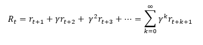**

**其中时间 **t** 的奖励是未来**贴现奖励**的组合。这意味着未来的回报被低估了。 **TD 误差**是最终正确回报(V*_t)和我们当前预测(V_t)的差值。**

**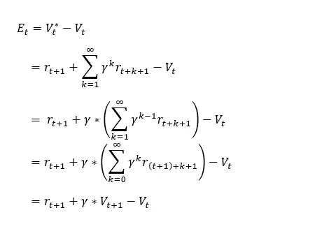**

**并且和其他优化方法类似，当前值会被其值+ learning_rate * error 更新:**

**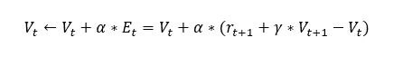**

**好了，今天的数学到此为止。上面的等式是 TD 学习的核心思想，它将帮助我们理解 QL 和 SARSA 码。**

# **因素**

**Alpha (α):学习率。此参数显示了我们应该根据误差调整估计值的程度。学习率在 0 到 1 之间。大的学习率会积极地调整，并可能导致训练结果波动——而不是收敛。学习率小调整慢，需要更多时间收敛。**

**γ(γ):贴现率。我们对未来回报的重视程度。贴现率在 0 到 1 之间。贴现率越大，我们越重视未来的回报。**

**e*(在下一节“e-greedy”政策中出现):反映勘探与开发的比率。我们以概率 *e* 探索新的选项，并以概率*1-e*停留在当前的最大值，更大的 *e* 意味着在训练时更多的探索。***

# ***QL &萨尔萨公司***

***QL 和萨莎都存储了当前状态的奖励和相应的动作，以便将来更新。一个状态通常由其组成部分的坐标来表示。如果环境是连续的，我们将有无限多的状态。为了解决这个问题，我们需要通过将它们分割成桶来离散化状态。***

***我这样做的方法是通过将连续空间分割成网格，并用单独的函数来离散它们(4 个变量，我将它们分割成 10 个盒子，每个盒子→我的权重矩阵中的 10⁴盒子)。对于更严格的应用，您可以将它们分割成更多的盒子(分割成 100 个盒子，而不是上面的 10 个)。盒子越多，模型可以学习的细节就越多，学习的时间就越长，内存空间也就越大。***

***小心你分割的盒子的数量。如果太小，你可以有一个表现不佳的模型。如果太大，就需要大的内存空间。还有，我建议限制游戏的区域。比如 OpenAI 的健身房里的推车杆子游戏，我忽略了图像上方的空白和边界附近的区域来限制我的状态空间。这些是你在制作模型时必须做出的一些设计选择。***

***由于它需要记忆状态空间，QL 和萨莎将最适合受约束和有限动作的游戏(如左右移动的钢管舞)，而不太适合更复杂的游戏(如有许多可能走法的国际象棋)。为了避免为状态空间更大的游戏存储所有的状态空间，我们可以使用深 q 网络。这种方法结合了强化学习和神经网络。我们将在后面的帖子中更多地讨论这个深度 q 网络。现在，回到 QL 和莎莎。***

***快速定义:“策略”是代理用来追求目标的策略。贪心(选择最佳值)是一种策略。贪婪算法会使我们陷入局部极小值。因此，我们有“e-greedy”，这是一种策略，要求它将探索 *e* 机会，以及遵循最优路径的( *1-e)* 机会。e-greedy 应用于平衡强化学习的探索和探索。(点击，了解更多关于探索与利用[的信息)。在这个实现中，我们使用 e-greedy 作为策略。](/reinforcement-learning-demystified-exploration-vs-exploitation-in-multi-armed-bandit-setting-be950d2ee9f6)***

***回到 QL 和萨莎，它们都是使用上面的 TD 学习公式更新的，略有不同:( *Q* 是保存离散空间和动作的所有奖励的存储器， *s* 表示状态， *a* 表示动作)***

## ***查询语言***

***数学(“强化学习:简介”中的等式 6.8)***

***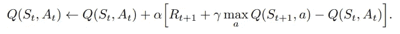***

***代码:***

***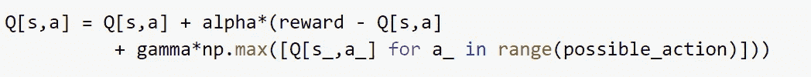***

## ***萨尔萨***

***数学(在“强化学习:简介”中的等式 6.7):***

***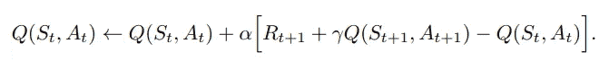***

***代码(电子贪婪策略):***

***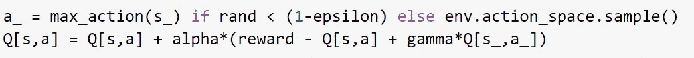***

## ***差别***

***区别非常微妙:对于 QL，这是一个非策略算法，当把奖励从下一个状态(s_，a_)传递到当前状态时，它取新状态(s_)的最大可能奖励，并忽略我们正在使用的任何策略。对于基于策略的 SARSA，我们仍然遵循策略(e-greedy)，计算下一个状态(a_)，并将对应于确切 a_ 的奖励传递回上一步。***

***重申一下，如果你到达下一个州，QL 考虑的是最好的情况，而 SARSA 考虑的是如果我们在下一个州遵循当前政策的回报。因此，如果我们的政策是贪婪的，萨尔萨和 QL 将是一样的。但是我们这里用的是 e-greedy，所以略有不同。***

# ***比较***

***QL 和萨莎都是解决强化学习问题的优秀初始方法。选择何时使用 QL 或萨莎的一些关键注意事项:***

*   ***这两种方法都适用于有限环境(或离散连续环境)***
*   ***QL 直接学习最优策略，而萨莎学习“接近”最优策略。QL 是一个更具侵略性的经纪人，而萨尔萨则更为保守。一个例子是在悬崖附近行走。QL 将选择最短的路径，因为它是最优的(有摔倒的风险)，而萨莎将选择更长、更安全的路线(以避免意外摔倒)。***
*   ***实际上，如果你想在一个快速迭代的环境中快速，QL 应该是你的选择。然而，如果错误代价很高(意外的最小故障——机器人)，那么 SARSA 是更好的选择。***
*   ***如果你的状态空间太大，可以尝试探索深 q 网络。我希望不久能写一篇关于这个话题的文章。敬请期待！***

# ***履行***

***对于钢管舞游戏，OpenAI 的健身房有一个预先构建的环境。这里列出了一些健身房的语法:(了解更多关于 OpenAI 健身房的信息[这里](https://gym.openai.com/docs/)***

***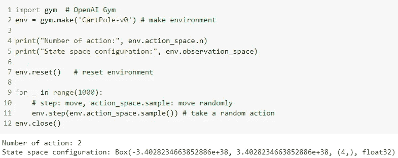***

***接下来，由于 QL 和萨莎在离散状态空间中工作得最好，并且推车杆游戏是连续的，我们将把他们离散化到更小的箱中。箱越多，性能越好。更多的箱将有助于模型考虑更多的特定状态空间，从而导致更好的整体性能。然而，更多的箱子将需要更多游戏的训练，消耗计算能力。如果时间、计算能力和存储空间是您的限制，请使用少量的容器。否则，欢迎您尝试更多的箱子。此外，在扩大规模之前，尝试使用少量的容器来检查性能。***

***放几张图展示我的算法的性能。请注意，在 OpenAI 的健身房推车杆游戏中，您可以达到的最大步数是 200(到那时游戏将自动终止)。***

***QL 培训:***

***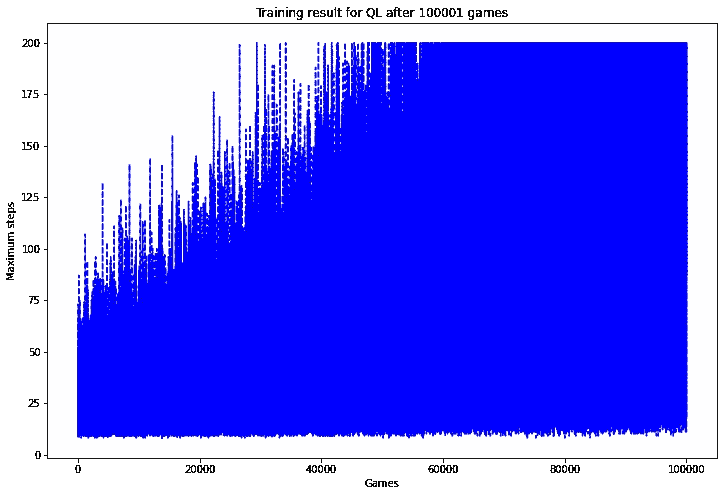***

***SARSA 培训:***

******

***QL 测试:***

***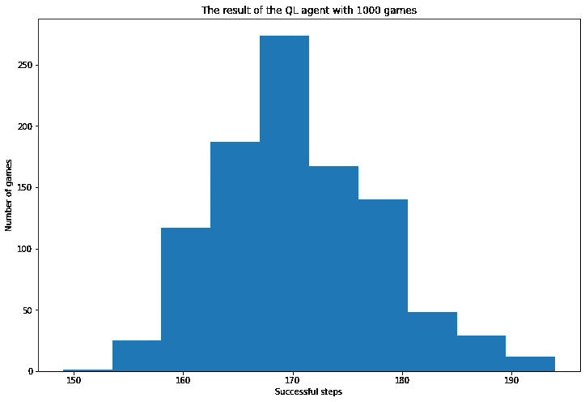***

***SARSA 测试:***

***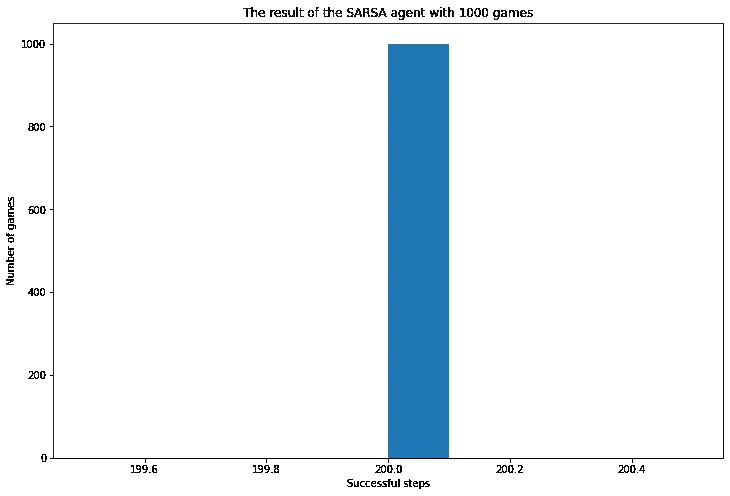***

***训练图显示了代理在多次游戏后的表现。x 轴表示我们训练的游戏数量，y 轴表示他们可以走的最大步数(由于 OpenAI gym 的设置，上限为 200 步)。
测试图显示了实施阶段的性能(在我们完成培训之后)。直方图显示了我们玩 1000 个游戏时每个模型的结果分布。
结果在意料之中，因为与 QL 相比，莎莎(通常)选择更安全的打法。因此，它可能会采取不太引人注目的步骤，导致更好的性能。这是莎莎表现优于 QL 的一个可能原因。***

## ***组合模型？为什么不呢？***

***随机想法:如果两个模型都不太好(如果我的 SARSA 没有那么好的话)，我们可以尝试将两个模型结合起来。***

***决定将基于“贝塔* QL+(1-贝塔)*萨尔萨”。***

***在某些情况下，如果你能很好地调优“beta ”,它可能有助于提高性能。调整贝塔系数意味着改变贝塔系数，看看哪个结果最好。这种调优更多的是一种艺术，看哪个效果最好。您可以尝试遍历多个 beta 值，看看哪一个产生的结果最高。***

***我们的 SARSA 在这个用例中总是成功的，所以在这个特殊的用例中不需要聚合，但是在其他游戏中可能值得一试！如果这个组合版本比其他游戏中的单个模型更好，请在评论区告诉我！***

# *****结论*****

***这里有一个 QL 和萨莎之间的快速介绍和比较。我希望它能帮助你更好地理解萨莎和 QL，并看到政策内学习和政策外学习的区别。***

***正如所承诺的，这里是所有算法和代理的[代码](https://github.com/viethoangtranduong/reinforcement-learning/tree/main/SARSA%20vs%20QL)(带有现有的 Q 表)。如果想看代理玩游戏的运行视频，就用 VS 代码运行，不要用 GG Colab。***

***如果你喜欢这篇文章并想看得更多，请随意给我的博客留下任何想法或问题的**回复**并关注！你也可以在 [LinkedIn](https://www.linkedin.com/in/viethoangtranduong/) 上找到我。享受学习！***

*****参考文献:** *1。阿什拉夫，M. (2018 年 12 月 3 日)。强化学习去神秘化:在多种武装强盗环境中的探索与利用。检索自*[*https://towardsdatascience . com/强化-学习-揭秘-探索-vs-剥削-多臂-土匪-设定-be 950 D2 ee 9 f 6*](/reinforcement-learning-demystified-exploration-vs-exploitation-in-multi-armed-bandit-setting-be950d2ee9f6) *2 .达伯尼，w .，&库尔特-尼尔森，z .(未注明)。多巴胺和时间差异学习:神经科学和人工智能之间富有成果的关系。检索自*[*https://deep mind . com/blog/article/Dopamine-and-temporal-difference-learning-A-fruitable-relationship-between-neuroscience-and-AI*](https://deepmind.com/blog/article/Dopamine-and-temporal-difference-learning-A-fruitful-relationship-between-neuroscience-and-AI) *3 .李博士(2020 年 4 月 12 日)。强化学习，第 1 部分:简介。检索自*[*https://medium.com/ai-理论-实践-商务/强化-学习-part-1-a-简介-a53a 849771 cf*](https://medium.com/ai³-theory-practice-business/reinforcement-learning-part-1-a-brief-introduction-a53a849771cf) *4 .OpenAI。(未注明)。开发和比较强化学习算法的工具包。检索自*[*https://gym.openai.com/docs/*](https://gym.openai.com/docs/) *5。斯坦福 PDP 实验室。(2015 年 12 月 16 日)。第九章时差学习。检索自*[*https://web . Stanford . edu/group/PDP lab/pdphandbook/handbook 10 . html*](https://web.stanford.edu/group/pdplab/pdphandbook/handbookch10.html) *6 .萨顿，R. S .，&巴尔托，总检察长(2018)。强化学习:导论。剑桥(麻省。):麻省理工学院出版社。
7。塔博尔，P. (2020 年 6 月 23 日)。SARSA.py .检索自*[*https://github . com/Phil Tabor/Youtube-Code-Repository/blob/master/reinforcement learning/Fundamentals/sarsa . py*](https://github.com/philtabor/Youtube-Code-Repository/blob/master/ReinforcementLearning/Fundamentals/sarsa.py)***