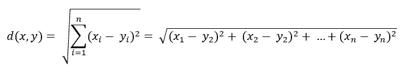
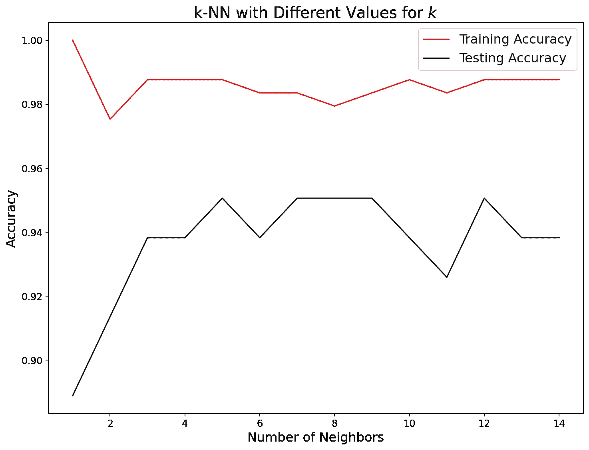

# Scikit-learn 的 k 近邻分类器和回归器简介

> 原文：<https://towardsdatascience.com/intro-to-scikit-learns-k-nearest-neighbors-classifier-and-regressor-4228d8d1cba6?source=collection_archive---------6----------------------->

## 了解掌握它们需要什么


**照片由** [**苏珊娜**](https://www.pexels.com/@suju?utm_content=attributionCopyText&utm_medium=referral&utm_source=pexels) **上** [**像素**](https://www.pexels.com/photo/closed-doors-3015714/?utm_content=attributionCopyText&utm_medium=referral&utm_source=pexels)

## 什么是 KNN？

> 如果 kNN 是你在机器学习课程中学习的第一个算法，请举手，✋🤚

*k* 最近邻算法是机器学习中最常用的算法之一。由于它的简单性，很多初学者经常用这个算法开始自己的 ML 奇妙之旅。它是少数几个可以平稳地用于回归和分类的算法之一。

那么，是什么让 kNN 同时具有如此的通用性和易用性呢？答案就藏在引擎盖下它是如何工作的。

假设您有一个包含两个类别的变量，如下所示:


图片来自[维基百科](https://en.wikipedia.org/wiki/K-nearest_neighbors_algorithm)

给定一个新的未知样本，如何判断它属于哪一组？当然，你会看周围的点。但是结果真的取决于你看得多远。如果你只看最近的 3，(实心圆)绿点属于红色三角形。如果你进一步观察，(虚线圆圈)点将被归类为蓝色方块。

kNN 也是这样工作的。根据 *k* 的值，该算法通过分类中最近的 *k* 邻居的多数投票对新样本进行分类。对于预测新样本实际数值的回归，算法只取最近的 *k* 邻居的平均值。就是这样。就这么简单。

然而，在代码中使用该算法并成功生成预测并不那么简单。今天，我们将看看算法如何工作的本质细节，如何准备任何数据以使其与算法的内部一致，以及如何显著提高其性能(具体来说，从 80%提高到 95%)。

<https://ibexorigin.medium.com/membership>  

获得由强大的 AI-Alpha 信号选择和总结的最佳和最新的 ML 和 AI 论文:

<https://alphasignal.ai/?referrer=Bex>  

## 引擎盖下的 k 近邻

关于 kNN 的内部，你应该知道的第一件事是，它是一个懒惰的算法。在机器学习行话中，这意味着该算法与其他算法相比没有训练阶段或训练阶段非常短。不要抱太大希望，因为快速训练有一个很大的缺点。

由于 kNN 查找最近邻的方式，生成预测会慢得多。在短暂的训练阶段，它会记住所有的数据点。为了进行预测，算法会找出新样本与数据集中每个数据点之间的距离。然后，它采用 *k* 最小距离，并根据其邻居的多数投票对新样本进行分类。


**形象由** [**维基**](https://en.wikipedia.org/wiki/K-nearest_neighbors_algorithm) 组成

对人眼来说，标记绿点完全没有问题。但是，如果不计算每个点之间的距离，该算法就无法找到最近的邻居。

距离本身是使用 3 种距离度量之一计算的:

*   欧几里德距离:x 和 y 分量之差的平方根:



作者图片

*   曼哈顿距离:x 和 y 坐标分量之间的差值的绝对值之和:


作者图片

*   闵可夫斯基距离是上述两种技术的推广。它有一个参数 *p* ，取值为 1 或 2。当 *p=1* 时，公式变为曼哈顿距离，而 *p=2* 为欧几里得距离:


作者图片

抱歉，公式太花哨了，但如果你打算进一步学习机器学习，你可能会习惯它。

> 缺少训练阶段也意味着算法没有*一般化*。

其次，kNN 也是一种*非参数*算法——它对数据的形状和分布没有严格的要求。与假设要素和目标具有线性关系的线性回归不同，kNN 没有这样的假设。这就是为什么它被认为是最简单的模型之一，并且如果经过“适当”的数据训练，开箱即用就能很好地工作。(我将在后面的部分解释我所说的“适当”是什么意思)

> 点击阅读并编辑 Kaggle [上这篇文章的笔记本。](https://www.kaggle.com/bextuychiev/are-you-good-enough-to-make-knn-work)

## 如何选择 k 的值

我想你已经意识到，算法的结果完全取决于 *k* 的值。因此，显而易见的问题是“我们如何选择 k 的最佳值？”

不幸的是，没有明确的答案。每个数据集的最佳值都会发生变化。你的工作是找出最大化你的性能指标的 *k* ，例如准确性。然而，你可以遵循一些总的趋势来为 *k* 的可能值做出明智的选择。

首先，选择小值的 *k* 会导致过拟合。例如，当 *k=1* kNN 分类器用与最近邻相同的标签标记新样本。这种分类器在测试时表现很差。相反，选择较大的值会导致拟合不足，并且计算量很大。

你可以在真实邻居的背景下思考这个问题。一个叫杰克的家伙一生都住在他的家乡，并且很久以前就认识他的邻居了。如果他搬到一个新的城市，他突然变成一个完全陌生的人，没有办法很快了解他的新邻居。也就是某种意义上的过拟合。

相比之下，杰克的儿子乔恩只有 6 岁，对他们的邻居知之甚少。当他们家搬家时，乔恩既不了解他的老邻居，也不了解他的新邻居。这可以被认为是欠拟合，一种太愚蠢的算法，无法理解训练集和测试集中的趋势。

现在，有一个完全不同的人——布鲁斯，他非常友好，善于交际，经常旅行，懂多种语言。无论他走到哪里，他都很快和周围的人成为好朋友。在这个类比中，布鲁斯的品质可以被认为是算法的最佳参数。

这个例子可能对你来说没有任何意义，但是每个人都有自己的解释什么是过度适应和欠适应的版本。重要的是，当你使用不同的 k 值时，你要理解 kNN 的性能是如何变化的。

实际上，你可以使用像`GridSearchCV`这样的工具来选择邻居的数量，但是这超出了本文的范围。相反，我们将使用模型复杂性曲线直观地选择最佳数量。

## 用 KNeighborsClassifier 分类

如前所述，对于分类问题，一个新样本的标签是由最近的 *k* 个邻居中的多数票来识别的。让我们使用`sklearn`的`KNeighborsClassifier`来看看算法的运行情况:

我们从`sklearn.neighbors`导入它和其他有用的函数。所有其他库都以标准别名导入。

对于数据集，我们将使用来自 Kaggle 的[帕尔默群岛企鹅](https://www.kaggle.com/parulpandey/palmer-archipelago-antarctica-penguin-data)数据。该数据集包含三种企鹅的特征:阿德利企鹅、巴布亚企鹅和下颚带企鹅。我们将通过使用企鹅的身体测量来构建企鹅种类的 kNN 分类器:

```
penguins = pd.read_csv('data/penguins_size.csv').dropna()
penguins.head()
```


我提到过，kNN 对数据的分布不做任何假设。让我们构建第一个没有任何预处理的分类器。我们将只使用 3 列作为特征:库门长度和深度，脚蹼长度和身体质量指数:

为了简单起见，我只选择了数字列。创建了一个大小为 0.25 的测试预测，并用 3 个邻居拟合了一个分类器。让我们用`accuracy_score`来计算它的精度:

```
>>> accuracy_score(y_test, predictions)0.7722772277227723
```

我们获得了 77%的准确率，这并不理想，但对于开箱即用的模型来说，这是一个非常好的分数。

## KNeighborsRegressor 回归

在预测连续值(不是标签)的回归任务中，kNN 取最近的 *k* 个邻居的平均值。回归器从`sklearn.neighbors.KNeighborsRegressor`开始就很容易得到:

```
from sklearn.neighbors import KNeighborsRegressor
```

这一次，我们将尝试使用企鹅的三个身体测量值来预测它们的体重指数(同样，只有数字特征，没有经过预处理):

将邻域数设置为 5 会产生 0.79 的决定系数。与其盲目地为 *k* 试随机数，不如采取更聪明的方法。

## 模型复杂性曲线

我们的想法是尝试不同的 k 值，并根据它绘制我们的性能指标的结果。这个你一看到就更有道理了。让我们从分类器开始:

我们创建了一个名为`plot_complexity_curve`的函数，它将邻居的可能数量、模型本身和数据作为参数。然后，对于每个 *k* ，它对训练集和测试集上的给定模型进行初始化、拟合和评分。在训练集和测试集上对模型进行评分会让您很好地了解哪些值会导致过度拟合和欠拟合:

在函数中，我引入了接受 x 和 y 值的`[knn.score](https://scikit-learn.org/stable/modules/generated/sklearn.neighbors.KNeighborsClassifier.html)`函数。这只是使用`predict`生成预测并根据`y_test`进行评分的一个更简短的版本。我们重复选择数值作为特征的相同过程，并将它们插入到函数中:


从图中我们可以看到，3 或 4 个邻居是过度拟合(训练分数非常高，测试分数很低)和欠拟合(训练分数和测试分数都很低)之间的中间值。

现在，是回归者的时候了:


对于回归量，似乎 6 到 10 之间的任何数量的邻居都是一个好的超参数。请注意，精度以决定系数的形式给出— $R $。在 sklearn 的[官方文档](https://scikit-learn.org/stable/modules/generated/sklearn.neighbors.KNeighborsRegressor.html#sklearn.neighbors.KNeighborsRegressor.score)上阅读更多相关内容。

在这两种情况下，都有很大的改进空间。有一些预处理技术可以显著提高 kNN 的性能。让我们在下一节深入探讨它们！

## 提高 kNN 的性能，特征缩放

尽管我们在企鹅数据集上得到了相当好的分数，但 kNN 是一个非常繁琐的算法。它有一定的数据质量要求才能正常工作。

kNN 的第一个要求是数字特征要有相同的尺度。如果你注意的话，你会发现身体质量指数栏与所有其他身体测量数据的比例完全不同。通常，所有要素都应进行缩放，使其范围从 0 到 1。

这可以通过一种叫做最小最大缩放的方法来实现(称为归一化)。它为分布中的每个数据点减去最小值并除以(最大-最小):


Scikit-Learn 方便地提供了一个`MinMaxScaler`转换器，它对 pandas 数据帧中的数字列执行这种规范化:

```
from sklearn.preprocessing import MinMaxScaler
```

让我们对企鹅的所有数字特征进行缩放。一般语法如下:


在用`MinMaxScaler`启动缩放器后，我们调用返回转换数据的`fit_transform`方法:

我们将使用我们的 good-ol' `plot_complexity_curve`函数来寻找 *k* 的最佳值:


哇，现在所有分数都高于 95%。看看功能扩展对性能的提升有多大。查看图表，保持欠拟合和过拟合之间平衡的 *k* 的值是 12 或 13。

注意`MinMaxScaler`不是特征缩放的唯一选项。在异常值的情况下，不要使用`MinMaxScaler`。相反，使用`StandardScaler`，它通过减去平均值并除以标准偏差来缩放。更详细的指南见 sklearn 的[用户指南](https://scikit-learn.org/stable/modules/preprocessing.html#preprocessing-scaler)。

## 编码分类变量

即使我们得到了相当好的分数，我们也没有把分类变量包括进去。是时候让他们进来了。

大多数 ML 算法更喜欢数值，所以我们应该将所有文本/分类变量转换成数字。

> 对于大多数数据集，在将文本/分类值转换为数字之前，会有更多与它们相关的问题。这里我们只关注转换部分，但是你可以在这里查看我关于使用 pandas 清理文本数据的权威指南:

</master-the-most-hated-task-in-ds-ml-3b9779276d7c>  

用数字编码分类值最流行的选项是 sklearn 的`[OneHotEncoder](https://scikit-learn.org/stable/modules/generated/sklearn.preprocessing.OneHotEncoder.html)`和`LabelEncoder`。我们今天只使用后者。

标签编码器为数据集中的每个唯一类别分配一个新的整数。例如，岛屿变量有 3 个独特的类别:

```
>>> penguins.island.unique()array(['Torgersen', 'Biscoe', 'Dream'], dtype=object)
```

性别分为两类:

```
>>> penguins['sex'].unique()array(['MALE', 'FEMALE', '.'], dtype=object)
```

啊哦，我们有一个不一致的类别—一个点。我们应该删除它:

标签编码器最适用于顺序变量，即有顺序的类别。即使我们在数据集中没有类别的排序，我们仍然可以使用它。

在我们进行编码之前，让我们构建特性和目标数组。记住这一次，我们将所有列作为特征:

现在，我们应该将分类和数字特征提取到单独的数组中，因为我们对它们应用了不同的转换器:

像以前一样，让我们用数字来表示特征:


作为一个额外的步骤，我们将缩放后的特性数组和它们的列名放回到一个数据帧中。

最后，我们对分类值进行编码:

`LabelEncoder`不像`MinMaxScaler`那样工作。我们不能同时将它应用于所有分类列。因此，我们循环遍历它们:

现在，我们的特征数据被分成预处理的数据帧，`X_cat`和`X_num_scaled`:

```
X_cat.head()
```


```
X_num_scaled.head()
```


让我们将它们一起添加到单个数据帧中:


转换引入了一些新的空值。我们应该从特性和目标数组中删除这些行:

现在，我们将使用前面的`plot_complexity_curve`函数找到预测企鹅种类的最佳模型:


什么？我们的测试分数比培训分数高？怎么会这样呢？这里面肯定有猫腻。让我们在下一部分深入探讨:

## 分层分裂

这个奇怪的事件发生在我们将分类值作为特征包含进来之后。在统计学中，有一个术语叫做*抽样偏差*。当你的样本不能代表真实人群时，就会出现这种情况。

例如，让我们想象你正在做一项全国性的调查。很明显，你不可能给全国每个人都发问卷，所以你抽取一个样本。在该国，女性占 54%，男性占 46%。为了不引入*采样偏差*，你必须尊重这个性别比例。如果你对 10000 人进行抽样，你必须确定其中 4600 人为男性，5400 人为女性。

让我们研究一下当我们进行常规训练/测试分割时会发生什么。更具体地说，我们将看看岛屿和性别类别的比例是否会保留:

看看完整数据中的性别比例:

看看训练数据中的性别比例:

看看测试数据中的比例:

正如你所看到的，我们得到了测试集非常不同的比例。让我们对这个岛做同样的尝试:

同样的事情也发生在这个岛上。使用 Scikit-learn 很容易防止这种情况。`train_test_split`函数有一个`stratify`参数，它的作用就是:保留类别的基本比例:

在分类的情况下，我们总是将`y`(目标)传递给`stratify`。因为我们并不真正关心保持特征的分布，而是目标数组。让我们使用`plot_complexity_curve`函数，现在使用分层分割。在我们做分割之前，我们将重复特征缩放和编码的最后步骤。我不会再提供代码，所以假设`X_ready`和`y`现在是预处理数组:



现在一切都如预期的那样。所有训练分数都高于训练分数。解释该图，k 的最佳值可能是 7、8 或 9。

以前，我们的分离可能会为模型生成一个更合适的测试集。这就是我们得到那些奇怪分数的原因。

## 结束语

我想通过总结 kNN 的利弊来结束这篇文章。

优点:

*   非常简单的算法，容易理解
*   快速训练阶段
*   不假设数据的基本分布
*   通用-可用于回归和分类

缺点:

*   非常缓慢的预测阶段
*   大量内存使用，因为它存储所有数据
*   对量值敏感-这就是为什么需要对要素进行缩放
*   对异常值和噪声敏感
*   遭受[维数灾难](https://en.wikipedia.org/wiki/Curse_of_dimensionality)

感谢阅读！

## 不知道接下来要读什么？在这里，我为你挑选了一些东西:

</how-to-master-the-subtle-art-of-train-test-set-generation-7a8408bcd578> 