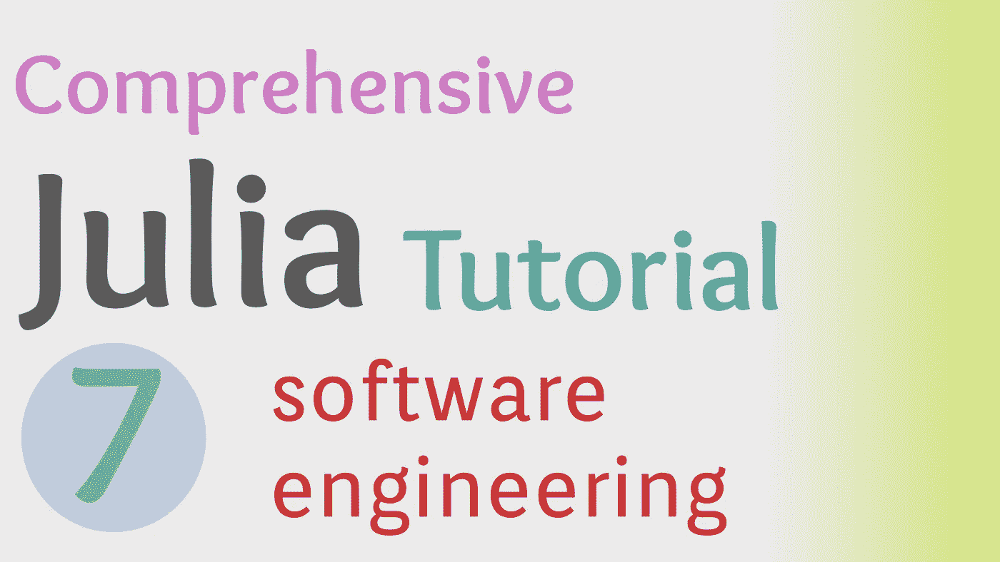

# Julia 编程语言中的软件工程介绍

> 原文：<https://towardsdatascience.com/intro-to-software-engineering-in-the-julia-programming-language-3c32411c5683?source=collection_archive---------36----------------------->

## 朱莉娅综合教程

## Julia 语言中定义的目录和环境概述。



(图片由作者提供)

> 本文视频

> 开源代码库

[](https://github.com/emmettgb/JuliaLessons/tree/master/7) [## emmettgb/JuliaLessons

### 想学朱莉娅？这是一个很好的起点！-埃米特 GB/朱丽亚莱森

github.com](https://github.com/emmettgb/JuliaLessons/tree/master/7) 

# 介绍

虽然 Julia 编程语言以其科学用途而闻名，但仍有一些包需要为此目的而开发。也就是说，在 Julia 中，软件工程可能不是这门语言最重要的技能，重要的是首先要有做科学的软件包。包是生态系统的重要组成部分，我个人认为不管科学目的如何，包总是保持你的算法技巧处于最佳状态的好方法！

对于本教程，我们将致力于一个非常令人兴奋的项目，实际上可能在未来派上用场！我们的项目名为 SuperFrame.jl，它将是现有包 DataFrames.jl 的扩展。因此，随着更多地了解如何使用 DataFrames.jl 之类的包，我们也将熟悉如何创建自己的优秀项目。考虑到这一点，我决定我们不妨把它正式化！让我们在 Github 上创建一个项目！如果这个项目真的有用，我们可以一起努力把它推到 Julia package registry，它可能会成为人们使用的东西——这很令人兴奋，因为我们正在一起努力！这是我创建的存储库！：

[](https://github.com/emmettgb/SuperFrame.jl/tree/main) [## emmettgb/SuperFrame.jl

### 我们一起编写的 DataFrames.jl 扩展:)如果您想了解更多信息，可以通过以下方式与我们合作…

github.com](https://github.com/emmettgb/SuperFrame.jl/tree/main) 

按照惯例，提交应该改进提交中将要包含的内容的简要描述。也就是说，存储库对任何提交都是开放的，但您可能应该等到我们实际使用它时，才能理解我们将要使用的确切方法和标准化——按照惯例，当然是基于 DataFrames.jl 的。

# 文件结构

幸运的是，对于基于 Julia 的开发人员来说，开发一个包含完整环境的包实际上非常容易。我们可以用适当的 Project.toml 创建完整的文件结构，它将包含我们的虚拟环境，来自 Julia Pkg REPL。现在让我们进入一个合适的目录并运行 Julia。我个人用~/Projects。

```
cd ~/Projects
julia
```

现在我们将使用]键进入 Pkg REPL:

```
julia> ]
pkg>
```

最后，我们可以使用 activate 命令用 Project.toml 文件和 Manifest.toml 文件创建新的虚拟环境:

```
activate SuperFrame.jl
```

为了实际创建适当的文件和环境，我们需要用 add 命令添加一个依赖项。当然，因为我们正在创建 DataFrames.jl 扩展，所以我们将添加 DataFrames.jl:

```
add DataFrames
```

现在我们可以退格退出 PKG REPL，然后按 ctrl + D 退出朱莉娅 REPL。

> Pro 提示:Julia 中的 pwd()函数会推送你的 REPL 的工作目录。实际上，这很有用。我认为这是一个可以利用的很好的功能，因为在 Julia 中很难判断你在文件系统中的位置。

# 创建模块

在结束这个快速介绍之前，我们今天要做的最后一件事是在 Julia 中创建一个基本模块。回头看一下模块 Compose.jl 的页面，我们看到我们需要一个 src 目录，所以让我们用 cd 进入包含新环境的文件夹，并创建一个新的 src 目录:

```
cd SuperFrame.jl
mkdir src
cd src
```

今天我只是用 nano 编辑了一小段文本，但将来我会使用带有 Juno 扩展的 Atom 文本编辑器。当然，我们还将回顾如何设置这个环境，这应该相对简单，所以不要担心。然而，这是我的偏好，所以如果有你想要使用的偏好的文本编辑器，请随意使用！

```
nano SuperFrame.jl
```

最后，我们要做的最后一件事是在 Julia 中创建一个模块对象。Julia 中模块的关键词是

> 组件

我称之为直接。我们在模块单词后面加上一个要导入的名称，对于这个例子，它当然是超帧。正如我们将在 Julia 中编写的其他内容一样，我们也需要编写`**end**`来完成我们的语句。

```
module SuperFrame
    using DataFramesend
```

我还添加了一个“使用数据框架”，这只是临时代码，因为为了更高效，我们将来可能会使用直接导入。也就是说，将它写入我们的硬盘将完成我们新软件包的初始设置！

# 结论

我非常兴奋能和我的读者和观察者一起创建这个包。这对我来说真的很有趣，我真的希望有人能做出贡献，因为这是我们一起的项目，我认为只要有一点指导，它会变得很棒，并提供一些非常有用的互动体验和学习。SuperFrame.jl 将成为一个支持多种不同数据格式的包，其类型比传统的基于 DataFrames.jl 的类型更好。

虽然 DataFrames.jl 是一个很棒的包，但如果能更精确地或以某种方式处理一些数据，那就更好了。当我们这样做的时候，我们还可以创建一些很酷的交互式可视化，并把这个包扩展到处理像图像数据框这样的东西。你对这个项目感到兴奋吗，因为我当然兴奋了！我也很高兴能参与到你们对这些编程概念的学习氛围中——因为编程很棒，也很有趣！非常感谢您的阅读，我很欣赏，并祝新年和 2021 年快乐！