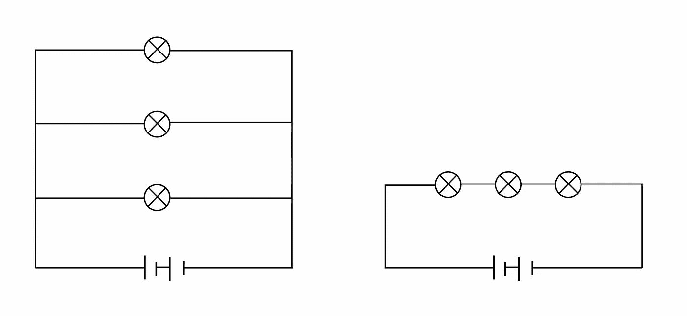
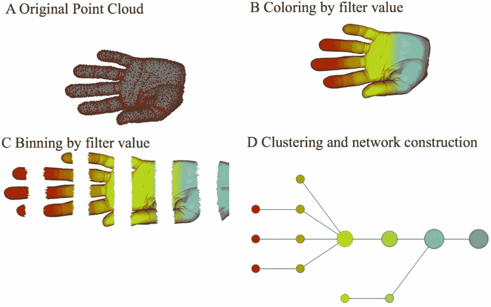
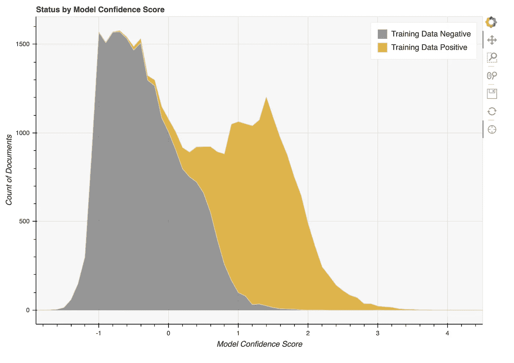
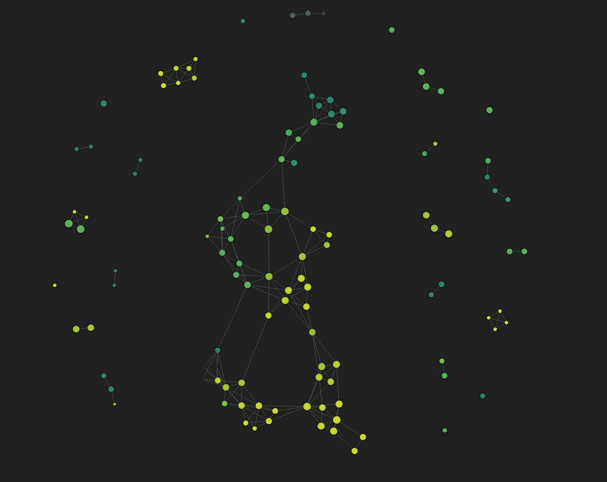
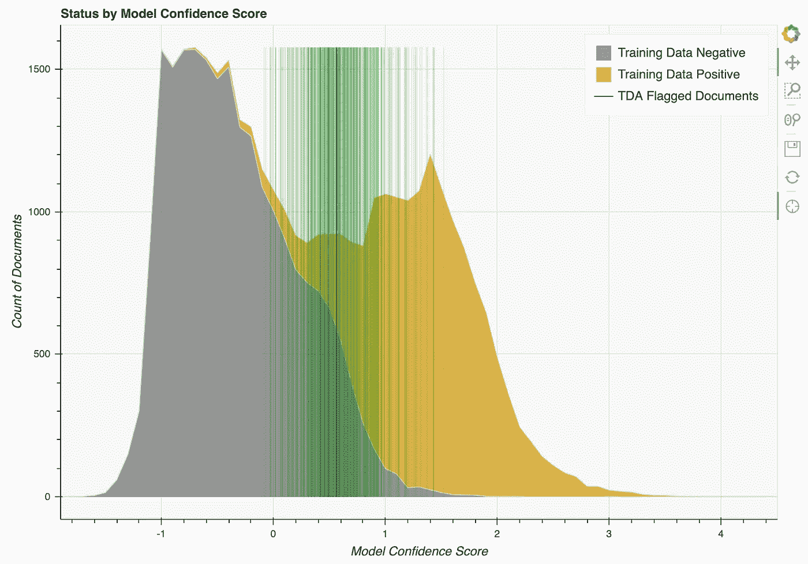

# 应用拓扑数据分析简介

> 原文：<https://towardsdatascience.com/intro-to-topological-data-analysis-and-application-to-nlp-training-data-for-financial-services-719495a111a4?source=collection_archive---------13----------------------->

## 应用于金融服务的 NLP 训练数据

拓扑数据分析，或称 TDA，是一套提供数据集额外洞察力的方法。它增强了其他形式的分析，如统计和几何方法，并对任何想要更完整地了解其数据的数据科学家都很有用。

本文描述了拓扑方法的实用性，概述了一个著名的 TDA 算法“mapper ”,并描述了如何使用一个名为 Scikit-TDA 的工具包应用于自然语言处理。最后，我们分享了将上述所有内容应用于机器学习管道的训练数据收集问题的细节，该管道涉及来自金融服务行业的文档。

# 为什么是拓扑？

拓扑学是关于连续对象的数学。不是大小和形状，而是连续性。它是关于事物是如何联系在一起的，差距在哪里。

一个简单的类比展示了为什么拓扑数据检查如此有用，那就是挂上节日灯。当负责在房子上安装节日灯时，首先从几何学和统计学的角度考虑这个问题是很自然的。


[来源](https://commons.wikimedia.org/w/index.php?title=File:Harrahan_Christmas_Lights_House_1.JPG&oldid=449270576)

几何回答了像房子有多长，屋顶有多高，插座在哪里，需要多少盏灯这样的问题。统计数据回答了一些问题，比如这些灯需要多少电流，它们的成本是多少，它们平均一天要亮几个小时。

安装完成后是第一次插上电灯的重要时刻，但是…什么也没有。突然间，长度、尺寸和颜色都变得不重要了。它们的价格和重量并不影响它们为什么不启动。相反，我们跳到故障排除模式，以完全不同的方式思考灯串。我们认为它们是电路。



并联(左)和串联(右)灯串的电气图。x 代表灯泡，插头在底部。[来源](https://commons.wikimedia.org/w/index.php?title=File:Series_and_Parallel_Circuit.jpg&oldid=533380220)

如果只有几个灯泡不亮，这串灯泡是并联的，我们只需更换那些坏了的灯泡。如果没有一盏灯亮着，它们可能都是串联的，我们必须找到一些坏了的灯泡。或者我们可以把串联的线插到并联的线上，串联在一起。还是水货！在任何情况下，我们现在都准备好开始调试上面的图片，记住原理图看起来一点也不像房子上的实际灯串。

**看一个数据集的拓扑可视化就像看节日灯的电路图。**我们有意忽略空间特征、点与点之间的巨大长度和短距离，而是只关注数据的连通性。我们问什么是相连的，什么是分开的，差距在哪里。这给了我们新的信息来回答棘手的问题。重要的是要记住，TDA 并没有取代几何和统计分析，而是补充了它们，就像在房子上挂上节日灯时电路图补充了卷尺一样。

# 简单地说，映射器算法

有[很多](https://www.youtube.com/watch?v=_tiv0qYcM3U) [优秀](https://www.youtube.com/watch?v=NjcLSviRP5E) [入门](https://www.youtube.com/watch?v=dApjJpQZYOY) [视频](https://www.youtube.com/watch?v=3Z73Wd2T1xE&t=1052s)讲解 [Carlsson、Memoli 和 Singh 在 2007 年](http://dx.doi.org/10.2312/SPBG/SPBG07/091-100)发明的 mapper 算法。以下是概述，而不是试图复制这些资源:

1.  从高维空间的数据开始。
2.  创建重叠的数据仓。
3.  在每个箱内，对数据进行聚类。
4.  对于每个集群，在图中创建一个节点。
5.  连接共享数据点的节点。



图片来自 [Carlsson 等人，2013 年](https://doi.org/10.1038/srep01236)

在真实数据分析中，原始数据是高维的，并且不能像这里的初始数据点那样可视化。否则，我们就完了！生成的图形以节点和边的形式表示，使我们可以看到拓扑关系，而无需考虑初始数据向量的几何细节。

# 好的。怎么会？

答案:[西基特-TDA](https://scikit-tda.org/) 。

Scitkit-TDA 是一个 Python 包，为以前独立的算法提供了标准接口。像 scikit-learn 一样，`.fit()`和`.fit_transform()`系列中的方法用于执行算法和转换数据。一个例子看起来像

```
import kmapper as kmmapper = km.KeplerMapper(verbose=2)
projected_data = mapper.fit_transform(data, projection=TSNE())
graph = mapper.map(
    projected_data,
    clusterer=DBSCAN(),
    cover=km.Cover(35, 0.4),
)
```

其中`TSNE`和`DBSCAN`可以通过它们自己的`.fit()`和`.transform()`方法与适当的类似 scikit 的对象交换。更多详细示例，参见 [Scikit-TDA 示例页面](https://kepler-mapper.scikit-tda.org/en/latest/examples.html)。

# 向 NLP 申请

从文本中创建向量对于机器学习模型来说非常重要，因为机器学习模型只知道如何对数字列表进行操作。最简单和最容易的方法之一是单词袋模型，其中数据集中的每个唯一单词在某个高维空间中有自己的方向，文档由它包含的单词的坐标表示。

遵循 [Scikit-TDA 的开普勒映射器示例](https://kepler-mapper.scikit-tda.org/en/latest/notebooks/KeplerMapper-Newsgroup20-Pipeline.html)，我们使用 TFIDF 缩放对文档的文本进行矢量化，减少到二维，并使用聚类算法构建图表。

```
mapper = km.KeplerMapper(verbose=2)projected_X = mapper.fit_transform(term_count_matrix,
    projection=[TfidfTransformer(sublinear_tf=True),
                TruncatedSVD(n_components=100, random_state=0),
                Isomap(n_components=2, n_jobs=-1)],
    scaler=[None, None, MinMaxScaler()])
```

我们对文档中的例子做了一些调整。因为我们要处理如此多的大文件，所以我们使用一个定制的具有有限内存的并行术语计数器来构建一个术语矩阵，然后在管道中使用一个 TFIDF 转换器。我们还试验了不同形式的降维，如 PCA，以构建投影数据。

最后，为了构建图表:

```
graph = mapper.map(projected_X,
    clusterer=AgglomerativeClustering(
        n_clusters=3,
        linkage="complete",
        affinity="euclidean"),
    cover=km.Cover(n_cubes=12, perc_overlap=0.33))
```

同样，我们试验了不同的聚类算法，如 DBSCAN 和 HDBSCAN，并改变了亲和力和重叠参数。

# 应用于金融服务培训数据

财务文件是 S&P 全球许多工作流程的核心。在内部，机器学习分类模型用于为许多用例区分文档流的优先级。公司内部的内容专家定期提供训练数据，以确保模型以最佳性能运行。

训练数据收集过程的简化如下。对于给定的工作流，内容专家为每个摄取的文档提供一个“肯定”或“否定”标签。在训练时，我们检索每个文档的文本，并训练一个分类器来尝试基于模型置信度分数线性分离文档。当构建一个新的模型时，我们可能会在正面和负面文档之间看到相当多的(不希望的)重叠。



约 40，000 个文档的新模型的得分直方图。几乎所有得分低于-0.5 的文档都有一个“负面”标签，所有得分高于 2.0 的文档都有一个“正面”标签。中间的分数代表模型混乱。理想情况下，左边的灰色叶和右边的黄色叶是分开的。x 轴上的单位是任意的。

对于一个新的工作流，合理的解释是一个训练数据标注的问题。查看模型出错的文件，在中间的某个地方，是一个开始的好地方。对于规模感，在 x 轴上的分数 0.0 和 1.0 之间有大约 9000 个文档。

我们现在使用 TDA 根据它们的拓扑属性对文档进行分组，并寻找分类错误中的模式。我们想知道混淆模型的文档是否是拓扑连接的。如果是这样的话，我们可以使用具有高度混淆的集群节点作为候选，发送回内容专家进行额外的考虑。

如前一节所述，将 TDA 应用于文档，我们最终得到的是按平均文档混乱程度着色的节点和边。



在图像中，每个圆圈都是一组文档。最小的圆圈只代表几个文档，而最大的圆圈代表几千个文档。最亮的黄色球只包含被模型可靠地正确分类的文档，而深紫色球只包含错误分类的文档。从黄色到紫色的光谱范围是每个圆的“平均正确性”的连续体。

错误分类的文档组，即蓝色和紫色节点，似乎主要出现在图像的北部和西北部区域。我们可以从这些节点中选择所有文档，查找它们的模型置信度得分，并查看它们在模型置信度曲线上的位置。



来自蓝色/紫色 TDA 集群的文档标有绿线。

每个绿色竖条代表 TDA 输出的蓝色/紫色节点中的一个文档，较暗的绿色部分表示在该模型置信度得分下文档的浓度较高。TDA 标记了不到 500 个文档，大部分在 x 轴上的分数在 0.0 到 1.0 之间。

在 TDA 分析之前，我们有大约 9000 份文件要开始查看，以确定我们的数据收集是否有问题。现在已经缩减到不到 500 人。这并不是说我们不能用统计或几何方法获得收益，但我们确信我们发回的文件是相关的。幸运的话，我们的业务合作伙伴将在我们发送的文档中找到一个模式，并纠正培训数据收集中的系统错误，从而进行更好的第二轮模型培训。

# 结论

如果统计方法是数据科学家的卷尺，绘图是梯子，那么 TDA 就是万用表。它通过关注连接和间隙而不是大小和形状，提供了一种查看数据的正交方式。链接资源为刚刚开始使用 TDA 的数据科学家提供了快速入门和高效工作的机会。

## 录像

*   [Scikit TDA| SciPy 2019 |纳撒尼尔索尔](https://www.youtube.com/watch?v=AWoeBzJd7uQ)
*   [“面向工作数据科学家的拓扑数据分析”——Anthony Bak](https://www.youtube.com/watch?v=3Z73Wd2T1xE)
*   [TDA 制图者第二部，伊莎贝尔·k·达西](https://www.youtube.com/watch?v=dApjJpQZYOY)
*   [映射器算法和 Reeb 图](https://www.youtube.com/watch?v=_tiv0qYcM3U)
*   [关于映射器的介绍，Bala Krishnamoorthy(2020 年 2 月 11 日)](https://www.youtube.com/watch?v=NjcLSviRP5E)

## 论文和网站

*   [滑动窗口和持久性，Perea 和 Harer](https://arxiv.org/pdf/1307.6188.pdf)
*   TDA Github
*   [西基特-TDA 文件](https://scikit-tda.org/)
*   [金融时间序列的拓扑数据分析，Gidea 和 Katz](https://arxiv.org/pdf/1703.04385.pdf)
*   [UMAP、麦金尼斯、希利和梅尔维尔](https://arxiv.org/pdf/1802.03426.pdf)
*   [使用拓扑从复杂数据的形状中提取洞察力，Carlsson 等人](https://doi.org/10.1038/srep01236)
*   [用于分析高维数据集和三维物体识别的拓扑方法，卡尔松、梅莫利和辛格](http://dx.doi.org/10.2312/SPBG/SPBG07/091-100)
*   [开普勒映射器 2.0.0 文档](https://kepler-mapper.scikit-tda.org/en/latest/examples.html)
*   [应用拓扑](https://appliedtopology.org/)
*   [介绍一种新的文本分类和使用 TDA、埃利亚西和莫哈达姆的自然语言处理可视化](https://arxiv.org/abs/1906.01726)

Ryan Duve 是标准普尔全球公司的数据科学家。他还是一名物理学家、Linux 黑客和一名糟糕的咖啡师。