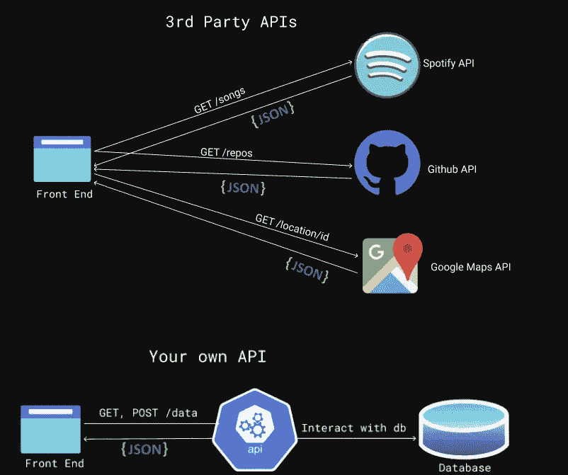
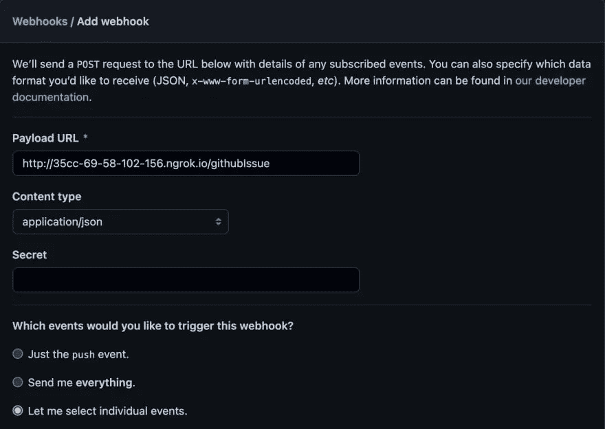
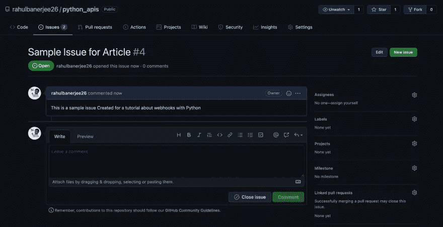

# 介绍 Webhooks 以及如何用 Python 接收它们

> 原文：<https://towardsdatascience.com/intro-to-webhooks-and-how-to-receive-them-with-python-d5f6dd634476?source=collection_archive---------3----------------------->

## 本教程将介绍 webhooks 的概念。我们还将构建一个简单的 Flask 服务器，它可以接收 GitHub webhooks。我们还将看到如何公开我们的本地主机。


照片由 [Grace 到](https://unsplash.com/@gigalilac?utm_source=unsplash&utm_medium=referral&utm_content=creditCopyText)在 [Unsplash](https://unsplash.com/s/photos/hook?utm_source=unsplash&utm_medium=referral&utm_content=creditCopyText)

# 什么是 webhook？

在说 webhooks 之前，先说一下 API。下面是一个 API 的数据流。



作者创建的图像

您向 API 发出一个 GET/POST 请求，然后得到一个响应。如果你想学习更多关于使用 API 的知识，可以看看我关于使用 Python 使用[API 的文章，或者我关于使用 JavaScript](https://medium.com/p/94fddec609cc) 使用[API 的文章。](https://medium.com/p/8360ce624d3a)

考虑一下 Github API，如果我们想构建一个 API，每当回购中出现新问题时，它都会发送一封电子邮件。一种方法是构建一个 API，每隔 1-2 分钟发出一个请求，检查是否有新的问题出现并通知我们。这个过程被称为[轮询](https://tyk.io/blog/moving-beyond-polling-to-async-apis/#:~:text=APIs%20commonly%20require%20a%20client,requests%20data%20from%20the%20server.&text=This%20pattern%20is%20known%20as,or%20notified%20of%20backend%20events.)。基本上，我们必须定期请求检查新的问题。然而，这似乎是低效的。如果每当一个新问题产生时，GitHub 向我们的 API 发出请求，那该怎么办？这就是所谓的 webhook。我们不定期发出请求，我们只是给 Github 我们的 API 的端点，每当一个新的问题产生时，就会向我们给 GitHub 的端点发出请求。Webhooks 也被称为反向 API。下面是轮询和 webhooks 的比较。这张图片的灵感来自于[这篇文章](https://www.mailjet.com/blog/news/what-is-webhook/)


由 Autho 创建的图像

正如你可能已经注意到的，很多请求被发出，根据我们发出请求的频率，在新问题被创建和我们的 API 得到通知之间可能会有一点延迟。

让我们创建一个 API，以便在 Github repo 中创建新问题时接收请求。

# 创建一个简单的 Flask 服务器

首先，让我们创建一个 hello world 端点。

现在我们需要创建一个端点来接收来自 GitHub API 的请求。这将是一个接受 POST 请求的标准端点。

我阅读了文档，知道 JSON 对象的关键。您可以使用不同的键来访问更多数据，如问题标签等。

现在你可以运行你的 flask 服务器了

```
python3 __init__.py
```

# 公开暴露我们的本地主机 URL

Webhooks 需要一个公共 API 端点，因为它们不能向端点发出请求，例如“ [http://127.0.0.1:5000/](http://127.0.0.1:5000/) ”。一种方法是部署 API 并使用已部署 API 的 URL。另一种方法是将您的本地主机公开为一个公开可用的 URL。这是暂时的，只有在 Flask 服务器运行时才有效。对公共 URL 的任何请求也将被发送到您的本地主机 URL。

我们将使用 [ngrok](https://ngrok.com/) 来公开我们的本地主机 URL。你必须创建一个帐户。


ngrok 截图

为您的操作系统下载 ngrok 并解压缩。现在打开一个终端，cd 到解压后的 ngrok 文件所在的目录。在终端中键入以下命令

```
ngrok  http <PORT NUMBER>
```

例如:如果您的 flask 服务器运行在端口 5000 上，您必须键入以下内容

```
ngrok http 5000
```


终端截图

您应该在终端中看到类似的输出。公共 URL 是“转发”旁边的 URL。我的情况是[http://35cc-69-58-102-156 . ngrok . io](http://35cc-69-58-102-156.ngrok.io/)。如果您访问您的公共 URL，您应该看到与您访问您的本地主机 URL 时看到的一样的东西。

# 创建问题网络挂钩

选择任何你喜欢的 Github Repo。进入设置>网页挂钩>添加网页挂钩


回购截图



Webhook 创建的屏幕截图

输入您的端点，在我的例子中是[http://35cc-69-58-102-156.ngrok.io/githubIssue](http://35cc-69-58-102-156.ngrok.io/githubIssue)

由于我们只希望在回购中创建问题时提出请求，因此选择“让我选择单个事件”向下滚动选择“问题”。一旦你下来，向下滚动并创建网页挂钩。

# 测试 Webhook

在回购中制造问题



问题截图

现在检查运行 flask 服务器的终端。我还添加了一个标签，并在创建问题后关闭了问题。


终端截图

# 结论

现在 Flask 服务器做不了什么。但是，您可以在它的基础上进行构建。除了打印收到的数据，您还可以使用这些数据发送推送通知或电子邮件。我希望这篇文章对你有所帮助。在 [LinkedIn](https://www.linkedin.com/in/rahulbanerjee2699/) 、 [Twitter](https://twitter.com/rahulbanerjee99) 上与联系。

如果你喜欢我的文章并愿意支持我，请考虑使用我的[推荐链接](https://rahul1999.medium.com/membership)注册一个中级会员。您将能够访问付费墙后面的所有文章。如果你使用我的推荐，我将免费获得你每月订阅的一部分。