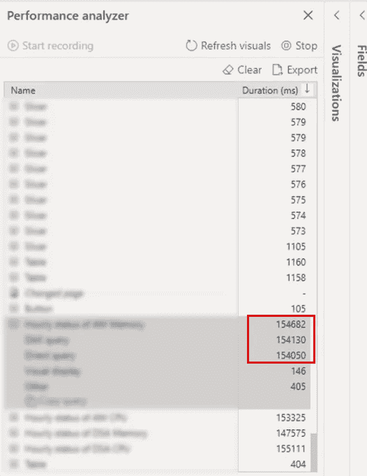
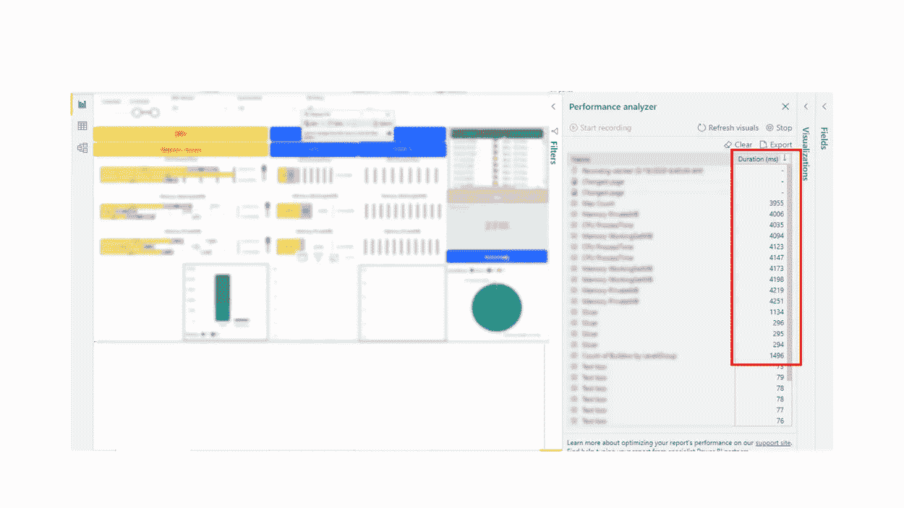
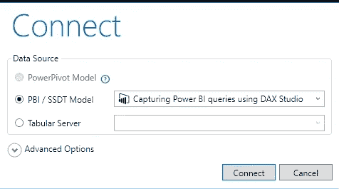
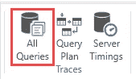
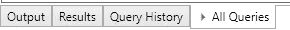
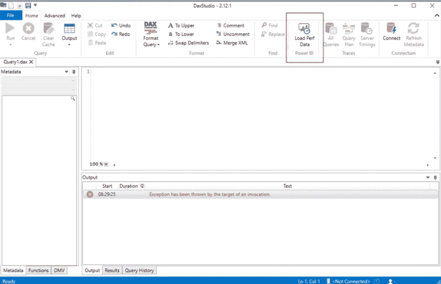
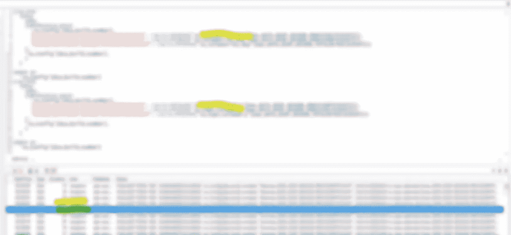
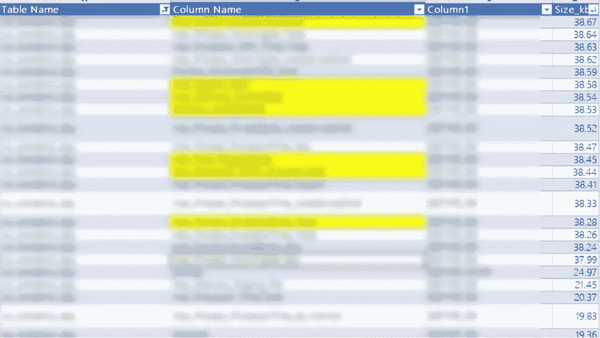

# 推出两款工具，将您的功耗提升 10 倍

> 原文：<https://towardsdatascience.com/introducing-2-tools-to-speed-up-your-power-bi-10x-e354cce355ae?source=collection_archive---------36----------------------->

## 使用所解释的步骤进行自我诊断，以确定根本原因并加快报告速度

尼古拉斯·霍伊泽在 [Unsplash](https://unsplash.com/photos/poa-Ycw1W8U) 上拍摄的照片

咨询 Power BI 时，我收到的最常见的问题之一是关于性能的，例如“为什么运行一个仪表板需要这么长时间？”或者“我怎样才能让它更快？”

与性能相关的因素有很多。在开始讨论每一个问题或分享一系列建议之前，我想告诉你如何进行自我诊断，这样你就可以对可能的原因进行分类，找出根本原因，并专注于关键问题！

# 内容

*   确定创建仪表板时的步骤
*   在设定目标之前了解用户行为
*   80/20 原则
*   使用**性能分析器**识别问题
*   使用 **DAX Studio** 进行进一步分析
*   基于洞察力采取行动
*   结论

首先，让我们概述一下创建仪表板的过程。

有三个步骤:

*   导入
*   询问
*   形象化

# 在设定目标之前了解用户行为

多快才算够快？快和慢都是主观的。如果是 C 级的财务仪表板，期望可能会很高，因为仪表板通常在注意力短暂的通勤中消耗，例如在出租车上用手机查看仪表板。相反，在软件测试场景中，等待时间可能会更长，因为数据量很大，甚至刷新数据库也需要时间。BI 开发人员很忙，所以试着把注意力放在有影响力的事情上。

# 80/20 原则

在许多情况下，80%的延迟来自仪表板中不到 20%的视觉效果。性能分析器帮助我们识别这些。

# 使用性能分析器确定问题

打开 **Power BI 桌面**，点击顶部的**视图**。一旦选择**性能分析器**，您将看到该功能出现在右侧。点击**开始记录**后，分析仪记录刷新花费的时间。我建议在你换了一个新页面来模拟用户体验之后再录制。

在下图所示的示例中，最耗时的是在查询类别下，这意味着 DAX 中还有改进的空间。如果它在“视觉显示”类别下，您可能希望更改不同的视觉效果。在大多数情况下，Power BI 提供的原生视觉效果具有更好的性能。

下图演示了调整前后的情况。刷新一个控制面板需要 120 多秒。转完，用了不到 4 秒。

作者的 Power BI 图像(调整前)

作者的 Power BI 图像(调整后)

# 使用 DAX Studio 进行进一步分析

假设我们已经对在**查询中花费最多的持续时间进行了分类。**我推荐使用 **DAX Studio** 做进一步分析。DAX Studio 是一个在 Power BI、Excel 和分析服务表格中编写、执行和分析 DAX 查询的工具。更多详情，请点击查看[。](https://daxstudio.org/)

如果是第一次使用 DAX Studio，可以随意参考以下步骤进行连接。

下载 DAX Studio 后，请打开它并单击文件→打开以链接到 Power BI 报告。

作者的 DAX 工作室图像

点击**所有查询**。

作者的 DAX 工作室图像

不要忘记将卡片拖到所有查询中。

作者的 DAX 工作室图像

将卡片拖到所有查询中。

作者的 DAX 工作室图像

现在，您已经准备好分析 Power BI 报告了。

从下图中，我们可以检查查询中的步骤和持续时间。它帮助我们识别最耗时的查询，并分析如何改进。

作者的 DAX 工作室图像

# 基于洞察力采取行动

**DAX Studio** 也计算每列的大小。请不要低估它的力量。我有一个客户觉得它很有见地。在实践中，数据库管理员和分析师拥有不同级别的权限，所以当分析师不知道列的大小并可能失去确定延迟根本原因的机会时，这并不奇怪。

下图显示了按大小排列的列列表。黄色标记的行很重，但在仪表板中没有使用。然后我让客户仔细检查需要多少列？原来 400 列中只有 30 列是需要的。在清理了数据并带来了他们所需要的东西后，文件大小已经大大减小了。它不仅使传输变得容易，而且性能也提高了。

作者的 DAX 工作室图像

# 结论

**性能分析器**和 **DAX Studio** 是我用来自我诊断的两个工具。我喜欢它们易于使用，并帮助我们专注于要深入研究的领域。毕竟，找出根本原因比简单地说“太慢了”更有帮助。

下一次，如果你面临类似的问题，问一些后续问题来分解问题，并用数据来支持。

一些示例问题:

*   **刷新一份报告需要多长时间？**
*   **哪种视觉花费的时间最多？**
*   **哪些步骤最耗时？导入、查询还是可视化？**
*   这种视觉效果对讲述故事有必要吗？
*   我们需要将所有的列导入到数据集中吗？

最初发布于[https://wanchunghuang . com/introducing-2-tools-to-speed-your-power-bi-10x/](https://wanchunghuang.com/introducing-2-tools-to-speed-up-your-power-bi-10x/)2021。

# 保持联系

*   关注我在[媒体](https://medium.com/@wanchunghuang)上的更多类似的故事
*   在 [LinkedIn](https://www.linkedin.com/in/wanchung-huang/) 上连接
*   你怎么想呢?留下评论