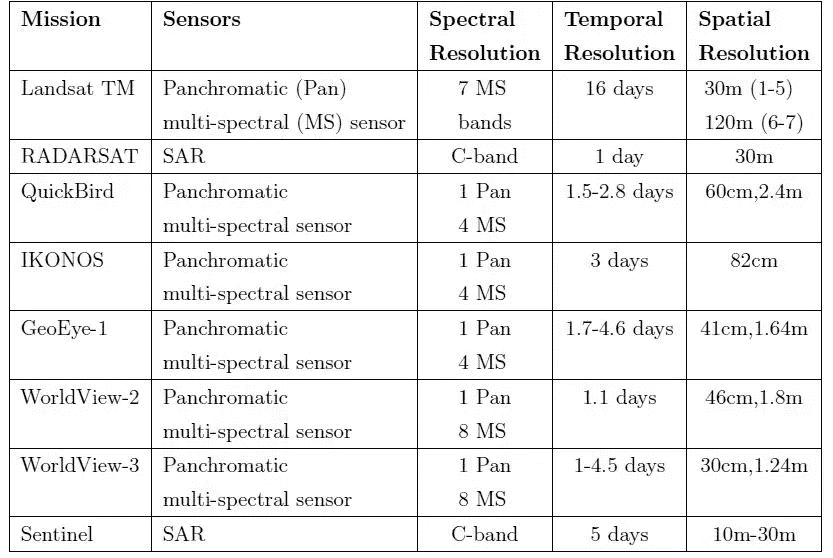
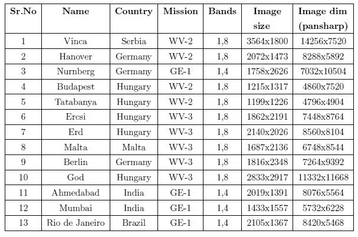
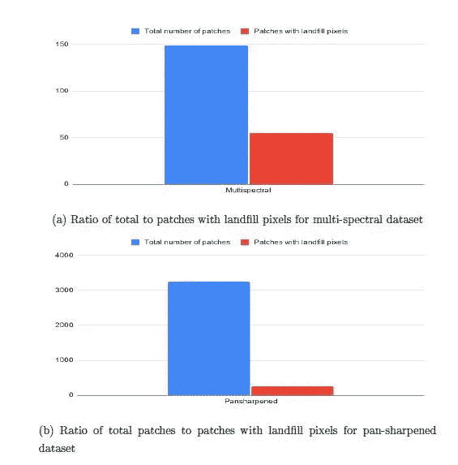
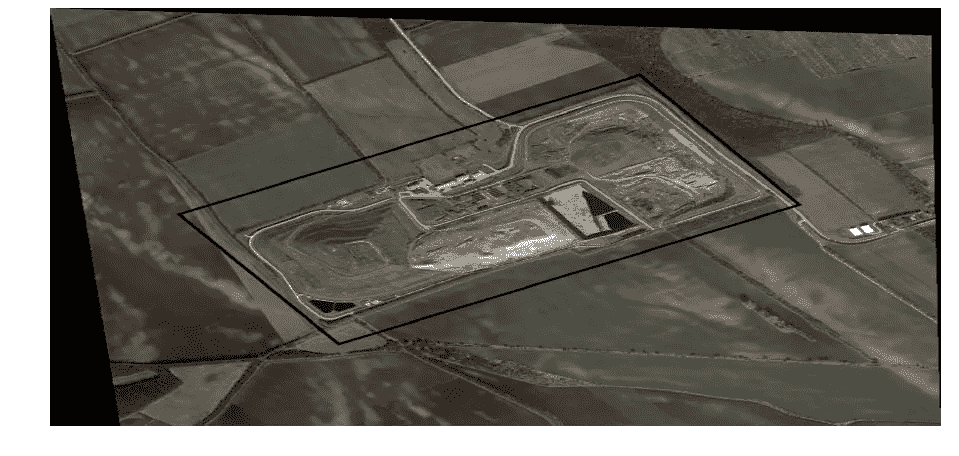
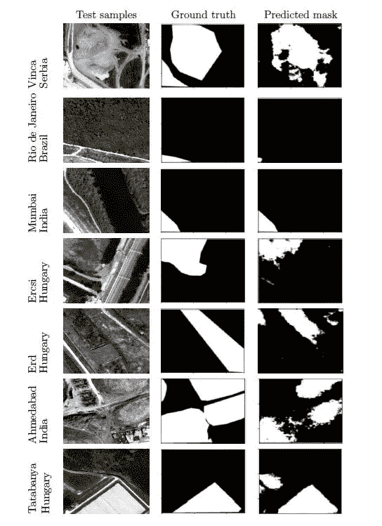
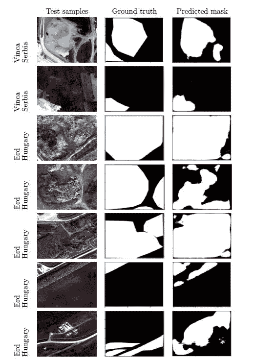

# 介绍一种新颖的垃圾填埋场和废物堆放场的甚高分辨率数据集

> 原文：<https://towardsdatascience.com/introducing-a-very-high-resolution-dataset-of-landfills-and-waste-dumps-196d46d533fc?source=collection_archive---------14----------------------->

## [行业笔记](https://towardsdatascience.com/tagged/notes-from-industry)

## 由来自德国、匈牙利、塞尔维亚、印度和巴西的垃圾填埋场的甚高分辨率多光谱卫星图像组成的新数据集

[Pop &斑马](https://unsplash.com/@popnzebra)在 [Unsplash](https://unsplash.com/?utm_source=medium&utm_medium=referral) 上拍照

# 非法垃圾场和垃圾填埋场的威胁

废物处理是一个严重的问题，世界上大部分的废物都进入了东南亚和非洲国家的垃圾场。除了垃圾填埋场，废物还被非法弃置在河岸和海滩上。虽然其中一些垃圾填埋场可能是合法的，并有适当的回收和安全处置系统，但大型非法垃圾填埋场不仅在污染土壤、水和空气方面对环境构成威胁，而且对社区的健康有害。

对于政府和市政当局来说，跟踪这些迅速增长的垃圾填埋场以控制威胁是一项挑战。虽然这些垃圾填埋场可以通过无人机进行监测，但通过卫星图像使用地球观测(EO)的可能性可以让我们一次性监测更大的区域，从而形成更好的废物监测和管理系统。

# 利用地球观测探测垃圾填埋场的可能性

由于目前正在运行的大量空间卫星传感器程序的存在，各种分辨率(空间、时间和光谱)的卫星传感器数据量达到了 Pb 级。空间遥感传感器可分为成像和非成像传感器。如果只说成像传感器，还有光学、热、雷达成像传感器的太空计划。对这些传感器的详细描述超出了本文的范围。

下表列出了一些最流行和最广泛使用的卫星传感器。

各种卫星任务的技术规格表。除了雷达卫星和哨兵之外，所有的卫星传感器都是光学传感器。RADARSAT 和 Sentinel 包含合成孔径雷达(SAR)传感器。作者图片

因此，我们可以看到，在获取光电探测数据方面，我们确实有太多的选择，这使得研究利用光电探测填埋场的可能性成为一项值得进行的工作。光电技术已经有了一些应用，比如探测海洋中的船只(还记得被困在苏伊士运河的长赐号吗？)，洪水的影响，毁林，非法采矿，铁路轨道监测等等。

虽然大多数可用的卫星数据都是开源的，并且免费用于研究，但一些商业程序，如 Maxar Technologies 的 WorldView，可以提供非常高分辨率的卫星图像，只需支付少量费用即可购买。

# 新型垃圾填埋场数据集的规格

在这一节中，我将讨论选择一组卫星图像来创建数据集的动机和过程。此外，我还讨论了为图像创建精确注释的方法。

## 创建数据集的过程

任何机器学习管道的最大和最关键的挑战是选择正确的数据集。所选数据集的可用性、大小和质量决定了机器学习架构以及最终用于解决手头问题的进一步技术和超参数。

对于这个项目，在没有任何公开可用的垃圾填埋场检测数据集的情况下，我不得不创建自己的数据集。虽然有几个可用的数据集，如 UC Merced 土地利用数据集[1]、DeepSat [2]、Urban Atlas [3]、BigEarthNet [4]，但这些数据集主要提供关于土地、田地、森林等一般土地利用分类类别的广泛信息。BigEarthNet 确实为垃圾场提供了一个类，但是由于数据集是从低分辨率 Sentinel 卫星影像(参见上表)中创建的，因此不足以检测可能小于一米的小型垃圾填埋场。因此，该项目需要一个专门针对垃圾填埋场的定制数据集。值得注意的是，在项目的第一阶段，我没有根据废物的类型对垃圾填埋场进行分类。也就是说，为数据集创建选择的垃圾填埋场是废物不可知的。基于废物类型的分类可被视为该项目的未来改进。

最终，我决定使用空间分辨率分别为 46 厘米、30 厘米和 41 厘米的 WorldView-2 (WV-2)、WorldView-3 (WV-3)和 GeoEye-1 (GE-1)卫星程序的超高分辨率(VHR)光学图像。这些卫星节目的相应光谱分辨率分别为 8 个多光谱(ms)波段、8 个 MS 波段和 4 个 MS 波段，此外还有 1 个全色波段。此外，这些程序的时间分辨率在 1-5 天之间。这些参数使得从这些图像中创建的数据集非常适合从卫星图像中监测和检测垃圾填埋场。

与哨兵图像不同，这些 VHR 图像不是免费的。然而，欧洲航天局(欧空局)允许出于研究目的免费使用有限的储存库。一旦我最终确定了我将要使用的卫星程序，我就向欧空局索要图像拼图。为了获得这些图像拼图，我确定了欧洲、亚洲和南美洲的 13 个主要已知垃圾填埋场，并将它们发送给欧空局，欧空局反过来又让我获得了这些垃圾填埋场的非常高分辨率的图像。

欧空局通常以一组 GeoTIFF 文件的形式提供图像——1 幅黑白全色图像具有非常高的空间分辨率，例如 WV-3 为 30 厘米，但光谱分辨率较低(1 个光谱带), 1 幅多光谱图像具有高光谱分辨率，例如 WV-3 为 8 个光谱带，但空间分辨率较低，例如 WV-3 为 1.24 米。全色锐化是一种技术，其中全色和多光谱图像可以融合在一起，以获得具有高光谱和高空间分辨率的图像。WV-3 图像的空间分辨率为 30 厘米，光谱分辨率为 8 个波段。因此，全色锐化是一种两全其美的方法。虽然像插值这样的传统方法普遍用于全色锐化，但最近深度学习已被用于实现高分辨率多光谱图像。我对垃圾填埋场数据集执行全色锐化，以获得高分辨率的多光谱数据集。为了做到这一点，我在 QGIS [6]中使用了 Orfeo 工具箱[5]。因此，我实际上创建了 2 个垃圾填埋场数据集—一个仅包含多光谱图像，另一个包含全色锐化图像。

塞尔维亚 Vinca 的垃圾填埋场。a .)具有低空间分辨率但高光谱分辨率的多光谱图像。b)具有高空间分辨率但低光谱分辨率的全色图像。c)具有高空间和光谱分辨率的全色锐化图像。作者图片

下表提供了泛锐化前后这些地点的清单和欧空局提供的图像大小:

作者图片

一些用黑色标记垃圾填埋区的图片:

欧空局在印度和匈牙利提供的图片中用黑色标出的垃圾填埋场位置。可以看出，在整个图像区块中，对应于垃圾填埋场的像素数量远小于不包含垃圾填埋场信息的像素数量。图片作者。

欧空局提供的图像块的尺寸非常大。为此，我将这些拼贴分成 512x512 像素的小块。下表列出了为每个多光谱和全色锐化数据集获取的面片数。

数据集图像补丁率。作者图片

可以看出，尽管产生的斑块总数相当高，但具有填埋像素的斑块数量相当低，如下图所示。这导致了数据集中的不平衡。从下面绘制的比率可以推断，数据集是不平衡的，具有垃圾填埋像素的斑块较少。为此，为了训练模型，只考虑那些其中具有填埋像素的小块。这是因为即使是具有填埋像素的斑块，其背景像素也比填埋像素多。

显示多光谱和高分辨率全色锐化数据集的 512x512 斑块和带有垃圾填埋像素的斑块总数比率的图。作者图片

因此，创建的数据集由 55 个多光谱和 242 个 512x512 像素的全色锐化斑块组成，每个斑块都具有垃圾填埋信息，可以根据机器学习工程师的需要进一步划分为训练集、测试集和验证集，以训练他们的模型。

## 创建高度精确标签的过程

一旦图像补丁被创建，下一个最重要的任务是准确地标记垃圾填埋场，以便它可以作为地面真实数据。因为手头的任务是通过执行语义分割来检测垃圾填埋场，所以我在 QGIS 的帮助下创建了分割遮罩[6]。

准确的标签几乎和数据质量一样重要，甚至更重要。在任何机器学习流水线中，垃圾进就是垃圾出。因此，如果您的训练数据或相应的标签不正确，输出就不可能是理想的。即使是最好的架构也无法弥补不良数据。因此，创建准确的标签对这个项目至关重要。为此，我遵循了两步策略——目视检查和计算图像斑块的植被指数。

目视检查和 VIs 是一些传统的方法，已经在文献中用于垃圾填埋检测。但是它们已经被证明是不可靠的，同时也是乏味和耗时的，这就是为什么我们试图应用机器学习来找到问题的解决方案。但是，当我们试图创建地面真实标签时，传统的视觉检查和 VIs 方法恰好是一个相当有用的工具。以下小节讨论如何使用这些方法来创建标签:

## 外观检验

这是可用于标记的最简单的方法。在创建标签时，通过目视检查来识别对应于垃圾填埋场的区域是第一步。这种方法有助于排除不符合垃圾填埋场条件的区域，因为垃圾填埋场的位置是由我提供的，因此我知道它们的确切地理位置。

通过目视检查，我可以识别匈牙利 Erd 的垃圾填埋场，如下图中黑色矩形所示。

匈牙利 Erd 的垃圾填埋场。作者图片

## 植被指数(六)

虽然可以通过已知的地理位置来识别匈牙利 Erd 的垃圾填埋场，但不足以创建整个区域的分段标签。如果你仔细观察上图中用实体关系图标出的填埋区，你会发现填埋区内的一些区域被植被覆盖。同样，其他一些垃圾填埋场内也有建筑物或其他结构，不能归类为垃圾填埋场。将它们标记或标注为垃圾填埋场会混淆神经网络，导致不正确的预测。

为了更好地了解垃圾填埋区内的景观，并排除将植被区域标记为垃圾填埋区的可能性，我利用 VIs 进行了分析，这有助于我创建准确的标签。

从遥感图像获得的植被指数(VIs)是一种评估植被覆盖、健康和植被生长动态的简单方法。这些指数利用可见光辐射，特别是可见和不可见光谱中的绿色光谱区域来获得植被表面的量化。土壤、杂草和感兴趣的植物的混合组合使得简单 VI 的计算成为非常困难的任务。有许多可视信息提供有关植被覆盖的有用信息。其中包括 NDVI、SAVI 和 MSAVI。我在 QGIS [6]的帮助下计算了这些 VI，以深入了解垃圾填埋区。VIs 的详细描述和计算超出了本文的范围。

匈牙利 Erd 填埋场的 NDVI 计算如下所示。图像最右侧的 NDVI 等级代表 NDVI 等级，基本上表示 NDVI 的绿色越深(或 NDVI 值越大)，景观中的植被越健康，反之亦然。从垃圾填埋区的 NDVI 地图中可以看出，并非整个区域都可以标记为垃圾填埋场，因为一些以绿色显示的区域代表垃圾填埋场内的植被。将这些区域标记为垃圾像素会导致机器学习模型的错误输出。

匈牙利 Erd 的垃圾填埋场以及相应的 NDVI 值和比例尺。作者图片

通过目视检查、计算和分析 VIs，我可以创建精确的分段遮罩。下图中显示了其中的一些，上面覆盖了垃圾填埋场斑块及其对应的遮罩。

带有重叠分段掩膜的垃圾填埋场块被用作地面实况。作者图片

如前所述，分段掩码是在 QGIS 的帮助下创建的。在数据集文件夹中，掩膜存储为 GeoJSON 文件，该文件由构成掩膜的面的每条边的坐标列表组成。每个垃圾填埋场都有一个相应的 GeoJSON 文件。修补程序名称以及相应的 GeoJSON 掩膜文件已在. csv 文件中列出。这个。csv 文件可用于在实施期间由数据加载器加载填埋补丁和相应的掩膜。

# 探测匈牙利的垃圾填埋场——一些结果

将用于语义分割的监督深度学习算法应用于来自垃圾填埋场数据集的验证集提供了一些有用的结果。深度学习模型成功地识别了几米大小的垃圾填埋场，这对于监控和检测非法垃圾填埋场非常有用，因为它们通常分布在较小的区域。垃圾填埋场的部分分割结果如下所示。

作者图片

作者图片

深度学习架构的规范以及相关参数和结果将在未来的文章中分享。然而，在这里可以找到一个简短的技术概述:[https://www . euspace imaging . com/combining-vhr-satellite-imagery-and-deep-learning-to-detect-fills/](https://www.euspaceimaging.com/combining-vhr-satellite-imagery-and-deep-learning-to-detect-landfills/)

# 请求访问数据集的进程

本文的目的是提出一种新的垃圾填埋场数据集，由高质量的 VHR 图像和精确的分割模板组成。此外，我想讨论和分享我在选择适当的数据和工作流程的整个过程中的经验，以及我自己为这些数据创建注释或标签的想法。我希望新的机器学习工程师会发现这很有用。

将来，我会把数据集放在一个服务器上，从那里可以直接下载。但是，目前，如果您想要访问数据集，请遵循以下步骤:

1.  在此位置启动项目回购:[https://github . com/AnupamaRajkumar/填埋场检测 _SemanticSegmentation](https://github.com/AnupamaRajkumar/LandfillDetection_SemanticSegmentation) 。这使我能够跟踪请求访问数据集的人
2.  在 anupamar228@gmail.com 给我写一封电子邮件，提供你的电子邮件地址，链接到你的 DropBox，我会让你访问目前存储在我个人 DropBox 中的知识库。

# 鸣谢和引用信息

我要感谢欧空局为研究目的免费提供 VHR 图像。他们有一个巨大的各种类型和规格的卫星图像库，这对地球观测研究是一个福音。

欧空局出于研究目的将数据集开源。但是，它受到版权法的约束。如果使用数据集中的图像，必须包括“DigitalGlobe，Inc. 2021，数据由欧洲航天局提供”，以避免侵犯版权。我已经把这个信息包含在数据集文件夹的 LicenseInfo.txt 里了，一定要用。

如果您决定使用该数据集中的图像，请不要忘记引用数据集文件夹中 ReadMe.txt 中提到的内容。

## 参考

[1]杨熠和肖恩·纽萨姆，“土地利用分类的视觉词汇包和空间扩展”，美国计算机学会地理信息系统进展国际会议，2010 年，[http://weegee.vision.ucmerced.edu/datasets/landuse.html](http://weegee.vision.ucmerced.edu/datasets/landuse.html)

[2] Saikat Basu、Sangram Ganguly、Supratik Mukhopadhyay、Robert DiBiano、Manohar Karki 和 Ramakrishna Nemani。deep sat——卫星图像学习框架，2015 年。

[3]城市地图集。https://land.copernicus.eu/local/urban-atlas.[访问时间:2021–11–14。](https://land.copernicus.eu/local/urban-atlas.)

[4] Gencer Sumbul，Marcela Charfuelan，Begüm 德米尔和 Volker Markl。Bigearthnet:遥感图像理解的大规模基准档案。在 IGARSS 2019–2019 IEEE 国际地球科学和遥感研讨会上，第 5901–5904 页，2019 年。

[5] Orfeo 工具箱。【https://www.orfeo-toolbox.org/CookBook/】T4Applications/app _ pan sharpening . html 访问时间:2021–11–15。

QGIS 开发人员指南。https://docs.qgis.org/3.16/en/docs/developers _ guide/index . html 访问时间:2021–11–15。