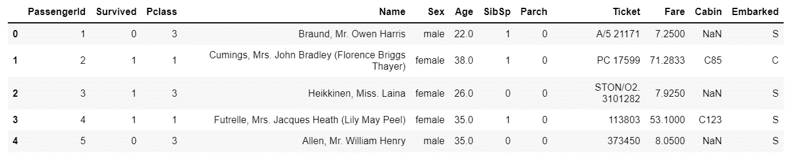
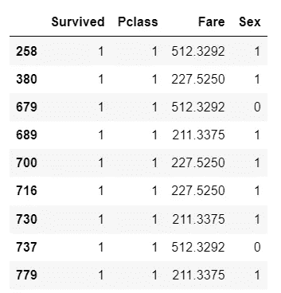

# 使用 PyOD 在 Python 中引入异常/离群点检测🔥

> 原文：<https://towardsdatascience.com/introducing-anomaly-outlier-detection-in-python-with-pyod-40afcccee9ff?source=collection_archive---------4----------------------->

## 你认为那些讨厌的局外人能躲得过你吗？


约翰·施诺布里奇在 [Unsplash](https://unsplash.com?utm_source=medium&utm_medium=referral) 上的照片

# 您的旅程概述

1.  [设置舞台](#2a76)
2.  [什么是异常/异常值检测？](#5a70)
3.  [介绍 PyOD](#d2b4)
4.  [熟悉数据](#2562)
5.  [用于数据清洗的异常检测](#8787)
6.  [用于预测的异常检测](#1525)
7.  [包装](#45a1)

# 1 —搭建舞台

近年来，**异常检测**在机器学习社区变得更加流行。尽管如此，在异常检测上的资源肯定比经典的机器学习算法要少。因此，学习异常检测可能会比想象中更棘手。从概念的角度来看，异常检测实际上非常简单！

这篇博文的目的是给你一个异常/异常值检测的快速介绍。具体来说，我将向您展示如何使用包 [PyOD — Python 异常检测](https://pyod.readthedocs.io/en/latest/)在 Python 中实现异常检测。通过这种方式，您不仅会了解什么是异常/异常值检测，还会了解如何在 Python 中实现异常检测。

好消息是 PyOD 很容易应用——尤其是如果你已经有了使用 [Scikit-Learn](https://scikit-learn.org/stable/) 的经验。事实上，PyOD 包试图与 Scikit-Learn API 接口非常相似。

**先决条件:**你应该对 Python 和熊猫有一些基本的熟悉。然而，不需要异常检测的知识😃

# 2 —什么是异常/异常值检测？

异常检测有许多名称；*异常检测*、*异常分析*、*异常分析*、*新奇检测*。来自维基百科的简明描述如下描述了异常检测:

> ***异常检测*** 是对罕见项目、事件或观察结果的识别，这些项目、事件或观察结果因与大多数数据显著不同而引起怀疑。

让我们试着解开以上陈述。假设您有一个由许多观察值组成的数据集。异常检测的目标是识别明显不同于其他观测的观测。你为什么想这么做？有两个主要原因:

## 用例 1 —数据清理

清理数据时，有时最好删除异常，因为它们歪曲了数据。让我们用一个具体的例子来说明这一点:假设你做了一个调查，问了一些关于受访者最喜欢的猫品种的问题😺


由[米哈伊尔·瓦西里耶夫](https://unsplash.com/@miklevasilyev?utm_source=medium&utm_medium=referral)在 [Unsplash](https://unsplash.com?utm_source=medium&utm_medium=referral) 上拍摄

您首先将调查交给 100 个人，每个人完成调查。现在，您需要估计参加调查所需的平均时间。为什么？您希望有 10，000 多人参加调查。指出新受访者的调查大概需要多长时间是很专业的。即使猫很牛逼，人也很忙！

假设您从前 100 个人那里获得了以下结果:

*   3 分钟— 57 名受访者
*   4 分钟— 33 名受访者
*   5 分钟— 6 名受访者
*   6 分钟— 3 名受访者
*   480 分钟— 1 名受访者

最后一个是怎么回事？480 分钟就是 8 小时！经进一步检查，你发现被调查人在晚上 23:58 开始调查，然后从 00:00 一直站到 07:56。然后从 07:56 到 07:58 结束。你能看到发生了什么吗？

明明一个人开始调查，然后睡觉，然后早上起来就完成了调查。如果您保留这一结果，那么完成调查的平均时间将是

平均值=(3 * 57+4 * 33+5 * 6+6 * 3+1 * 480)/100 = 8.31

然而，说调查大约需要 8 分钟是不准确的。花了那么长时间的唯一原因是因为一个困倦的回答者😪

更准确的做法是把那个人从记录中去掉

平均值= (3 * 57 + 4 * 33 + 5 * 6 + 6 * 3)/99 = 3.54

为简单起见，调查可以写成这样的句子:*调查的平均完成时间在 3 到 4 分钟之间。*

这里，您已经手动删除了一个异常值，以清理数据，从而更好地代表现实。**异常检测是实现自动检测异常值的算法。**

> **注意:**在上面的例子中，您已经删除了一个异常值，以更好地匹配调查长度与现实。异常检测不应该**被用来人为地让一个产品看起来比它实际上更好。应该仔细考虑使用异常检测进行数据清理在道德上是否合适。**

## 用例 2 —预测

在其他应用中，*异常本身就是关注点*。例如网络入侵、银行欺诈和某些结构缺陷。在这些应用中，异常代表了值得进一步研究的东西。

*   **网络入侵** —网络数据的异常可能表明某种网络攻击已经发生。
*   **银行欺诈** —交易数据的异常可能表明欺诈或可疑行为。
*   **结构缺陷** —异常可能表明您的硬件有问题。虽然在这种情况下通常可以使用更传统的监控软件，但是异常检测可以发现更奇怪的缺陷。

> **警告:**在某些情况下，比如银行欺诈，并不总是单笔交易引起怀疑。应该考虑的是在上下文中看到的多次交易的频率和数量。为了解决这个问题，应该对数据进行适当的汇总。这超出了本博客的范围，但是您应该知道。

# 3 —介绍 PyOD

让我们描述一下帮助您进行异常检测的 Python 包 [PyOD](https://pyod.readthedocs.io/en/latest/index.html) 。用 PyOD 文档的话说:

> PyOD 是一个全面且可扩展的 **Python 工具包**，用于**检测多元数据中的无关对象**。

简而言之，PyOD 为您提供了一系列执行异常检测的模型。一些值得一提的亮点是:

*   PyOD 包括 30 多种不同的算法。他们中的一些是经典作品(如 LOF)，而另一些则是新晋作品(如科普德)。参见[支持型号的完整列表](https://pyod.readthedocs.io/en/latest/pyod.models.html)。
*   PyOD 通过使用 Numba 的 jit-decorator 优化了它的代码。如果你对此感兴趣，我已经在 Numba 上写了一篇博文。
*   PyOD 有统一的 API。因此，如果您熟悉 PyOD 中的一些模型，那么您可以轻松地学习其余的模型。我建议在你写完这篇博客后，看看 [PyOD API 备忘单](https://pyod.readthedocs.io/en/latest/api_cc.html)。

如果您正在使用 PIP，那么您可以使用以下命令安装 PyOD:

```
pip install pyod
```

如果您之前已经安装了 PyOD，请确保使用 pip 命令更新它:

```
pip install --upgrade pyod
```

如果您使用的是 Conda 软件包管理器，那么您可以运行以下命令:

```
conda install -c conda-forge pyod
```

在这篇博文中，我将演示两种异常检测算法:KNN 和 LOC。你可能以前听说过 KNN(K-最近邻)，而 LOC(本地离群因子)可能对你来说并不熟悉。让我们先来看看你将使用⚡️的数据

# 4 —熟悉数据

我们将使用经典的**泰坦尼克号数据集**。要将数据集加载到 Pandas 中，只需运行下面的代码:

```
import pandas as pd
titanic = pd.read_csv(
"[https://raw.githubusercontent.com/datasciencedojo/datasets/master/titanic.csv](https://raw.githubusercontent.com/datasciencedojo/datasets/master/titanic.csv)"
)
```

要检查数据集的第一行，使用`head()`方法:

```
titanic.head()
```



泰坦尼克号数据帧的前 5 行。

如您所见，有代表性别、年龄、票价、乘客级别、机票等的列。为简单起见，您将只使用以下四列:

```
# Selecting only the columns Survived, Pclass, Fare, and Sex
partial_titanic = titanic[["Survived", "Pclass", "Fare", "Sex"]]
```

`partial_titanic`中没有缺失值。然而，列`Sex`由字符串值`male`或`female`组成。为了能够进行异常检测，您需要数值。您可以使用代码将这个二进制分类变量转换为值 0 和 1:

```
# Change the categorical value Sex to numeric values
partial_titanic["Sex"] = partial_titanic["Sex"].map({
"male": 0,
"female": 1
})
```

现在您已经准备好进行异常检测了😃

# 5 —用于数据清理的异常检测

现在让我们使用异常检测来清理您在上一节中创建的数据集`partial_titanic`。您将使用 KNN 模型来完成这项工作。KNN 模型检查数据并寻找远离其他数据点的数据点(行)。首先，您需要导入 KNN 模型，如下所示:

```
# Import the KNN
from pyod.models.knn import KNN
```

我们从提出一个 KNN 模型开始:

```
# Initiate a KNN model
KNN_model = KNN()
```

对于用于数据清理的异常检测方法，您可以对整个数据集进行如下拟合

```
# Fit the model to the whole dataset
KNN_model.fit(partial_titanic)**Output:**
KNN(algorithm='auto', contamination=0.1, leaf_size=30, method='largest', metric='minkowski', metric_params=None, n_jobs=1, n_neighbors=5, p=2, radius=1.0)
```

当运行上面的代码时，你会打印出很多默认值(例如`contamination=0.1`)。如果需要，可以进行调整。运行模型后，您可以访问两种类型的输出:

*   **标签:**通过运行`KNN_model.labels_`，您可以找到观察值是否为异常值的二进制标签。数字`0`表示正常观察值，而数字`1`表示异常值。
*   **决策分数:**通过运行`KNN_model.decision_scores_`，您可以得到某件事情有多异常的原始分数。这些值的范围从`0`到更高。较高的异常值表示数据点更像是异常值。

让我们来看看训练模型的标签:

```
# Find the labels
outlier_labels = KNN_model.labels_# Find the number of outliers
number_of_outliers = len(outlier_labels[outlier_labels == 1])
print(number_of_outliers)**Output:**
88
```

对于一个有 891 名乘客的数据集，有 88 个异常值是相当高的。为了减少这种情况，您可以将 KNN 模型中的参数`contamination`指定得更低。`contamination`表示异常值数据点的百分比。假设污染仅仅发生在`1%`:

```
# Initiate a KNN model
KNN_model = KNN(contamination=0.01)# Fit the model to the whole dataset
KNN_model.fit(partial_titanic)# Find the labels
outlier_labels = KNN_model.labels_# Find the number of outliers
number_of_outliers = len(outlier_labels[outlier_labels == 1])
print(number_of_outliers)**Output:** 
9
```

现在只有`9`离群！您可以查看它们:

```
# Finding the outlier passengers
outliers = partial_titanic.iloc[outlier_labels == 1]
```

如果你检查`outliers`变量，你会得到下表:



离群乘客

如果你看看上面的乘客，KNN 模型会发现他们的票价高得令人难以置信。所有乘客的平均票价很容易在熊猫身上找到:

```
# Average fare price
round(partial_titanic["Fare"].mean(), 3)**Output:**
32.204
```

KNN 算法已经成功地发现了 9 名在票价意义上是异常值的乘客。KNN 模型有许多可选参数[供您选择，以满足您的特定需求🔥](https://pyod.readthedocs.io/en/latest/pyod.models.html#module-pyod.models.knn)

如果您觉得异常值不能代表数据的总体感觉，那么现在可以从数据中删除这些异常值。如前所述，您应该仔细考虑用于数据清理的异常检测是否适合您的问题。

# 6 —用于预测的异常检测

在上一节中，您看到了用于数据清理的**异常检测**。在本节中，您将在预测的**异常检测处取一个峰值。您将根据现有数据训练一个模型，然后使用该模型来预测新数据*是否为异常值。***

假设有谣言说沃森太太也乘坐了泰坦尼克号，但她的死亡从未被记录。根据传闻，沃森太太是一位富有的女士，她花了 1000 美元乘坐泰坦尼克号在一个非常高级的套房里旅行。


卢克·布拉斯韦尔在 [Unsplash](https://unsplash.com?utm_source=medium&utm_medium=referral) 上拍摄的照片

异常检测不能肯定地说谣言是真是假。然而，它可以根据其他乘客的信息来判断沃森太太是否是异常。如果她是一个异常，谣言应该半信半疑。

让我们用 PyOD 库中的另一个模型来测试 Watson 夫人的存在性；**局部异常值因子(LOF)** 。LOF 模型通过将数据点的*局部密度*与其相邻数据点的局部密度进行比较来测试数据点是否为异常值。关于这种方法的更多信息，你可以查看它的维基百科页面。

让我们开始编码吧！首先建立一个局部异常因素模型:

```
# Import the LOF
from pyod.models.lof import LOF# Initiate a LOF model
LOF_model = LOF()# Train the model on the Titanic data
LOF_model.fit(partial_titanic)
```

请注意，使用 LOF 模型与使用 KNN 模型是多么相似。

现在你可以把沃森太太表示成一个数据点:

```
# Represent Mrs. Watson as a data point
mrs_watson = [[0, 1, 1000, 1]]
```

`mrs_watson`中的值代表她的存活(`0`代表未存活)、乘客等级(`1`代表头等舱)、票价(`1000$`代表票价)、性别(`1`代表女性)。LOF 模型需要 2D 阵列，因此这就是在`mrs_watson`中增加一对括号`[]`的原因。

我们现在使用`predict()`方法来预测沃森太太是否是异常值:

```
outlier = LOF_model.predict(mrs_watson)
print(outlier)**Output:**
1
```

值`1`表示沃森太太是异常值。这应该让你怀疑关于沃森太太的谣言是假的😮

# 7—总结

我已经向您展示了如何用 KNN 和 LOF 两种算法实现异常检测。正如你可能会怀疑的那样，PyOD 中有更多的算法可以使用。

异常检测对于清理数据和预测异常值都很重要。手边的应用程序应该确定是否需要应用异常检测。如果您计划在 Python 中应用异常检测，那么 [PyOD](https://pyod.readthedocs.io/en/latest/) 是一个可靠的选择。

**喜欢我写的？查看我的其他帖子，了解更多 Python 内容:**

*   [用漂亮的类型提示使你罪恶的 Python 代码现代化](/modernize-your-sinful-python-code-with-beautiful-type-hints-4e72e98f6bf1)
*   [用 Python 可视化缺失值非常简单](/visualizing-missing-values-in-python-is-shockingly-easy-56ed5bc2e7ea)
*   [使用米托轻松加速 Python 中的数据分析](/painlessly-speed-up-your-data-analysis-in-python-with-mito-2b79de4f2f46)
*   [5 个能在紧要关头拯救你的超赞数字功能](/5-awesome-numpy-functions-that-can-save-you-in-a-pinch-ba349af5ac47)
*   [5 个专家提示，让你的 Python 字典技能一飞冲天🚀](/5-expert-tips-to-skyrocket-your-dictionary-skills-in-python-1cf54b7d920d)

如果你对数据科学、编程或任何介于两者之间的东西感兴趣，那么请随意在 LinkedIn 上添加我，并向✋问好