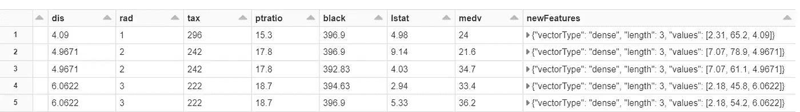

# 面向数据科学的 Azure Databricks 简介

> 原文：<https://towardsdatascience.com/introducing-azure-databricks-for-data-science-547e2784fa49?source=collection_archive---------19----------------------->

## 了解 Azure Databricks 服务功能对于大数据处理和实施机器学习解决方案的重要性。


约翰·马特丘克在 [Unsplash](https://unsplash.com?utm_source=medium&utm_medium=referral) 上拍摄的照片

# 介绍

这篇文章将简要描述 Azure Databricks 托管服务的丰富特性及其功能。作为一名机器学习工程师，如果你配备了这个工具库，那么它将把你的开发技能带到新的高度。

让我们首先了解一下微软 Azure 的 Databricks 即服务产品是什么。

Azure Databricks 是微软 Azure 提供的全托管平台服务，简而言之，它是一个大数据和机器学习平台。它融合了 Apache Spark 和微软团队的共同努力。该服务是大数据处理和机器学习的单一平台。

Azure Databricks 使您作为数据工程师能够运行大规模 Spark 工作负载，因为 Azure 的底层大规模可扩展计算能力，因此它们可以通过自动扩展、缓存、索引和查询优化在云中匹配无与伦比的性能和成本效益。

> 本文假设您已经熟悉了 Spark 框架，并且掌握了 PySpark 知识。

<https://www.linkedin.com/in/p-jainani/>  

# Azure 数据块

Databricks 由 Apache Spark、Delta Lake 和 MLflow & Spark 创建，这是一个统一的处理引擎，可以使用 SQL、机器学习、图形处理或实时流分析来分析大数据。


**Azure Databricks 架构** -自定义图像

Azure Databricks 架构的核心是 Databricks 运行时引擎，它针对优化的数据访问层引擎优化了 Spark 产品、Delta Lake 和 Databricks I/O。这一核心引擎为数据科学工作负载提供了强大的处理能力。它还提供了与不同 Azure 数据服务的原生集成能力，如 Azure Data Factory 和 Synapse Analytics。它还提供了各种 ML 运行时环境，比如*tensor flow*&*py torch*。笔记本可以与 MLFlow + [Azure 机器学习服务](/azure-machine-learning-service-part-1-an-introduction-739620d1127b)集成。

## 引擎盖下——它的火花

Azure Databricks 服务是一个面向笔记本的 *Apache Spark 即服务*工作环境。它为大规模数据处理和机器学习提供了分析引擎。真正意义上，它可以处理大容量、高速度、多种多样的大数据。Apache Spark 集群是一组计算机，它们被视为一台计算机，处理从笔记本发出的命令的执行。这个集群有一个*驱动*来将*任务*分配给它的*执行器*，并通过可用的*插槽*来处理它们。此外，驱动程序将任务分配给执行程序来执行任务，并对其数据进行划分，该任务被划分为多个阶段并按顺序流执行。作业每个阶段的结果都会发送给驱动程序进行整合。这就是 Spark 处理架构的要点。


**Spark Cluster:逻辑架构** —来源微软文档

作为一名 Azure Databricks 工程师，你只需要关注:

*   我的数据被划分成多少个分区。
*   我拥有的用于并行执行的槽数。
*   我触发了多少工作？
*   最后是这些工作被划分的阶段。

# **Azure Databricks 正在运行**

假设您已经在订阅中创建了 Azure Databricks 工作区。

## 读取数据

作为开发人员，它使您能够从不同的来源提取任何格式的数据，CSV、JSON 或 parquet，并在并行、分布式和可伸缩的 spark 环境中处理它们。为此，它使用 scala、R 或 python APIs。

下面的代码片段使用 *Spark 会话*来创建一个使用`read()`函数的*数据帧*。它链接`csv()`函数从 CSV 文件中读取数据。

```
bostonDF = (spark.read
  .option("HEADER", True)
  .option("inferSchema", True)
  .csv("/mnt/training/bostonhousing/bostonhousing/bostonhousing.csv")
)display(bostonDF)
```


上一段代码的输出

## 添加新功能

如果作为一名开发人员，你是 Spark 的新手，那么你需要知道，Spark 不同于许多其他机器学习框架，因为我们在包含我们所有特征的向量的单个列上训练我们的模型。通过创建一个名为`features`的列来准备数据，该列包含平均房间数、犯罪率和贫困率。这是通过使用 [PySpark 的 VectorAssembler](http://spark.apache.org/docs/latest/api/python/pyspark.ml.html?highlight=vectorassembler#pyspark.ml.feature.VectorAssembler) 对象汇编器创建新的列特性来实现的，如下面的代码片段所示:

```
from pyspark.ml.feature import VectorAssemblerfeatureCols = ["indus", "age", "dis"]
assembler = VectorAssembler(inputCols=featureCols, outputCol="newFeatures")bostonFeaturizedDF2 = assembler.transform(bostonDF)display(bostonFeaturizedDF2)
```



上一段代码的输出

> 参见[ml lib 文档了解更多关于`features`栏中稀疏向量符号的](https://spark.apache.org/docs/latest/mllib-data-types.html)，这将在特征章节中详细介绍。

## 火车模型

一旦数据准备好了，我们就可以训练我们的模型了，这是通过下面的代码完成的，这是一个简单的[线性回归](http://spark.apache.org/docs/latest/api/python/pyspark.ml.html?highlight=vectorassembler#pyspark.ml.regression.LinearRegression)模型:

```
from pyspark.ml.regression import LinearRegressionlrNewFeatures = LinearRegression(labelCol="medv", featuresCol="newFeatures")lrModelNew = lrNewFeatures.fit(bostonFeaturizedDF2)
```

## 获得预测

模型定型后，将按如下方式获取预测:

```
from pyspark.ml.linalg import Vectorsdata = [(Vectors.dense([11., 68., 4.]), ),
        (Vectors.dense([6., 35., 2.]), ),
        (Vectors.dense([19., 74., 8.]), )]
newDataDF = spark.createDataFrame(data, ["newFeatures"])
predictionsDF = lrModelNew.transform(newDataDF)
display(predictionsDF) 
```

`lrModelNew`是一个训练有素的估计器，我们可以使用它的`.transform()`方法转换数据，因此它也计算预测值。


上一段代码的输出

# 结论

简要描述 Azure Databricks 服务的本质、架构及其核心 Spark 引擎功能。我只是通过实现一个虚拟的 ML 模型给出了一个蹩脚的例子，试图触及表面。在随后的文章中，我会谈到 Azure Databricks 服务的另一个方面。

# 参考

[1]微软文档| [Azure Databricks 服务](https://docs.microsoft.com/en-us/azure/databricks/scenarios/what-is-azure-databricks-ws)
【2】Azure data bricks |[入门](https://docs.microsoft.com/en-us/azure/databricks/scenarios/quickstart-create-databricks-workspace-portal?tabs=azure-portal)
【3】[Azure data bricks 笔记本](https://docs.microsoft.com/en-us/azure/databricks/notebooks/)

> 在 [**LinkedIn**](https://www.linkedin.com/in/p-jainani/) 上与我联系，进一步讨论

<https://www.linkedin.com/in/p-jainani/> 