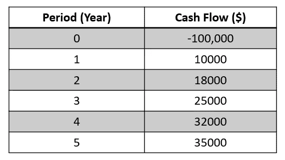
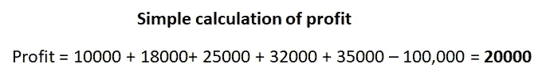
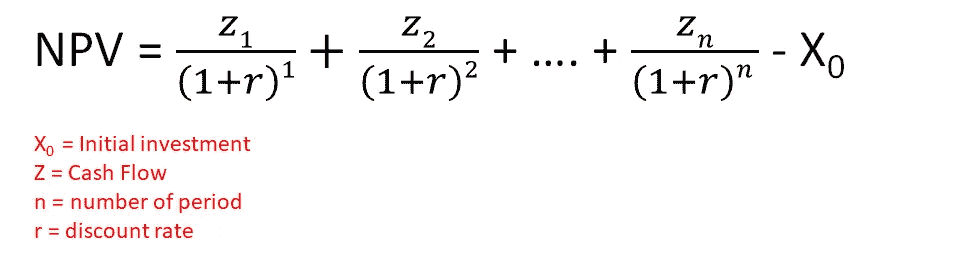
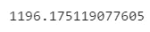
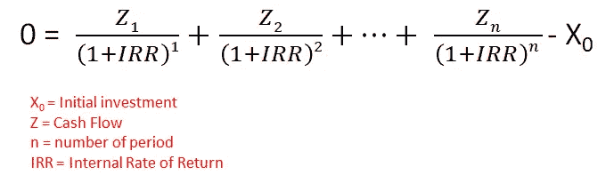
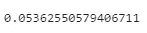
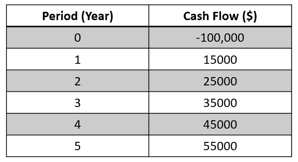
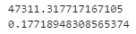

# 使用 Python 引入资本预算工具

> 原文：<https://towardsdatascience.com/introducing-capital-budgeting-tools-with-python-e369ef23d5ac?source=collection_archive---------18----------------------->

## 资本预算在任何业务中都不是一个随机的猜测。在本文中，我们将使用 Python 来度量项目评估的 NPV 和 IRR。

凯利·西克玛在 [Unsplash](https://unsplash.com/s/photos/budget?utm_source=unsplash&utm_medium=referral&utm_content=creditCopyText) 上的照片

[**资本预算**](https://en.wikipedia.org/wiki/Capital_budgeting) 是一个深思熟虑的计划过程，以确定一个或多个潜在投资项目是否值得通过公司的资本化结构获得现金资金。资本预算的最终目的是使决策者能够明智地选择能够为公司增值的项目，从而使股东受益。

本文将介绍两种最常用的资本预算方法。它们是:

1.  **净现值**
2.  **内部收益率**

净现值和内含报酬率在许多企业中被广泛使用，它们是相互关联的。我们将使用[**Python Numpy-Financial package**](https://numpy.org/numpy-financial/latest/)来处理 NPV 和 IRR 所需的所有计算。

# 必备 Python 库

1.  **货币金融**——[https://numpy.org/numpy-financial/](https://numpy.org/numpy-financial/)

# 开源代码库

本文中的原始完整源代码可以在我的 [Github Repo](https://github.com/teobeeguan/Python-For-Finance/tree/main/Time%20Value%20of%20Money) 上获得。如果你想用它来关注我的文章，请随意下载它( *NPV & IRR.ipynb* )。

# 1.净现值

假设我们有一个项目，建议初始投资资本为 100，000 美元。我们预计该项目将在未来五年产生 10000 美元、18000 美元、25000 美元、32000 美元、35000 美元的收入。

作者准备的图像

这里的问题是五年后我们能从这个项目中获得多少利润？一个简单的计算可能只是简单地将第一年到第五年的所有收入相加，然后减去初始资本。

作者准备的图像

看起来这个项目是有利可图的，五年后我们可以获得 20000 美元。然而，简单计算的一个明显问题是，它没有考虑 [**贴现率**](https://www.investopedia.com/terms/d/discountrate.asp) 。

未来五年我们未来现金流的现值并不是恒定的，事实上，该值将逐年贴现。未来现金流贴现有两个主要原因:

1.  **投资风险。**并非所有项目都有相同的风险水平。风险较高的项目获得现金流的概率往往较低。因此，对于风险较高的项目，应采用较高的贴现率。
2.  **金钱的时间价值。**由于通货膨胀、利率和机会成本，钱越早收到越值钱。

我们需要一种更好的方法来评估一个项目的盈利能力，这就是如何将**净现值(NPV)** 考虑进去的。

> 净现值是与项目相关的所有现金流的现值之和。(来源:[流明](https://courses.lumenlearning.com/boundless-finance/chapter/net-present-value/))

NPV 考虑了未来现金流的贴现率。净现值的公式如下:

作者准备的图像

我们可以使用 **Python Numpy Financial npv 函数**来计算上面项目示例的 npv。让我们假设贴现率是每年 5%。

**第 1–2 行:**导入库

**第 4–5 行:**将贴现率设为 5%，并创建一个未来现金流列表。列表中的第一项是初始投资金额，应该用负号表示。

**第 6 行:**使用 Numpy Financial *npv* 函数计算净现值。

作者准备的图像

结果显示净现值仅为 **$1196.18** ，远低于$20000(不考虑折现率的现金流)。虽然该项目仍然有利可图，但由于利润相对较小，它可能仍然不是一个好的投资选择。

# **2。内部收益率**

从上面的例子中，我们看到净现值只有 1196.18 美元，贴现率为 5%。如果我们将贴现率略微提高到 6%，我们可以预测 NPV 可能会变为负值。事实上，有一个正式的方法来衡量项目现金流的弹性。这种方法被称为**内部收益率**。

> IRR 是一种衡量使项目 NPV 为零的贴现率的方法。(来源: [CFI](https://corporatefinanceinstitute.com/resources/knowledge/finance/internal-rate-return-irr/) )

内部收益率的公式如下:

作者准备的图像

以上面的例子为例，我们可以使用 **Python Numpy 财务 irr 函数**来计算项目的 IRR。

**第 1 行:**创建一个未来现金流的列表。列表中的第一项是初始投资金额，应该用负号表示。

**第 2 行:**使用 Numpy Financial *irr* 函数计算内部收益率。

作者准备的图像

由此得出的内部收益率为 **5.36%** 。这意味着当前项目的现金流弹性相对较低，因此可视为高风险项目。IRR 越低，项目的风险就越高。

# 3.重述 NPV 和 IRR

假设我们有第二个项目，预计未来五年的收入如下:

作者准备的图像

我们假设第二个项目的贴现率也是 5%。现在，我们将使用相同的 **Python Numpy-Financial npv 和 irr 函数**来计算第二个项目的 NPV 和 IRR。

作者准备的图像

净现值为**47311.32 美元**，内部收益率为 **17.72%** 。显然，第二个项目有更大的回报和更高的现金流弹性来抵御风险。通过比较第一个和第二个项目，第二个应该是一个更好的选择，可能会给所有股东带来理想的利润。

# 结论

在这篇文章中，我们已经经历了两个最常见的资本预算工具，即。净现值和内部收益率。事实上，它们是许多与净现值和内含报酬率一起使用的方法，如回收期、会计比率等。

实际上，没有一种资本预算工具能够保证项目盈利，因为所有的方法都旨在根据当前可用的信息和假设提供最佳预测。然而，它们绝对是有用的工具，可以帮助我们做出比随机猜测更合理的决定。

我希望你喜欢阅读这篇文章。

# 参考

1.  [https://corporatefinanceinstitute . com/resources/knowledge/finance/internal-rate-return-IRR/](https://corporatefinanceinstitute.com/resources/knowledge/finance/internal-rate-return-irr/)
2.  [https://courses . lumen learning . com/unlimited-finance/chapter/net-present-value/](https://courses.lumenlearning.com/boundless-finance/chapter/net-present-value/)
3.  [https://www.investopedia.com/terms/d/dcf.asp](https://www.investopedia.com/terms/d/dcf.asp)