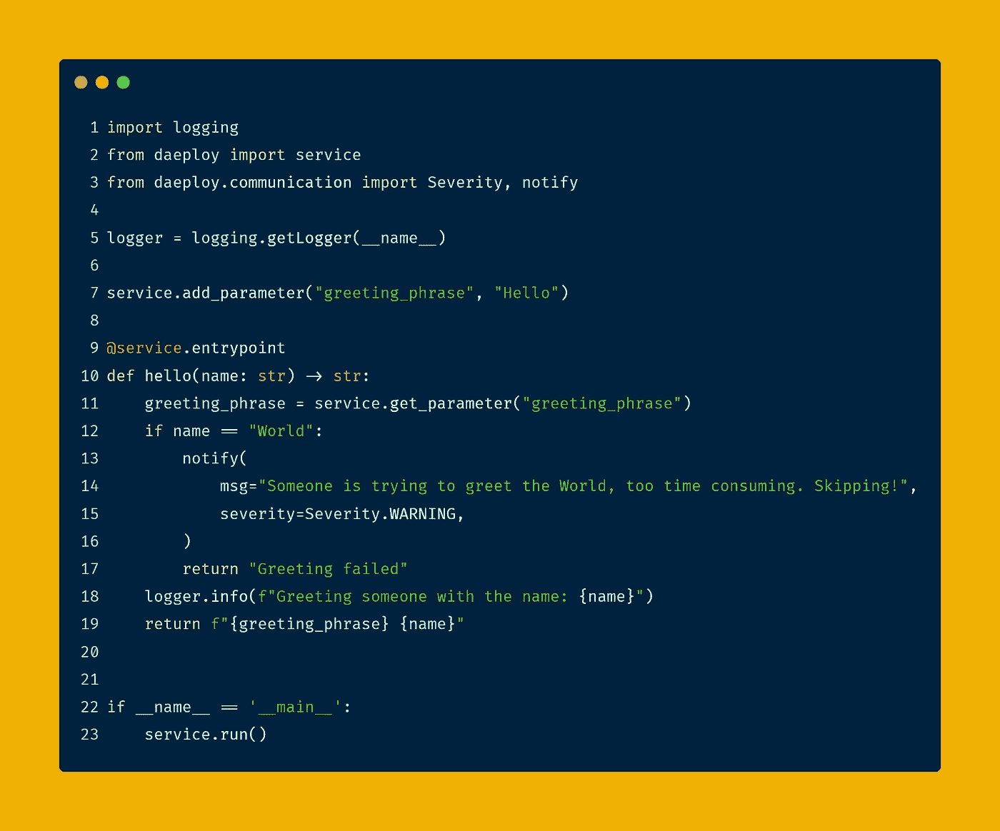
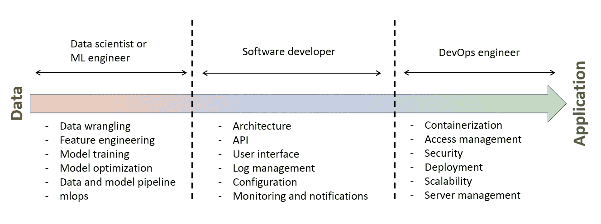
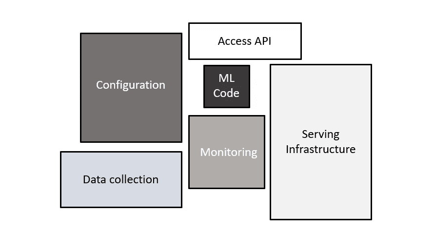

# 介绍 Daeploy

> 原文：<https://towardsdatascience.com/introducing-daeploy-the-tool-to-let-data-scientists-be-data-scientists-5e6ba3e8c6f4?source=collection_archive---------34----------------------->

## 让数据科学家成为数据科学家的工具！

[Viking Analytics](https://vikinganalytics.se/) 是一家位于哥德堡的瑞典公司，提供预测性维护和智能状态监控解决方案。 [Daeploy](https://daeploy.com/) 是 4 年多来为行业提供机器学习解决方案的巅峰之作。这就是我们旅行和部署的故事！



一个 hello world 服务，用 23 行代码实现了 REST API、配置和通知！(作者创作)

# 面向工业 4.0 客户端的典型机器学习项目

客户经常带着他们希望通过利用他们的数据和机器学习的力量来缓解的痛点来找我们。一个典型的项目通常从发现阶段开始，在这个阶段，我们一起查看客户数据以理解数据并评估找到解决方案的可能性。

如果初始数据准备情况分析显示出潜力，则概念验证阶段开始，重点是证明解决方案的可行性。这一步选择的工具通常是 Jupyter 笔记本。

成功的概念验证之后是最小可行产品(MVP)。这就是挑战的开始，因为从数据到应用程序的项目是一项要求很高的任务，需要跨越多个技能集。虽然从数据到概念验证的过程通常是机器学习的过程，但 MVP 阶段需要广泛的其他技能，如软件开发和 DevOps。



从数据到应用的旅程(由作者创作)

理想情况下，一个人需要一个由数据科学家、软件开发人员、DevOps 工程师组成的团队，如果有必要，还需要 UI/UX 来成功完成应用程序之旅。然而，在实践中，数据科学家或 ML 工程师的任务是将他们的模型和算法转化为应用程序，这是很常见的。

# **我们的使命:**让数据科学家成为数据科学家！

我们希望数据科学家能够专注于他们喜欢做的事情:处理和理解数据、模型训练、模型评估、模型优化，并在产品化和部署他们的解决方案上花费尽可能少的时间和精力。我们确定了需要解决的两个关键问题:

## 1.添加功能

正如“机器学习系统中隐藏的技术债务”这篇著名的文章[1]所示，ML 代码通常是 ML 项目的一小部分。要使 ML 代码能够可靠地传递其值，需要许多功能。



受“机器学习系统中隐藏的技术债务”启发的图片[1](作者创作)

世界各地的数据科学家正花费数天甚至数周的时间向他们的模型添加功能，比如 REST API、配置和通知。

为了解决这个问题，我们开发了 Daeploy 软件开发工具包(SDK ),它提供了大量现成的功能。

# 2.部署

软件部署是将代码转换为在主机上运行的应用程序并使其可供使用的过程。这通常是 DevOps 工程师的领域。要成功部署解决方案，需要理解诸如访问、安全性和身份验证、代理、SSL 证书、CI/CD 管道、代码容器化、服务管理等概念。

潜在部署目标的多样性增加了 ML 部署的复杂性。目标可以在云上或内部。要在云上部署，必须熟悉各种云提供商、他们的术语以及他们的用户界面。内部部署取决于客户 IT 及其托管软件解决方案的准备情况。

我们利用 Daeploy manager 来解决部署难题，Daeploy manager 是一个 docker 映像，运行在您应用程序的目标上。目标可以是任何符合以下条件的机器:

1.  能够运行 Docker
2.  允许访问 Docker 守护程序。

如果满足上述要求，目标可以是任何具有任何操作系统的机器。它可以是你的个人电脑，工厂里的服务器，云中的虚拟机，或者是树莓 Pi。Daeploy manager 提供安全性和身份验证，并提供一个安全的 API 来部署您的代码、从运行的服务中提取日志、获取通知等等。

让我们仔细看看 Daeploy SDK 和 Daeploy manager 的一些特性。

# Daeploy SDK

当编写应该作为服务运行的代码时，使用 Daeploy SDK。它作为 python 包安装在 Python 环境中，并努力使创建这些服务的过程尽可能简单。

```
$ pip install daeploy
```

## **创建 API**

一个常见的用例是将经过训练的模型转换为预测服务，该服务具有可以接收数据并生成预测的 API。使用 Daeploy SDK，您可以用一个装饰器将任何 Python 函数转换成 API。

```
# Lets import what we need from daeploy SDK
from daeploy import service# decorate a python function with service.entrypoint to create an API endpoint!@service.entrypoint
def hello(name: str) -> str:
    logger.info(f"Greeting someone with the name: {name}")
    return f"hello {name}"
```

## 警报和通知

监控模型或一般运行的服务是创建可靠解决方案的一个重要方面。用例是无穷无尽的。一个常见的棘手问题是经过训练的模型随着时间的推移而退化。Daeploy SDK 带有内置的通知功能，因此您可以在经理仪表板上和您的电子邮件中获得通知。

```
@service.entrypoint
def hello(name: str) -> str:
    if name == "world":
        notify(
            msg="Someone is trying to greet the World!!",
            severity=Severity.WARNING,
            emails=["your@email.com"],
        )    
    logger.info(f"Greeting someone with the name: {name}")
return f"hello {name}"
```

## 使用微服务架构构建应用

创建应用程序通常需要多种服务，例如:

*   **数据库连接器服务:**从专用数据库提取数据或将数据保存到专用数据库的服务。
*   **预测服务:**获取数据作为输入并返回预测的服务。
*   **业务逻辑服务:**包含业务相关逻辑的服务，负责将预测转换为业务相关动作。
*   **仪表板服务:**提供可视化或与应用程序交互的服务。

使用微服务架构比单一应用程序有很多好处，例如灵活性、可伸缩性和关注点分离，等等。然而，也有缺点。管理服务之间的通信是微服务架构导致额外开销的一个例子。

如果使用 REST，需要为每个服务设置一个 Flask 服务器，创建和管理端点，并处理使用 REST API 可能发生的异常。Daeploy SDK 使得服务之间的通信像普通的 python 函数调用一样简单。下面是一个使用 call_service 并从另一个服务调用 hello 函数的示例:

```
# import call_service from communication package
from daeploy.communication import call_servicedef greet_the_world() -> str:
# No need for API call. Just call any entry point from other        # services using call_service function
    reponse = call_service(
        service_name="greeting_service",
        entrypoint_name="hello",
        arguments={"name": "world"}
     )
    logger.info(f"{reponse}")
return f"{reponse}"
```

# 部署经理

部署管理器旨在简化部署过程。让我们看看 Daeploy manager 如何简化部署服务的复杂性。

## 安全性和身份验证

处理访问、安全性和身份验证是在远程服务器上部署应用程序的基本部分，无论是在云上还是在客户场所。尤其是在处理业务敏感数据的时候。Daeploy manager 带有内置的基于令牌的身份验证和 HTTPS 功能。

用户可以直接与 Daeploy manager REST API 通信，或者使用 SDK 附带的命令行界面(CLI)。要使用 CLI，您所需要的只是一个安装了 Daeploy SDK 并激活了 Python 环境的终端。要与 Daeploy manager 通信，首先使用 login 命令进行身份验证:

```
$ daeploy login
Enter daeploy host: [https://your-host](http://localhost)
Logging in to Daeploy instance at [https://your-host](http://localhost)
Username: admin
Password: ***************
Changed host to https://your-host
```

您还可以使用 CLI 创建具有不同有效期的令牌。例如，您可以创建有效期为五天的令牌，如下所示:

```
$ daeploy token 5
Active host: [https://your-host](http://localhost)
Use the token in the header {"Authorization": "Bearer token"}, for further details see the docs
eyJ0eXAiOiJKV1QiLCJhb.....
```

## 集装箱化

使用 Docker 之类的容器部署服务正在成为行业标准。容器有几个优点，如可移植性、一致的操作，并且与虚拟机(VM)相比，它们更轻量级。
Daeploy manager 将 Python 代码转换成 Docker 映像，安装所有必需的依赖项，并作为服务运行，所有这些都只需一个命令:

```
$ daeploy deploy [options] <service-name> <version> <source>
```

源代码可以是您的本地开发文件夹、git repo，甚至是现有的 docker 映像！

## 影子部署

影子部署是一个方便的特性，它允许在不中断生产的情况下测试现有服务的新版本。在影子部署中，新版本与当前版本一起部署。新版本接收服务的所有入站流量，但忽略响应。


影子部署(来源:作者)

使用 assign 命令很容易切换服务的主版本。更多信息，请参见[此处](https://vikinganalytics.github.io/daeploy-docs/1.0.1/content/getting_started/shadow_deployment.html?highlight=shadow#versioning-and-shadow-deployment)。

```
$ daeploy assign <service-name> <version>
```

要了解关于启动管理器的更多信息，请查看[入门文章](https://daeploy.medium.com/getting-started-with-daeploy-b7aeef918fa5)。

我们很高兴发布 Daeploy，并让社区免费获得[。我们期待看到它如何帮助您将您的想法付诸实践。就业愉快！](http://www.daeploy.com)

## 参考资料:

[1] D .斯卡利，加里·霍尔特，丹尼尔·戈洛文，尤金·达维多夫，托德·菲利普斯，迪特马尔·埃布纳，维奈·乔德里，迈克尔·杨，江泽龙·克雷斯波，丹·丹尼森，*“机器学习系统中隐藏的技术债务”，*第 28 届神经信息处理系统国际会议论文集，2015 年 12 月