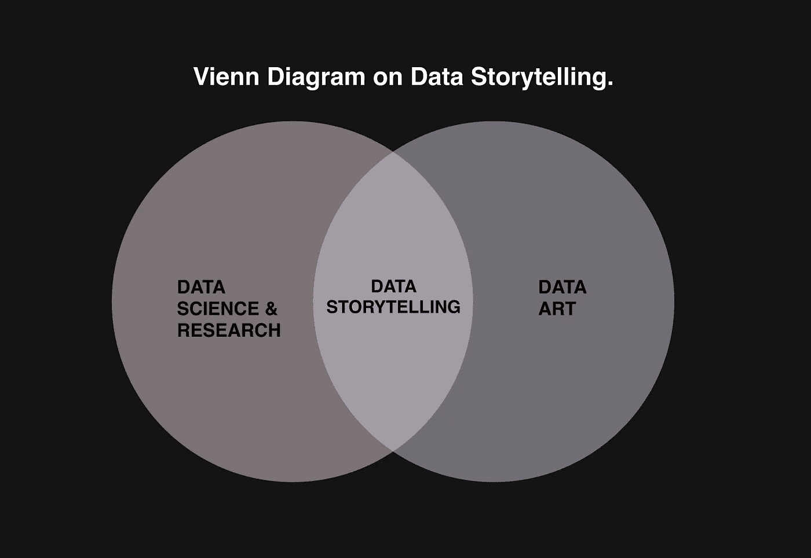
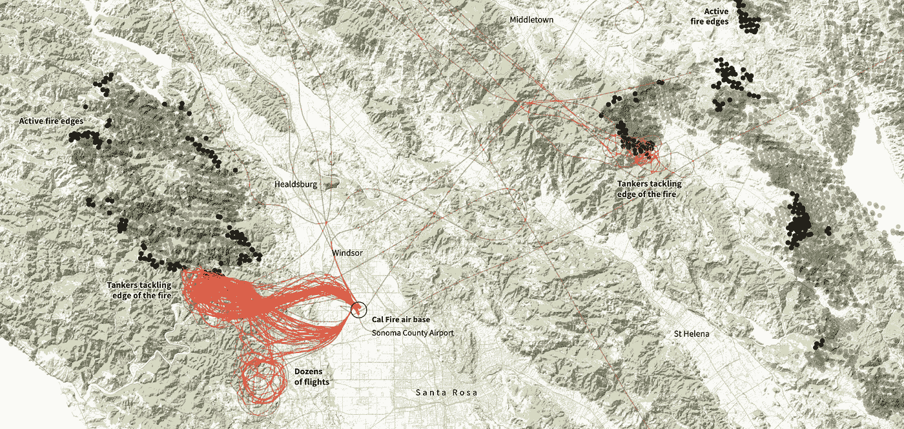
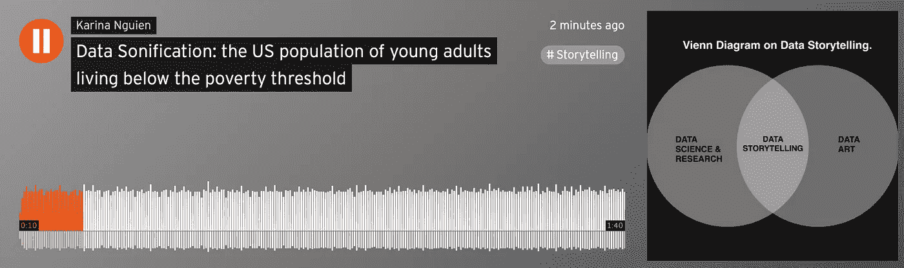

# 引入数据发音作为数据故事的核心原则

> 原文：<https://towardsdatascience.com/introducing-data-sonification-as-a-core-principle-to-data-storytelling-9fa047fe773d?source=collection_archive---------34----------------------->

## [实践教程](https://towardsdatascience.com/tagged/hands-on-tutorials)

## 重新思考数据可视化世界中的设计可及性。数据可视化的剖析和可视化的可访问性。

数据新闻是一个新兴领域，因为记者现在可以利用大量的开放数据来发现新的故事，提取见解和发现，并利用尖端技术制作一个强大的故事。正如《纽约时报》现任首席执行官梅雷迪思·列文所说，“我们生活在数字信息和高质量新闻结合的黄金时代。”今天我将分享这个领域的一个方面——数据故事。

## **目录**

```
1\. Defining data storytelling. 2\. The anatomy of an accessible data visualization. 3\. Visualization for accessibility - data sonification with an example of representing the US population of young adults living below the poverty threshold. 
```

# 定义数据叙事

在数据化的世界中，有许多相互关联的术语和流行词汇，就像在人工智能的世界中一样。所以，我认为让它更清晰一点是有意义的。



在 Figma 上创建的关于数据故事的 Vienn 图。信用:[数据新闻和可视化与免费工具](https://journalismcourses.org/course/data-journalism-and-visualization-with-free-tools/)

**首先，有数据学术界和数据科学。那是我在加州大学伯克利分校的专业。它需要更多的研究导向，并需要统计/决策理论建模范式来设计像人-人工智能协作(即自动驾驶汽车)这样的系统。当我们谈论学术数据科学时，它通常包含复杂的图表，除非你知道研究的完整背景，否则无法理解。“在这种情况下，我们将数据可视化是因为我们想从中提取意义。从历史上看，这是因为科学家必须为他们论文中的每一个数字付费，这样他们才能塞进尽可能多的信息。这将使事情变得复杂。”(开罗)像这样:**


学术界的数据各有千秋！


我在 RL 阅读人工智能研究论文中的数据来做研究

**另一方面，还有数据艺术**“数据往往看起来根本不像传统的图表或图形。相反，它看起来像是属于博物馆的东西。”(开罗)这是一个皇室家族的星座，在这里你可以看到所有皇室成员之间的家庭联系。这种数据艺术的另一个很好的例子是我去年在纽约的一个展览中看到的 Giorgia Lupi 的 Latour 项目。


[皇家星座](https://royalconstellations.visualcinnamon.com/)和[《伤痕——我们看不到的数据》](http://giorgialupi.com/bruises-the-data-we-dont-see)

“数据讲故事本身就存在于两者的交汇点。它有时被描述为寓教于乐，因为它既有启发性又令人愉快。数据叙事的不同之处在于,**的目标是接触尽可能多的受众，传达清晰的叙述和关键要点**。
数据可视化是一种讲述数据故事的工具，我们可以用它从电子表格中看到的数字中提取见解。”(开罗)


[路透社报道](https://graphics.reuters.com/ETHIOPIA-CONFLICT/xklpyjmndvg/)

数据可视化将数据映射到对象上，如饼图、地图、条形图，甚至声音(阅读到最后！)之所以它最近变得强大，是因为它使我们能够发现某些模式、趋势，最终发现我们否则无法看到的故事。

# 可访问数据可视化的剖析

数据可视化必须对所有人开放。因此，它通常由几层内容组成，根据[数据新闻和使用免费工具的可视化](https://journalismcourses.org/course/data-journalism-and-visualization-with-free-tools/):


Figma 数据可视化的基础层。信用:[数据新闻和可视化与免费工具](https://journalismcourses.org/course/data-journalism-and-visualization-with-free-tools/)

## 脚手架层

该图层包含支持标注、轴和比例等内容的要素。这是 2017 年*华尔街日报制作的数据可视化，* [*“追踪全国失业、工作岗位增加和工作岗位减少。”*](http://graphics.wsj.com/job-market-tracker/)

“您可以看到右上角的颜色图例和轴上的小标签、图表轴上的小刻度线等。这是脚手架层。这基本上决定了内容将如何呈现，它将一切置于上下文理解中:“


来源:[http://graphics.wsj.com/job-market-tracker/](http://graphics.wsj.com/job-market-tracker/)鸣谢:[使用免费工具的数据新闻和可视化](https://journalismcourses.org/course/data-journalism-and-visualization-with-free-tools/)

## **编码层**

这些对象的属性根据数据(表示数据的特征)而变化。在数据可视化中，我们使用许多不同种类的编码方法。“其中之一是高度或长度，就像条形图一样。这是一个重要的层面，因为它显示了一个变量随着时间的变化，对于新闻报道来说，这是一个非常有洞察力的指标。”(开罗)

这是我最近做的一个数据的例子，分析了 12 月份 billboard 2020 的历史数据。我用 x 轴代表这首歌在排行榜上的周数，y 轴代表在 billboard 上的位置(历史上的变化)，圆圈的大小代表峰值位置(根据周的变化)。


我创作的广告牌 2020 年 12 月

## **标注图层**

“注释层是我们添加到可视化中的文本元素，用于阐明数据或突出显示图表中的重要数据点，并将其放在上下文中。这很重要，因为它使我们能够有效地与公众沟通。”(开罗)

这里是由路透社[制作的加州如何使用数十架飞机扑灭野火的可视化画面。这个项目的设计者不仅绘制了飞机的航线和标记的东西，还提供了可视化下面的注释。他们比较了飞机的载重量，以了解每种类型的飞机可以投放多少阻燃剂或水。](https://graphics.reuters.com/CALIFORNIA-WILDFIRE/AIRCRAFT/bdwpkzmyyvm/)



[路透社报道加州如何使用数十架飞机扑灭野火](https://graphics.reuters.com/CALIFORNIA-WILDFIRE/AIRCRAFT/bdwpkzmyyvm/)


[路透社报道加州如何使用数十架飞机扑灭野火](https://graphics.reuters.com/CALIFORNIA-WILDFIRE/AIRCRAFT/bdwpkzmyyvm/)

## **“我”层**

这一层使人们能够体现数据并与之交互，这是一些个性化的时刻。其中一个例子是纽约时报[“测验:让我们预测你是民主党人还是共和党人”](https://www.nytimes.com/interactive/2019/08/08/opinion/sunday/party-polarization-quiz.html)预测你的政治倾向。

“这增加了参与度，它告诉你，通过告诉你你是错的或你是对的，它让你置身于你所展示的数据之中。”(开罗)


《纽约时报》的[“测验:让我们预测你是民主党人还是共和党人”](https://www.nytimes.com/interactive/2019/08/08/opinion/sunday/party-polarization-quiz.html)

# 可访问性的可视化-数据发音，以表示生活在贫困线以下的美国年轻人为例。

无论是传统的平面设计还是数字产品设计，其中一个重要的设计原则就是**可访问性**。随着我们在日常生活中看到越来越多的数据可视化，重要的是不仅要整合基本的 web 可访问性原则，还要考虑为盲人和视力受损者提供信息的新方法。

我想分享一下**数据语音化的概念，**基本上是将数据转换成声音，通过听觉来理解它。所以，我使用了联合国可持续发展开源数据，只过滤了美国的案例，做了一些基本的数据清理程序，开始玩数据，用我 8 年的音乐教育和工具玩声音。


数据发音的产生

这是一个生活在贫困线以下的 18 岁以下儿童的故事，他们生活在排名低于平均水平的各州，并以高中辍学率和入学率为背景。你可以听到背景中的钢琴代表 18 岁以下儿童生活在两倍贫困线以下的所有数据点，低音提琴代表学校入学率，振荡器代表高等教育的一般质量，钟琴代表高中辍学率。通过过滤一个学校升学率(低于平均水平)的数据，我只对代表的数值进行了发音，这就是为什么低音提琴不是一直演奏的原因。

结果如下:



[https://soundcloud . com/Karina-ngu ien/data-sonization-the-us-population-of-young-成年人生活在贫困线以下的人口](https://soundcloud.com/karina-nguien/data-sonification-the-us-population-of-young-adults-living-below-the-poverty-threshold)

> **感谢阅读！我目前在纽约时报做设计，在加州大学伯克利分校做研究。你也可以订阅我的** [**时事通讯**](https://semaphore.substack.com/about) **，在那里我分享了更多关于新兴技术、产品设计和数据驱动调查的道德含义。了解更多关于我的作品** [**这里**](https://www.karinanguyen.co/) **。**

引用的作品:

*   [*数据新闻和可视化用免费工具*](https://journalismcourses.org/course/data-journalism-and-visualization-with-free-tools/)