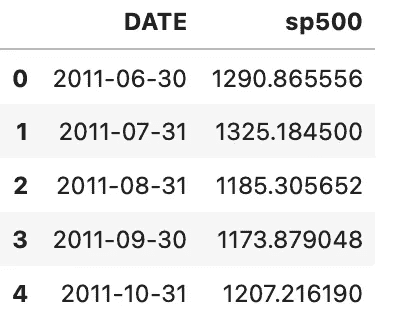
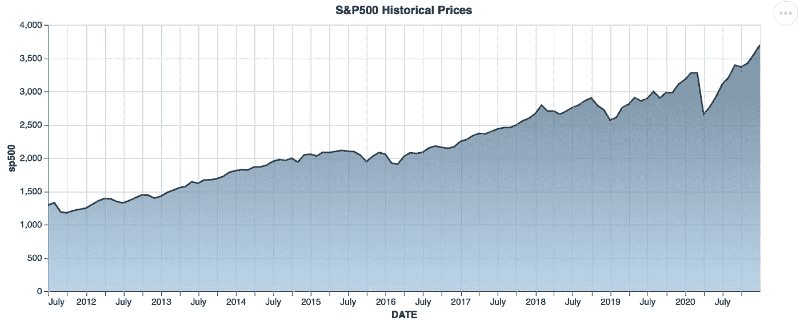
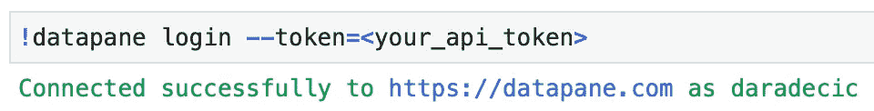
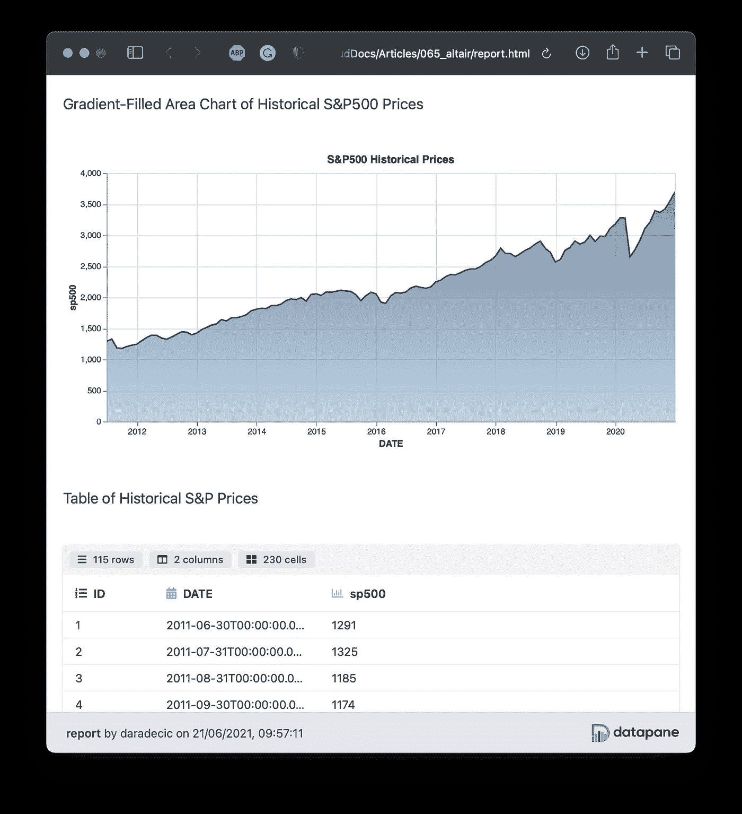
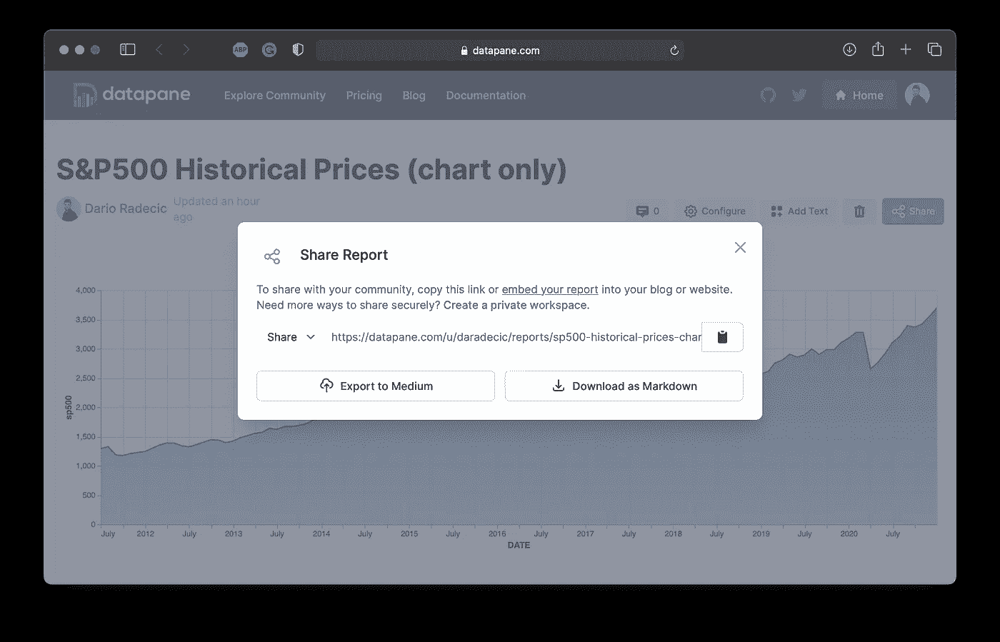

# Datapane 简介:如何用 Python 创建交互式报告和可视化

> 原文：<https://towardsdatascience.com/introducing-datapane-how-to-create-interactive-reports-and-visualizations-with-python-ebc40e02e748?source=collection_archive---------16----------------------->

## 从媒体文章到网站，在任何地方创建、发布和嵌入交互式数据可视化

由[贝卡·泰普特](https://unsplash.com/@beccatapert?utm_source=unsplash&utm_medium=referral&utm_content=creditCopyText)在 [Unsplash](https://unsplash.com/?utm_source=unsplash&utm_medium=referral&utm_content=creditCopyText) 拍摄的照片

***免责声明*** *:这不是一篇赞助文章。我与 Datapane 或它的创建者没有任何关系。这篇文章展示了该库的一个公正的概述，旨在使数据科学工具能够被更广泛的大众所使用。*

您想让您的报告具有交互性吗？或者在你的博客中嵌入交互式数据可视化？如果是这样， **Datapane** 可能是您一直在寻找的银弹。今天，您将看到如何用几行 Python 代码创建、共享和嵌入交互式报告。

这篇文章的结构如下:

*   数据面板—简介和环境设置
*   使用 Altair 创建图表
*   使用 Datapane 保存和发布报告
*   最后的想法

# 数据面板—简介和环境设置

很多次，我花了几个小时构建一个交互式数据可视化，然后带着一个问题离开— *我如何才能与我的读者分享它？*截图工具不行，gif 只是 *meh* ，但是 Datapane 可以扭转局面。

如果你想与世界分享任何分析报告，Datapane 就是为你准备的。该库使得以编程方式从图表和表格创建报告并将其包装在公共对象(如文本和图像)周围变得容易。

今天，您将看到如何获取、可视化和发布包含 S&P500 历史价格图表的报告。我们将使用 [Altair](https://altair-viz.github.io/) 作为数据可视化库，但是您可以自由使用 Bokeh、Plotly 或 Folium 来代替。

首先，让我们为项目配置一个虚拟环境:

要使用 Datapane，你还必须在他们的网站上注册一个免费账户。这样做将为您提供一个 API 令牌，用于从 Python 脚本或笔记本中发布报告。

接下来让我们创建一些可视化。

# 使用 Altair 创建图表

如前所述，我们将构建历史 S&P500 价格的数据可视化。`pandas_datareader`库可用于直接下载财务数据。

以下代码片段导入库，下载 20 年的历史数据，并对其进行重新采样，以便只保留月平均值:

下面是前几行的样子:

图片 1-S&P 历史价格数据集的头部(图片由作者提供)

接下来让我们创建可视化。这将是一个显示 ETF 价格随时间变化的填充面积图。代码如下:

下面是图表的样子(在笔记本中):

图 2—S&P500 历史价格图表(图片由作者提供)

这就是我们保存和发布报告所需的全部内容。接下来让我们开始吧。

# 使用 Datapane 保存和发布报告

到目前为止，我们已经掌握了数据集和数据可视化。Datapane 可以很容易地将一个或多个元素导出到一个报告中，无论是在本地还是在他们的服务器上。

在继续之前，请使用以下命令登录到 Datapane 服务器:

图 3——登录 Datapane 服务器的过程(作者图片)

把`<your_api_token>`换成注册后给你的字符串代码就行了。

接下来让我们做第一个报告。以下代码将把可视化和表格(加上一些文本元素)保存到本地计算机上的一个文件中:

它看起来是这样的:

图 4 —由 Datapane 生成的 HTML 报告(图片由作者提供)

这无疑是朝着正确方向迈出的一步，因为您可以轻松地共享报告文件，但是让我们更进一步。

下面的代码将只向 Datapane 服务器发布图表:

发布后，您可以点击“共享”按钮获得可共享的网址:

图 5 —共享已发布的数据面板报告(作者图片)

你可以与任何人分享它，甚至将其嵌入到你的媒体文章中——只需粘贴网址并点击*输入*:

非常管用！让我们用图表+表格报告做同样的事情:

在这里—嵌入式:

这就是与世界分享和嵌入定制可视化/报告的简单之处。接下来让我们总结一下。

# 最后的想法

今天您已经看到了 Datapane 的基础知识。然而，还有很多东西需要去发现，所以你可以自己去探索。最棒的是——它不会花你一分钱。Datapane 提供一些[付费计划](https://datapane.com/pricing/)，但是如果你独立工作，你可能不需要它。

如需进一步了解，请参考[官方文档](https://docs.datapane.com/)。它还包含一个到 API 文档的链接，所以你可以在那里找到任何特性。

总的来说，Datapane 对于任何想要分享交互式可视化和报告的人来说都是一个优秀的服务。无论是您必须提交的每周销售报告还是博客帖子，交互性都为您的工作增添了新的维度。试一试吧——完全免费。

喜欢这篇文章吗？成为 [*中等会员*](https://medium.com/@radecicdario/membership) *继续无限制学习。如果你使用下面的链接，我会收到你的一部分会员费，不需要你额外付费。*

 [## 通过我的推荐链接加入 Medium-Dario rade ci

### 作为一个媒体会员，你的会员费的一部分会给你阅读的作家，你可以完全接触到每一个故事…

medium.com](https://medium.com/@radecicdario/membership) 

# 了解更多信息

*   [2021 年学习数据科学的前 5 本书](/top-5-books-to-learn-data-science-in-2020-f43153851f14)
*   [如何使用 Cron 调度 Python 脚本——您需要的唯一指南](/how-to-schedule-python-scripts-with-cron-the-only-guide-youll-ever-need-deea2df63b4e)
*   [Dask 延迟—如何轻松并行化您的 Python 代码](/dask-delayed-how-to-parallelize-your-python-code-with-ease-19382e159849)
*   [如何使用 Python 创建 PDF 报告—基本指南](/how-to-create-pdf-reports-with-python-the-essential-guide-c08dd3ebf2ee)
*   [即使没有大学文凭也要在 2021 年成为数据科学家](/become-a-data-scientist-in-2021-even-without-a-college-degree-e43fa934e55)

# 保持联系

*   关注我的 [Medium](https://medium.com/@radecicdario) 了解更多类似的故事
*   注册我的[简讯](https://mailchi.mp/46a3d2989d9b/bdssubscribe)
*   在 [LinkedIn](https://www.linkedin.com/in/darioradecic/) 上连接