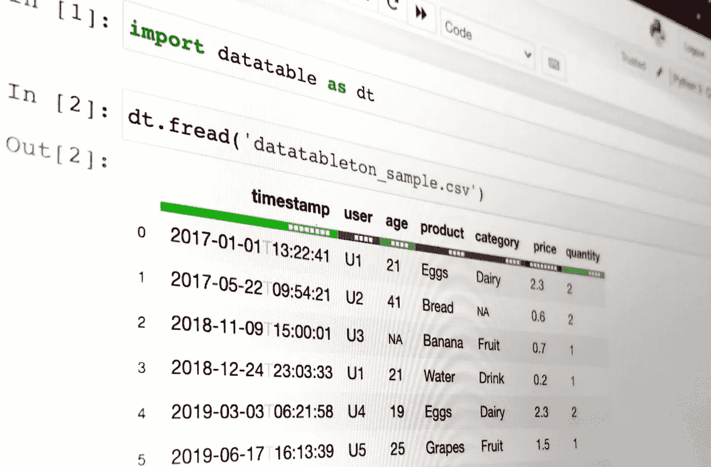
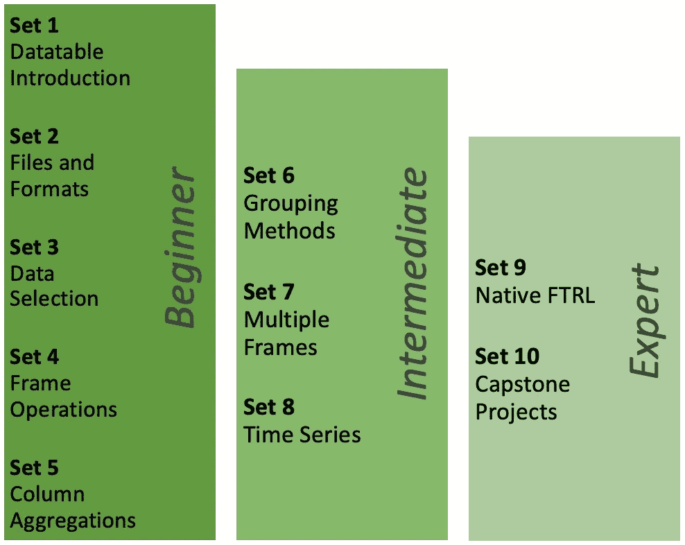

# 介绍数据表- Python 数据表教程和练习

> 原文：<https://towardsdatascience.com/introducing-datatableton-python-datatable-tutorials-exercises-a0887f4323b0?source=collection_archive---------19----------------------->

## 要测试的练习。要学的教程。

作者图片

> **Datatable** 是一个用于操作表格数据的 python 库。它支持内存不足的数据集，多线程数据处理，并有一个灵活的 API。

如果这让你想起了 R 的[数据表](https://rdatatable.gitlab.io/data.table)，那你就对了，因为 Python 的[数据表](https://github.com/h2oai/datatable)包与 R 库密切相关，并受其启发。

2021 年 7 月 1 日 [v1.0.0](https://datatable.readthedocs.io/en/latest/releases/v1.0.0.html) 发布，现在可能是开始探索这个包的好时机。

笔记本是了解软件包并深入研究它们的最好方式之一。它很方便，能够带来实际操作的体验，并且通常与清晰的文档密切相关。

Twitter 上关于学习新图书馆内容类型的投票

# 数据表顿:💯数据表练习

[DatatableTon](https://github.com/vopani/datatableton) 是一个开源项目，包含 100 个不同部分的 Python 数据表练习，以课程或教程的形式为初学者、中间用户和专家进行教学。

✅结构化为练习&教程-选择你的风格
✅适合初学者，中级&专家-选择你的水平
✅可在 Colab，Kaggle，Binder & GitHub 上找到-选择你的平台

# 学问

> data[data.f.set ≥ mylevel]

*   对于希望从头开始学习 datatable 的初学者，建议从头开始按顺序浏览所有集合。它们的结构是为了让新人容易上手，快速学习。
*   对于希望提高数据表技能的中间用户，建议从集合 5 或集合 6 开始，并按顺序浏览所有后续集合。
*   对于希望练习更多 datatable 的专家来说，建议在最后两组测试自己:Set 9 和 Set 10。

# 教学

> data[data.f.style == mystyle]

*   对于查看练习以测试学生的教师，建议使用所有 ***练习*** 样式的练习集。
*   对于查看教程进行演示或教学的教师，建议使用套件的所有 ***解决方案*** 样式。

# 内容

数据表顿集

DatatableTon 的每个部分都是一个 Jupyter 笔记本，旨在展示该包的特定功能，从基本设置和数据处理到机器学习模型和完整的项目。

## [Set 01 数据表简介初学者练习 1–10](https://github.com/vopani/datatableton#set-01--datatable-introduction--beginner--exercises-1-10)

*   软件包的安装和设置
*   创建和显示数据
*   查看数据及其详细信息

创建框架

## [设置 02 文件和格式初学者练习 11–20](https://github.com/vopani/datatableton#set-02--files-and-formats--beginner--exercises-11-20)

*   读取/写入 csv、gz、jay、zip 文件或 URL
*   集成熊猫，numpy，箭头格式
*   在框架中使用列表、字典和元组

从熊猫转换成熊猫

## [Set 03 数据选择初学者练习 21–30](https://github.com/vopani/datatableton#set-03--data-selection--beginner--exercises-21-30)

*   选择行/列/切片/元素
*   使用单个或多个试探法筛选行/列
*   删除缺失的行/列，并删除重复项

选择列

## [设置 04 框架操作初学者练习 31–40](https://github.com/vopani/datatableton#set-04--frame-operations--beginner--exercises-31-40)

*   更改列名和类型
*   创建、更新、删除行/列
*   估算和设置缺失值

设置缺失值

## [设置 05 列聚合初学者练习 41–50](https://github.com/vopani/datatableton#set-05--column-aggregations--beginner--exercises-41-50)

*   计算计数、总和、最小值、最大值、平均值、中值、众数、标准差、偏斜、库尔特
*   列的协方差
*   特征相关性和相关性矩阵

计算所有列的平均值

## [设置 06 分组方法中级练习 51–60](https://github.com/vopani/datatableton#set-06--grouping-methods--intermediate--exercises-51-60)

*   按功能分组的聚合指标
*   比较按功能分组的列统计信息
*   将分组与筛选和排序结合起来

计算按其他列分组的列的中值

## [设置 07 多帧中级练习 61–70](https://github.com/vopani/datatableton#set-07--multiple-frames--intermediate--exercises-61-70)

*   读取、rbind、cbind 多个帧
*   使用单键或多键连接框架
*   框架的并集、交集、差集

连接多个框架

## [设置 08 时间序列中级练习 71–80](https://github.com/vopani/datatableton#set-08--time-series--intermediate--exercises-71-80)

*   提取和创建日期/时间特征
*   在组内/组外创建滞后和超前变量
*   计算日期/时间戳的差异

创建滞后变量

## [Set 09 FTRL 本地专家练习 81–90](https://github.com/vopani/datatableton#set-09--native-ftrl--expert--exercises-81-90)

*   FTRL 模型的初始化和超参数
*   对 FTRL 模型进行训练和评分
*   执行 k 重交叉验证

训练 FTRL 模型

## [设置 10 个顶点项目专家练习 91–100](https://github.com/vopani/datatableton#set-10--capstone-projects--expert--exercises-91-100)

*   多个数据集上的端到端工作流
*   Kaggle 竞赛数据集和实际提交
*   探索您自己的数据集和用例

Kaggle 贸易转移竞赛的端到端实施

> [DatatableTon 是开源的，可以在 GitHub](https://github.com/vopani/datatableton)
> 上免费获得，特别感谢[Parul Pandey](https://medium.com/u/7053de462a28?source=post_page-----a0887f4323b0--------------------------------)&[Shrinidhi Narasimhan](https://medium.com/u/770f2b90bdbf?source=post_page-----a0887f4323b0--------------------------------)的合作🙏