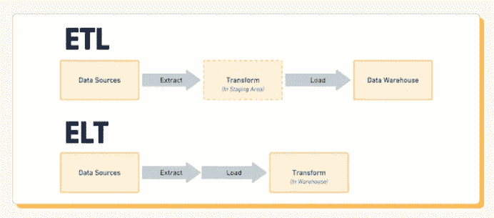
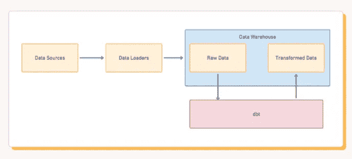

# ETL 和 ELT 中断器 dbt 简介

> 原文：<https://towardsdatascience.com/introducing-dbt-the-etl-elt-disrupter-4351adc34123?source=collection_archive---------14----------------------->

## 再见 ETL & ELT，你好 dbt！

图片来自 Pixabay 的 Peter H

每天，数 Pb 的数据被收集、操作和存储，用于全球范围内的各种分析目的。如果没有管道来获取这些数据并正确使用它们，大规模的数据科学根本不可能实现。传统上，被称为 ETL 和 ELT 的两个过程中的一个用于获取大量数据，挑选出重要的部分，然后将这些数据加载到数据湖或数据存储中。然而，这两种管道都有其缺点，到 2020 年，随着世界越来越依赖于分析和实时数据，ETL 和 ELT 不再是最锋利的剑。

在本文中，我将比较 ETL 和 ELT，总结两者的工作原理，它们在过去和现在是如何被常规使用的，以及为什么数据科学领域的大多数领导者认为它们已经过时了。

# ELT，ETL，有什么区别？

[经许可从普查中获取的图像](https://blog.getcensus.com/a-complete-guide-to-revenue-cohort-analysis/)

**ELT** 代表提取、加载、转换，而它的伙伴 ETL 同样表示提取、转换、加载。这三个步骤在任何重要的数据转换中都是至关重要的过程。不管你有没有意识到，它们被用于全球数百万的应用中。每当你从附近的杂货店购买一件商品，你的交易，无论是匿名的还是有身份的，都将被转移到这些金融和营销分析管道中的一个。让我们看看 ELT 如何与 ETL 相抗衡。

如果我们从各种来源收集数据，比如一个国家的多个商店，或者比方说水坝不同点的许多不同仪器，以给出一个科学示例，我们需要将所有这些数据收集在一起，然后只提取对我们想要创建的分析有影响的部分。这可能是每个商店的净销售额，在这种情况下，您需要对所有交易进行标准化和合计。或者，在大坝的例子中，可能需要列出所有的水压读数。这是转换过程，对于创建分析是必不可少的。具体来说，它允许我们使用商业智能工具，如 Tableau 或 Periscope。

当我们使用 ELT——即提取、加载、转换——时，我们的目的是通过在数据服务器上执行这些计算量很大的操作来节省我们的主机。我们不使用杂货店的计算机来合计交易，而是将原始数据发送到数据湖或其他存储机器，只有在那时，我们才执行转换阶段来获得整体利润——例如，合计交易和减去成本。

ELT 非常适合我们只做简单计算的大量数据，比如杂货店的例子。我们可以从所有来源提取数据，例如读卡器，将它们加载到我们的数据存储中，然后转换它们，以便我们可以轻松地进行分析。

另一方面，你有 **ETL** 。这在大坝的例子中效果更好。总的来说，我们不一定收集大量的数据，但有许多不同类型的读数，很可能你会想对它进行大量的计算，以进行深刻的分析。最好我们也希望这些数据实时，这样我们就可以防止任何洪水！在这种情况下，提取、转换、加载更合适。我们不是将原始数据发送到数据存储器，然后进行操作，而是在它们被发送到数据存储器时执行操作，这就是所谓的“转换阶段”。通过这种方式，我们可以建立一个连续的数据流，该数据流在被加载到数据存储器之前就已经被处理了！

这两个类比善于突出 ETL 与 ELT 的优缺点。有了 ELT，当您有大量的数据，比如数百个交易，但您只想执行一些相对简单的操作，比如计算利润，或者将销售额映射到一天中的时间时，它就非常有用。

与此同时，ETL 在实时情况下工作得更好，在这种情况下，我们没有大量的数据，但我们有许多需要正确排序的专门数据，因此需要更多的计算。

# ETL 和 ELT 工具

对现代世界来说幸运的是，我们不再需要做大量的编程来为我们的数据创建一个流线型的管道！有许多 ETL 和 ELT 工具允许我们执行这些功能，从各种各样的数据源到各种各样的数据仓库或机器。

例如，Hevo 无编码数据管道在零售商和其他实体企业中广泛使用，他们希望收集销售数据或关于他们商店的活动信息。但它也非常适合实时数据，所以如果你想测量你的店面外面的客流量，并绘制一段时间的地图，你也可以使用 Hevo！

还有 Fivetran，它围绕预建的连接器和功能构建，提供“即插即用”的体验。

# dbt —更好的方法！

ELT 和 ETL 听起来像是从 A 到 B 获取数据进行分析的非常合理的方法，但实际上它们本身都很不方便。使用 ELT 和 ETL，您必须在加载数据之前准确地知道您想要创建什么样的分析。幸运的是，它们与现代工具如 [Fivetran](https://blog.getcensus.com/dbt-the-etl-elt-disrupter/fivetran.com) 、Airflow、Stitch 等以及云仓库如 BigQuery、 [Snowflake](https://www.snowflake.com/) 和 Redshift 相比都很微不足道。

即使这样，困难的部分仍然留在变换层。转换层是数据管道中至关重要的元素，但如果它阻碍了您获得最相关的见解，那么一定有更好的方法。

然而，通过一些更先进的管道技术，我们可以增加我们的选择，并允许我们创建许多不同类型的分析，而不必通过管道重新发送数据并对其进行不同的转换！

[经许可从普查中获取的图像](https://blog.getcensus.com/a-complete-guide-to-revenue-cohort-analysis/)

它被称为 dbt，或[数据构建工具](https://getdbt.com/)，它是一个超级灵活的命令行数据管道工具，允许我们非常快速、非常轻松地收集和转换数据进行分析！dbt 不需要完全重新编程您的管道。

dbt 仍然像传统数据库一样构建在 SQL 之上，但是它使用像 jinja 这样的模板引擎在其上构建了额外的功能。这有效地允许你带来更多的逻辑(如循环、函数等。)到您的 SQL 中，以访问、重新排列和组织您的数据。有点像对数据集编程，但有更多的灵活性和选项。

有了这些代码，您就可以使用 dbt 的 run 命令来编译这些代码，并在 SQL 数据上运行这些代码，从而准确地获得您所寻找的转换中需要的部分。它还可以快速编程、测试和修改，而无需等待它运行所有数据，这意味着您可以在紧张的时间表内创建新的、更好的程序版本。

dbt 不会完全取代 ELT 和，但它确实提供了更大的灵活性——它极大地增强了您的“T”转换层/阶段。**使用 dbt，您可以一次又一次地聚合、规范化和排序数据，无论您喜欢什么方式，而无需不断更新您的管道和重新发送。**

dbt 不是 ETL 和 ELT 的替代品，但是随着现代技术的发展，这些独立的管道方法已经过时了。无论您是遵循 ETL 还是 ELT，有一件事是肯定的，那就是在您能想到的每一个方面，dbt 对 T(转换)层都是一个巨大的改进。

# 感谢阅读！

我鼓励你去看看 dbt。您可以从这里的[快速入门指南](https://docs.getdbt.com/tutorial/setting-up)开始，并在这里加入他们的超级[有用社区。相信我，当你开始使用 dbt 时，你会想你以前是怎么做数据建模工作的。](https://community.getdbt.com/)

不确定接下来要读什么？我为你挑选了另一篇文章:

 [## 2021 年成为数据科学家的完整 52 周课程

### 连续 52 周，每周学点东西！

towardsdatascience.com](/a-complete-52-week-curriculum-to-become-a-data-scientist-in-2021-2b5fc77bd160) 

**又一个！**

 [## 数据科学面试中你应该知道的 10 个统计概念

### 学习聪明，不努力。

towardsdatascience.com](/10-statistical-concepts-you-should-know-for-data-science-interviews-373f417e7d11) 

# 特伦斯·申

*   ***如果你喜欢这个，*** [***跟我上媒***](https://medium.com/@terenceshin) ***了解更多***
*   ***有兴趣合作吗？让我们连线上***[***LinkedIn***](https://www.linkedin.com/in/terenceshin/)
*   ***报名我的邮箱列表*** [***这里***](https://forms.gle/tprRyQxDC5UjhXpN6) ***！***