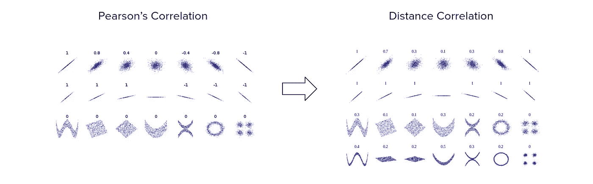
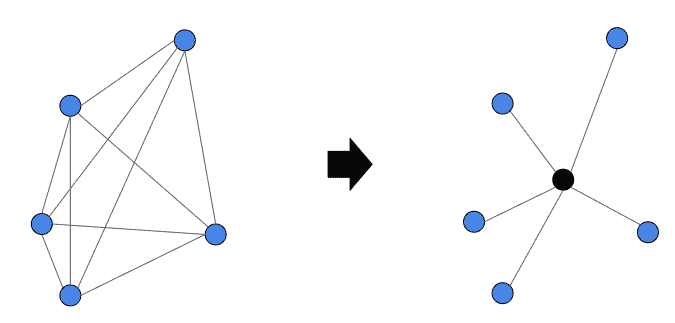

# 引入距离相关性，一种优越的相关性度量。

> 原文：<https://towardsdatascience.com/introducing-distance-correlation-a-superior-correlation-metric-d569dc8900c7?source=collection_archive---------5----------------------->

## 这是一个解决皮尔逊相关性头号问题的现代指标


[咖啡极客](https://unsplash.com/@coffeegeek?utm_source=unsplash&utm_medium=referral&utm_content=creditCopyText)在 [Unsplash](https://unsplash.com/s/photos/compare?utm_source=unsplash&utm_medium=referral&utm_content=creditCopyText) 上的照片

# 目录

1.  介绍
2.  什么是距离相关性？
3.  距离相关背后的数学
4.  在 Python 中实现距离相关性

# 介绍

我想我们都同意，商业中最常用的衡量标准之一是相关性，更具体地说，是皮尔逊相关性。

概括地说，相关性衡量两个变量之间的**线性**关系，这本身已经是一个问题，因为有许多关系是非线性的。

因此，作为一个例子，你可能会得出结论，变量 X 和收入之间的关系是不相关的，而事实上它是相关的，只是不是线性的。

这就是**距离相关性**发挥作用的地方！

# 什么是距离相关性？

距离相关性是非线性随机变量之间关联强度的度量。它超越了皮尔森相关性，因为它不仅能发现线性关联，还能在多维度上发挥作用。距离相关性的范围从 0 到 1，其中 0 表示 X & Y 之间的独立性，1 表示 X & Y 的线性子空间相等。

下图显示了距离相关性测量与皮尔森相关性的比较。



距离相关性的公式如下:


距离相关公式

距离相关性不是距离本身之间的相关性，而是组成“双中心”矩阵的标量积之间的相关性。

如果这对你没有意义，让我们更深入地研究数学。

# 距离相关背后的数学

设(Xk，Yk)，k = 1，2，…，n 是一对两个随机变量 X & Y 的统计样本。

首先，我们计算包含所有成对距离的 n 乘 n 距离矩阵(aj，k)和(bj，k)。


然后我们取双中心距离。


从视觉角度来看，通过采用双中心距离，我们将矩阵表示(左侧)转换为右侧的图表(双中心矩阵)。



作者创建的图像

我们为什么要这样做？

我们这样做的原因如下。任何一种协方差都是矩的叉积。因为距离不是力矩，我们必须把它们计算成力矩。为了计算这些力矩，你必须首先计算与平均值的偏差，这就是双重居中所实现的。

最后，我们计算乘积 A 和 B 的算术平均值，以得到平方的**样本距离协方差**:


距离协方差公式

**距离方差**就是两个相同变量的距离协方差。它是下列各项的平方根:


距离方差公式

# 在 Python 中实现距离相关性

确信这是你的标准？您很幸运，因为有一个距离关联库，使它非常容易实现。

下面是一个示例代码片段:

```
import dcordef distance_correlation(a,b):
    return dcor.distance_correlation(a,b)
```

利用这个函数，你可以很容易地计算出两个样本 a 和 b 的距离相关性。

# 感谢阅读！

我希望你觉得这很有趣！就我个人而言，我发现这在我的日常生活中非常有用，我希望你也能发现这很有用。

这个指标肯定有优点和缺点，我很想听听你的想法。如何看待一个可以检测非线性关系的相关性度量，但其范围只限于 0 和 1 之间？

一如既往，我祝你学习一切顺利！

**不确定接下来该读什么？我为你挑选了另一篇文章:**

</10-statistical-concepts-you-should-know-for-data-science-interviews-373f417e7d11>  

**又一个！**

</21-tips-for-every-data-scientist-for-2021-3d4c28471a6c>  

# 特伦斯·申

*   ***如果你喜欢这个，*** [***跟我上媒***](https://medium.com/@terenceshin) ***了解更多***
*   ***有兴趣合作吗？让我们连线上***[***LinkedIn***](https://www.linkedin.com/in/terenceshin/)
*   ***报名我的邮箱列表*** [***这里***](https://forms.gle/tprRyQxDC5UjhXpN6) ***！***