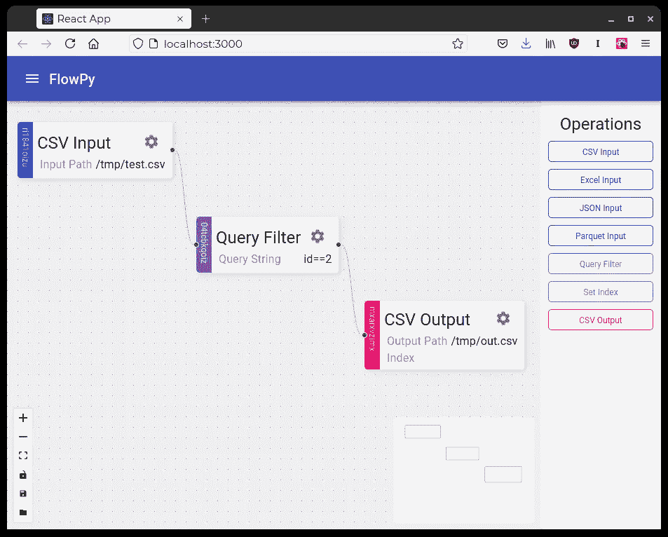
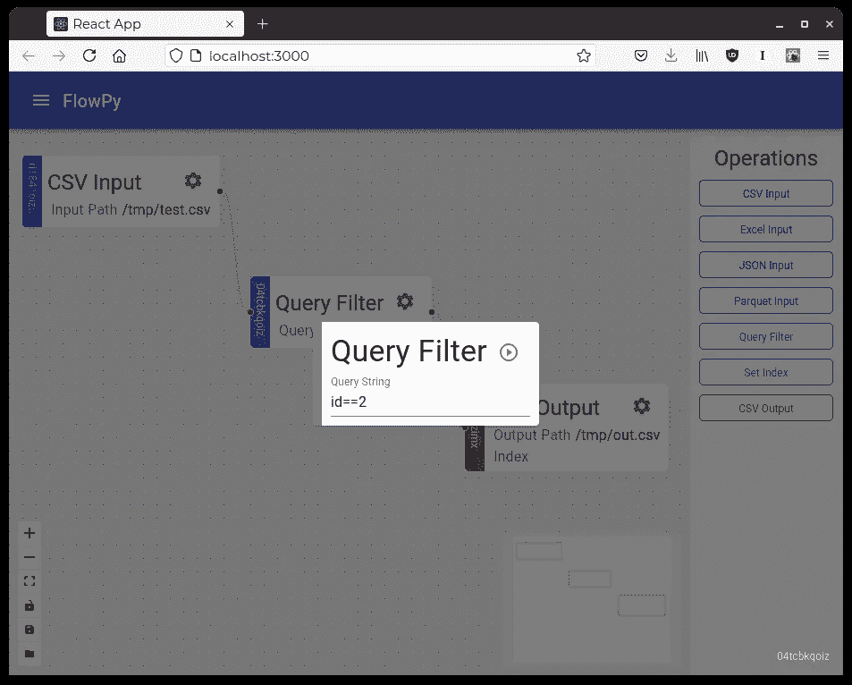
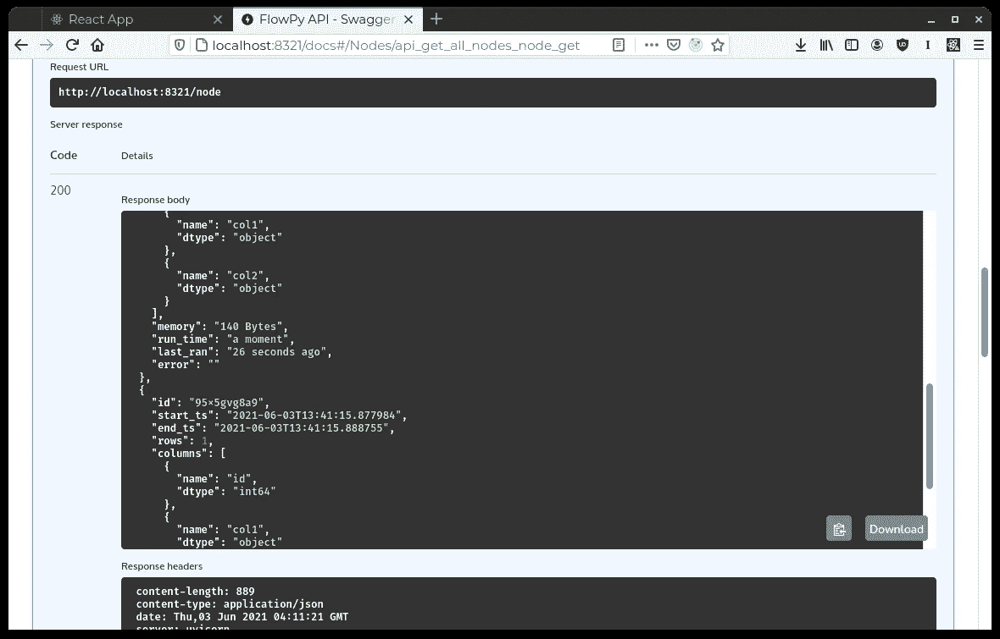
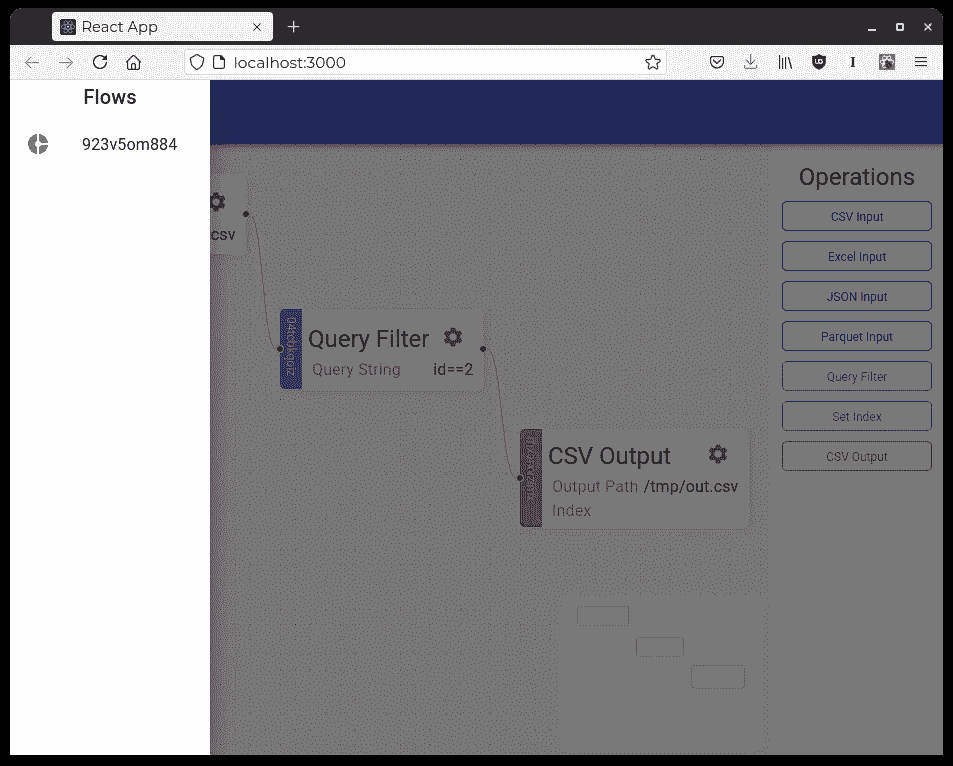

# FlowPy 简介-使用 python 在浏览器中处理数据！

> 原文：<https://towardsdatascience.com/introducing-flowpy-an-intuitive-front-end-for-processing-data-with-python-a619ebe6bb9e?source=collection_archive---------13----------------------->

## [行业笔记](https://towardsdatascience.com/tagged/notes-from-industry)

## 从您自己的浏览器舒适地操作熊猫数据框！

> 我们都喜欢处理数据，但有时将我们所做的传递给数据会很有挑战性。我希望构建一个应用程序，帮助人们定义数据流，同时提供一种直观而简单的方式来编辑这些数据流并与其他人共享。对于具有扎实技术背景的人来说，将数据管道编写为脚本是简单而有效的，但是如何向经理或利益相关者展示这一点呢？我决定是时候构建一个这样的应用程序了！作为一个额外的收获，我想这对那些不直接编码但理解他们想要对数据执行的步骤的人(例如，一个博士生)是有利的

我希望界面简单、直观、美观，以便在演示或会议期间使用，将处理步骤传递到其他业务领域。因为从概念上讲，我们是在实现一个有向无环图，所以我希望有一个画布，可以拖动节点，并通过拖放边来连接节点。下面的屏幕截图显示了一个简单的 DAG(流)的界面。

带有示例流的 FlowPy Studio 作者提供的图片

从上面的屏幕截图中，我们可以看到，这个特定的流获取一个 CSV(来自“/tmp/test.csv”)，应用一个单独的过滤级(其中“id==2”)，然后将数据帧写到磁盘(位于“/tmp/out.csv”)。

只有节点最重要的参数才会显示在流程中。重心图标用于查看和编辑所有参数。单击该图标将打开一个模式窗口，显示该节点的所有参数及其当前值。

展示节点参数示例的 FlowPy Studio 作者图片

单击该模式中的 play 按钮将导致后端运行该节点。最初采取依赖性解决步骤来检查在流中的当前节点之前定义的哪些节点已经运行并且包含最新数据。拥有最新的数据对不同的节点来说意味着不同的事情。例如，如果过滤器节点的过滤器参数已经更改，它将需要再次运行。但是，对于 CSV 输入节点，将比较输入文件的散列，以查看这是否是相同的数据；否则，将再次加载数据。一旦所有先决条件节点都是最新的，最初请求的节点就会运行。

显示当前节点运行状态的 FlowPyAPI 作者图片

目前，当一个节点运行时，前端没有任何指示。理想情况下，我设想界面上的交通灯系统显示红色表示从未运行，橙色表示运行但旧数据被缓存，绿色表示运行并更新。然后，当点击 cog 图标编辑节点参数时，我希望显示一组扩展的运行统计数据。我希望显示的关于节点运行的元数据类型是:

*   节点运行的时间。
*   消耗了多少内存。
*   数据集中存在哪些列。

后端公开所有这些项目；我只是没有扩展前端来显示这些信息。

这个应用程序还可以处理多个流，并通过侧栏公开它们。我想把它扩展到基于个人和团队的安全和共享。

目前，这个应用程序还处于初级的 alpha 阶段。对于新手和有经验的开发人员来说，这是一个很有价值的软件。我想探索某种形式的自动管道部署以及文档和业务规则的生成。

我目前正在学习 react，我知道在前端有许多需要改进的地方。此外，后端需要明显的扩展来支持新功能。我现在已经公开了这个知识库，因为我相信它已经到了有人可以从目前存在的东西中理解我的愿景的地步。还有其他明显的扩展，如容器化的流运行器和 spark 集成，以及更好的调度支持。

我希望你能看到我用这个工具的最终目标。我找人提交一些问题和公关的。让我们像开源社区那样做，把它变成一个有用的工具，我知道这是可能的！

 [## schlerp/flowpy

### 一个 python 应用程序，用于在您舒适的 web 浏览器中操作 pandas 数据框。数据流是…

github.com](https://github.com/schlerp/flowpy) 

不久将会有一篇文章解释这方面的先驱应用程序，该文章着重于使用从一个非常相似的界面设计的 SQL 来执行 ELT！它被称为 PELT Studio，可以在下面的存储库中找到。

 [## 施勒普/佩尔特工作室

### Python Extract，Load，T ransform Studio 是一个用于执行 ELT(和 ETL)任务的应用程序。引擎盖下…

github.com](https://github.com/schlerp/pelt-studio) 

我需要特别提到一个类似的新兴产品，叫做数据块。在开始开发这个应用程序之后，在寻找用 react 处理 DAG 的优秀方法时，我遇到了 reactflow。Reactflow 是前端所基于的库，非常棒。在研究它的文档时，我找到了它所设计的产品的参考资料，这是一个非常相似的概念，但更成熟，并且基于 Javascript。我更喜欢 python 操作数据的生态系统，我相信我并不孤单，所以我仍然看到了 FlowPy 的空间。然而，如果您更喜欢 Javascript，请查看数据块！在我写这篇文章的时候，我仍然在等待进入 alpha，但是非常兴奋！

 [## react Flow——一个用于构建基于节点的应用程序的开源库。

### 反应流发布在 npm 上。您可以通过以下方式安装它:流由节点和边组成(或仅由节点组成)。我们一起…

反应流.开发](https://reactflow.dev/)  [## 数据块

### 我们开始将数据块作为一个小项目，目前正在寻找未来开发该工具的选项…

数据块. pro](https://datablocks.pro/) 

感谢您的阅读，请不要忘记查看我的其他文章，并在 medium 上关注我！