# 介绍 FugueSQL —用于 Pandas、Spark 和 Dask 数据帧的 SQL

> 原文：<https://towardsdatascience.com/introducing-fuguesql-sql-for-pandas-spark-and-dask-dataframes-63d461a16b27?source=collection_archive---------1----------------------->

## 用于数据科学和分析的端到端 SQL 界面

# 动机

作为一名数据科学家，您可能对 Pandas 和 SQL 都很熟悉。然而，可能有一些查询和转换，您会觉得用 SQL 而不是 Python 来做比较舒服。

如果你能像下面这样查询熊猫的数据帧，那不是很好吗？

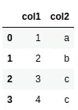

…使用 SQL？

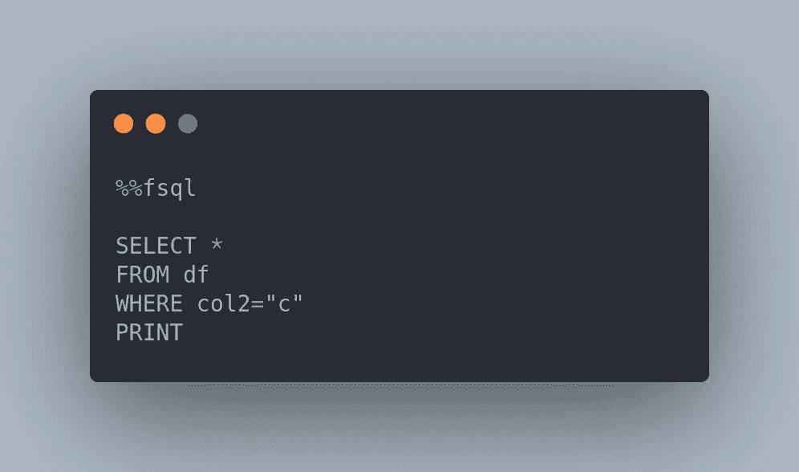

作者图片

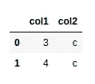

或者在 SQL 查询中使用 Python 函数？

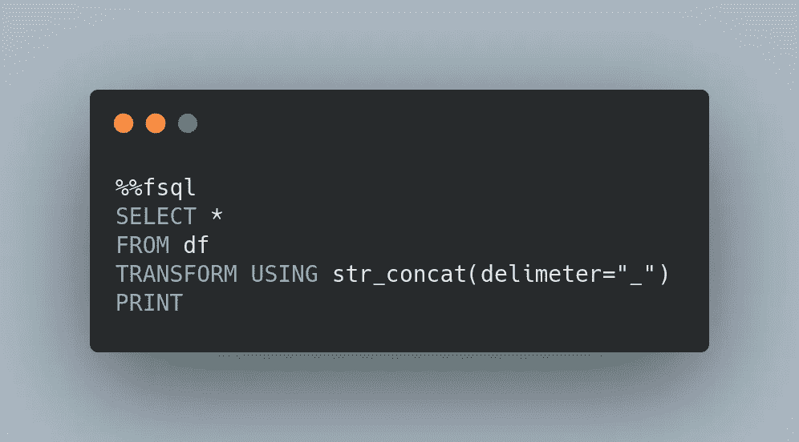

这时，FugueSQL 就派上用场了。

# 什么是 FugueSQL？

[FugueSQL](https://fugue-tutorials.readthedocs.io/tutorials/fugue_sql/index.html) 是一个 Python 库，允许用户组合 Python 代码和 SQL 命令。这使得用户可以在 Jupyter 笔记本或 Python 脚本中灵活地切换 Python 和 SQL。

要安装 FugueSQL，请键入:

```
pip install fugue[sql]
```

要在 Spark 或 Dask 执行引擎上运行，请键入:

```
pip install fugue[sql, spark] 
pip install fugue[sql, dask]
pip install fugue[all]
```

在本文中，我们将探索 FugueSQL 的一些实用程序，并将 FugueSQL 与 pandasql 等其他工具进行比较。

# 笔记本中的 FugueSQL

FugueSQL 附带了一个 Jupyter notebook 扩展，允许用户交互式地查询带有语法高亮显示的数据帧。

要使用它，从`fugue_notebook`导入`setup`函数来注册`%%fsql`细胞魔法。这目前只在经典笔记本上可用(JupyterLab 上不可用)。

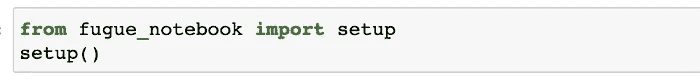

为了理解`%%fsql`细胞是如何变魔术的，让我们从创建一个熊猫数据框架开始:


现在，您可以像在 SQL 中一样通过在单元格的开头添加`%%fsql`来进行查询。

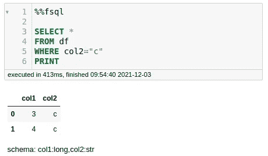

作者图片—将代码[复制到此处](https://gist.github.com/khuyentran1401/63492c0e52a31358772b6e54c3aacbbe)

上面的代码中，只有`PRINT`没有遵循标准 SQL。这类似于 pandas `head()`和 Spark `show()`操作来显示许多行。

像`GROUP BY`这样的操作类似于标准的 SQL 语法。

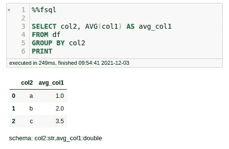

作者图片—将代码[复制到此处](https://gist.github.com/khuyentran1401/daf5ebc94036a4ad6c0b5b1cf3fd16de)

# 增强的 SQL 界面

对于 SQL 用户来说，除了`PRINT`语句之外，上面显示的没有什么不寻常的。然而，Fugue 也为标准 SQL 添加了一些增强，允许它优雅地处理端到端的数据工作流。

## 处理临时表

SQL 用户经常不得不使用临时表或公用表表达式(CTE)来保存中间转换。幸运的是， **FugueSQL 支持通过变量赋值来创建中间表。**

例如，在转换`df`之后，我们可以将其赋给另一个名为`df2`的变量，并使用`SAVE variable OVERWRITE file_name`将`df2`保存到一个文件中。

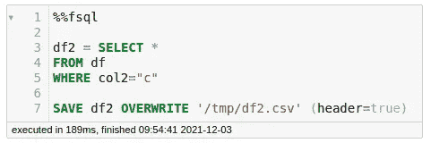

作者图片—将代码[复制到此处](https://gist.github.com/khuyentran1401/7246f3796d7a8523441f4d7ba253c851)

现在，如果我们想对`df2`应用更多的变换，只需从我们之前保存的文件中加载它。

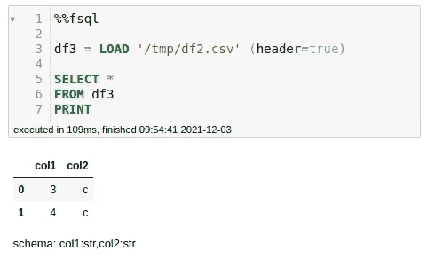

作者图片—将代码[复制到此处](https://gist.github.com/khuyentran1401/21d89008b985f5970ca021a8b1d956a6)

很酷，不是吗？

# 添加的关键字

SQL 的语法是为了查询，这意味着它缺少操纵数据的关键字。FugueSQL 为常见的 DataFrame 操作添加了一些关键字。例如:

*   滴

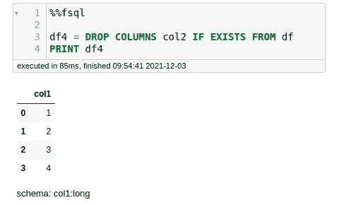

作者图片—将代码[复制到此处](https://gist.github.com/khuyentran1401/4467e4234b3bf3b9167f6b2c8559e787)

*   填充空参数

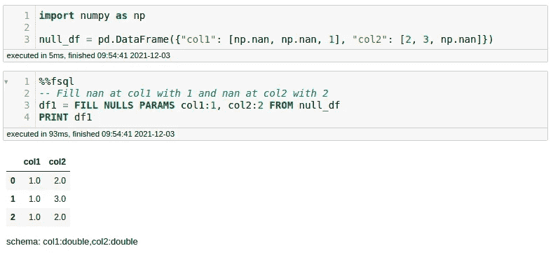

作者图片—将代码[复制到此处](https://gist.github.com/khuyentran1401/8aafb8ddea3deac79fbdf110776836ea)

*   样品

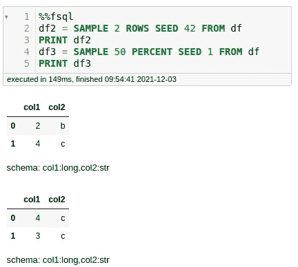

作者图片—将代码[复制到此处](https://gist.github.com/khuyentran1401/23df00ab3bc09a1651ca08660194275b)

有关操作员的完整列表，请查看 [FugueSQL 操作员文档](https://fugue-tutorials.readthedocs.io/tutorials/fugue_sql/operators.html)。

# 与 Python 集成

通过使用`TRANSFORM`，FugueSQL 还允许您在 SQL 查询中使用 Python 函数。

例如，要在 SQL 查询中使用函数`str_concat`:

…只需将以下组件添加到功能中:

*   输出模式提示(作为注释)
*   键入注释(`pd.DataFrame`)

酷！现在我们准备将它添加到 SQL 查询中:

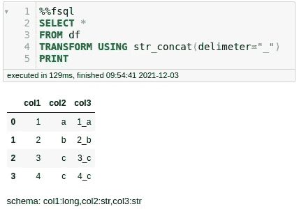

图片由作者提供—将代码[复制到此处](https://gist.github.com/khuyentran1401/74593d3e48f08bfa664ab9c68f12c85a)

# 向大数据扩展

## 富格斯基火花

SQL 的一个美丽特性是它不知道数据的大小。该逻辑以一种与规模无关的方式表达，即使在 Pandas、Spark 或 Dask 上运行也将保持不变。

使用 FugueSQL，我们可以通过指定`%%fsql spark`在 Spark 执行引擎上应用相同的逻辑。我们甚至不需要编辑`str_concat`函数来将它带到 Spark，因为 Fugue 会负责移植它。

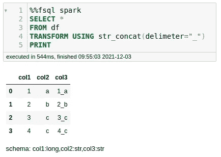

作者图片—将代码[复制到此处](https://gist.github.com/khuyentran1401/eac24a252b583f9956bf70d60958bdfd)

## `PREPARTITION BY`

分布式计算的一个重要部分是分区。例如，要获得每个逻辑组中的中值，需要对数据进行分区，使每个逻辑组都位于同一个工作线程上。

为了描述这一点，FugueSQL 有了`PREPARTITION BY`关键字。神游的`prepartition-transform`语义相当于熊猫的`groupby-apply`。唯一的区别是`prepartition-transform`扩展到分布式设置，因为它规定了数据的位置。

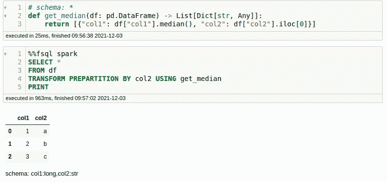

作者图片—将代码[复制到此处](https://gist.github.com/khuyentran1401/091f7439eadbbecdb9b3ad875b30f17a)

注意，对于列`col2`中的每个不同值，上面的`get_median`函数都会被调用一次。因为数据是预先划分好的，所以我们只需取出第一个值`col2`就可以知道我们正在与哪个组一起工作。

# 生产中的 FugueSQL

要将 FugueSQL 从 Jupyter 笔记本中取出并放入 Python 脚本中，我们需要做的就是将 FugueSQL 查询包装在一个`fsql`类中。然后我们可以调用`.run()`方法并选择一个执行引擎。

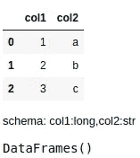

# FugueSQL 和 pandasql 有什么区别？

如果你了解 pandassql，你可能会想:如果 pandasql 已经允许你用 panda 运行 sql 了，为什么还要用 FugueSQL 呢？

pandasql 只有一个后端 SQLite。在 pandas 和 SQLite 之间传输数据会带来很大的开销。另一方面，FugueSQL 支持多个本地后端:pandas、DuckDB 和 SQLite。

当使用 pandas 后端时，Fugue 直接将 SQL 翻译成 pandas 操作，所以根本没有数据传输。DuckDB 有极好的 pandas 支持，所以数据传输的开销也可以忽略不计。Pandas 和 DuckDB 都是本地数据处理的首选 FugueSQL 后端。

Fugue 还支持 Spark、Dask 和 cuDF(通过 blazingSQL)作为后端。

# 结论

恭喜你！您刚刚学习了如何使用 FugueSQL 作为 SQL 接口来操作 Python 数据帧。使用 FugueSQL，您现在可以使用 SQL 语法来表达端到端的数据工作流，并无缝地扩展到分布式计算！

本文并没有详尽地介绍 FugueSQL 的特性。有关 Fugue 或 FugueSQL 的更多信息，请查看下面的参考资料。

*   [Github 回购](https://github.com/fugue-project/fugue)
*   [FugueSQL 文档](https://fugue-tutorials.readthedocs.io/tutorials/fugue_sql/index.html)
*   [赋格懈怠](https://join.slack.com/t/fugue-project/shared_invite/zt-jl0pcahu-KdlSOgi~fP50TZWmNxdWYQ)

随意发挥，并在这里叉这篇文章的源代码:

[](https://github.com/khuyentran1401/Data-science/blob/master/data_science_tools/fugueSQL.ipynb) [## 数据科学/fuguesql . ipynb at master khuyentran 1401/数据科学

### master 上有用的数据科学主题以及代码和文章的集合-Data-science/fuguesql . ipynb…

github.com](https://github.com/khuyentran1401/Data-science/blob/master/data_science_tools/fugueSQL.ipynb) 

我喜欢写一些基本的数据科学概念，并尝试不同的数据科学工具。你可以在 [LinkedIn](https://www.linkedin.com/in/khuyen-tran-1401/) 和 [Twitter](https://twitter.com/KhuyenTran16) 上和我联系。

如果你想查看我写的所有文章的代码，请点击这里。在 Medium 上关注我，了解我的最新数据科学文章，例如:

[](/write-clean-python-code-using-pipes-1239a0f3abf5) [## 使用管道编写干净的 Python 代码

### 一种简洁明了的处理迭代的方法

towardsdatascience.com](/write-clean-python-code-using-pipes-1239a0f3abf5) [](/3-tools-to-track-and-visualize-the-execution-of-your-python-code-666a153e435e) [## 3 个跟踪和可视化 Python 代码执行的工具

towardsdatascience.com](/3-tools-to-track-and-visualize-the-execution-of-your-python-code-666a153e435e) [](/how-to-create-mathematical-animations-like-3blue1brown-using-python-f571fb9da3d1) [## 如何使用 Python 创建类似 3Blue1Brown 的数学动画

### 利用您的 Python 技能创建美丽的数学动画

towardsdatascience.com](/how-to-create-mathematical-animations-like-3blue1brown-using-python-f571fb9da3d1) [](/how-to-detect-seasonality-outliers-and-changepoints-in-your-time-series-5d0901498cff) [## 如何检测时间序列中的季节性、异常值和变化点

### 只需要 Kats 和几行代码

towardsdatascience.com](/how-to-detect-seasonality-outliers-and-changepoints-in-your-time-series-5d0901498cff)