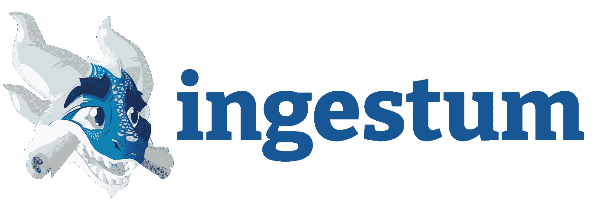

# Ingestum 简介

> 原文：<https://towardsdatascience.com/introducing-ingestum-dda1650857f4?source=collection_archive---------31----------------------->

## 一个可扩展、可伸缩、免费和开源的统一摄取框架，使创建和使用 NLP 程序变得更加容易

图片作者。

NLP 和其他基于语言的人工智能的市场正在爆炸式增长，估计每年增长超过 20%[1]。作为一家人工智能公司，我们很快意识到，简单地访问非结构化内容是一个重大的技术障碍。

根据 Gartner 2015 年的一项研究，80%的企业数据被锁定在非结构化文档中[2]。这些非结构化数据中的大部分相对容易获取，但麦肯锡认为最后的 20%在提取和机器可读方面特别具有挑战性[3]。NLP 的承诺在于以尽可能少的摩擦获得数据，我们永远不会因为客户有“错误”的文件而拒绝他们。

当我们寻找答案时，我们发现摄取软件市场高度分散，有几十个利基专家，没有一个解决方案能满足我们的需求。对于一家预算紧张、梦想远大的年轻初创公司来说，缺乏解决方案是一个巨大的挑战，也是一个额外的障碍。作为在开源社区有深厚根基的开发人员，我们对找不到开源解决方案感到失望。

因此，我们构建了自己的—一个可扩展、可伸缩且易于使用的统一内容摄取框架。我们称之为 Ingestum(“摄取它们”)。因为我们也不希望其他项目或初创公司受到阻碍，所以今天我们在免费/自由开源许可下发布它，供全世界使用。

最近，我们再次深入研究了市场，发现了 170 多家潜在供应商，并有了一些惊人的发现:

*   市场极其分散。
*   非常非常少的“纯玩家”只专注于摄取。
*   至少有十几家人工智能供应商分别销售他们的摄取平台。
*   有许多人工智能供应商将他们的摄入与他们的人工智能产品联系在一起。
*   一种常见的方法是将所有内容转换成 PDF，然后应用光学字符识别(OCR)。
*   几乎对一家公司来说，这种吸收是专有的，迫使每个进入市场的新公司重新发明轮子，减缓创新，并为有活力的年轻公司创造进入壁垒。

这不仅仅影响开发者。当选择一个人工智能产品时，用户被锁定在可用的摄取软件中。提前消化可能很难，尽管许多人工智能公司拥有出色的内部解决方案，但他们可能仍然难以处理复杂的 PDF 结构或其他文档，从而阻碍了他们的效率。更不用说来自新社交媒体或视频会议应用的快速激增的数据格式了。我们遇到的一些公司在谈到“数据准备”时，会掩饰这些挑战。但是，如果它简单、快速、可靠地吸收非结构化数据，就不会仍然是一个未解决的问题。

同样，在与客户的交谈中，我们了解到数据管理问题是一个反复出现的主题。一位维护企业药物警戒平台的客户告诉我们，“当我看到我们的安全平台时，我很尴尬，我需要计算我们有多少供应商、工具和连接点。这是一个巨大的，蔓延的建筑图。很尴尬。我都不会表现出来。”

在这种产品激增的情况下，我们找到了一个潜在的解决方案。我们意识到我们的摄取引擎框架首先需要具有可伸缩性和可扩展性。当面对一种不熟悉的格式时，我们可以在短短三个小时内创建一个新的修改器，然后能够真空处理该类型的每个文档。我们想要的是需要尽可能少的单点解决方案，这可能是一个完全全面的摄取平台—您需要的最后一个摄取解决方案。

现在是核心问题——那么，我们为什么要开源呢？如果这么多公司都在努力消化，而且我们相信我们有秘方，为什么我们要把配方发布到网上让所有人看呢(和如今大多数配方博客一样，还有一篇解释其来源的长篇背景文章)？

一个原因是我们对自己核心技术的信心。我们认为，我们的人工智能平台因其语言智能而足够差异化，因此我们不需要在摄取方面占据优势。另一个原因是我们知道开源项目的优势。摄取不是我们的核心业务，虽然创建一个新的修饰符只需要几个小时，但是随着我们公司的扩展，当我们遇到新的文档类型时，拥有一个大大扩展的修饰符库是很好的，此外还有吸引活跃的开发人员社区来不断完善和扩展产品的所有额外好处。

但最后，我们是开源的忠实信徒。像大多数工程团队一样，我们非常依赖于站在前人的肩膀上。Ingestum 的组件中有 Python 组件，如 Beautiful Soup、Camelot、PDFMiner、Pyexcel、Twython、Python-tesseract 和 Deep Speech。我们非常感谢开发人员社区创建了这些组件，从而使我们的工作变得更加容易，我们希望回报他们。此外，今天，人工智能公司没有利用这些伟大的项目。Ingestum 是第一个将这些项目整合在一起的免费/libre 开源框架。

我们的大部分工程团队也是通过开源社区走到一起的。我共同创建了 Sugar Labs，这是一个面向儿童的协作式免费/自由开源软件学习平台，还有 Music Blocks，这是一个以有趣的方式探索基本音乐概念的工具集。通过在 Sugar Labs 的工作，我认识了马丁·阿本特·拉哈耶，他是 Ingestum 的首席工程师。马丁和胡安·帕布鲁都是 GNOME 基金会的成员，为 GNOME 项目做出了贡献

我们都深信开源的使命。我们为我们创造 Ingestum 的工作感到非常自豪，我们希望它不辜负自由/开源软件产品的优良传统。

ingestum——从拉丁词到摄取——旨在应对三大挑战:

*   便于编写脚本，从任意来源和格式中提取非结构化内容；
*   提供一个从各种源格式中提取内容的框架；和
*   允许在许多粒度级别上集成 Python 脚本和服务。

我们的文档[4] [5]中详细介绍了 Ingestum 方法，它有六个主要概念:

1.  *Sources* :源文件或数据流，转换成 Ingestum 文档，可扩展的 JSON 编码格式，以便进一步处理；
2.  *文档*:应用修改符的中介，例如，表格数据、自由文本数据或收款文档；
3.  *修饰符*:对其全部或部分输入的具体操作，返回一个输出文件；
4.  *管道&管道*:管道是一系列修饰符，管道是管道的集合，这是屡试不爽的 UNIX 方法；
5.  *条件*:选择性应用修饰语的逻辑条件；适用于复杂的非结构化数据，例如只提取表格或不带表格的文本；
6.  *manifest*:用 JSON 表示，描述了源代码和管道及其参数，简化了 Ingestum 的命令行调用。

这些组件形成了一个统一的框架，用于接收各种来源，如一家意外险公司的 PDF 数据表、Proquest 和 PubMed 的研究论文、美国政府机构的 XML 文档、电子邮件线程、Twitter feeds、一家制药公司的 XLS/XLSX 文件、Youtube 和 Vimeo 视频以及会议录音。现在，您可以对您的非结构化数据或您客户的非结构化数据使用 Ingestum 框架。

我们认为 Ingestum 为人工智能领域的任何人提供了一个令人信服的销售论据:它是免费的，非常容易安装、原型化、测试和部署。就其本质而言，处理非结构化数据需要一些实验和迭代。Ingestum 在这方面很出色，因为这个过程被分解成了小步骤。今天，GitLab 上的 Ingestum 库中有几十个示例管道，涵盖了广泛的来源。这些为构建新的定制管道提供了一个起点。(过多的管道示例简化了开发人员的入职，因为修改现有管道比创建新管道更容易。)修改器库覆盖面广，添加新的修改器通常只需几个小时的工作。Ingestum 可以通过 FastAPI 之类的服务框架获得，并集成到低代码和无代码环境中。

Ingestum 并不完美。默认的 OCR 库可能难以处理一些手写文档。可以改进默认的语音到文本的代码转换。但是通过 Ingestum 的插件机制可以很容易地添加一个首选库。Ingestum 的模块化架构意味着可以为所有类型的文档和流类型及格式添加修改器，并且该平台将随着部署而增长。

我们认为 Ingestum 在摄入市场上既是竞争者也是反竞争者。我们的意思是:它是免费的开源软件，所以你可以自由地评估它，并将其添加到你现有的工作流程中。相反，如果你相信(就像我们一样)Ingestum 可以在你的摄取过程中发挥核心作用，你现在使用的软件可以作为插件添加到 Ingestum 中。C++或 Java 模块中的代码？别担心，用 Python 绑定把它们放进去。如果您有不想发布的专有摄取代码，LGPL 允许您将代码作为插件添加到实现中。Ingestum 可以成为任何类型的非结构化数据和现有解决方案之间的桥梁，或者直接喂给 AI 处理。我们相信如果人工智能公司为框架贡献插件，所有的船都会上升。

我们对 Ingestum 的愿景是通过使非结构化文本易于自然语言处理(NLP)来推进人工智能，促进知识结构的创建，从而实现人工智能技术的进一步丰富。我们相信，通过消除最大的初始障碍，降低创新成本，Ingestum 将成为未来人工智能项目的福音。[下载 Ingestum 自己看。](https://gitlab.com/sorcero/community/ingestum.git)

[*要了解更多关于 Ingestum 的信息或报名参加我们 4 月 27 日的网络研讨会，请点击这里*](https://www.ingestion.co/) *。*

[1] [自然语言处理市场，按组件、类型(统计、混合)、应用程序(自动摘要、情感分析、风险&威胁检测)、部署模式、组织规模、垂直市场和区域划分—2026 年全球预测](https://www.marketsandmarkets.com/Market-Reports/natural-language-processing-nlp-825.html) (2020)、市场和市场

[2] A. Dayley，D. Logan，[组织将需要应对三大挑战，以遏制非结构化数据过剩和忽视](https://www.gartner.com/en/documents/3077117/organizations-will-need-to-tackle-three-challenges-to-cu) (2015)，Gartner Research

[3] M. Friesdorf，M. Hedwig，F. Niedermann，[最佳数字文档处理:支付者视角](https://www.mckinsey.com/industries/healthcare-systems-and-services/our-insights/best-in-class-digital-document-processing-a-payer-perspective) (2019)，麦肯锡&公司

[4]https://sorcero.gitlab.io/community/ingestum/

[5]https://gitlab.com/sorcero/community/ingestum.git 的 git 克隆