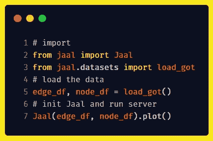
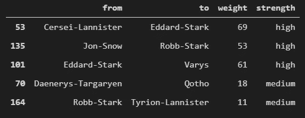
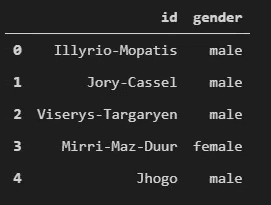
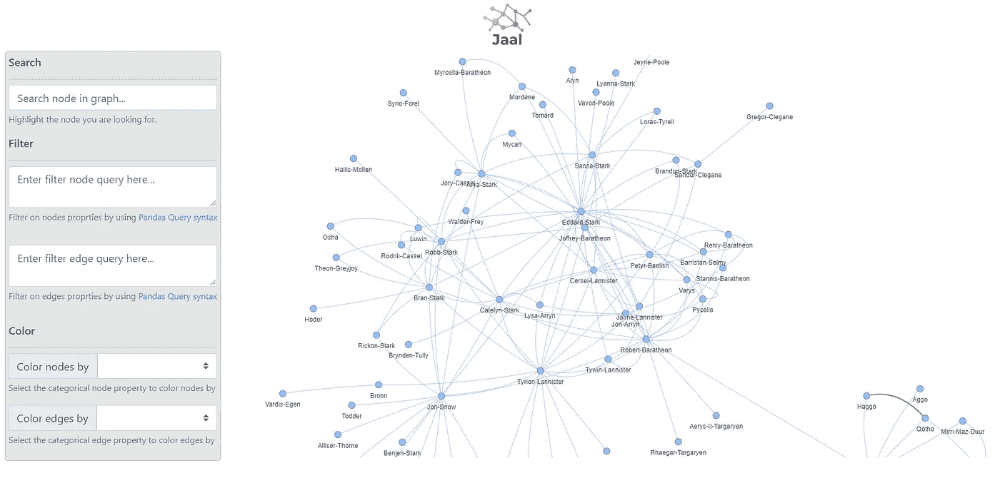
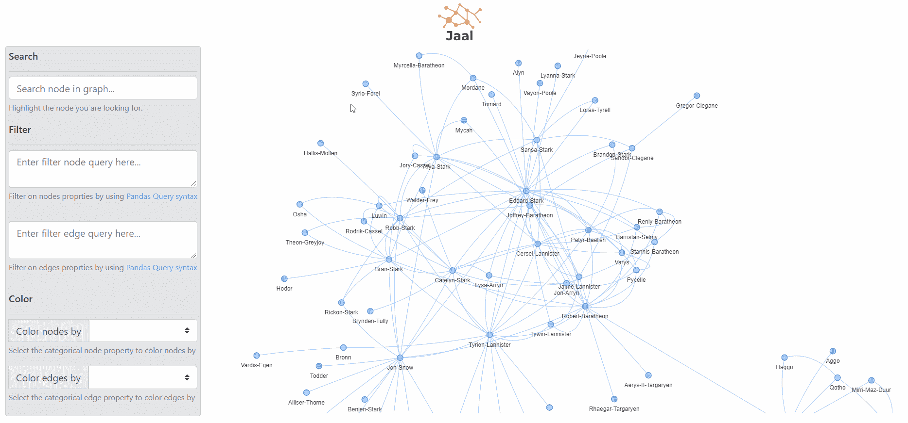
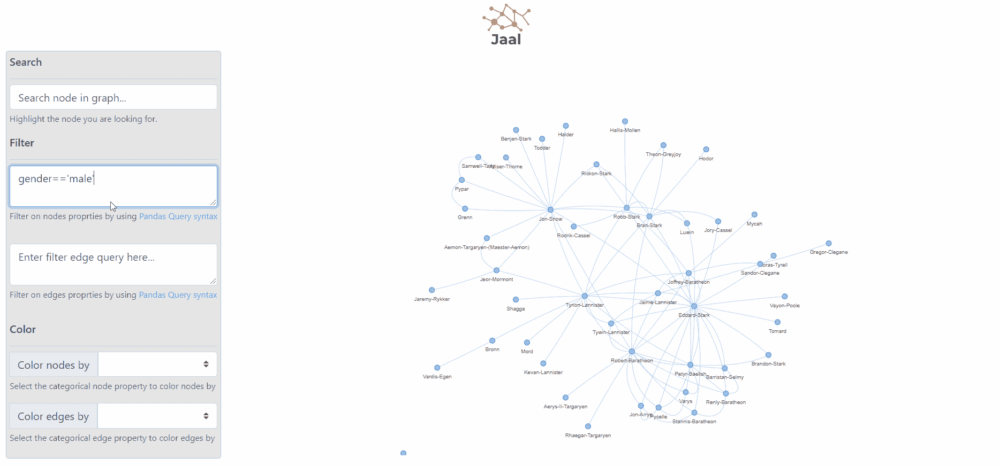
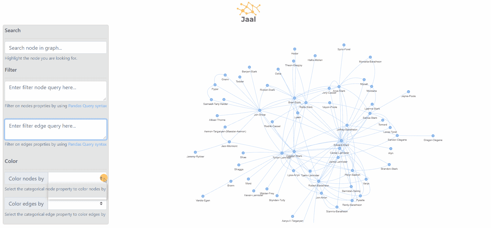

# Jaal 简介——轻松与网络互动

> 原文：<https://towardsdatascience.com/introducing-jaal-interacting-with-network-made-easy-124173bb4fa?source=collection_archive---------13----------------------->

## 您的互动网络*用 Python 可视化仪表盘*


照片由[艾拉·巴克斯特](https://unsplash.com/@ellabaxter20201?utm_source=unsplash&utm_medium=referral&utm_content=creditCopyText)在 [Unsplash](https://unsplash.com/s/photos/cobweb?utm_source=unsplash&utm_medium=referral&utm_content=creditCopyText) 上拍摄

*访问* [*包的 github 页面*](https://github.com/imohitmayank/jaal) *获取代码和详细自述。还有，如果你喜欢，请不要羞于点击星星*😏

# 👉前言

不久前，我发表了一篇[文章，介绍了 Python 中的几种网络可视化工具](/visualizing-networks-in-python-d70f4cbeb259)。反响是惊人的。最精彩的部分是人们分享他们的经历、喜好和问题的信息。有趣的一点是，有多少人对其中一个选项感到兴奋，但它需要大量的样板代码才能开始。这个问题是 Jaal 的催化剂，在 Jaal 中，我试图使用 Dash 和 visdcc 去掉在 Python 中绘制网络所需的所有多余的东西。除此之外，我还尝试添加了一些我个人认为网络可视化工具应该具备的最常见的交互功能。所以，事不宜迟，让我们深入到 Jaal😄


# 👉什么是 Jaal

Jaal 是一个基于 python 的交互式网络可视化工具，使用 Dash 和 Visdcc 构建。由于它是使用 Dash 构建的，我们可以将其视为一个仪表板，而不是网络图。正因为如此，除了基本特性，Jaal 还提供了多种选项来处理网络数据，比如搜索、过滤，甚至给图中的节点和边着色。所有这些都在 2 行代码内:)

# 👉安装

安装 Jaal 非常简单，只需运行以下命令，

```
pip install jaal
```

你完了😆

注意，建议在安装之前创建一个虚拟环境。这可以很容易地通过使用`python -m venv myenv`来完成，然后激活我们运行的环境，

1.  (Windows) `.\\myvenv\\Scripts\\activate.bat`
2.  (Linux) `source myvenv/bin/activate`

# 👉入门指南

安装 Jaal 后，我们需要获取数据并调用 Jaal 中的`plot`函数。让我们通过玩软件包中包含的《权力的游戏》数据集来实现这一点。获取数据和绘图的完整代码如下:



这里我们首先导入`Jaal`主类和数据集加载函数`load_got`。后来，我们从包中加载了 get 数据集。这给了我们两个文件，

1.  **edge_df** :至少有`from`和`to`列的熊猫数据帧，表示实体之间的边关系
2.  **node_df** :这是一个熊猫数据帧，至少有`id`列，包含唯一的节点名



距离 edge_df(左)和 node_df(右)5 行。除了强制栏，重量和强度是边缘的特征。同样，性别也是节点的一个特征。

注意，edge_df 是强制的，node_df 是可选的。此外，我们可以在这些文件中包含额外的列，它们分别被自动视为边或节点特征。

接下来，我们将数据传递给 Jaal 并调用`plot`。这将导致控制台提示 Jaal 运行的默认本地主机地址(`127:0.0.1:8050`)。我们可以访问它来查看下面的仪表板，



Jaal dashboard，左边是设置面板，右边是图形。

# 特征

目前，仪表板由以下部分组成:

1.  **设置面板**:这里我们有多个选项来玩图形数据。它还包含以下小节，

*   **搜索**:可用于高亮显示图形中的一个节点
*   **Filter** :支持 pandas 查询语言，可用于基于节点或边特征过滤图形数据。
*   **颜色**:可用于根据节点或边的分类特征对其进行着色。注意，目前只支持基数最大为 20 的特性。

2.**图形**:使用 visdcc 绘制的网络图。

# 👉例子

让我们一个接一个地看一下上面讨论的每个特性的例子。我们将使用得到的数据集。

## 1.搜索

第一个选项是搜索，我们可以在图中搜索特定的节点。它支持在节点标签上逐字符搜索。下面是一个我们试图搜索“Arya”的例子，



## 2.过滤

接下来，我们进行过滤。Jaal 支持在节点和边特性上进行搜索的选项。为此，我们提供了单独的文本区域。下面我们可以看到节点和边过滤查询的现场效果。



## 3.着色

最后，代替过滤，我们可能希望看到任何特征的总体分布。目前，Jaal 通过提供基于任何分类特征给节点或边着色的选项来处理这个问题。下面我们可以看到一个真人例子。



# 结论

本文的目的是介绍一个名为 Jaal 的新 python 包。这个包的灵感来自于几个志同道合的人最近在网络可视化上发布的[消息、评论和反应。这是为了减轻我们在尝试可视化和处理网络数据时面临的一些棘手问题。希望这能有所帮助。另外，这只是 Jaal 的第一个版本，我还想添加更多的功能。为此，非常感谢任何合作或想法。下一集再见！](/visualizing-networks-in-python-d70f4cbeb259)

干杯。

在 [LinkedIn](https://www.linkedin.com/in/imohitmayank/) 上与我联系，并在我的[网站](http://mohitmayank.com/)上阅读类似的文章。