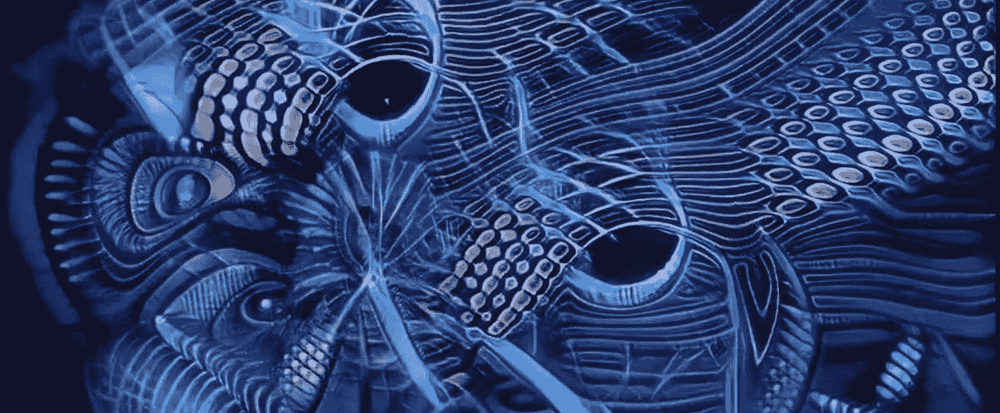

# 介绍“清晰的声波梦”:用几行 Python 代码将 GAN 艺术与音乐同步！

> 原文：<https://towardsdatascience.com/introducing-lucid-sonic-dreams-sync-gan-art-to-music-with-a-few-lines-of-python-code-b04f88722de1?source=collection_archive---------5----------------------->



## 让生成视听艺术变得简单和可定制

生成艺术在过去几年里取得了长足的进步。人们只需要看看互联网上发布的无数艺术品(例如这里的和这里的)就可以意识到，就艺术水平而言，机器可以说已经和人类不相上下了。这对艺术家的影响，向前发展，是值得讨论的——但我们都同意的一件积极的事情是，它为全新的视觉和听觉体验打开了大门。同样，它使得艺术创作即使是未经训练的人也能接触到。

因此，进入**清醒的声波梦**:一个 Python 包，只用几行代码就把艺术与音乐同步了！

宋:[Saje 的覆盆子](https://open.spotify.com/track/163CIHsH9SkYxcCjPINqHv?si=W1IQYvjDRn6hzF8CfXfxXw)。由[杰里米·托曼](https://twitter.com/tormanjeremy)训练的模特举重。

# 重要链接

如果你想直接跳到重点，沉浸在清晰的声波梦中，这里有你需要的所有链接:

*   GitHub 库[。](https://github.com/mikaelalafriz/lucid-sonic-dreams)
*   Google Colab 上的[教程笔记本，其中详细介绍了您可以修改的所有参数，并提供了示例代码模板。](https://colab.research.google.com/drive/1Y5i50xSFIuN3V4Md8TB30_GOAtts7RQD?usp=sharing)
*   [清醒的声波梦 Instagram 账户](https://www.instagram.com/lucidsonicdreams/)，其中包含用这个包创建的视频的简短预览。
*   我的 [YouTube 频道](https://www.youtube.com/channel/UC6CEmHx20lFvT78kR4Cu7Gg)，其中包含用这个包创建的完整长度的作品视频，以及我的其他音乐作品。

否则，如果您想进一步了解这个包是如何工作的，同时也想在这个过程中看到一些演示，请进一步阅读！

# 它是如何工作的

为了保持可访问性的精神，我将去掉大多数(但不是全部)解释生成模型的技术术语。相反，在准确理解音乐是如何操纵视觉效果的时候，我将关注最重要的细节。毕竟，对于那些感兴趣的人来说，网上有足够的资源来详细描述那些肮脏的细节。

通常，生成性艺术品是由一类称为生成性对抗网络(GAN)的深度学习框架产生的。Lucid Sonic Dreams 默认使用 [StyleGAN2-ADA](https://github.com/NVlabs/stylegan2-ada) 架构——尽管这是可定制的，稍后你会看到。这些模型是在通常遵循某种“风格”的图像数据集上训练的。训练后，模型能够输出几乎无限数量的图像，这些图像与它们被训练的图像的风格相匹配。[这个由](https://github.com/justinpinkney/awesome-pretrained-stylegan2)[贾斯汀·平克尼](https://www.justinpinkney.com/)创作的知识库展示了来自众多预先训练好的 StyleGAN2 模型的样本输出，风格从脸型、艺术到……我的小马？

当我们深入研究这些图像是如何产生的，事情就变得有趣了。一个模型被输入一个决定输出图像的输入——在 StyleGAN2 的例子中，是一个包含 512 个数字的向量。相应地，对输入向量的微小改变将在输出图像中产生微小改变。现在，有趣的部分:如果我们从音乐中获得声波，从这些声波中提取数值(例如振幅)，并将它们添加到输入向量中的值，会怎么样？清醒声波梦对视频中的每一帧都这样做，产生出随着听到的音乐而脉动和变形的艺术。

为了给予它应有的充分肯定，这个想法是由[马特·西格尔曼](https://medium.com/@mes2338)的[深度音乐可视化器](/the-deep-music-visualizer-using-sound-to-explore-the-latent-space-of-biggan-198cd37dac9a)项目激发的。这是一个类似的 Python 实现，将音乐与由[比根](https://machinelearningmastery.com/a-gentle-introduction-to-the-biggan/)生成的图像同步。网上有一些其他的项目在尝试这个想法，但是没有一个(据我所知)是以 Python 包的形式出现的，也不像 Lucid Sonic Dreams 那样可以定制。

无论如何，这是对幕后发生的事情的基本概述。更多的技术细节将在下面的“调整参数”部分讨论！

# 使用软件包

清醒声波梦被特别设计成**易于使用**和**极其灵活**。所有需要的是通常的 pip 安装…

```
pip install lucidsonicdreams
```

…后面是几行 Python 代码:

就这样，你完成了！这是用这段代码生成的一个示例视频；我建议至少看前一分半钟，看看单个组件的构建。

宋:[化爱所基本上周六晚上](https://open.spotify.com/track/4mmjL7yZKiVHcVjhUEwku4?si=vHyTyFk9QQCH_d6aBlu1_A)

## 改变风格

只需运行以下命令，即可查看可用的默认样式:

这将打印一个完整的样式名称列表供您选择。这些风格是由之前提到的贾斯汀·平克尼[从](http://Justin Pinkney) [awesome 资源库](https://github.com/justinpinkney/awesome-pretrained-stylegan2)中提取的。也可以传递您自己的样式 GAN 权重，或者使用完全不同的 GAN 架构——稍后会有更多详细信息。

## 调谐参数

虽然这个包在默认设置下非常容易使用，但它实际上有许多参数——实际上有 30 多个——可以调整！Google Colab 上的[教程笔记本](https://colab.research.google.com/drive/1Y5i50xSFIuN3V4Md8TB30_GOAtts7RQD?usp=sharing)详细列出了这些参数。然而，在本文中，我们将只讨论音乐操纵的基本组件，以及控制它们的最重要的参数。

用这个包，音乐控制 3 个主要的视觉组件:**脉冲**、**动作**和**类。** Pulse，从字面上看，指的是视觉效果如何“脉动”音乐的打击乐元素。从数学上来说，这个脉冲是声波的振幅与输入矢量的*临时*相加的结果(即矢量在下一个视频帧中恢复正常)。同时，运动指的是视觉变形的速度。从数学上来说，这是输入向量的*幅值累积*相加的结果(即任何相加的都保持不变)。

“类”组件是一个有趣的组件。它指的是生成的图像中对象的标签。例如，在针对 [WikiArt](https://www.wikiart.org/) 图像训练的风格中，有 167 个类别，包括梵高、达芬奇、抽象画等。这些由音乐的音高控制，具体来说，12 个音高被映射到 12 个不同的类别。这些音高的单个振幅影响传递到第二个输入向量(“类别向量”)的数字，该向量确定模型生成的对象。这个想法是从前面提到的[深度音乐可视化工具](/the-deep-music-visualizer-using-sound-to-explore-the-latent-space-of-biggan-198cd37dac9a)项目中获得的！

为了了解哪些参数是最重要的，让我们来布置完整的视频生成管道。首先，输入向量被初始化并在。这是视频的“基本动作”。参数 ***speed_fpm*** 控制该运动的速度，其中“fpm”代表“每分钟帧数”——本质上是每分钟初始化的矢量数量。对于每一个后续帧，参数 ***pulse_react*** 、 ***motion_react*** 和 ***class_react*** 控制音频对各个组件的操纵程度。

在模型从这些向量中生成图像后，这些图像被传递给一堆效果，这些效果也会对音乐做出反应。默认情况下，该软件包带有“对比”和“闪光”效果，与音频的打击乐元素同步。这些可以通过设置 ***对比度 _ 强度*** 和 ***闪光 _ 强度*** 参数来切换。也可以创建你自己的自定义效果——稍后会有更多的细节。

下面是一些调整这些参数的示例代码。请注意 *speed_fpm* *= 0* ，这样在歌曲的无声部分就没有运动。

宋:[丁尼生的煎饼脚](https://open.spotify.com/track/3lg1wx9oVqgKGBhR0LcEnS?si=n1FAzebCRu6MkC7sMMxpsA)

## 使用您自己的风格和重量

如果您已经训练了自己的样式，或者您碰巧在网上遇到了模型权重，您可以将这些权重的文件路径作为*样式*参数值传递。我个人很兴奋地看到，有自己的模型权重的生成艺术家最终用这个包制作出了什么！

举个例子，你在这篇文章的[标题视频](https://youtu.be/iEFqcMrszH0)中看到的(令人难以置信的惊人)视觉效果是由一个经过[杰里米·托曼](https://twitter.com/tormanjeremy)训练的模型生成的。[这个线程](https://www.reddit.com/r/deepdream/comments/leqwxs/stylegan2ada_pickle_file_in_comments_with_colab/)描述了他的训练数据集，并包含一个权重文件的链接。以下是我用来生成视频的代码:

## 使用孤立的音轨

对于我的音乐同行们来说，你们很幸运，他们正在寻找一个音乐可视化工具。该软件包允许您上传孤立的音轨来控制脉冲，运动，类，对比度和闪光。如果您希望这些可视组件与特定的乐器同步，这是最理想的选择。您也可以使用这些孤立的轨道来定制效果，我们将在下一节中看到。

这是一些我用来可视化我自己制作的音乐曲目的代码。我用一个独立的打击音轨来控制脉冲，用一个独立的“合成和弦”音轨来控制类别。

你真正的音乐

## 创建自定义效果

除了内置的对比和闪光效果之外，Lucid Sonic Dreams 还允许您创建自己的反应式自定义效果。为此，只需创建一个接受至少 3 个参数的函数— ***数组*** ，它引用效果所应用到的图像； ***力度*** ，决定了它对音乐的反应程度；以及 ***振幅*** ，指的是音乐在任意给定时间点的音量。然后，将这个自定义函数传递给一个***effects generator***对象。这里有一个非常实验性的可视化，利用了 scikit-image 的[漩涡](https://scikit-image.org/docs/dev/auto_examples/transform/plot_swirl.html)效果:

宋:[叶卡捷琳娜](https://open.spotify.com/track/5UC6HF9VVgYMHQ7PcwcZNZ?si=3a-FXRPVSgKBYmU_4kn8dw)

## 使用其他 GAN 架构

如果你更喜欢使用一些其他的 GAN 架构，Lucid Sonic Dreams 可以让你这样做。简单地定义一个函数，接受一批噪声向量和类别向量(NumPy 数组)作为输入，输出一批[枕头](https://pillow.readthedocs.io/en/stable/)图像。实际上，这个函数甚至不需要使用 GAN——它可以是将输入向量转换为图像的任何函数。

下面的代码通过使用 BigGAN 的 PyTorch 实现生成图像，复制了前面提到的[深度音乐可视化工具](/the-deep-music-visualizer-using-sound-to-explore-the-latent-space-of-biggan-198cd37dac9a)。这是一个更加复杂的代码块，使用了一些额外的参数。注意，这需要您首先运行`pip install pytorch_pretrained_biggan`。

歌曲:[波特·罗宾逊《声音的海洋》](https://open.spotify.com/track/2lNFWUrxuNaQsf5I1pDTPr?si=bLtO5nYRRdijMcJWdMxDSg)

**仅此而已！对于那些打算尝试这个包的人，我很期待看到你们创造的奇迹。**