# 介绍米托——如何在编辑电子表格时生成熊猫代码

> 原文：<https://towardsdatascience.com/introducing-mito-how-to-generate-pandas-code-while-editing-a-spreadsheet-96cf874b70c2?source=collection_archive---------13----------------------->

## 这个免费的熊猫点击式图形用户界面有什么好处吗？


Solaiman Hossen 在 [Unsplash](https://unsplash.com/?utm_source=unsplash&utm_medium=referral&utm_content=creditCopyText) 上拍摄的照片

***免责声明*** *:这不是一篇赞助文章。我与米托或这个库的创建者没有任何关系。这篇文章展示了该库的一个公正的概述，旨在使数据科学工具能够被更广泛的大众所使用。*

数据科学工具和库的世界正在变得(或者已经)饱和。没有巨大的惊喜因素，任何新事物都很难获得关注。这就是米托引起我注意的地方。

这个库背后的想法很简单——你以电子表格的形式编辑数据集，米托自动生成 Python 熊猫代码。 ***有什么好的吗？嗯，是的，但是继续阅读以获得更深刻的概述。***

这篇文章的结构如下:

*   安装米托
*   数据集加载
*   添加和删除列
*   过滤和排序数据
*   汇总统计数据
*   保存和加载分析
*   判决

# 安装米托

米托方案有两个先决条件:

*   Python 3.6 或更新版本
*   [Node.js](https://nodejs.org/en/download/)

我假设你已经安装了 Python，但是节点可能是个问题。请花几分钟时间安装它，然后就可以继续了。

从这里开始，让我们为米托创建一个虚拟环境:

```
python3 -m venv mitoenv
```

现在让我们激活它:

```
source mitoenv/bin/activate
```

太好了！接下来，我们可以使用以下命令安装该软件包:

```
pip install mitosheet
```

差不多了—我们还需要 Jupyter 实验室推广经理:

```
jupyter labextension install [@jupyter](http://twitter.com/jupyter)-widgets/jupyterlab-manager@2
```

就是这样！您可以使用以下命令启动 Jupyter lab:

```
jupyter lab
```

让我们在下一节继续数据集加载。

# 数据集加载

加载 Jupyter 后，您可以执行以下代码来打开一个新的米托工作表:

```
import mitosheetmitosheet.sheet()
```

以下是结果输出:

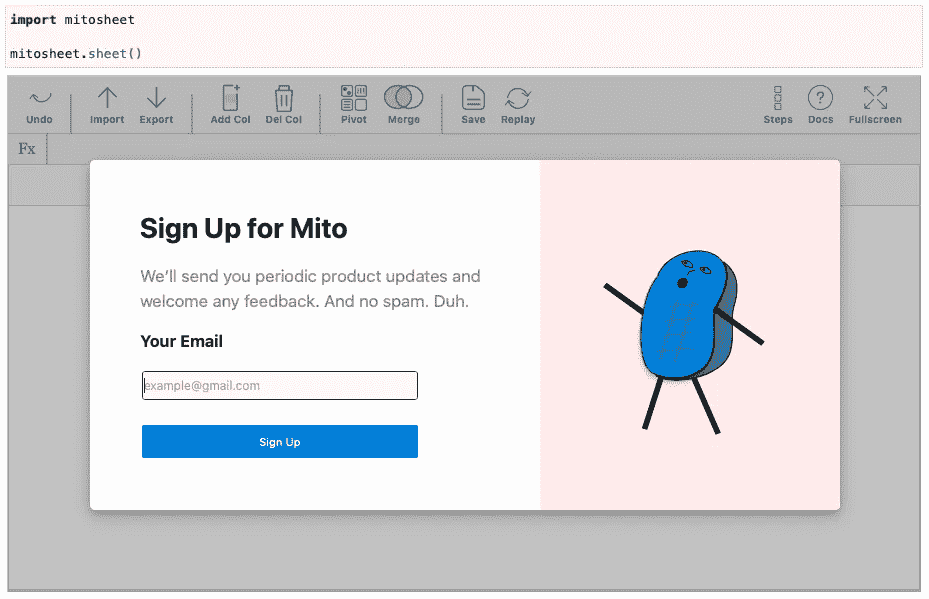

图 1-创建新的米托工作表(图片由作者提供)

您必须输入您的电子邮件地址才能继续。完成后，您将看到一张空白表格:

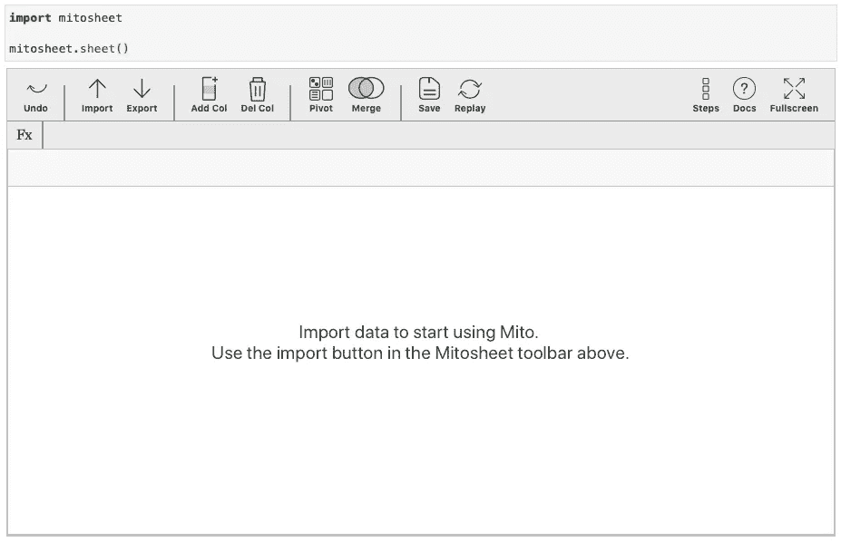

图片 2 —新米托表(图片由作者提供)

您可以点击**导入**按钮加载数据集。在本文中，我们将使用著名的[泰坦尼克号数据集](https://gist.githubusercontent.com/michhar/2dfd2de0d4f8727f873422c5d959fff5/raw/fa71405126017e6a37bea592440b4bee94bf7b9e/titanic.csv)。以下是初始加载后的样子:

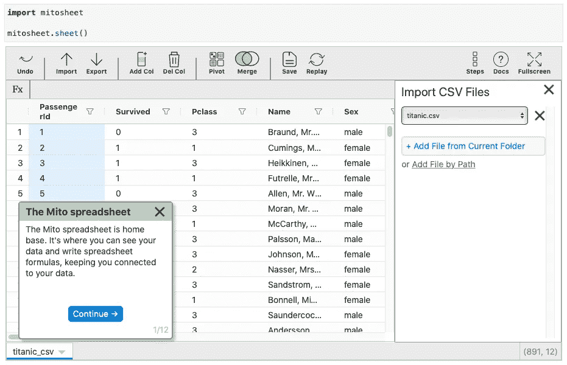

图 3——米托表中的泰坦尼克号数据集(图片由作者提供)

加载一个 CSV 文件就是这么简单！米托自动在下面的单元格中编写熊猫代码。下图显示了它现在的样子:

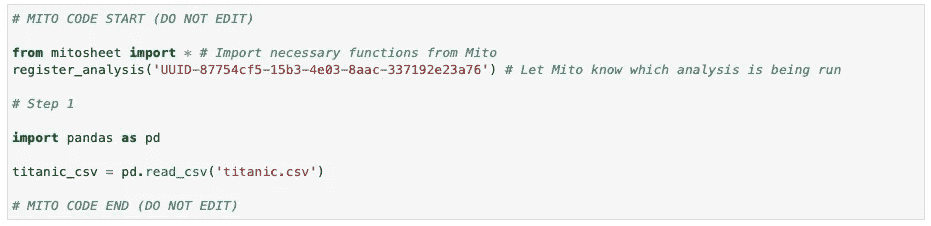

图 4 —为数据集加载生成的 Pandas 代码(图片由作者提供)

接下来让我们看看如何添加和删除列。

# 添加和删除列

数据预处理中最基本的操作之一是添加和删除属性。米托通过顶部菜单中的**添加列**和**删除列**按钮来实现。

让我们从添加列开始。单击 **Add Col** 按钮——这将在下表中添加一个任意名称的列(在我的例子中是 **M** )。要添加数据，您可以单击第一行并输入与 Excel 相同的公式！

下面是一个例子—如果`Sex`属性的值是*男性*，下面的公式将返回 1，否则返回 0:

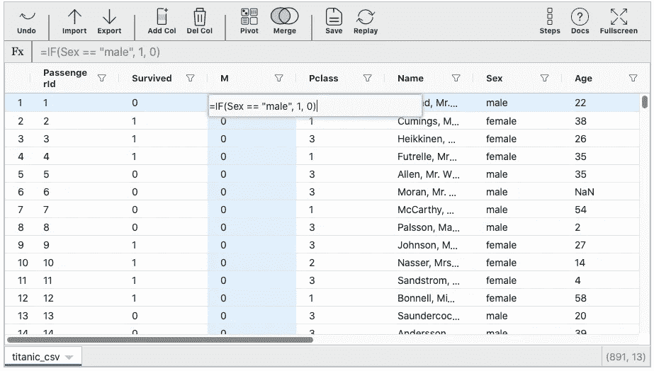

图 5 —使用米托添加列(图片由作者提供)

您可以点击列名，将其更改为更合适的名称，比如`IsMale`。米托生成了下面的熊猫代码:

```
titanic_csv.insert(2, ‘M’, 0)titanic_csv[‘M’] = IF(titanic_csv[‘Sex’] == “male”, 1, 0)titanic_csv.rename(columns={“M”: “IsMale”}, inplace=True)
```

接下来让我们看看如何删除列。只需选择要删除的列，然后单击**删除列**按钮。将会出现一个类似这样的弹出窗口:

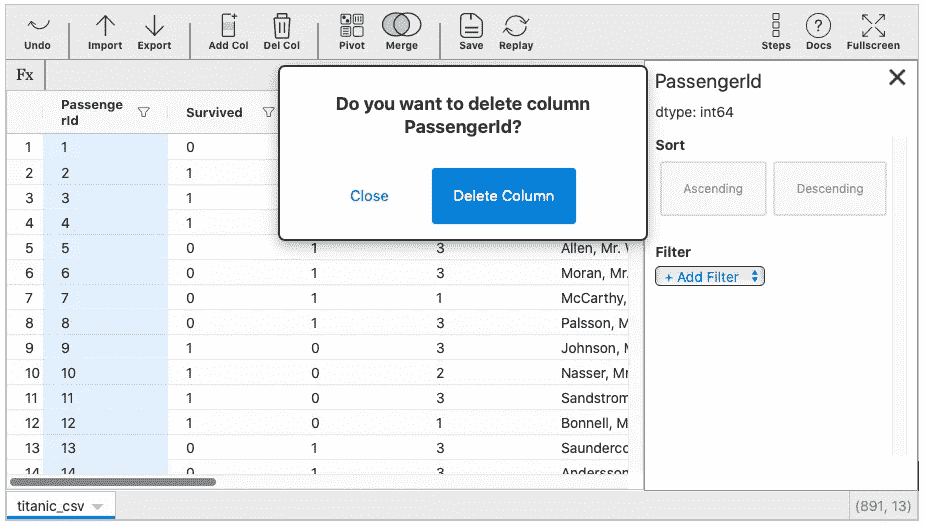

图 6 —删除带有米托的列(作者图片)

在那里，只需确认您想要删除该列。米托将为您生成以下代码:

```
titanic_csv.drop(‘PassengerId’, axis=1, inplace=True)
```

这就是添加和删除列是多么容易。接下来让我们看看如何对数据进行过滤和排序。

# 过滤和排序数据

很难想象没有某种过滤和排序操作的数据分析工作流。好消息是——这些在米托很容易做到。

先说过滤。当您选择一列时，会弹出一个侧菜单:

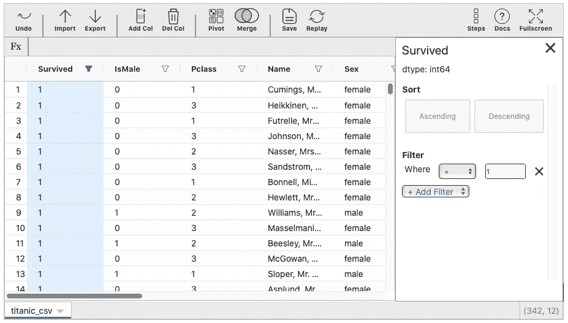

图 7-用米托过滤(图片由作者提供)

在*过滤器*下，选择合适的选项。让我们只包括年龄列没有丢失，并且值在 40 到 42 之间的这些记录。您必须添加一个完整的组来拥有多个过滤条件，如下所示:

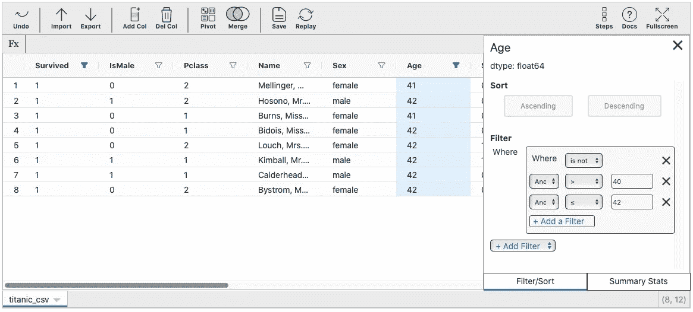

图 8 —米托的多重过滤条件(图片由作者提供)

这是米托在幕后写的代码:

```
titanic_csv = titanic_csv[((titanic_csv.Age.notnull()) & (titanic_csv[‘Age’] > 40) & (titanic_csv[‘Age’] <= 42))]titanic_csv = titanic_csv.reset_index(drop=True)
```

虽然有点乱，但它完成了任务。

接下来是分类。这是一个更容易实现的操作。您需要选择列并选择升序或降序选项。以下是如何根据 *Fare* 列对过滤后的数据集进行降序排序:

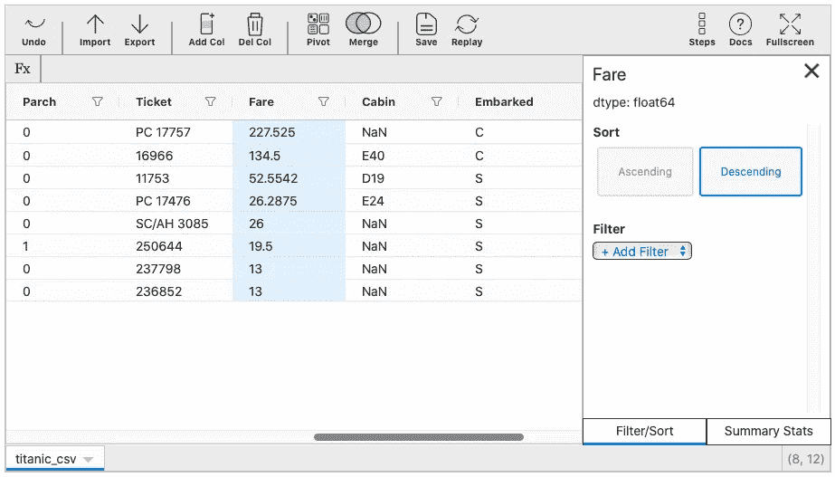

图 9 —用米托排序(图片由作者提供)

下面是生成的排序代码:

```
titanic_csv = titanic_csv.sort_values(by=’Fare’, ascending=False, na_position=’first’)titanic_csv = titanic_csv.reset_index(drop=True)
```

这就是基本的排序和过滤。接下来让我们看看另一个有趣的特性—汇总统计。

# 汇总统计数据

如果在任何数据分析工作负载中有一件事您会做得很多，那就是汇总统计。基本思想是打印一列最有趣的统计值，并可能显示一些数据可视化。

事实证明，米托自动做到了这一点。你所需要做的就是选择一个属性，然后点击右边菜单中的 **Summary Stats** 。让我们对*年龄*栏也这样做:

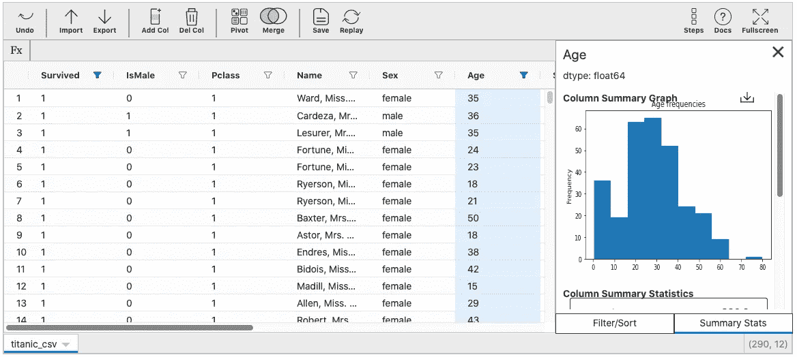

图 10-汇总统计数据-直方图(作者提供的图片)

如您所见，首先显示的是变量的分布，然后是汇总统计数据:

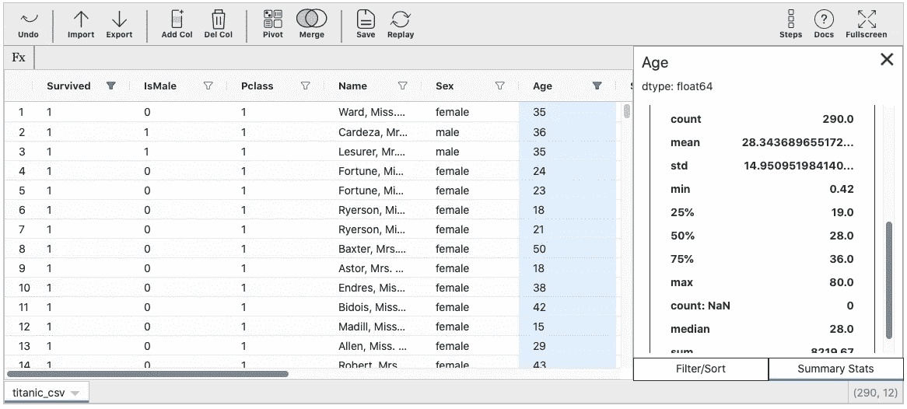

图 11 —汇总统计数据(作者提供的图片)

在今天结束之前，让我们再来看看米托的一个特色。

# 保存和加载分析

用 Excel 术语来说，用米托保存分析就像用 Python 记录宏一样。您可以通过点击顶部菜单中的**保存**按钮来保存任何分析。

它将弹出一个模态窗口，要求您命名分析并确认保存:

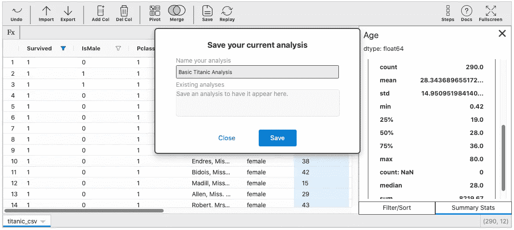

图 12 —使用米托保存分析(图片由作者提供)

要重复分析，点击**重放**按钮。它会要求您选择一个已保存的，如下所示:

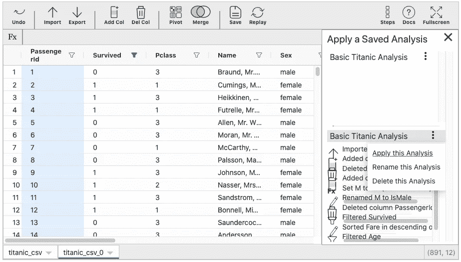

图 13 —用米托回放分析(图片由作者提供)

如果你不想复制粘贴代码的话，重放特性可能对一些来自不同笔记本的重复操作很有用。

# 判决

这就足够了。我们已经讨论了最常见的特性，并在一个小数据集上进行了测试。问题仍然是——你应该使用米托吗？

作为一名数据科学家，我看不出你为什么不应该这样做，尤其是如果你精通 Excel 并想开始使用 Python 和 Pandas。米托可以让过渡过程变得容易得多。

自动代码生成功能对初级和中级 Pandas 用户也有好处，因为它让您知道是否有替代或更简单的方法来使用这个库。

总之——给米托一个机会。这是免费的，你不会有任何损失。我很想在下面的评论区听到你对这个库的看法。

*喜欢这篇文章吗？成为* [*中等会员*](https://medium.com/@radecicdario/membership) *继续无限制学习。如果你使用下面的链接，我会收到你的一部分会员费，不需要你额外付费。*

[](https://medium.com/@radecicdario/membership) [## 通过我的推荐链接加入 Medium-Dario rade ci

### 作为一个媒体会员，你的会员费的一部分会给你阅读的作家，你可以完全接触到每一个故事…

medium.com](https://medium.com/@radecicdario/membership) 

# 有用的链接

1.  米托网站— [https://trymito.io](https://trymito.io)
2.  米托文档—[https://docs . try mito . io](https://docs.trymito.io)

# 了解更多信息

*   [每个数据科学家必读的 3 本编程书籍](/3-programming-books-every-data-scientist-must-read-db1d3a1a284c)
*   [如何让 Python 静态类型化——基本指南](/how-to-make-python-statically-typed-the-essential-guide-e087cf4fa400)
*   [用 Python 进行面向对象编程——你需要知道的一切](/object-orientated-programming-with-python-everything-you-need-to-know-cb0ada963756)
*   [Python 字典:你需要知道的一切](/python-dictionaries-everything-you-need-to-know-9c2159e5ea8a)
*   [介绍 f 字符串 Python 中字符串格式化的最佳选项](/introducing-f-strings-the-best-option-for-string-formatting-in-python-b52975b47b84)

# 保持联系

*   在[媒体](https://medium.com/@radecicdario)上关注我，了解更多类似的故事
*   注册我的[简讯](https://mailchi.mp/46a3d2989d9b/bdssubscribe)
*   在 [LinkedIn](https://www.linkedin.com/in/darioradecic/) 上连接
*   查看我的[网站](https://www.betterdatascience.com/)