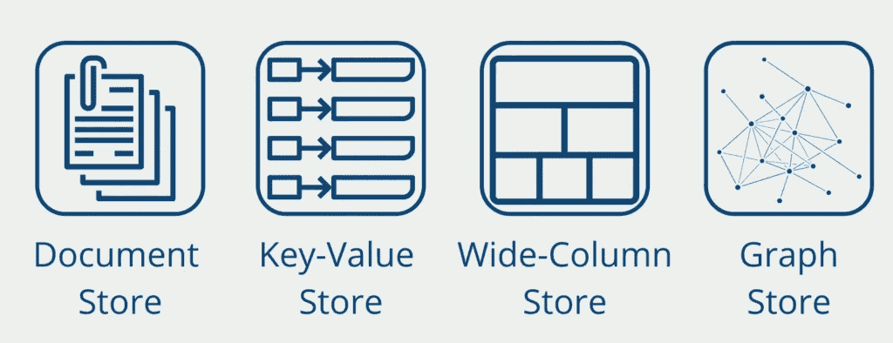

# 使用 MongoDB 介绍 NoSQL 数据库

> 原文：<https://towardsdatascience.com/introducing-nosql-databases-with-mongodb-d46c976da5bf?source=collection_archive---------13----------------------->

## NoSQL 数据库实用指南

简·安东宁·科拉尔在 [Unsplash](https://unsplash.com/s/photos/mongo-db?utm_source=unsplash&utm_medium=referral&utm_content=creditCopyText) 上拍摄的照片

MongoDB 是一个开源的非关系数据库解决方案，被归类为 [NoSQL](https://databasecamp.de/en/data/nosql-databases) 系统，可用于[大](https://databasecamp.de/en/data/big-data-basics) [数据](https://databasecamp.de/en/data/big-data-basics)应用。MongoDB 于 2009 年首次推出，使用所谓的集合和文档，这些集合和文档又包含最终存储数据的各种键值对。

# 什么是 NoSQL 数据库？

[NoSQL](https://databasecamp.de/en/data/nosql-databases) (“不仅仅是 SQL”)的原理最早出现在 2000 年代末，泛指所有不在关系表中存储数据的[数据库](https://databasecamp.de/en/data/database)，其查询语言不是 [SQL](https://databasecamp.de/en/data/sql-definition) 。除了 [MongoDB](https://www.mongodb.com/) 之外，NoSQL 数据库最著名的例子还有 [Apache Cassandra](https://cassandra.apache.org/_/index.html) 、 [Redis](https://redis.io/) 或 [Neo4j](https://neo4j.com/) 。

由于其结构的原因，NoSQL 数据库的可伸缩性远远高于传统的 SQL 解决方案，因为它们还可以分布在不同的系统和计算机上。此外，大多数解决方案都是开源的，支持关系系统无法覆盖的数据库查询。

NoSQL 解决方案分为四类:

NoSQL 数据库分类|作者照片

*   **文档存储**在一个文档中存储各种信息。例如，一个文档可以包含一天的所有数据。
*   键值存储是非常简单的数据结构，其中每条记录都存储为一个具有唯一键的值。该键可用于检索特定信息。
*   **宽列存储**将数据记录存储在列中，而不是通常的行中。它们已经过优化，可以在大型数据集中快速查找数据。
*   **图形数据库**在所谓的节点和边中存储信息。这使得表示社交网络变得非常容易，例如，在社交网络中，人是个体节点，他们之间的关系被表示为边。

# MongoDB 数据库的结构

MongoDB 包含了很多所谓的集合，可以和关系数据库的表相媲美。在一个集合中，可以有几个所谓的文档，它们依次对应于一个表中的记录，以此类推。真正令人兴奋和新奇的事情发生在文档本身。这就是为什么我们要仔细观察它们。

这些文档包含几个存储实际数据的键值对。这些值可以包含不同的数据类型(字符串、整数、浮点等。)同时，一个键在两个不同的文档中可以有两种不同的数据类型。在关系数据库数据模型中，这在两行一列中是不可能的。

在当前的实现中，MongoDB 只允许每个文档有 8MB 的数据大小。减去文件开销的存储空间后，没有太多的存储空间留给数据集。然而，MongoDB 使用基于 JSON 构建的二进制数据格式，这使得它比基于文本的文件格式更加内存友好。顾名思义，BSON，这种数据格式是基于它的起源(“二进制 JSON”)。

# 什么是 MongoDB 文件格式？

BSON 是 JSON 的二进制文件格式，并在某些方面进行了优化。原始文件格式，如 CSV、XML 或 JSON，是所谓的基于文本的格式。他们以纯文本形式存储数据。这使得它们对于我们人类来说很容易理解，但是需要相对较大的存储空间。随着近年来大数据项目变得更加突出，二进制数据格式也变得更加有趣。

这些以二进制符号存储部分甚至全部数据，使它们在存储的时间内对我们人类不可读。这意味着打开和保存这样的文件需要更多的时间，因为首先要处理信息，但是存储空间更小，查询有时更高效。BSON 文件将密钥存储为二进制值。然而，值仍然作为文本保存，而元数据以二进制存储，因此可以比文本键更快地读取。下面是一个简单的 JSON 字典和相应的 BSON 文件的例子:

正如我们所看到的，BSON 文件向原始格式添加了一些额外的元数据，比如数据类型。对于小文件来说，这可能看起来更加复杂，但是对于非常大的文件来说，通过降低读取速度，这证明了它的价值。

# MongoDB 属于哪个 NoSQL 类别？

MongoDB 属于所谓的文档存储，它是 NoSQL 数据库的一个子类型。它们是非关系的，因为数据不是存储在行和列中，而是存储在文档中。与传统的关系数据库相比，文档存储是 NoSQL 中最流行的子类。该应用程序的优点包括:

*   易于开发人员的适用性也是由于可理解的数据模型。
*   灵活的数据模式，即使在最初创建数据库之后也可以很容易地更改。
*   随着数据量或访问的增加，数据库的水平可伸缩性。

# MongoDB 有什么优势？

与其他 NoSQL 解决方案一样，MongoDB 为大型数据集提供了许多优于传统关系数据库的优势:

*   **负载平衡**:这些数据库可以分布在不同的虚拟机上，因此即使有大量的并发查询或大量数据，它们仍然保持相对较高的性能。另一方面，关系数据库由于其基本属性(ACID)而不能分布在多台机器上。因此，如果一台机器必须处理许多查询，它就必须变得更强大。在大多数情况下，这比将负载分散到一个系统上更昂贵、更复杂。
*   **灵活的数据格式**:正如我们已经强调的，MongoDB 可以存储比关系数据库灵活得多的数据模式。理论上，每个键都可以有自己的数据格式。
*   **多种编程语言支持** : MongoDB 现在已经开发出来，支持多种编程语言，比如 Python、PHP、Ruby、Node.js、C++、Scala、JavaScript 等等。这使得为各种各样的应用程序项目集成数据库变得容易，并且使用他们的编程语言，而不必切换到另一种语言。

# MongoDB 如何存储数据？

MongoDB 数据库实际上可以用于几乎所有可以用 JSON 格式存储数据的应用程序领域。这些可以相对容易地“翻译”成 BSON 格式并存储在 MongoDB 中。BSON 文件的结构不指定任何数据结构，并且可以存储灵活的模式。

如果我们想类比关系数据库，那么单个文档就是关系数据库中的行，即记录。BSON 文件中的字段包含某种数据类型的数据，因此最适合与表中的列进行比较。最后，具有相似信息内容和结构的文档存储在所谓的集合中，集合可以被认为是关系数据库中的表。

这方面的一个经典例子是网站上的用户移动数据。每个用户的旅程都是不同的，因此不提供固定的数据模式。例如，电子商务网站上的用户下订单并登录系统。另一方面，下一个用户会在公司的招聘栏中找到最新的工作机会。在 JSON 文件中，这可以通过键相对容易地映射，因此也存储在 MongoDB 中。在关系数据库中，相同的用例不容易映射。

其他可以想象的应用领域包括来自应用程序的后端数据，网站的内容管理系统，甚至是公司完整的数据仓库。

# MongoDB 适合大数据应用吗？

如今，当试图描述这样一种现象时，每个人都在谈论大数据这个词，即公司和公共组织拥有越来越多的数据，这尤其将传统数据库推向了极限。

MongoDB 绝对是实现大数据应用的可能系统。在这种情况下，它首先给人的印象是前面提到的水平可伸缩性和灵活的数据模式。此外，它有一个存储引擎，可以非常有效地处理内存，例如压缩文档。

然而，主要的优点是 MongoDB 支持动态查询。简而言之，这意味着在查询开始之前不会创建数据查询语句。这提供了编写对当前情况做出反应的灵活程序的优势。假设您经营一家在线商店，一位客户正准备登录。只有在客户输入他的凭证并按下登录按钮后，程序才能决定在哪个文档中搜索关于客户的信息。

因此，当数据仍然需要在存储和查询之间进行更改(例如，聚合)时，MongoDB 特别适合大数据领域。

# 这是你应该带走的东西

*   MongoDB 是 NoSQL 数据库的一个应用。
*   它存储所谓的集合，集合又包含以实际数据作为键值对的文档。
*   MongoDB 特别适合需要高可伸缩性、具有灵活的数据模式和存储大量数据的应用程序。

*如果你喜欢我的作品，请在这里订阅*<https://medium.com/subscribe/@niklas_lang>**或者查看我的网站* [*数据大本营*](http://www.databasecamp.de/en/homepage) *！还有，medium 允许你每月免费阅读* ***3 篇*** *。如果你希望有****无限制的*** *访问我的文章和数以千计的精彩文章，不要犹豫，点击我的推荐链接:*[【https://medium.com/@niklas_lang/membership】](https://medium.com/@niklas_lang/membership)每月花$***5****获得会员资格**

*</understanding-mapreduce-with-the-help-of-harry-potter-5b0ae89cc88>  <https://medium.com/@niklas_lang/understanding-the-backpropagation-algorithm-7a2e3cb4a69c>  </learn-coding-13-free-sites-to-help-you-do-it-9b2c1b92e573>  </beginners-guide-extract-transform-load-etl-49104a8f9294> *