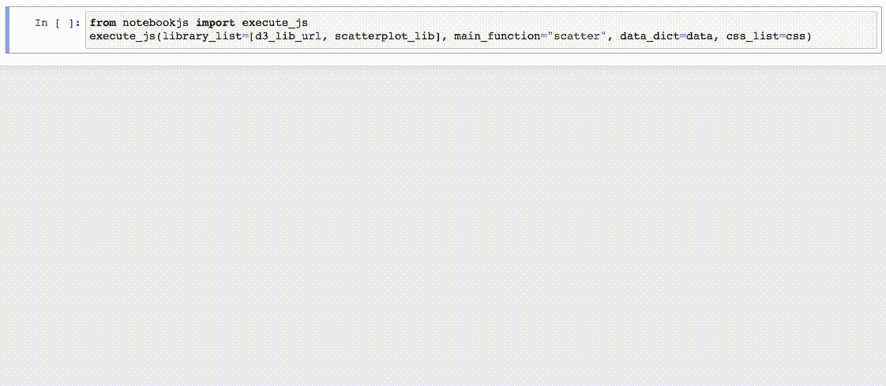
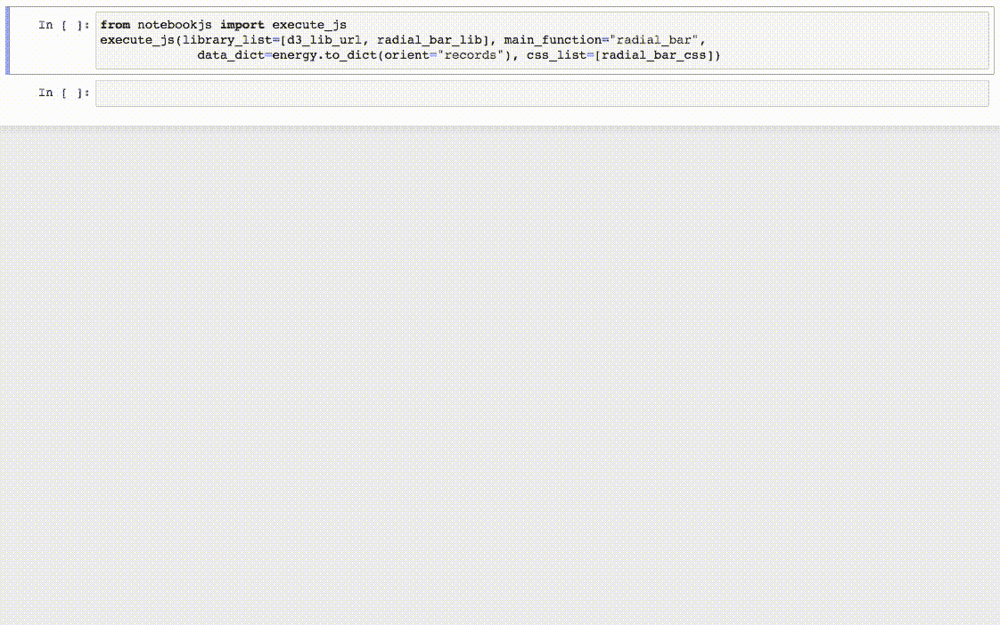

# 介绍 notebookJS:计算笔记本中 Python 和 JavaScript 的无缝集成

> 原文：<https://towardsdatascience.com/introducing-notebookjs-seamless-integration-between-python-and-javascript-in-computational-e654ec3fbd18?source=collection_archive---------2----------------------->


在 [Unsplash](https://unsplash.com/s/photos/data-visualization?utm_source=unsplash&utm_medium=referral&utm_content=creditCopyText) 上由 [Carlos Muza](https://unsplash.com/@kmuza?utm_source=unsplash&utm_medium=referral&utm_content=creditCopyText) 拍摄的照片

你是否见过数据可视化，并认为在 Jupyter 笔记本中使用它会很棒？我知道我做过很多次。笔记本是试验数据可视化的最佳场所，因为它们可以在同一个地方包含所有的数据争论、预处理、图片和文档。然而，将 JavaScript 添加到 Python 笔记本中需要大量样板代码，这会变得繁琐和重复。更糟糕的是，不同的笔记本环境有不兼容的 API 用于 Python 和 JavaScript 之间的消息传递。例如，如果开发人员希望他们的库同时在 Jupyter 和 Colab 中运行，他们将不得不使用两种通信格式。


为了解决这些问题，我们创建了 [*notebookJS*](https://github.com/jorgehpo/notebookJS) ，这是一个 Python 库，可以用一行代码集成 Python 和 JavaScript **。**



在 Jupyter 笔记本中重用 D3 散点图代码。代码改编自[https://www . D3-graph-gallery . com/graph/scatter _ animation _ start . html](https://www.d3-graph-gallery.com/graph/scatter_animation_start.html)

# 背景

在您最喜欢的 web 堆栈(D3 和 React for me ❤)中编写可视化内容为开发人员提供了很大的灵活性。然而，在不同的数据集上测试代码可能会成为一个挑战。根据我的经验，我必须 1)硬编码数据集，或者 2)编写一个定制的服务器来管理数据。当试验数据集、预处理步骤或图表类型时，这些选项都不是很好。

在 Python 笔记本中进行实验很容易，因为所有的数据操作都可以内联完成，笔记本会自动跟踪计算步骤。在大多数情况下，像 Matplotlib 和 Altair 这样的 Python 库可以很容易地用来创建图表。然而，有时我们需要的可视化不能用现成的工具生成。例如，当我想探索 Auto-Sklearn 产生的 ML 管道时，我必须从头开始编写可视化。在笔记本中集成自定义可视化可能很麻烦，因为需要大量的样板代码来 1)在笔记本中运行可视化，2)在 Python 和 JavaScript 之间发送数据(详见[本文](https://ieeexplore.ieee.org/iel7/5992/9387473/09391750.pdf?casa_token=MUNl1uso0R8AAAAA:YnF1ekYRLVpRkeg7OSetZItt-H8yx4ABuwgUS0dPHk8rLv5H-EAp2rFOxqOXHpC2G2cDsx_gjBU) [1】)。

因为我们发现笔记本中的可视化非常有用，所以我们决定为它创建一个库。特别是，*笔记本 JS* :

*   负责笔记本中所有 vis 的样板代码；
*   从网上自动加载 JS 库
*   支持代码分割成多个 JS 和 CSS 文件。

它是这样工作的:

# 笔记本

首先你要安装[库](https://github.com/jorgehpo/notebookJS):

```
pip install notebookjs
```

notebookJS 的 API 非常简单。实际上，一个函数负责所有的事情: *execute_js* 方法执行一个 JavaScript 函数，并使用回调为 Python 和 JavaScript 之间的双向通信建立基础设施。

这些是参数:

*   *library_list* :字符串列表。字符串列表包含 1)JavaScript 库的 URL，2) JavaScript 代码，3) JavaScript [包](https://github.com/jorgehpo/notebookJS/tree/main/Examples/5_Webpack_BaseballAnnotator_Bidirectional)
*   *main_function* : str。要调用的主函数的名称。该函数将使用两个参数调用:< div_id >，例如“#my_div”和< data_dict >。
*   *数据 _ 字典*:字典。包含要传递给< main_function >的数据的字典
*   试镜 : dict。{<callback _ str _ id>:<python _ function>}形式的字典。JavaScript 库可以使用回调与 python 对话。
*   *css_list* :字符串列表。包含 1)CSS 样式表的 URL 或 2) CSS 样式的字符串列表

*main_function* 是调用 execute_js 时运行的 JavaScript 函数。它有以下签名:

```
function main_function(div_id, data_dict)
```

举个简单的例子，我们可以使用 D3 向输出单元格添加一个圆:


# 加载本地库

正如我们所见，在 Python 笔记本中运行一个 JavaScript 函数只需要一行代码(不包括 JS 库定义)。我们注意到 JS 代码可以存储在一个单独的文件中，并从 Python 加载。数据也可以用 Python 加载，并使用字典结构传递给 JavaScript(内部转换为 JSON)。
例如，如果我们想要重用这个[径向条形图](https://bl.ocks.org/AntonOrlov/6b42d8676943cc933f48a43a7c7e5b6c)，我们只需在 JS 文件中更改数据加载代码，然后使用 *notebookJS* :



# Python 回调

我最喜欢的一个特性是设置 Python 回调的能力。在从事数据科学项目时，有些步骤在 JavaScript 中更容易完成(如前端和用户交互)，有些步骤在 Python 中更好(数字处理、机器学习等)。有了 *notebookJS* ，我们可以两全其美。

让我们来看一个非常简单的例子:我们想制作一个动画，其中我们用一堆语言编写 Hello World。短语存储在 Python 中，Javascript 处理前端代码:

Javascript 绘图函数使用标识符“get_hello”每 1 秒向 Python 请求“Hello World”:

Python 等待 *get_hello* 并做出相应的响应:

回调函数使用回调参数“连接”到可视化:


# 限制

*notebookJS* 目前不支持 Javascript ES6 模块。这就是我们在例子中使用 D3 V3 的原因。

如果你需要 ES6，我们建议使用一个构建工具，比如 Webpack + Babel，把你的 JS 代码编译成一个文件，把 ES6 转换成老的 JS。随着项目的增长，这是管理多个库和创建优化代码的最简单的方法。有关代码捆绑的示例，请参见本页上的[web pack 库设置。](https://github.com/jorgehpo/notebookJS/tree/main/Examples/5_Webpack_BaseballAnnotator_Bidirectional)

# 最后的想法

notebookJS 是一个新工具，我们正在积极寻求关于我们应该支持哪些功能的反馈。如果您有任何问题或想要合作，请告诉我们！

我们的知识库中有更多的例子。如需现场演示，请查看我们的 [Colab 笔记本](https://colab.research.google.com/drive/1g8WOn9oZ5G_3-Y8DYmpV1MIj59dnd81u?usp=sharing)。

# 参考

[1] Jorge Piazentin Ono、Juliana Freire 和 Claudio T. Silva。"[Jupyter 笔记本中的交互式数据可视化](https://ieeexplore.ieee.org/iel7/5992/9387473/09391750.pdf?casa_token=MUNl1uso0R8AAAAA:YnF1ekYRLVpRkeg7OSetZItt-H8yx4ABuwgUS0dPHk8rLv5H-EAp2rFOxqOXHpC2G2cDsx_gjBU)。"*科学计算&工程*23.2(2021):99–106。