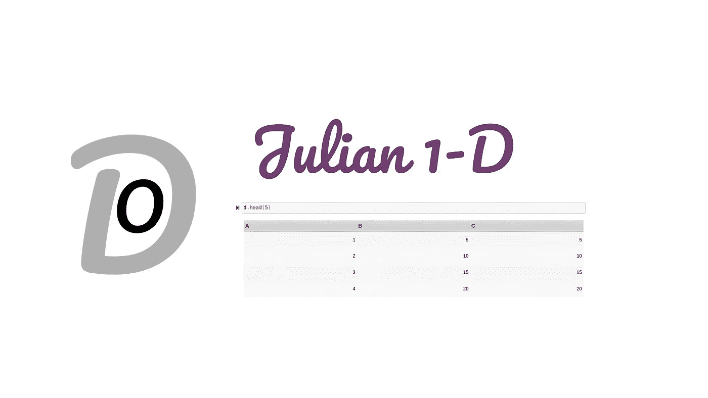
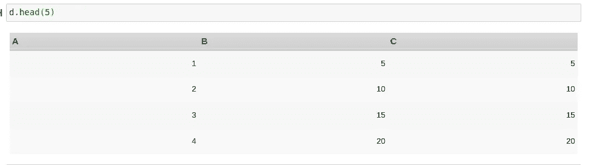
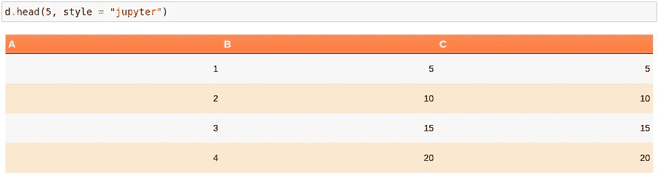
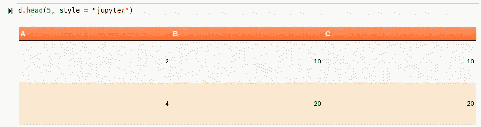

# 介绍奇数帧:一维数据

> 原文：<https://towardsdatascience.com/introducing-oddframes-jl-data-in-one-dimension-296e1389c27a?source=collection_archive---------39----------------------->

## 我厌倦了 DataFrames 的工作方式，所以我自己做了一个。



(图片由作者提供)

# 介绍

在我的数据科学经历中，有一点我一直在重复，那就是一维数据在科学计算中的实际价值。在许多情况下，采用一维方法处理数据的好处是，许多机器学习任务涉及塑造一维数据，而许多工具不喜欢采用多维数据。

也就是说，我发现维度是非常灵活的东西。取一个一维数组，在它下面放另一个一维数组，我们立刻得到(2，x)的维数。我在这里的观点是，尽管一维数组听起来更加困难，但它们同样灵活，因为它们是多维数学的构建模块。

此外，特征结构通常只是一维的。大多数时候，我发现自己在处理预测模型，这些模型需要一维输入，我认为这可能非常简单。

DataFrames.jl 无疑是处理数据的一个很好的包，但是由于这些经常遇到的一维问题，对于那些只想处理一维数据的人来说可能有点多。我喜欢将 DataFrames 看作是美化了的 JSON 数据，而 DataFrames.jl 包通过将 DataFrames 中的数据矩阵化和基于轴化，已经将 data frames . JL 包的形状和矩阵提升到了一个全新的水平。这是处理数据的一个很好的方法，因为如果需要的话，我们可以获得一维方法的优势和多维方法的灵活性。

然而，DataFrames.jl 对于这门语言的新手来说可能也不是一个容易上手的包。DataFrames.jl 是非常根深蒂固的，并集成到 Julian 生态系统和方法论中，通常遵循当今 Julia 包的许多典型语法和方法论。虽然像条件屏蔽和序列类型这样的好东西可能会丢失，但 DataFrames 通过使用在整个 Julia 中扩展的相同的内置方法来弥补它。如果你想了解更多关于如何使用 DataFrames.jl 的知识，我有一整篇文章，你可以在这里找到:

</how-to-manipulate-data-with-dataframes-jl-179d236f8601>  

然而，我对这种方法的问题是，我认为它通常需要生态系统的开发，而不是单个软件包的开发。要明确的是，这并不奇怪或什么；这是一种常见的做法。然而，正因为如此，我们现在缺少了许多在 Julia 生态系统中有待进一步开发的特性。换句话说，在很多情况下，包都在等待实现新特性，直到其他包分支完成！

如果你想查看 OddFrames 库并了解更多，你可以在这里查看:

<https://github.com/ChifiSource/OddFrames.jl>  

如果你想看一个有输出和索引的酷笔记本，你可以看看这里:

<https://github.com/emmettgb/Emmetts-DS-NoteBooks/blob/master/Julia/OddFrames%20Output.ipynb>  

# 奇数帧类型

在我创建一个处理一维数据的伟大包的过程中，我希望它混合了许多概念，而且真正展示了 Dictionary 数据类型的威力。使用像字典这样的基本数据类型有很多不同的优点。一个很棒的事情是，类型的分派通常可以非常简单，只需将迭代器连接到字典子元素。

我认为这是处理这种带标签数据的一种非常酷的方式，因为它并没有脱离语言的核心，而是围绕语言的核心创建了一个包装器，以便更有效地处理数据。我将首先展示 OddFrame 类型的构造函数，它也包含一个内置的用于查看 OddFrame 的 _head()方法。这是从 Pandas 方法开始的地方，因为我还计划实现 tail()以便有效地查看数据。我们将从看构造函数开始，然后看一下 _head()，因为我想更多地谈论它。

```
mutable struct OddFrame{head} <: AbstractOddFrame
    lookup::Dict
    head::head
    function OddFrame(lookup::Dict)
        head(count; style = "classic") = _head(lookup, count, style = style)
        new{typeof(head)}(lookup, head)
    end
```

这基本上是一个在创建基本 OddFrame 类型之前允许传递字典的调用。这也将接收 head()方法，如下所示:

```
function _head(lookup::Dict, count::Int64 = 5; style::String = "classic")
    thead = "<thead>
<tr>"
    tbody = "<tbody>"
    [thead = string(thead, "<th>", string(name), "</th>") for name in keys(lookup)]
    thead = string(thead, "</thead>")
    cols = values(lookup)
    features = [push!(val) for val in cols]
    for i in 1:length(features[1])
        obs = [row[i] for row in features]
        tbody = string(tbody, "<tr>")
        [tbody = string(tbody, "<td>", observ, "</td>") for observ in obs]
        tbody = string(tbody, "</tr>")
    end
    tbody = string(tbody, "</tbody>")
    compisition = string(_css,"<table class = \"", style, "\">",
     thead, tbody,"</table>")
    display("text/html", compisition)
end
```

这基本上是一种算法，将这些值放入 HTML 表中。表格也有 CSS 样式，我认为看起来不错。在一个新的 OddFrame 上调用 head 输出，我们可以看到这是什么样子:

```
d = OddFrame(Dict(:A => [1, 2, 3, 4], :B => [5, 10, 15, 20], :C => [5, 10, 15, 20]))
d.head(5)
```



(图片由作者提供)

这种类型的课程附带了一些基本的方法和迭代器。现在可用的函数方法是 drop()，以及两个迭代器 eachcol()和 eachrow()，这两个方法都来自 DataFrames.jl。

# 索引

OddFrames.jl 包最初开发的很大一部分是索引。我发现 DataFrames.jl 中有一点特别烦人，那就是索引。此外，Python 的 Pandas 缺少一些我非常想念的方法，即条件屏蔽，这使得过滤比我习惯的方法有所下降。如您所料，您可以索引 OddFrame 的符号来调用查找字典中的键:

```
df[:B]
```

这个调用是这样分派的:

```
getindex(od::OddFrame, col::Symbol) = od.lookup[col]
```

与 DataFrames.jl 不同，这里还有字符串的语法，以避免必须做符号(“带空格的字符串”)的事情，我认为这很棒:

```
getindex(od::OddFrame, col::String) = od.lookup[Symbol(col)]
```

如前所述，我经常从 Pandas.py 模块中错过的东西是使用遮罩进行索引的能力。我觉得这太棒了，我第一次使用它时，它的力量让我惊叹不已。我最后用这个在奇数帧中复制了那个语法:

```
function getindex(od::OddFrame, mask::BitArray)
    [if mask[i] == 0 drop(od, i) end for i in 1:length(mask)]
end
```

这将需要一个 BitArray，它是跨向量或一维数组的条件运算符的返回。所以现在我们可以这样做一个数据帧:

```
d = OddFrame(Dict(:A => [1, 2, 3, 4], :B => [5, 10, 15, 20], :C => [5, 10, 15, 20]))
```



(图片由作者提供)

并使用任何基于元素的布尔运算符，例如。>:

```
d[d[:A] .> 2]
```

然后有这样的回报:



(图片由作者提供)

> 很酷，对吧？

我谈了很多为什么我喜欢这个，因为不久前我在一个熊猫倒计时中做了一个熊猫专题。你可以在这里查看:

</20-great-pandas-tricks-for-data-science-3a6daed71da0>  

# 结论

jl 当然是一个很酷的概念，我对此非常兴奋！我认为它肯定会对美丽的 JuliaData 生态系统做出贡献，我认为像我这样的用户可能会发现这个包有用而且有趣。也就是说，我确实想在 OddFrames 包中实现许多新的东西，比如更好的显示、更多的调度、更多的功能，以及对已经提供的内容进行更多的简化。