# 介绍 open HAC——用于数字生物标记分析和机器学习的开源工具包

> 原文：<https://towardsdatascience.com/introducing-openhac-an-open-source-toolkit-for-digital-biomarker-analysis-and-machine-learning-6e107c4524ad?source=collection_archive---------25----------------------->

## 用于人体活动分类研究和模型创建的新视频分析平台。

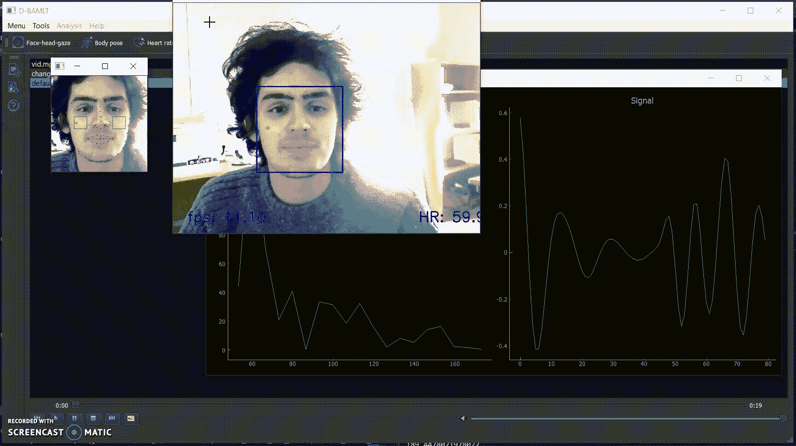

开放人类活动分类( [OpenHAC](https://chags1313.github.io/OpenHAC/) )是一个开源用户界面，用于数字生物标记提取、分析和探索，并带有构建、评估和部署机器学习分类器的工具。它建立在现有的软件包上，用于量化行为特征和组装机器学习框架。我这个项目的目标是:1)让所有研究人员、开发人员、学者和公民科学家都可以进行数字生物标记研究，以推进健康的数字测量，并创建人类活动表型分析的新工具；2)创建一个个人社区，致力于为人类健康构建具有临床和学术意义的技术解决方案。

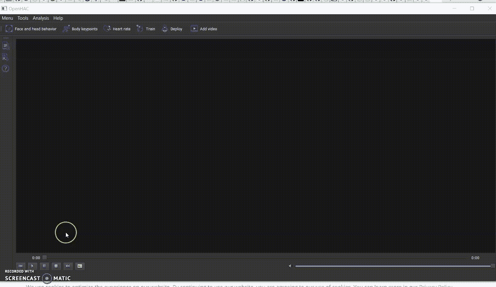

# 数字生物标记提取

OpenHAC 中可用的数字生物标记功能目前包括面部活动、眼球运动、运动模式、身体关键点和心率。

**脸-头-凝视**

面部、头部和凝视数据依赖于 OpenFace 进行测量，这些数据被前馈到 OpenDBM，以获得临床和学术相关的行为特征。

open face:【https://github.com/TadasBaltrusaitis/OpenFace 

open DBM:[https://github.com/AiCure/open_dbm](https://github.com/AiCure/open_dbm)

*数据收集*

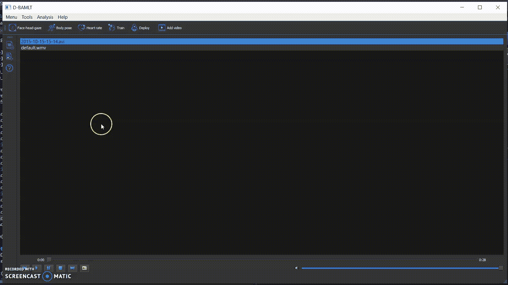

*输出*

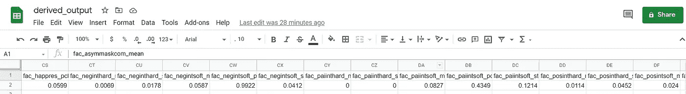

**身体姿势**

身体部位包括头部、手臂和腿部的定位，总共 15 个部位。OpenHAC 依赖于 OpenCV 的图像处理和 OpenPose 库中使用的预训练模型。

https://opencv.org/

打开姿势:[https://github.com/CMU-Perceptual-Computing-Lab/openpose](https://github.com/CMU-Perceptual-Computing-Lab/openpose)

*数据收集:*

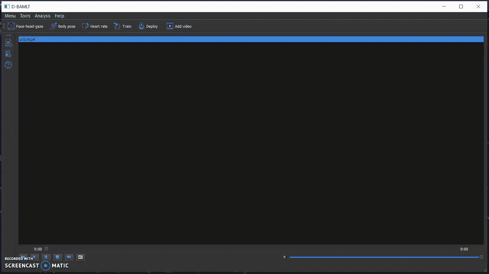

*输出*

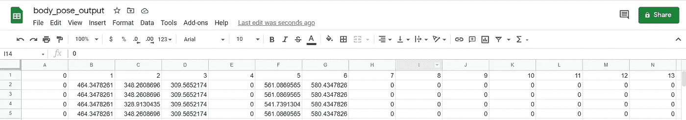

**心率**

OpenHAC 的心率测量基于 [habom2310](http://github.com/habom2310) 的工作成果。使用心率功能将提取每分钟的心跳数和每帧的准确度。

使用摄像头测量心率:[https://github . com/habom 2310/使用摄像头测量心率](https://github.com/habom2310/Heart-rate-measurement-using-camera)

*数据收集*

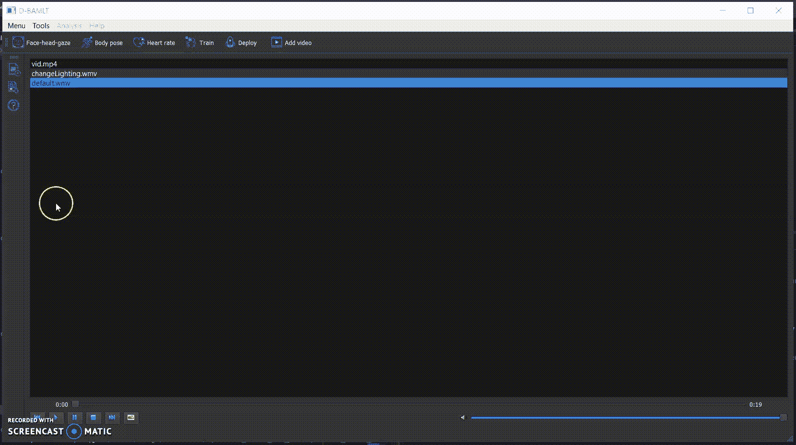

*输出*

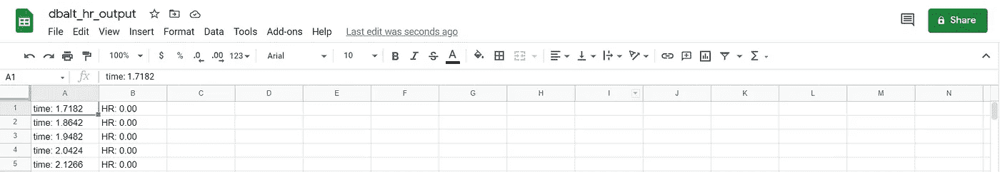

# 人类活动分类

通过 OpenHAC，还可以使用其机器学习分类工具来创建、分析和提取新的数字生物标记特征。将行为特征与手动分类相结合，用户可以为诸如疼痛、困倦、活动水平和非典型运动等行为表现创建有效的分类器。

OpenHAC 使用由 Scicit-Learn 支持的 PyCaret 库来比较、创建、保存、加载和部署机器学习模型。使用 OpenHAC 的图形用户界面，创建人类活动分类器的过程简单明了。

**设置数据并比较多个模型**

OpenHAC 使用 PyCaret 的函数来初始化创建管道的训练环境。然后，它可以使用交叉验证来训练和评估 PyCaret 库中所有估计器的性能。

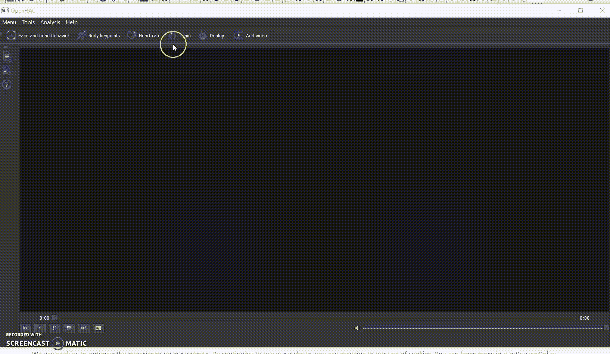

**选择分类器并评估性能**

OpenHAC 可以训练和评估 PyCaret 库中的任何模型。图用于分析和解释基于维持数据的模型。

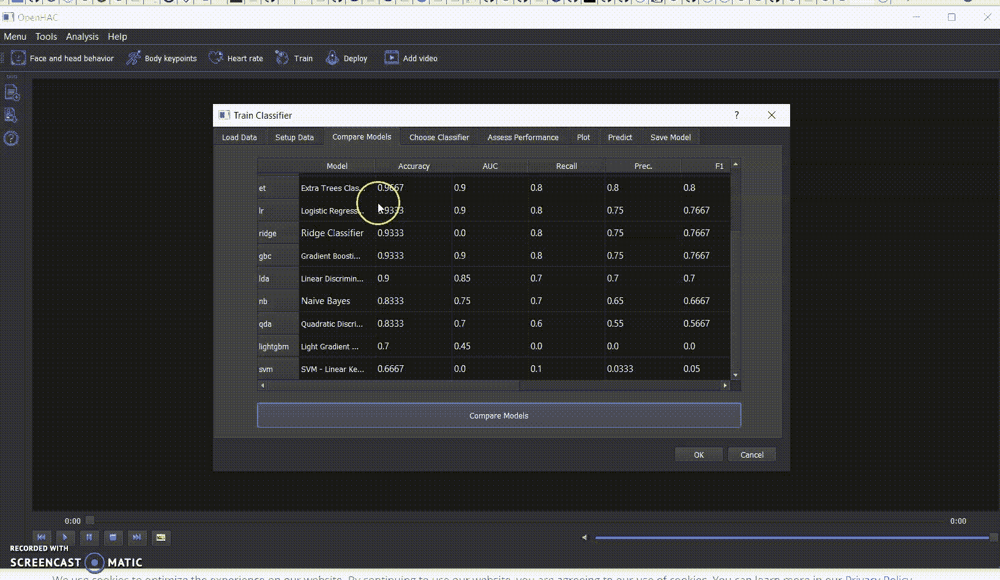

**预测并保存**

OpenHAC 在整个数据集上训练模型，然后分配预测标签和分数(预测类的概率)。我们的转换管道和经过训练的模型对象被保存为 pickle 文件供以后使用。

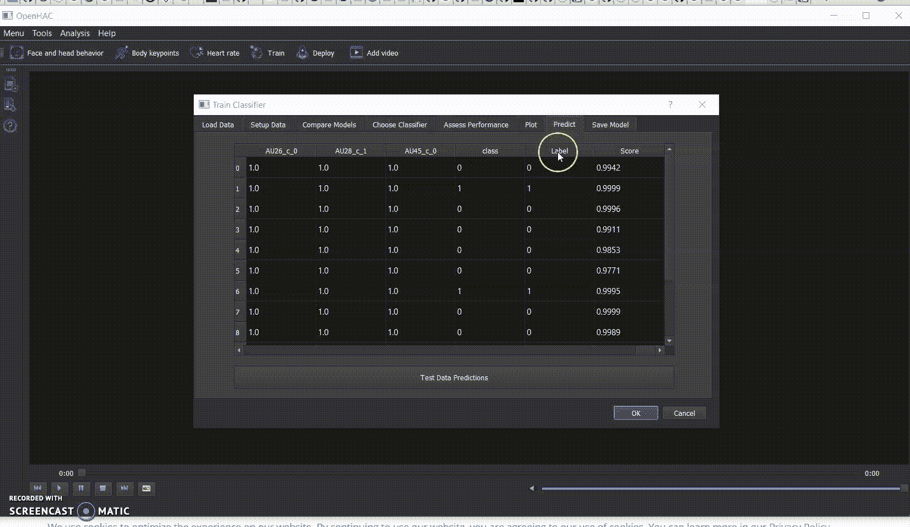

对于对人类活动分类感兴趣的人来说，OpenHAC 可以是一个很好的工具。它仍在发展中，因此可以从那些愿意帮助它成长的人那里获益。如果你有兴趣参与 OpenHAC 项目，请通过[hagencolej@gmail.com](http://hagencolej@gmail.com)联系我。谢谢大家的支持！！

OpenHAC 的代码可以在 GitHub 上找到:[https://github.com/chags1313/OpenHAC](https://github.com/chags1313/OpenHAC)

OpenHAC 的 wiki 可以帮你入门:[https://github.com/chags1313/OpenHAC/wiki](https://github.com/chags1313/OpenHAC/wiki)