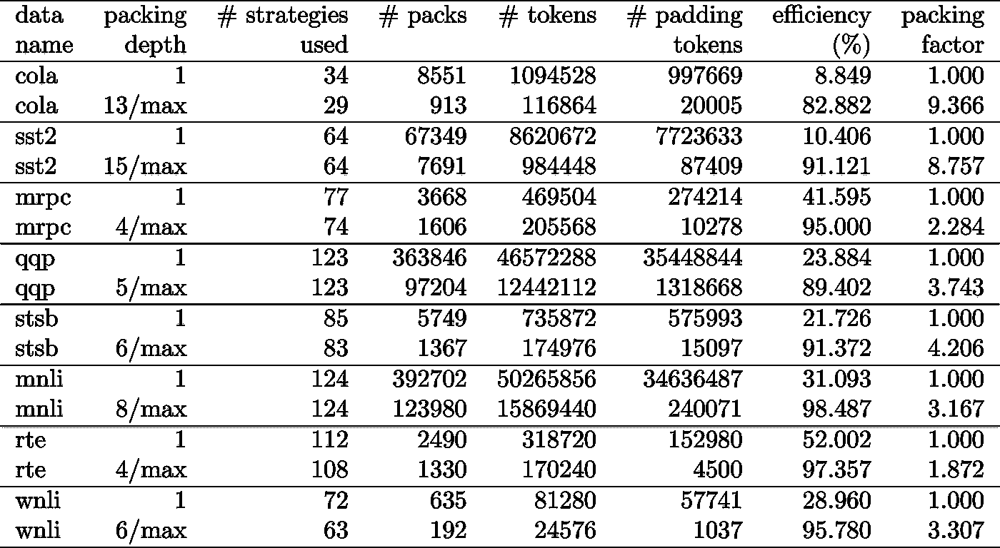

# 引入压缩 BERT，将自然语言处理的训练速度提高 2 倍

> 原文：<https://towardsdatascience.com/introducing-packed-bert-for-2x-faster-training-in-natural-language-processing-eadb749962b1?source=collection_archive---------11----------------------->

## [思想和理论](https://towardsdatascience.com/tagged/thoughts-and-theory)

## *用于更高效训练的新 BERT 打包算法*

作者:[马里奥·迈克尔·克雷尔博士](https://medium.com/@dr.mario/about)和[马特伊·科塞克](https://medium.com/@matej.kosec/about)

图片作者。

通过使用一种新的打包算法，我们在训练 BERT-Large 时将自然语言处理的速度提高了 2 倍以上。我们的新打包技术消除了填充，从而显著提高了计算效率。

我们怀疑这也可以应用于基因组学和蛋白质折叠模型以及其他具有偏斜长度分布的模型，从而在不同的行业和应用中产生更广泛的影响。

我们在一篇新论文[1]中介绍了 Graphcore 的高效非负最小二乘直方图打包算法(或 NNLSHP)以及我们应用于打包序列的 BERT 算法。

# 由于序列填充造成的 NLP 中的计算浪费

在我们最近向 ml perf 提交的[基准测试中，我们开始研究优化 BERT 训练的新方法。我们的目标是开发实用的优化方法，以便在实际应用中轻松采用。BERT 作为这些优化的重点模型之一是一个自然的选择，因为它广泛应用于工业和我们的许多客户。](https://www.graphcore.ai/posts/raising-the-bar-graphcores-first-mlperf-results)

我们惊讶地发现，在我们自己的使用维基百科数据集的 BERT-Large 训练应用程序中，数据集中 50%的标记是填充的——这导致了大量的计算浪费。

填充序列以使它们长度相等是 GPU 常用的方法，但我们认为值得尝试一种不同的方法。

序列的长度变化很大，原因有两个:

1.  维基百科的基础数据显示了文档长度的巨大差异
2.  BERT 预处理本身随机减小被组合以生成训练序列的提取文档的大小

将长度填充到最大长度 512 会导致所有标记的 50%是填充标记。用实际数据替换 50%的填充数据可以在相同的计算量下多处理 50%的数据，从而在最佳条件下实现 2 倍的速度提升。

图 1:维基百科数据集分布。图片作者。

这是维基百科特有的吗？号码

好吧，那它是特定于语言的吗？号码

事实上，偏斜的长度分布无处不在:在语言、基因组学和蛋白质折叠中。图 2 和图 3 显示了 SQuAD 1.1 数据集和 GLUE 数据集的分布。

图 2:最大序列长度为 384 的 SQuAD 1.1 BERT 预训练数据集序列长度直方图。图片作者。

图 3:最大序列长度为 128 的粘合数据集序列长度直方图。图片作者。

我们如何在避免计算浪费的同时处理不同的长度？

当前的方法需要针对不同长度的不同计算内核，或者工程师需要通过编程移除填充，然后针对每个注意块和损失计算重复地添加回填充。通过放大代码并使其更复杂来节省计算并不吸引人，所以我们寻找更好的东西。难道我们不能把多个序列放在一个最大长度的包里一起处理吗？事实证明，我们可以！

这种方法需要三个关键因素:

1.  一种有效的算法来决定将哪些样本放在一起以具有尽可能少的剩余填充
2.  调整 BERT 模型以处理包装而不是序列
3.  以及调整超参数

# 包装

起初，你似乎不太可能非常有效地打包像维基百科这样的大型数据集。这个问题通常被称为装箱问题。即使打包限制为三个或更少的序列，产生的问题仍然是强 NP 完全的，缺乏有效的算法解决方案。现有的启发式打包算法没有前途，因为它们的复杂性至少为 *O* ( *n log* ( *n* ))，其中 *n* 是序列的数量(维基百科的大约 16M)。我们感兴趣的是可以扩展到数百万个序列的方法。

两个技巧帮助我们大幅降低了复杂性:

1.  将一个包中的序列数量限制为三个(对于我们的第一个解决方案)
2.  仅在序列长度的直方图上操作，每个出现的长度有一个仓

我们的最大序列长度是 512。因此，移动到直方图将维度和复杂性从 1600 万个序列减少到 512 个长度计数。允许一个包中最多有三个序列，将允许的长度组合数量减少到 22K。这已经包括了要求序列在包中按长度排序的技巧。那么为什么不试试 4 个序列呢？这将组合的数量从 22K 增加到 940K，这对我们的第一个建模方法来说太多了。此外，深度 3 已经实现了非常高的包装效率。

最初，我们认为在一个包中使用三个以上的序列会增加计算开销并影响训练期间的收敛行为。然而，为了支持推理等需要更快、实时打包的应用，我们开发了高效的非负最小二乘直方图打包(NNLSHP)算法。

## 非负最小二乘直方图打包

装箱经常被公式化为一个数学优化问题。然而，对于 1600 万(或更多)的序列，这是不实际的。光是问题变量就超过了大多数机器的内存。基于直方图的方法的数学程序非常简洁。为了简单起见，我们决定使用直方图矢量 *b* 的最小二乘法( *Ax=b* )。我们扩展了它，要求策略向量 *x* 为非负，并增加权重以允许少量填充。

棘手的部分是战略矩阵。每一列的最大和为 3，并编码哪些序列被打包在一起以精确匹配所需的总长度；我们的情况是 512。这些行对每个可能的组合进行编码，以达到总长度。策略向量 *x* 就是我们要找的，它描述了我们选择 20k 个组合的频率。有趣的是，最后只选出了 600 个左右的组合。为了得到一个精确的解，在 *x* 中的策略计数必须是正整数，但是我们意识到一个近似舍入的解，只要有非负的 *x* 就足够了。对于近似解，可以使用一个简单的开箱即用的求解器在 30 秒内得到结果。

图 4:序列长度 8 和包装深度 3 的策略矩阵示例。行代表打包在一起的长度为 1-8 的序列，列代表一个包中所有可能的长度组合，没有特定的顺序。图片作者。

最后，我们必须修复一些没有被分配策略的样本，但这些样本是最小的。我们还开发了一个变量求解器，它强制每个序列都被打包，可能带有填充，并且具有依赖于填充的权重。花费的时间长得多，解决方案也好不到哪里去。

## 最短包装优先直方图包装

NNLSHP 为我们提供了充分的包装方法。然而，我们想知道我们是否可以从理论上得到一个更快的在线方法，并消除只将 3 个序列放在一起的限制。

因此，我们从现有的打包算法中获得了一些灵感，但仍然专注于直方图。

我们的第一个算法，最短打包优先直方图打包(SPFHP)有四个组成部分:

1.  从最长序列到最短序列对直方图的计数进行操作
2.  如果当前序列长度不适合任何包，则开始一组新的包
3.  如果有多个匹配，取序列长度之和最短的包装，分别修改计数
4.  再次检查剩余计数是否合适

这种方法最容易实现，只需要 0.02 秒。

一种变型是取序列长度的最大和，而不是最短和分裂计数，以获得更完美的拟合。总的来说，这并没有改变效率，但是增加了代码的复杂性。

最短包装优先直方图包装的工作原理。作者制作的动画。

## 维基百科，1.1 小队，胶水包装结果

表 1、2 和 3 显示了我们提出的两种算法的装箱结果。**打包深度**描述了打包序列的最大数量。封装深度 1 是基线 BERT 实现。当没有设定限制时，最大出现填料深度用一个附加的“max”表示。**包数**描述了新打包数据集的长度。**效率**是打包数据集中真实令牌的百分比。**填充系数**描述了相对于填充深度 1 的潜在加速。

我们有四个主要观察结果:

1.  分布越偏，包装的好处就越大。
2.  所有数据集都受益于打包。有些甚至超过 2 倍。
3.  当填充深度不受限制时，SPFHP 效率更高。
4.  对于最多 3 个打包序列，NNLSHP 越复杂，效率越高(99.75 对 89.44)。

表 1:维基百科上推荐的打包算法(SPFHP 和 NNLSHP)的关键性能结果。图片作者。

表 2:为 SQUaD 1.1 BERT 预训练提出的打包算法的性能结果。图片作者。

表 3:为 GLUE 数据集提出的打包算法的性能结果。仅显示基线和 SPFHP 包装结果，不限制包装深度。图片作者。

# 伯特处理调整

关于 BERT 体系结构的有趣之处在于，大多数处理都发生在令牌级，这意味着它不会干扰我们的打包。只有四个部分需要调整:注意力屏蔽、MLM 损失、NSP 损失和准确度。

这四种处理不同数量序列的方法的关键是向量化和使用可以连接的最大数量的序列。为了引起注意，我们已经有了一个遮罩来处理填充。从下面的 TensorFlow 伪代码中可以看出，将此扩展到多个序列非常简单。这个概念是，我们确保注意力被限制在单独的序列上，不能超出这个范围。

注意掩码代码示例。

图 5:示例 0-1 掩码

对于损耗计算，原则上我们拆开序列并计算单独的损耗，最终获得序列(而不是包)的平均损耗。

对于 MLM 损失，代码如下所示:

损失计算代码示例。

对于 NSP 损耗和精确度，原理是相同的。在我们的公开示例中，您可以找到我们内部的 [PopART 框架](https://docs.graphcore.ai/projects/popart-user-guide/en/latest/intro.html)的相应代码。

## 维基百科开销和加速估计

对于我们对 BERT 的修改，我们有两个问题:

1.  它会带来多少开销？
2.  多少开销取决于放在一个包中的最大序列数？

由于 BERT 中的数据准备可能很麻烦，我们使用了一种快捷方式，针对多种不同的填充深度编译了代码，并比较了各自的(测量)周期。结果显示在表 4 中。使用**开销**，我们表示由于模型的改变而导致的吞吐量减少的百分比，以支持打包(例如用于引起注意的掩蔽方案和改变的损失计算)。**实现的加速**是由于打包导致的加速**打包因子**和由于**开销**导致的吞吐量下降的组合。

表 4:维基百科上建议的打包算法(SPFHP 和 NNLSHP)的估计加速比较。图片作者。

多亏了矢量化技术，开销出奇地小，而且将许多序列打包在一起也没有什么坏处。

# 超参数调整

有了包装，我们的有效批量(平均)翻了一番。这意味着我们需要调整训练超参数。一个简单的技巧是将梯度累积计数减半，以保持与训练前相同的有效平均批量。通过使用带有预训练检查点的基准设置，我们可以看到精度曲线完全匹配。

图 6:包装和非包装处理的学习曲线与**包装方法的减少批量**的比较。作者图片。

准确性匹配:MLM 训练损失一开始可能略有不同，但很快赶上。这种最初的差异可能来自于注意力层的轻微调整，这种调整可能在先前的训练中偏向于短序列。

为了避免减速，有时保持原来的批量大小不变，并将超参数调整到增加的有效批量大小(加倍)会有所帮助。要考虑的主要超参数是β参数和学习率。一种常见的方法是将批处理大小加倍，这在我们的例子中会降低性能。查看 LAMB 优化器的统计数据，我们可以证明将β参数提升到填充因子的幂对应于连续训练多个批次以保持动量和速度的可比性。

图 7:应用了**试探法**的打包和解包处理的学习曲线比较。作者图片。

我们的实验表明，将β取 2 的幂是一个很好的启发式方法。在这种情况下，不期望曲线匹配，因为增加批量大小通常会降低样本/时期意义上的收敛速度，直到达到目标准确度。

现在的问题是，如果在实际场景中，我们真的得到预期的加速吗？

图 8:在**优化设置**中包装和非包装加工的学习曲线对比。作者图片。

是的，我们有！我们获得了额外的加速，因为我们压缩了数据传输。

# 结论

将句子打包在一起可以节省计算工作量并保护环境。这项技术可以在任何框架中实现，包括 PyTorch 和 TensorFlow。我们获得了明显的 2 倍加速，同时，我们扩展了打包算法的技术水平。

我们感兴趣的其他应用是基因组学和蛋白质折叠，其中可以观察到类似的数据分布。视觉变形器也是一个有趣的领域，可以应用不同大小的打包图像。您认为哪些应用程序会运行良好？我们希望收到您的来信！

[看报纸](https://arxiv.org/abs/2107.02027)

[访问 GitHub 上的代码](https://github.com/graphcore/tutorials/tree/sdk-release-2.1/blogs_code/packedBERT)

# 谢谢你

感谢我们在 Graphcore 应用工程团队的同事傅生和 Mrinal Iyer 对这项工作的贡献，感谢 Graphcore 研究团队的 Douglas Orr 提供的宝贵反馈。

# 参考

[1] M. Kosec，S. Fu，M. M. Krell，[打包:朝向 2 倍 NLP BERT 加速](https://arxiv.org/pdf/2107.02027.pdf) (2021)，arXiv