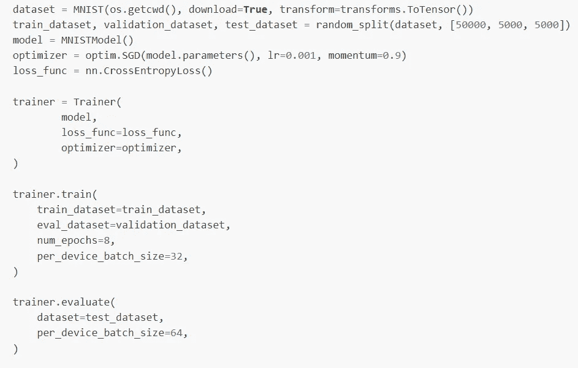
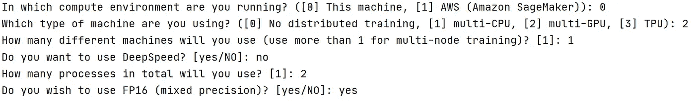
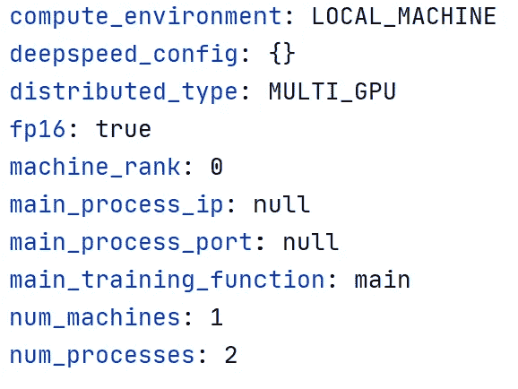
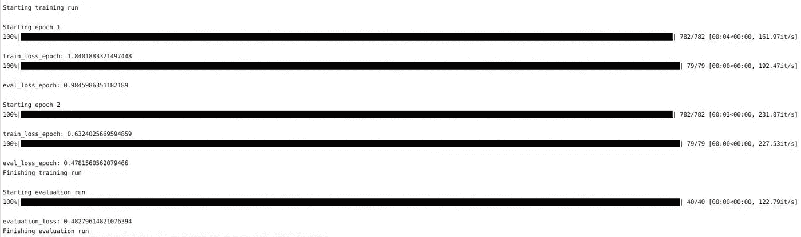
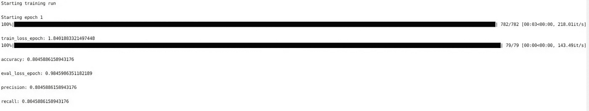

# 推出 PyTorch 加速版

> 原文：<https://towardsdatascience.com/introducing-pytorch-accelerated-6ba99530608c?source=collection_archive---------9----------------------->

## 一个简单但功能强大的库，用最少的样板文件训练 PyTorch 模型

pytorch-accelerated 是一个轻量级库，旨在通过提供一个最小但可扩展的训练循环(封装在单个 [**训练器**](https://pytorch-accelerated.readthedocs.io/en/latest/trainer.html#pytorch_accelerated.trainer.Trainer) 对象中)来加速训练 pytorch 模型的过程，该训练循环足够灵活，可以处理大多数用例，并且能够利用不同的硬件选项，而无需更改代码。pytorch 加速的提供了一个精简的特性集，并且非常强调**的简单性**和**的透明性**，使用户能够准确地理解幕后发生的事情，而不必自己编写和维护样板文件！

**的主要特征**是:

*   一个简单、包含但易于定制的训练循环，在简单的情况下可以开箱即用；可以使用继承和/或[回调](https://pytorch-accelerated.readthedocs.io/en/latest/callbacks.html)来定制[行为。](https://pytorch-accelerated.readthedocs.io/en/latest/trainer.html#customizing-trainer-behaviour)
*   处理器件布局、混合精度、 [DeepSpeed 集成](https://www.deepspeed.ai/)、多 GPU 和分布式培训，无需更改代码。
*   使用纯 PyTorch 组件，没有额外的修改或包装，并且可以轻松地与其他流行的库互操作，如 [timm](https://github.com/rwightman/pytorch-image-models) 、 [transformers](https://huggingface.co/transformers/) 和 [torchmetrics](https://torchmetrics.readthedocs.io/en/latest/) 。
*   一个小的、简化的 API 确保现有 PyTorch 用户的学习曲线最小。

为了确保库的每个部分——包括内部和外部组件——都尽可能的清晰和简单，使得定制、调试和理解每一步幕后发生的事情变得容易；培训师的大部分行为都包含在一个单独的类中！在 Python 的精神中，没有什么是隐藏的，一切都是可访问的。

本文的目的是介绍这个库，我决定将它命名为 *pytorch-accelerated* (原因将在后面变得显而易见！)，描述创建它背后的一些动机，并演示如何使用它来*加速*您的 PyTorch 开发。这篇文章的目的是**而不是**来破坏或比较任何现有的解决方案，因为我坚信它们都有自己的位置，并且不会因为有人说他们更喜欢库 *x* 中的工作方式并且更喜欢使用它而生气！

*如果你想直接进入主题，或者通过实践而不是阅读来学习更多内容，快速入门指南可在* [*这里*](https://pytorch-accelerated.readthedocs.io/en/latest/quickstart.html) *获得，文档可在* [*这里*](https://pytorch-accelerated.readthedocs.io/en/latest/index.html) *获得，或者查看 GitHub* *上的* [*示例。觉得有用别忘了加星！*](https://github.com/Chris-hughes10/pytorch-accelerated/tree/main/examples)



使用 pytorch-accelerated 训练 MNIST。

# 为什么*另一个* PyTorch 高级 API？

作为[微软 CSE](https://microsoft.github.io/code-with-engineering-playbook/CSE/) 的数据智能和设计团队的一部分，我们在许多不同的领域从事广泛的机器学习项目。由于这些问题的复杂性，我们的工作通常可以被描述为应用研究——从现有的艺术方法中获得灵感，以新的有趣的方式适应和应用这些方法——同时也强调强大的软件工程实践，如[SOLID](https://team-coder.com/solid-principles/)；确保代码尽可能简单和可维护。

随着深度学习的使用和受欢迎程度不断上升，我们的许多项目都涉及开发深度学习解决方案，PyTorch 是我在这些情况下的首选工具。因此，我们需要一个足够灵活的解决方案来处理大量的用例，同时易于扩展，但让我们尽快跟上速度；由于我们的许多项目非常大，我们通常需要能够从第一天就利用分布式培训！由于我们通常更喜欢利用预训练的模型或现有的架构，而不是每次都从头构建模型，所以我们使用的任何东西都需要能够轻松地与包含最先进模型的其他库互操作，我个人最喜欢的是 [timm](https://github.com/rwightman/pytorch-image-models) 和 [transformers](https://huggingface.co/transformers/) 。

在 CSE 工作模式中，我们'*与我们的客户'*'一起编码，在项目期间作为一个团队工作。当我们与具有不同 ML 成熟度级别的团队一起工作时，我们的许多队友都是第一次被介绍到 PyTorch，所以我们需要确保学习曲线尽可能浅；不要让他们被大量的信息淹没，充分利用我们在项目中合作的时间。我们还必须注意，我们希望客户在没有我们的情况下继续维护任何产生的解决方案，因此我们必须尽可能保持事情简单易懂和易于维护。

尽管我是这一领域中几种不同解决方案的长期用户，但我反复发现自己在一些情况下，我正在使用的现有工具不太适合我的用例，或者是由于引入的复杂性水平，或者是由于必须学习 PyTorch 之上的新工具的复杂性，或者是发现定义抽象的方式与我试图做的事情不太一致。

因此，就我个人而言，我决定创建一个非常简单的通用培训循环，以方便客户使用 PyTorch 并加速开发，同时保持我们所需的灵活性水平；尽可能利用现有工具。这被有意设计成一个非常薄的抽象，具有流线型的特性集，使得理解、修改和调试变得容易。在收到来自客户和同事的积极反馈后，我被说服[在 PyPI](https://pypi.org/project/pytorch-accelerated/) 上为任何可能发现这种解决方案有用的人提供这种解决方案。

## *pytorch 加速*针对的是谁？

*   熟悉 PyTorch 但希望避免编写通用训练循环样板文件以关注训练循环中有趣部分的用户。
*   喜欢并习惯于选择和创建自己的模型、损失函数、优化器和数据集的用户。
*   重视简单和流线型特性集的用户，其行为易于调试、理解和推理！

## 什么时候不应该用 pytorch 加速？

*   如果你正在寻找一个端到端的解决方案，涵盖从加载数据到推断的一切，帮助你选择模型、优化器或损失函数，你可能会更适合 [fastai](https://github.com/fastai/fastai) 。pytorch-accelerated 只关注训练过程，其他所有问题都由用户负责。
*   如果你想自己编写整个训练循环，只是没有所有的设备管理问题，你可能最适合使用拥抱脸[加速](https://github.com/huggingface/accelerate)！虽然可以定制 [**训练器**](https://pytorch-accelerated.readthedocs.io/en/latest/trainer.html#pytorch_accelerated.trainer.Trainer) 的每一部分，但训练循环基本上被分解成许多不同的方法，您必须覆盖这些方法。但是，在你走之前，写那些`for`循环真的重要到足以保证从头再来*吗*😉。
*   如果您正在处理一个定制的、高度复杂的用例，它不适合通常的训练循环模式，并且想要在您选择的硬件上挤出最后一点性能，您可能最好坚持使用 vanilla PyTorch 任何高级 API 在高度专业化的情况下都会成为开销！

# 为什么 PyTorch 需要一个高级 API？

对于那些不熟悉 PyTorch 的人来说，你可能想知道，为什么 PyTorch 甚至需要一个高级 API？它真的如此复杂以至于所有这些不同的解决方案都必须建立在它的基础上吗？如果是这样，为什么还要使用它呢？！

由于其灵活性、易于调试以及与 Python OOP 实践一致的编码风格，PyTorch 正在迅速成为 Python 中机器学习研究的首选工具。然而，尽管 PyTorch 有很多优点，但它对日常从业者来说缺少一个东西——缺少一个通用的训练循环，或“fit”功能。由于这种缺失，一些图书馆试图用各种方法来填补这一空白。

虽然缺少通用循环经常被认为是一种优势，因为它迫使从业者对培训过程的所有部分负责，这导致在每个新项目的开始都需要类似的样板代码。这导致了实现错误，并且缺乏一个公共的结构导致了不同项目中的训练循环之间的不一致性；实现可能千差万别，这使得理解和维护代码库变得困难，除非您熟悉这个项目——即使您对 PyTorch 有很好的理解！

此外，虽然 PyTorch 为组件提供了良好、清晰的抽象，使简单的应用程序易于上手，但由于引入分布式和混合精度训练、度量计算和日志记录等因素，复杂性会迅速增加；模糊教程中经常出现的“简单”风格的循环。由于必须显式管理数据向设备的传输，这本身就增加了大量的样板文件！

虽然纯 PyTorch 无疑是高度复杂的、需要大量灵活性的定制任务的最佳方法，但对于“大多数”用例来说，这种粒度级别似乎太低了。

# 那么，为什么叫 pytorch 加速呢？

除了本库的主要目的是帮助您更快地提高 PyTorch 的工作效率之外，它还是对本库所基于的一个重要底层组件的敬意。

至少对我来说，使用高级工具的主要动机是由于设备管理，以及在设置分布式培训时这可能导致的潜在问题。需要明确的是，在纯 PyTorch 中这样做并不太复杂，但这确实涉及到对训练脚本进行多处修改，例如:在模型周围添加不同的包装器，在进程之间同步和收集结果，确保在每个节点上设置特定的环境变量，以及使用专门的启动命令开始训练运行。

然而，2021 年 4 月，[抱抱脸发布了优秀的 *accelerate* 库](https://huggingface.co/blog/accelerate-library)，将所有这些关注点封装到一个加速器对象中。这使得利用分布式培训变得非常容易，而不必将所有的专家代码引入到您的脚本中；对其如何运作保持合理的透明度。

你可能已经猜到了，我是一个即时粉丝，几乎立刻就采用了它。但是，根据设计，accelerate 不提供任何其他功能，需要用户编写和维护自己的训练循环。在一些用例之后，我注意到我的大多数加速脚本开始看起来非常相似，我开始越来越多地注意到我脑海中的一个小小的声音，它不断地提醒我，通过复制和粘贴上一个项目的代码来启动每个新项目可能不是最好的方法…

对我来说，这是巩固这些知识和创建我自己的图书馆所需要的最后一击！

*pytorch-accelerated* 自豪而透明地建立在 [Hugging Face Accelerate](https://github.com/huggingface/accelerate) 之上，后者负责设备之间的数据移动、DeepSpeed 集成以及训练配置的启动。

*现在所有的问题都解决了，让我们开始吧！*

# 入门:在 MNIST 上训练分类器

让我们从一个非常简单的例子开始，使用 MNIST，因为如果我们不这样做，我们真的会做深度学习吗？！

首先要做的是安装软件包。为了帮助我们开始，我们还包括了运行示例可能需要的任何包:

`pip install pytorch-accelerated[examples]`

## 创建培训脚本

现在，让我们创建我们的培训脚本。

首先，我们需要下载数据。在这一点上，MNIST 实际上是深度学习的对等物 *Hello，World* ，我们可以直接从 torchvision 做这件事；它甚至有一个内置的数据集！

```
import osfrom torch.utils.data import random_split
from torchvision import transforms
from torchvision.datasets import MNISTdataset = MNIST(os.getcwd(), download=True, transform=transforms.ToTensor())train_dataset, validation_dataset, test_dataset = random_split(
    dataset, [50000, 5000, 5000]
)
```

这里，我们使用一个标准的转换将数据转换为 PyTorch 张量，然后将数据集随机分为训练集、验证集和测试集。

现在，我们已经准备好了数据，我们需要就模型架构、损失函数和优化器达成一致。由于这是一个非常简单的任务，让我们定义一个简单的前馈神经网络，并使用 SGD 和 momentum 作为我们的优化器。由于这是一个分类任务，让我们使用[交叉熵](https://pytorch.org/docs/stable/generated/torch.nn.CrossEntropyLoss.html)作为我们的损失函数。注意，由于交叉熵包括 SoftMax 计算，我们不需要将它作为模型架构的一部分。

```
from torch import nn, optimclass MNISTModel(nn.Module):
    def __init__(self):
        super().__init__()
        self.main = nn.Sequential(
            nn.Linear(in_features=784, out_features=128),
            nn.ReLU(),
            nn.Linear(in_features=128, out_features=64),
            nn.ReLU(),
            nn.Linear(in_features=64, out_features=10),
        )

    def forward(self, x):
        return self.main(x.view(x.shape[0], -1))model = MNISTModel()
optimizer = optim.SGD(model.parameters(), lr=0.001, momentum=0.9)
loss_func = nn.CrossEntropyLoss()
```

这通常是我们开始考虑编写训练循环的时候。然而，多亏了 *pytorch 加速，*我们解决了这个问题！要开始，我们所要做的就是导入[训练器](https://pytorch-accelerated.readthedocs.io/en/latest/trainer.html#pytorch_accelerated.trainer.Trainer)。

```
from pytorch_accelerated import Trainertrainer = Trainer(
    model,
    loss_func=loss_func,
    optimizer=optimizer,
)
```

[训练器](https://pytorch-accelerated.readthedocs.io/en/latest/trainer.html#pytorch_accelerated.trainer.Trainer)设计用于封装特定任务的整个训练循环，将模型、损失函数和优化器结合在一起，并为训练过程的每个步骤提供要执行的行为规范。

[训练器](https://pytorch-accelerated.readthedocs.io/en/latest/trainer.html#pytorch_accelerated.trainer.Trainer)的主要入口是[训练](https://pytorch-accelerated.readthedocs.io/en/latest/trainer.html#pytorch_accelerated.trainer.Trainer.train)方法，它将在我们提供的数据集上运行训练和评估循环。这也是我们为训练运行设置特定配置的地方，比如训练多少个时期以及使用多少批。这也是我们管理任何问题的地方，例如学习率计划、调整我们的数据加载器或累积梯度，但由于这是一个简单的例子，我们现在将跳过这些！

```
trainer.train(
    train_dataset=train_dataset,
    eval_dataset=validation_dataset,
    num_epochs=2,
    per_device_batch_size=32,
)
```

此外， *pytorch 加速的*支持分布式评估，所以在我们的训练运行结束后，让我们在测试集上评估模型。由于我们在评估过程中不会计算任何梯度，所以让我们将批量加倍。

```
trainer.evaluate(
    dataset=test_dataset,
    per_device_batch_size=64,
)
```

现在我们已经看到了所需的所有关键步骤，让我们将所有这些步骤合并到一个培训脚本中:

## 启动培训

既然我们已经编写了培训脚本，剩下要做的就是启动培训。如上所述，我们将利用拥抱脸加速。Accelerate 提供了 [accelerate CLI](https://huggingface.co/docs/accelerate/quicktour.html#launching-your-distributed-script) ，因此无论我们的底层硬件设置如何，我们都可以使用一致的命令来启动培训。

首先，我们需要为我们的培训创建一个配置。这可以通过两种方式之一来实现；我们可以为我们的系统存储一个本地配置，也可以创建一个配置文件。为了透明，我更喜欢用后者。我们可以使用以下命令来实现这一点:

```
accelerate config --config_file train_mnist.yaml
```

该命令将询问一系列问题，这些问题将用于生成配置文件。



加速配置命令的输出

回答上述问题会生成以下配置文件:



由` accelerate config-config _ file train_mnist.yaml `生成的 train _ Mn ist . YAML 配置文件

**注意:**要更改此配置，建议再次运行命令，而不是直接编辑此文件！

现在，要启动培训，我们可以使用以下命令:

```
accelerate launch --config_file train_mnist.yaml train_mnist.py
```

这将产生如下所示的输出:



运行培训脚本时产生的输出

根据所使用的[回调](https://pytorch-accelerated.readthedocs.io/en/latest/callbacks.html)，可以定制输出的确切内容。在这里，我们只是使用[训练师](https://pytorch-accelerated.readthedocs.io/en/latest/trainer.html#pytorch_accelerated.trainer.Trainer)的默认值。

这就是我们使用 2 个 GPU 训练一个模型所需要做的一切！

*关于训练循环中执行顺序的更多信息，请参见:* [*训练器内部发生了什么？*T9*。*](https://pytorch-accelerated.readthedocs.io/en/latest/trainer.html#inside-trainer)

# 跟踪指标

您可能已经注意到，默认情况下，[训练器](https://pytorch-accelerated.readthedocs.io/en/latest/trainer.html#pytorch_accelerated.trainer.Trainer)跟踪的唯一值是每个时期的损失。这是因为适当的度量标准严重依赖于任务！让我们看看如何跟踪其他指标。

*为了计算我们的指标，我们将使用*[*torch metrics*](https://torchmetrics.readthedocs.io/en/latest/)*，它们是分布式培训兼容的，这样我们就不需要在计算指标之前收集来自不同流程的结果。*

为此，我们可以采取两种不同的方法:

1.  训练员的子类化
2.  使用回调

决定采用哪种方法很大程度上取决于用户的偏好。文件中给出了以下指南:

> 建议使用回调来包含“基础结构”代码，这对于训练循环的操作(如日志记录)来说并不重要，但这一决定由用户根据具体的用例来判断。

由于计算指标并不影响我们的训练代码，它可能很适合回调，这意味着我们不必子类化训练器。然而，由于回调是按顺序执行的，我们必须确保这个回调会在指标被打印之前被调用！

让我们比较一下这两种方法。

## 训练员的子类化

虽然[训练器](https://pytorch-accelerated.readthedocs.io/en/latest/trainer.html#pytorch_accelerated.trainer.Trainer)应该在简单的用例中开箱即用，但是子类化训练器并覆盖其方法是有意的，也是被鼓励的——把基础实现想象成一组'*合理的缺省值*'！

*[*训练器*](https://pytorch-accelerated.readthedocs.io/en/latest/trainer.html#pytorch_accelerated.trainer.Trainer) *有很多不同的方法可以被覆盖，在文档* [*这里*](https://pytorch-accelerated.readthedocs.io/en/latest/trainer.html#customizing-trainer-behaviour) *中有描述。要记住的主要事情是，以动词为前缀的方法，例如* `create` *或* `calculate` *期望返回一个值，所有其他方法都用于设置内部状态(例如* `optimizer.step()` *)**

*让我们创建一个[训练器](https://pytorch-accelerated.readthedocs.io/en/latest/trainer.html#pytorch_accelerated.trainer.Trainer) 的子类，它跟踪一组分类指标。在这里，我们可以看到，在每个评估批次结束时，我们更新我们的指标——为了避免重写实际的评估逻辑，我们刚刚为此调用了默认实现——然后在每个评估周期结束时计算它们。*

*[训练器](https://pytorch-accelerated.readthedocs.io/en/latest/trainer.html#pytorch_accelerated.trainer.Trainer) 维护一个[运行历史](https://pytorch-accelerated.readthedocs.io/en/latest/tracking.html#runhistory)，默认情况下用于跟踪损失，我们可以用它来跟踪我们计算的指标。当然，我们可以手动管理跟踪，但是这种方法有一个额外的好处，即包含在[运行历史](https://pytorch-accelerated.readthedocs.io/en/latest/tracking.html#runhistory)中的任何指标将在每个时期结束时被记录！*

*在我们的脚本中使用我们的新教练，我们的脚本现在看起来像这样:*

*使用以下方式启动:*

```
*accelerate launch --config_file train_mnist.yaml train_with_metrics_in_loop.py*
```

*我们可以看到，度量是在每个时期的末尾打印出来的！*

**

*在循环中运行带有指标的培训脚本时产生的输出*

## *使用回调*

*对于这样一个小的调整，比如添加度量，你可能会觉得子类化[训练器](https://pytorch-accelerated.readthedocs.io/en/latest/trainer.html#pytorch_accelerated.trainer.Trainer)有点过分，并且更喜欢使用基本实现。在这种情况下，我们可以使用回调来扩展默认训练器的行为。*

*要创建一个新的回调，我们可以子类化 [TrainerCallback](https://pytorch-accelerated.readthedocs.io/en/latest/callbacks.html#pytorch_accelerated.callbacks.TrainerCallback) 并覆盖相关的方法；这些在的文档[中有描述。为了避免与](https://pytorch-accelerated.readthedocs.io/en/latest/callbacks.html#creating-new-callbacks)[训练器](https://pytorch-accelerated.readthedocs.io/en/latest/trainer.html#pytorch_accelerated.trainer.Trainer)的方法混淆，所有回调方法都带有前缀`_on`。*

*让我们创建一个新的回调来跟踪我们的分类指标:*

*在这里，我们可以看到代码几乎与我们在前一个例子中添加到训练器的代码相同。唯一的区别是，我们需要在培训或评估开始时手动将指标移动到正确的设备上。幸运的是，[训练器](https://pytorch-accelerated.readthedocs.io/en/latest/trainer.html#pytorch_accelerated.trainer.Trainer)通过根据上下文返回正确的设备，让我们变得简单！*

*要使用它，我们需要做的就是在创建时将它包含在我们传递给我们的[训练师](https://pytorch-accelerated.readthedocs.io/en/latest/trainer.html#pytorch_accelerated.trainer.Trainer)的回调列表中。因为我们想保留默认行为，所以我们在所有默认回调之前包含了这个行为。*

```
*trainer = Trainer(
    model,
    loss_func=loss_func,
    optimizer=optimizer,
    callbacks=(
        ClassificationMetricsCallback(
            num_classes=num_classes,
        ),
        *DEFAULT_CALLBACKS,
    ),
)*
```

*现在，我们可以将它整合到我们的培训脚本中:*

*像以前一样启动它:*

```
*accelerate launch --config_file train_mnist.yaml train_with_metrics_in_callback.py*
```

*我们将观察到与上一个示例相同的输出。*

# *结论*

*希望这已经提供了关于 *pytorch 加速的*的介绍和足够的信息来演示如何开始你自己的用例。要了解更多信息，文档可在此处[获得](https://pytorch-accelerated.readthedocs.io/en/latest/index.html)，更复杂的培训示例可在 GitHub 上[获得。觉得有用别忘了加星！](https://github.com/Chris-hughes10/pytorch-accelerated/tree/main/examples)*

*期待更多的帖子来涵盖如何处理一些更高级的用例，以及如何在培训期间应用一些我最喜欢的 PyTorch 技巧和诀窍。*

## *承认*

*pytorch-accelerated 的设计和特性背后的许多方面都受到了许多优秀库和框架的极大启发，如 [fastai](https://github.com/fastai/fastai) 、 [timm](https://github.com/rwightman/pytorch-image-models) 、 [PyTorch-lightning](https://github.com/PyTorchLightning/pytorch-lightning) 和抱抱脸 [accelerate](https://github.com/huggingface/accelerate) 。这些工具中的每一个都对这个库和机器学习社区产生了巨大的影响，他们的影响是不言而喻的！*

*pytorch-accelerated 仅从这些工具中获得灵感，并且包含的所有功能都是从零开始实现的，对本库有益。唯一的例外是 [examples](https://github.com/Chris-hughes10/pytorch-accelerated/tree/main/examples/) 文件夹中的一些脚本，为了展示 *pytorch-accelerated* 的特性，这些脚本中的现有资源被提取和修改；这些案例都有明确的标记，并注明原作者。*

*我还要感谢我所有出色的 CSE 同事，他们为 pytorch 加速版提供了反馈，并就一个好的解决方案提供了一些想法！*

**克里斯·休斯上的是* [*领英*](http://www.linkedin.com/in/chris-hughes1/) *。**