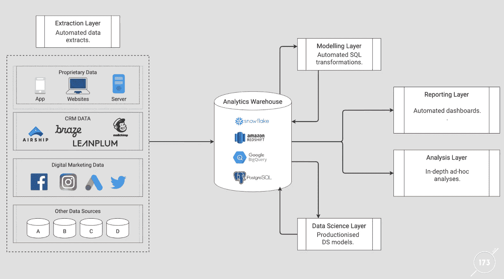
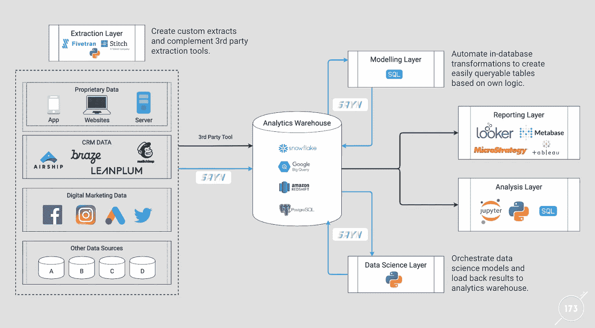

# 介绍 SAYN:一个简单而强大的数据处理框架

> 原文：<https://towardsdatascience.com/introducing-sayn-a-simple-yet-powerful-data-processing-framework-ce1c89af0e47?source=collection_archive---------20----------------------->

## 我们新的开源框架进一步提高了数据工程工作流程的效率

那么，SAYN 是什么？简单来说，SAYN 是一个开源数据处理框架。我们(173Tech 的团队)将它建成了最简单的框架，同时保持了充分的灵活性。用户可以从多个预定义的任务类型中进行选择，并构建自己的 ETL 流程。SAYN 真的是独一无二的，不像你以前见过的任何东西。想了解更多？接着读下去！

## 现代分析:背景

在我们谈论更多关于 SAYN 的内容之前，让我们先快速回顾一下背景。现代分析基础设施通常围绕数据仓库组织，使用五个核心层，如下图所示:



现代分析基础架构层

关键是要有一个高效的、可伸缩的数据流程，能够轻松地支持数百个任务及其依赖项的创建和维护。有两种常见的方法来解决这个问题:

*   使用技术工作流管理框架，如 Airflow，这可能非常复杂，需要更多的维护。
*   采用使用 Stitch + DBT 等工具的轻量级方法，这种方法缺乏灵活性，因为它没有为定制提取或数据科学模型等 Python 流程提供流程。

**如果您希望在大规模分析过程中保持高度灵活性，同时保持简单，该怎么办？**事实证明，我们从未找到有效解决这些问题的数据处理框架。所以我们建造了它！

## 塞恩:创世纪

我们认为，在大规模维护管道时，简单性至关重要。然而，我们也认为简单不应以牺牲灵活性为代价。这就是为什么我们建立了自己的开源数据处理框架: [SAYN](https://github.com/173TECH/sayn) 。 **SAYN 旨在通过简单、灵活和集中来增强分析团队的能力。它使分析团队内部对数据流程的贡献民主化，实现充分的灵活性，并通过自动化帮助节省大量时间。**

SAYN 是围绕任务的概念构建的，目前为您预建了以下任务类型:

*   **sql** :对数据库执行 sql 查询。
*   **autosql** :自动化数据转换过程。您编写一个 SELECT 语句，SAYN 会为您处理表/视图的创建。它也可用于增量载荷。
*   **python** :执行 python 代码。
*   **复制**:自动将数据从一个数据库复制到另一个数据库。
*   更多的将会到来！

下图显示了我们通常如何在现代分析堆栈中使用 SAYN。蓝线是由 SAYN 精心设计的:



现代分析基础架构层(带 SAYN)

## 塞恩哲学

SAYN 是围绕三个核心信念设计的，即现代数据处理框架应该通过简单、灵活和集中来增强数据工程师和分析师的能力。这就是 SAYN 如何实现这一承诺:

**简单**

*   项目结构和任务是用 YAML 定义的，这是一种非常简单的语言，通常用于配置。这具有显著的优势，每个分析师或工程师都可以轻松地为管道做出贡献，并添加新的数据流程。
*   您可以使用命令 **sayn run** 执行任务的任意组合，包括您的 Python 任务，从而实现流畅高效的工作流。
*   SAYN 通过其任务类型(例如，将 SELECT 语句自动转换为表/视图，将数据从一个数据库复制到另一个数据库)和其 API(例如，预构建的数据库连接和在 Python 代码中访问的凭证选择)提供了大量自动化并降低了数据工程的复杂性。您的团队可以专注于编写逻辑代码，而不是管道代码。
*   只需两行 YAML 和要执行的代码就可以定义任务。一般来说，你可以非常快速地与 SAYN 相处！

**灵活**

*   SAYN 使您能够使用 SQL 和 Python，这意味着您可以在分析领域做任何事情:数据提取、建模和数据科学。
*   SAYN 由 Jinja 提供支持，允许您轻松地使您的代码动态化。例如，在生产和开发环境之间切换。
*   你可以定义任何你喜欢的数据库结构，SAYN 不会强迫你默认任何特定的设计。

**集中**

*   SAYN 可以跨整个管道使用，使您能够集中和版本控制您的 SAYN 项目中的所有分析代码。
*   任务定义集中在 YAML 文件中，这些文件构成了 SAYN 编排的主干。

## SAYN 如何工作

要了解 SAYN 有多棒，最好的方法就是实际尝试一下！SAYN 分布在 PyPi 上，使用命令行工作。使用 **sayn run** 命令执行。你可以用下面四行文字在两分钟内开始:

```
$ pip install sayn
$ sayn init test_sayn
$ cd test_sayn
$ sayn run
```

这将安装 **sayn** 包，创建一个名为 **test_sayn** 的 sayn 项目，将您移至项目目录，然后执行 SAYN。您应该会看到以下情况:


SAYN 运行的执行

如前所述，SAYN 项目是围绕任务概念组织的:

*   任务定义了你的数据过程和它们之间的关系，SAYN 然后自动为你建立一个有向无环图(DAG)。
*   SAYN 支持多种任务类型。您只需通过选择一个类型来定义您的任务，定义所需的属性(如果有的话)，并指定要运行的代码。
*   可以在不同的 YAML 文件(被认为是“任务组”)中分离任务，以分离数据流程(例如，核心、营销、数据科学)，并在扩展时保持项目有序。

以下是 SAYN 的一些使用案例:

*   使用 autosql 任务的仓库内自动数据转换。这对于计算营销投资回报率等数据建模过程来说非常强大。
*   自动将数据从运行数据库副本复制到分析集群。
*   当提取器缺失或提取效率低下时，使用 Python 任务来补充提取工具，如 Stitch(如果不想使用第三方提取工具，则构建自己的提取管道)。
*   使用 Python 任务创建 LTV 预测数据科学模型并将结果加载到数据仓库中。

如果你想更多地了解 SAYN 是如何工作的，可以浏览我们的教程，这是一个很好的起点。

## 想了解更多？

我们正在积极开发 [SAYN](https://github.com/173TECH/sayn) 并且它正在一天比一天变得更好！SAYN 让我们在 173Tech 的生活变得更加轻松，它真正释放了我们的分析能力。您的团队也可以从中受益！此外，我们希望获得反馈，帮助我们将框架做得更好，所以请联系我们，我们很友好:)您可以通过 sayn@173tech.com[联系我们关于 SAYN 的问题或建议。快点说！](mailto:sayn@173tech.com)

— — — — —

*这个故事最初发表于:*[*https://www.173tech.com/insights/introducing-sayn/*](https://www.173tech.com/insights/introducing-sayn/)*。*