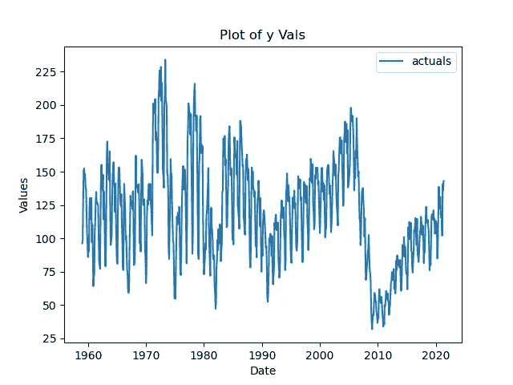
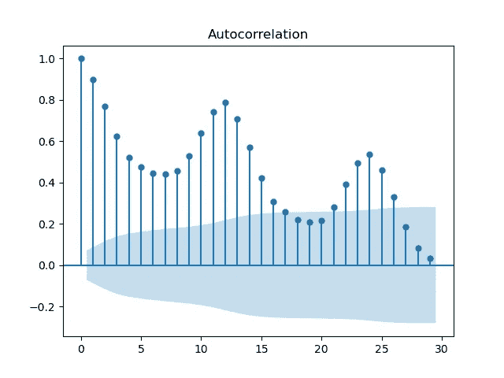
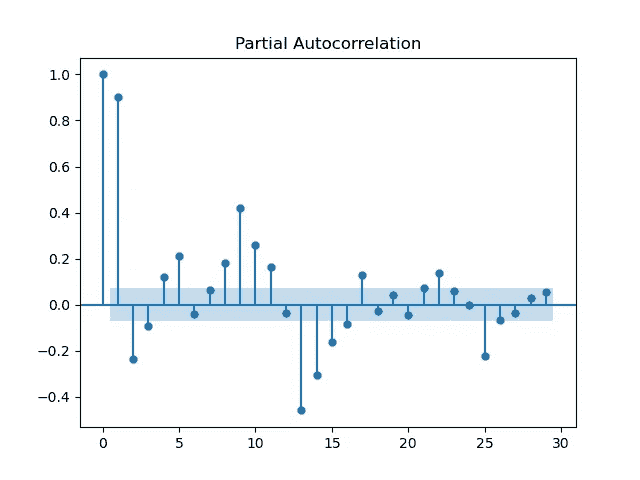
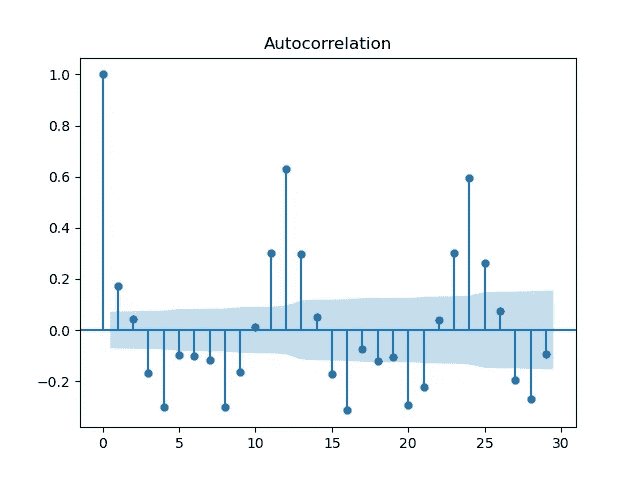
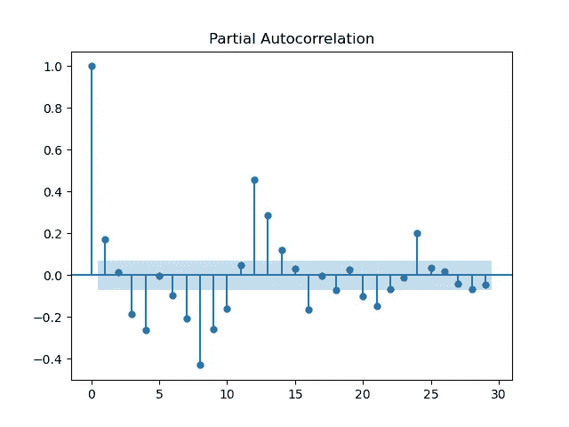
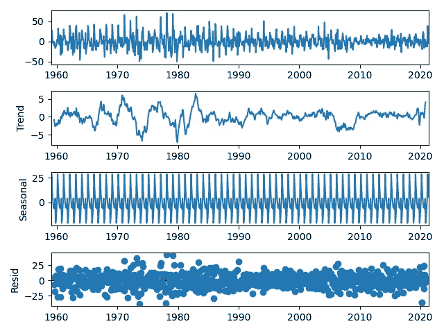
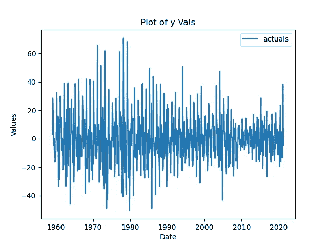
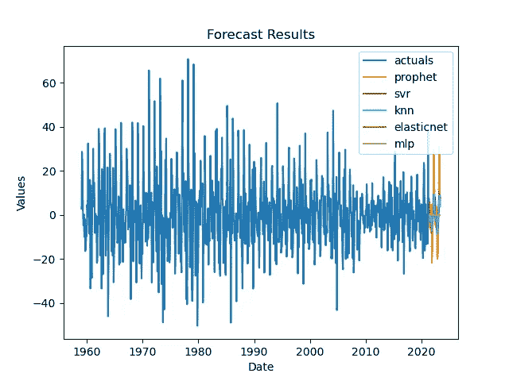
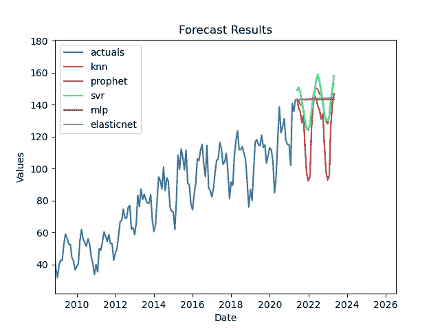

# 介绍 Scalecast:预测库。一

> 原文：<https://towardsdatascience.com/introducing-scalecast-a-forecasting-library-pt-1-33b556d9b019?source=collection_archive---------10----------------------->

## [实践教程](https://towardsdatascience.com/tagged/hands-on-tutorials)

## 用许多模型按比例进行预测


约书亚·富勒在 [Unsplash](https://unsplash.com?utm_source=medium&utm_medium=referral) 拍摄的照片

在这个由三部分组成的系列中，我们将探索一个 Python 预测库，该库使用最少的代码来检查时间序列，并使用流行和众所周知的机器学习模型进行预测。其优势包括:

*   具有自回归项的动态预测/测试集预测过程，可防止数据泄漏
*   许多解释季节性的方法
*   无论系列是否有差异，均可轻松获得水平结果和误差指标

第 1 部分使用这个框架来预测单个序列。[第 2 部分](/may-the-forecasts-be-with-you-introducing-scalecast-pt-2-692f3f7f0be5)将该方法扩展到 100 多个系列。第 3 部分回归到一个系列，但是展示了在不同集成级别上建模的灵活性。如果这是一个你喜欢并有兴趣参与和/或维护的项目，请联系 mikekeith52@gmail.com。在 GitHub 上看到它:

[](https://github.com/mikekeith52/scalecast) [## mikekeith52/scalecast

### 一个灵活的、代码最少的预测对象。通过在…上创建帐户，为 mikekeith52/scalecast 开发做出贡献

github.com](https://github.com/mikekeith52/scalecast) 

首先，要安装:

```
pip install --upgrade scalecast
```

现在，到代码。导入预测器对象:

```
from scalecast.Forecaster import Forecaster
```

接下来，导入数据并保存到 predictor 对象中。我们将使用 [HOUSTNSA 系列](https://fred.stlouisfed.org/series/HOUSTNSA)，它衡量自 1959 年以来美国每月的新屋开工数。要将时间序列数据加载到我们称为`f`的预测器对象中，请使用以下代码:

```
import matplotlib.pyplot as plt
import pandas_datareader as pdr
df = pdr.get_data_fred('HOUSTNSA',start='1900-01-01',end='2021-05-01')
f = Forecaster(y=df['HOUSTNSA'],current_dates=df.index)
```

我们将在 2021 年 5 月结束该系列，以使结果具有可重复性。让我们画出时间序列。

```
f.plot()
```



作者图片

预测的一个重要部分是检查时间序列的统计特性。当前值与过去值有多大关联？数据的季节性是什么？数据是静态的吗？我们使用自相关函数(ACF)图、偏自相关函数(PACF)图和季节分解图来检验这些问题。首先，让我们看看 ACF 和 PACF 的情节。

```
f.plot_acf()
f.plot_pacf()
plt.show()
```



作者图片



作者图片

这些数据表明，当前值和过去值之间存在大量的相关性，也称为自相关，最长可达 25 个周期。第一个图是对这种相关性的简单检验；第二个图控制术语之间的相关性。

当这种模式出现时，这是一个强有力的指标，表明该序列不是静止的(其均值不会保持恒定)，这使得预测变得困难，因为它部分遵循“随机行走”模式，似乎随机上下移动。解决这个问题的一种方法是转换数据，使每个值都是序列中前一个值和当前值的差。让我们来看看 ACF 和 PACF 图，这次使用`diffy=True`将差异数据传递给函数。

```
f.plot_acf(diffy=True)
f.plot_pacf(diffy=True)
plt.show()
```



作者图片



作者图片

虽然仍然有大量的自相关，但已经不那么多了。我们还注意到在 12 个月和 24 个月左右会出现一些季节性高峰。让我们进一步检查差异数据的季节性:

```
f.seasonal_decompose(diffy=True).plot()
plt.show()
```



作者图片

从这张图中我们可以看出，存在月度季节性，因此过去的一月份彼此相似，二月份也是如此，以此类推。残差似乎也是随机分布的。当考虑如何预处理模型和使用什么样的回归变量时，这些都是很好的信息，我们将很快对此进行讨论。

拿出一大块数据集来测试最终预测的准确性非常重要。让我们用 12 个月的时间来做这件事。我们还想预测未来 24 个月的情况。

```
f.set_test_length(12)
f.generate_future_dates(24)
```

您可能想知道调用这些方法会返回什么。实际上，它们不返回任何东西，只是简单地将信息保存在对象本身中。我喜欢这样，因为我们不必跟踪几个数据集或熊猫数据框架；所有相关信息都存储在对象中，以后可以很容易地访问。

让我们决定将哪些回归量添加到预测器对象中。从 ACF 图中，我们可以看到几个时期的现值和未来值之间存在显著的相关性；现在让我们使用 4 个过去的值(也称为滞后或自回归项)。我们也可以用第 12 和第 24 个滞后来捕捉一些季节性。

```
f.add_ar_terms(4) # 4 AR terms
f.add_AR_terms((2,12)) # 2 seasonal AR terms
```

在我们的对象中，这些回归量分别存储为“AR1”、“AR2”、“AR3”、“AR4”、“AR12”和“AR24”。本模块的美妙之处在于，所有使用 AR 术语的预测和预测制定都使用一个动态过程，用当前预测填充未来值。这防止了在其他预测应用中出现的过度拟合和数据泄漏，同时允许预测是动态的。然而，这也意味着由于在源代码中自由使用循环，一些模型评估是缓慢的。不要因此而气馁！

现在让我们对物体内的级数求差，使其静止。我们还运行了一个名为[增强的迪克·富勒](https://www.statsmodels.org/dev/generated/statsmodels.tsa.stattools.adfuller.html)的统计测试来进一步检验平稳性，然后重新绘制数据。

```
>>> f.diff()
>>> f.adf_test(quiet=False)
>>> f.plot()
series appears to be stationary
```



作者图片

当像这样绘制时，该系列似乎不太容易解释，但它将比使用其原始水平更容易有效地预测。更重要的是，根据统计测试，它现在是稳定的。

除了主序列之外,`diff()`方法将区分所有自回归项(它识别为以“AR”标签开头的变量)。也就是说，现在让我们添加捕捉月和年的影响的回归变量。

```
f.add_seasonal_regressors('month',raw=False,sincos=True)
f.add_seasonal_regressors('year')
```

这个方法依赖于`pandas.Series.dt`属性和`pandas.Series.dt.isocalendar()`方法。默认情况下，将返回一系列整数类型，使用诸如“月”、“周”、“日”、“星期”等标签(见[此处](https://pandas.pydata.org/docs/reference/api/pandas.Series.dt.year.html))。由于我们不一定看到任何给定年份的月份与我们的序列中的值的高低之间的直接线性关系，我们可以选择不使用月份的整数值(`raw=False`)，而是将值转换为正弦和余弦波函数(`sincos=True`)，这提供了一种更具周期性的模式来模拟数据，并且应该会提高准确性。另外还有`dummy=True`，它从回归变量中创建虚拟变量。所有这些转换都有其优缺点，我们鼓励您尝试不同的方法来指定您自己的模型。到目前为止，我们的回归变量包括前面提到的 ar 术语和三个新术语“monthsin”、“monthcos”和“year”。

我们还要添加一个 COVID19 回归量、时间趋势、与 COVID19 的组合时间趋势以及 2 和 3 次方的多项式时间趋势。

```
f.add_covid19_regressor() # called 'COVID19' by default
f.add_time_trend() # called 't' by default
f.add_combo_regressors('t','COVID19') # 't_COVID19'
f.add_poly_terms('t',pwr=3) # 't^2' and 't^3'
```

默认的 COVID19 回归变量日期范围是从华特·迪士尼世界(和许多其他知名企业)在美国关闭的那一天到 CDC 取消对接种疫苗者的口罩建议的时候，但这些日期以及以这种方式添加的大多数变量的名称都可以调整。

既然已经添加了所有的回归变量，我们就可以建模了。scalecast 模块的另一个有用部分是它能够自动调整一组不同的模型。最简单的方法是在工作目录中创建一个 Grids.py 文件。在那里，我们可以以 Python 字典的形式指定模型验证网格。每个模型将在一组验证数据上运行，这组验证数据是我们选择的正好发生在测试集周期之前的一段时间。对于给定的模型，将尝试写入网格文件的所有组合，并将推荐在验证集上具有最佳性能的组合，我们可以通过`auto_forecast()`方法使用它们。在 Grids.py 文件中，可以添加以下内容:

创建一个 Grids.py 文件，并将其保存在工作目录中以优化模型

请注意，对于每个要优化的模型，至少需要一个网格。

我们运行以下代码来指定一个 6 周期的验证集，并优化 8 个不同的模型:

循环调整和预测 8 个模型

我们现在已经使用多元线性回归、K-最近邻、支持向量回归、极端梯度提升树、梯度提升树、Elasticnet、多层感知器和 Prophet 模型进行了调整和预测。这些都来自流行的机器学习库:Scikit-Learn、XGBoost 和脸书先知，因此关于每一个库的文档都很丰富。

下一段代码将这些模型组合起来，以创建两个额外的预测:根据优化过程对前 3 个执行预测进行简单平均，并对所有模型进行加权平均，其中权重是根据每个模型在优化过程中各自的性能自动分配的。我们鼓励您尝试自己的组合建模，因为有很多方法可以做到这一点。

您可以组合模型来制作新模型

现在，我们有一组 10 个高度优化的模型，对这个时间序列进行预测。然而，这并不意味着它们都是好的。其中一些肯定会有一点不确定——尝试这么多的目的是找到至少两个有效的。所以，让我们根据他们各自在测试集上的均方根误差( [RMSE](https://scikit-learn.org/stable/modules/generated/sklearn.metrics.mean_squared_error.html.) )表现，来画出前 5 名最好的，看看他们看起来怎么样。让我们也向控制台打印一些关于每个评估模型的有趣信息(见[这里](https://github.com/mikekeith52/scalecast/blob/main/README.md#history)为所有可能的值打印):

```
f.plot(models='top_5',order_by='TestSetRMSE')
```



这很好，我们可以看到，根据我们选择的误差度量标准，prophet 模型是最好的，但这些预测实际上告诉了我们关于住房的什么信息？没有什么明显的，因为我们区别我们的数据和单位是根据房屋逐月的变化，而不是总的新房子。让这些预测揭示任何有意义的东西需要努力。是吗？在这个模块中，实际上非常简单。让我们再看一遍这个图，除了现在我们想要水平预测，所以我们通过了`level=True`。我们还根据它们的水平测试集平均绝对百分比误差( [MAPE](https://scikit-learn.org/stable/modules/generated/sklearn.metrics.mean_absolute_percentage_error.html) )值对它们进行排序，并将更多有用的信息打印到控制台:

```
f.plot(models='top_5',order_by='LevelTestSetMAPE',level=True)
```



哇！真正的、可用的预测就是这样，考虑到我们从中获得了多少分析，而不是很多代码。根据 MAPE(K-最近邻)水平，我们最准确的模型在测试集数据上每个周期平均只偏离大约 8%。根据我们选择的两个误差指标，前 3 个模型是相同的，并且这三个模型看起来都是合理的。现在让我们将结果导出到 Excel ( [下载](https://github.com/mikekeith52/scalecast/raw/main/examples/housing_results.xlsx))。

```
f.export(
    to_excel=True,
    determine_best_by='LevelTestSetMAPE',
    excel_name='housing_results.xlsx'
)
```

总之，我们有一个 Excel 工作簿和图表，其中包含在差异和非差异水平上评估的所有预测、每个模型的统计信息、最佳预测的规范，以及测试集预测与实际值的比较。过度拟合的可能性极小，因为我们所有的预测都是动态的、经过充分验证的。使用本模块，您可以做更多的事情。请务必阅读官方 scalecast [文档](https://scalecast.readthedocs.io/en/latest/)并查看[第 2 部分](/may-the-forecasts-be-with-you-introducing-scalecast-pt-2-692f3f7f0be5)！

注意:这篇博文最初是基于 scalecast 早期版本的功能编写的。我试图在这篇文章中更新代码，但有些代码可能无法在最新版本中使用。见 scalecast 最新[介绍笔记本](https://scalecast-examples.readthedocs.io/en/latest/misc/introduction/Introduction2.html)。