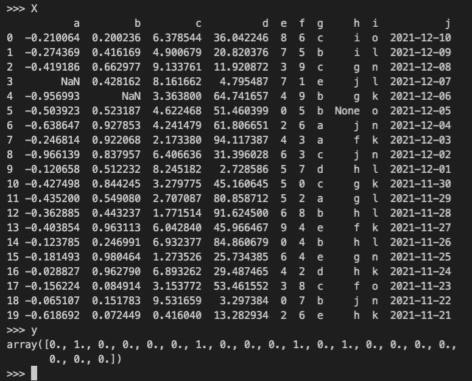

# 介绍 Skippa

> 原文：<https://towardsdatascience.com/introducing-skippa-bab260acf6a7?source=collection_archive---------9----------------------->

## sci kit-了解熊猫的预处理管道


由 [Marco Midmore](https://unsplash.com/@marco_midmore?utm_source=medium&utm_medium=referral) 在 [Unsplash](https://unsplash.com?utm_source=medium&utm_medium=referral) 上拍摄的照片

# 摘要

任何一个数据科学家大概都很熟悉`pandas`和`scikit-learn`。通常的工作流程需要在 pandas 中清理数据，并再次使用`pandas`或`scikit-learn`转换器如`StandardScaler`、`OneHotEncoder`等进行进一步的预处理。之后，机器学习算法被拟合(再次来自`scikit-learn`)。

这种方法存在一些问题:

1.开发工作流相当复杂，需要大量代码😰

2.很难在部署中重现预测工作流😩

3.减轻这些问题的现有解决方案根本不够好😞

**Skippa** 是一款旨在:

*   ✨ *大幅*简化开发
*   📦将所有数据清理、预处理以及模型算法打包/序列化到一个管道文件中
*   😌重用您已经熟悉的`pandas` & `scikit-learn`中的接口/组件

Skippa 帮助您在`pandas` `DataFrame`上轻松定义数据清理和预处理操作，并将其与`scikit-learn`模型/算法组合成一个可执行的管道。它大致是这样工作的:

```
from skippa import Skippa, columns
from sklearn.linear_model import LogisticRegressionX, y = get_training_data(...)pipeline = (
    Skippa()
    .impute(columns(dtype_include='object'), strategy='most_frequent')
    .impute(columns(dtype_include='number'), strategy='median')
    .scale(columns(dtype_include='number'), type='standard')
    .onehot(columns(['category1', 'category2']))
    .model(LogisticRegression())
)
pipeline.fit(X, y)predictions = pipeline.predict_proba(X)
```

> ☝️·斯基帕并不假定能解决所有问题，也不涵盖你可能需要的所有功能，也不是一个高度可扩展的解决方案，但它应该能够为超过 80%的常规基于 pandas/sklearn 的机器学习项目提供大规模简化。

## 链接

*   [📂Github](https://github.com/data-science-lab-amsterdam/skippa)
*   [📦pypi](https://pypi.org/project/skippa/)
*   [📝阅读文档](https://skippa.readthedocs.io/)

⏩ [*跳过短文直接上趣味 par*](#fd0c) *t*

# 为什么需要 Skippa

## 问题 1:代码太多…

对于概念上非常简单的任务—输入缺失值、一次性编码分类值、选择列的子集、缩放等。—你需要相当多的代码。如果通常您从一个由各种数据类型的列组成的`pandas`数据帧开始，那么您需要对不同的列进行不同的转换，并且您的许多代码涉及选择列子集和合并转换后的数据。

你想要的基本上是一组步骤，你说:我想把这个转换应用到这些列中。要是有一个软件包能让你用这样的习惯用法编码就好了…

## 问题 2:复制和部署

如果您想要部署您的模型，您需要能够重现您的预处理代码，以便在预测上下文中使用。此外，除了您的酸洗模型文件，您还需要为您的拟合定标器、拟合一键编码器和其他可能的转换生成酸洗文件，因为它们是生成新数据预测所必需的！这很快变得难以维持。如果您能将所有这些逻辑保存到一个文件中就好了…


作者图片

## 问题 3:现有的解决方案不够好

现在，在这个课题上已经做了很多工作。在`scikit-learn`你有

*   你可以用这个`Pipeline`将某些变形金刚链接到你的算法中
*   和`ColumnTransformer`，您可以用它来定义不同列组上变压器的管道。

虽然我觉得这很麻烦。看看这个例子:

```
import numpy as np
import pandas as pd

from sklearn.compose import ColumnTransformer
from sklearn.impute import SimpleImputer
from sklearn.pipeline import Pipeline
from sklearn.preprocessing import OneHotEncoder
from sklearn.tree import DecisionTreeClassifier

*# this is the input dataframe*
df **=** pd**.**DataFrame({
    'favorite_color':['blue','green','red','green','blue'],
    'age': [10,15,10,np**.**nan,10],
    'target':[1,0,1,0,1]
})

*# define individual transformers in a pipeline*
categorical_preprocessing **=** Pipeline([('ohe', OneHotEncoder())])
numerical_preprocessing **=** Pipeline([('imputation', SimpleImputer())])

*# define which transformer applies to which columns*
preprocess **=** ColumnTransformer([
    ('categorical_preprocessing', categorical_preprocessing, ['favorite_color']),
    ('numerical_preprocessing', numerical_preprocessing, ['age'])
])

*# create the final pipeline with preprocessing steps and* 
*# the final classifier step*
pipeline **=** Pipeline([
    ('preprocess', preprocess),
    ('clf', DecisionTreeClassifier())
])

*# now fit the pipeline using the whole dataframe*
df_features **=** df[['favorite_color','age']]
df_target **=** df['target']

*# call fit on the dataframes*
pipeline**.**fit(df_features, df_target)
```

这确实有用，但是

*   使用起来相当复杂和麻烦
*   如果需要对多组列进行串行转换，就会遇到限制，因为每个转换器的输出是一个`numpy`数组，而不是一个`pandas`数据帧

有一个包`[sklearn-pandas](https://github.com/scikit-learn-contrib/sklearn-pandas)`是一个高尚的努力来补救这些问题。虽然它确实解决了一些问题，但我并不满意。

# 斯基帕的设计和原则

skippa 最重要的设计原则是转换的输出总是一个`pandas DataFrame`。为什么？因为从概念上讲，您从一个`DataFrame`开始，它由不同数据类型的不同列组成，需要不同的转换。使用 sklearn，转换的输出是一个`numpy`数组。这通常意味着您丢失了列名和数据类型(一切都变成了浮点型)。从概念上讲，当将管道链接在一起时，您希望使用列的名称和/或数据类型来引用列。只有当`DataFrame`在整个管道中始终用作中央数据表示时，这才是可能的。

Skippa 通过实现现有转换的定制版本来实现这个结果。现在，这种方法当然有一个缺点:这些转换不能直接使用，需要实现一个特定的包装器。这总是意味着开发成本和可维护性成本。我希望 Skippa 提供的好处能够抵消这个成本。

其他设计考虑:

*   Skippa 的目标是拥有一种语法，它是定义转换的最简单的方式。
*   Skippa 并不支持您可能需要的所有功能。目的是为*大多数*用例提供附加值，*不是所有*用例。但是仍然有一个后备方法来定义任意转换！
*   是的，你需要学习一种稍微新的“语言”(即`Skippa`方法)，但是我觉得这很简单，对于任何熟悉`pandas`和`scikit-learn`的人来说都很容易学会。

# Skippa 的工作原理

所以，在所有这些抱怨和自以为聪明之后，让我们展示一下 Skippa 的能力吧！

安装只是通过 [pypi](https://pypi.org/project/skippa/) :

```
$ pip install skippa
```

导入`Skippa`对象和`columns`辅助函数:

```
from skippa import Skippa, columns
```

这个想法是你从一个`pandas DataFrame`开始。然后启动一个 Skippa 管道，然后使用链接命令来定义需要应用于某些列的转换。最后一步通常是来自`scikit-learn`的模型估计器(如分类器、回归器、聚类器)。

```
X, y = get_training_data(...)pipeline = (
    Skippa()
    .*<transformation-1>*(*<column-definition>*, *<optional-args>*)
    .*<transformation-2>*(*<column-definition>*, *<optional-args>*)
    ...
    .model(*<model-estimator>*(*<optional-args>*))
)
pipeline.fit(X, y)
pipeline.save('./models/mypipeline')
```

好，现在举个具体的例子。我们有一个`pandas` `DataFrame` `X`有 10 列:

*   4 个浮点列、2 个整数列、3 个分类列和 1 个日期列
*   浮点列和分类列中有缺失值

我们有一组标签`y`(0 或 1)



X 和 y 的控制台输出(图片由作者提供)

我们想做的如下

*   删除一堆我们不需要的列
*   估算缺失值(数值列的中值，分类列的最常见值)
*   一键编码分类列
*   缩放数字列
*   拟合逻辑回归模型

我们可以用几行代码来实现:

```
pipe = (
    Skippa()
    .select(columns(exclude=['a', 'f', 'i', 'j']))
    .impute(columns(dtype_include='number'), strategy='median')
    .impute(columns(dtype_include='object'), strategy='most_frequent')
    .scale(columns(dtype_include='number'), type='standard')
    .onehot(columns(['g', 'h']))
    .model(LogisticRegression())
)
pipe.fit(X, y)
pipeline.save('./models/mypipeline')
```

我们保存的文件是一个`SkippaPipeline`，它是`scikit-learn`的`Pipeline`的子类。它包含预处理和逻辑回归的整个流水线。易于部署和重用:

```
df_scoring = get_scoring_data(...)my_pipeline = Skippa.load_pipeline('./models/mypipeline')predictions = my_pipeline.predict_proba(df_scoring)
```

因为 Skippa 管道是一个常规的`scikit-learn` `Pipeline`对象，所以你可以使用所有的标准方法，比如`.fit`、`.transform`、`.predict`、`.predict_proba`等等。

# 如果我只想要预处理呢？

如果您只是对处理数据感兴趣，而不希望用建模算法完成流水线，这是完全可行的。或者，您可能只是想检查进入算法的最终数据集。使用`.build()`方法是可能的:

```
pipe = (
    Skippa()
    .select(columns(exclude=['a', 'f', 'i', 'j']))
    .impute(columns(dtype_include='number'), strategy='median')
    .impute(columns(dtype_include='object'), strategy='most_frequent')
    .scale(columns(dtype_include='number'), type='standard')
    .onehot(columns(['g', 'h']))
    .build()
)
df_processed = pipe.fit_transform(X)
df_processed.info()
```

# 关于选择列

使用`columns()`函数来定义转换的列子集。有几种方法可以使用它。例如，包括或排除列名列表:

*   `columns(['a', 'b'])`简单定义一个列名列表
*   `columns(include=['a', 'b'])`这相当于
*   `columns(exclude=['a', 'b'])`类似地，您可以取消选择列

您也可以使用`sklearn`的`make_column_selector()`功能中的`dtype_include`、`dtype_exclude`和`pattern`。

*   `columns(dtype_include='float')`选择所有浮动列
*   `columns(dtype_exclude='number')`取消选择所有数字列
*   `columns(pattern='myprefix_*')`选择从`myprefix_`开始的所有列

还可以加减多个列选择器！

*   `columns(dtype_include='object') — columns(['c', ‘d'])`选择除`c`和`d`之外的所有对象列。

# 支持的变压器

这些是 Skippa 支持的转换。如果需要的话，它们可以是现有的`scikit-learn`转换器、现有的`pandas.DataFrame`方法或者定制实现的包装器。

*   `.impute()`
    sklearn 的`SimpleImputer`周围的包装纸。
    例子:`.impute(columns(dtype_include='int'), method='medium')`
*   `.scale()`
    包裹住 sklearn 的`StandardScaler`(如果`type='standard'`)或者`MinMaxScaler`(如果`type='minmax'`)。
    举例:`.scale(columns(dtype_include='numeric'), 'minmax')`
*   `.onehot()`
    sk learn 的`OneHotEncoder`周围的 Wrapper。
    例如:`.onehot(columns(dtype_include='category'))`
*   `.encode_date()`
    自定义转换器，用于创建特性的过时值。它应用 pandas 的`pd.to_datetime()`并使用结果`.dt`对象的属性。
    示例:`.encode_date(columns(['mydate']), {'year': False, 'month': True, 'day': True})`
*   `.cast()`T42`pandas.DataFrame.astype()`裹尸布。它有别名`.astype()`和`.as_type()`。
    例如:`.cast(columns(dtype_include='int'), 'float')`
*   `.rename()`
    外裹`pandas.DataFrame.rename()`。
    注意:*没有*有列说明符吗！
    例如:`.rename({'a': 'name', 'b': 'age'})`
*   `.assign()`
    外裹`pandas.DataFrame.assign()`。
    注意:*不是*有列说明符吗！
    例如:`.assign(y_sq=lambda df: df['y']*df['y'])`
*   `.apply()`
    包装轮`pandas.DataFrame.apply()`。
    例如:`.apply(np.log)`
*   `.select()`
    简单地选择列的子集。
    举例:`.select(columns(dtype_exclude='object'))`
*   `.model()`
    不是变压器而是估算器。只能作为你管道的最后一步。提供一个`sklearn`估算器作为参数。
    例子:`.model(RandomForestClassifier(n_estimators=200, max_depth=5))`
*   `.concat()`
    将另一个并行管道连接到当前管道。这将连接这些管线的结果要素集。
    例如:
    

> ☝️:我们的想法是继续添加变形器来获得额外的功能，但是对于任何不被支持的功能，总是可以选择使用`.assign`或`.apply`方法来应用任何变形。

我渴望收到关于您的体验、意见和功能需求的反馈，所以请在 Github 中留下您的反馈或创建一个问题！

跳绳快乐！

## 链接

*   [📂Github](https://github.com/data-science-lab-amsterdam/skippa)
*   [📦pypi](https://pypi.org/project/skippa/)
*   [📝阅读文档](https://skippa.readthedocs.io/)