# 将统计学习引入传统方法

> 原文：<https://towardsdatascience.com/introducing-statistical-learning-to-conventional-methods-d9cd77ed9ddc?source=collection_archive---------40----------------------->

## 采用使用 R 的数据驱动方法的防火墙动作分类

弗兰基·查马基在 [Unsplash](https://unsplash.com/s/photos/security-data-science?utm_source=unsplash&utm_medium=referral&utm_content=creditCopyText) 上拍摄的照片

> 现在是为了行动而卷起的过去，过去是为了理解而展开的现在——威尔·杜兰特。

数据科学正在席卷技术前沿，我们逐渐见证了它在网络安全领域的影响。随着世界朝着数据驱动的方法发展，知道这是否是您问题的答案、从哪里开始以及如何着手是很重要的。

当您具备以下条件时，数据科学就会胜出:

*   足够的历史数据可以推动准确的预测。
*   许多因素影响结果，使得配置确定性的基于规则的算法变得繁琐。
*   在扩展解决方案时资源短缺。

由于在网络安全和数据科学方面有一些专业经验，我对将统计学习和预测方法应用于公共防火墙日志数据集的想法很感兴趣。这个博客描述了过程、观察、推理和结果。

# 问题是

> 人们应该问的第一个问题是，一个问题是否需要机器学习来解决。机器学习并不总是解决问题的答案，有时没有数据驱动的方法也能更好地解决问题。

**什么是防火墙？**简单地说，防火墙保护它所驻留的服务器。防火墙的基本功能是根据一组预先配置的规则，通过检查请求的属性(如源/目标 IP 和端口、数据包和字节数、持续时间等)来阻止来自可疑网络的请求。防火墙上手动配置的规则

1.  容易出现漏洞，事故也并不少见。
2.  **需要领域知识**在防火墙上配置所有必要的规则，以保护服务器免受任何已知威胁。
3.  **需要不止一个人的时间和精力**来覆盖每个潜在可疑网络的规则。

配置一组经常重叠的确定性规则变得繁琐，并且更难适应日益复杂的决策。当我们有一个识别模式的算法，而不是根据一组预先配置的规则做出决策时，零日威胁的几率会更低。

> 如果第一个问题的答案是肯定的，那么接下来要问的问题是，这个问题是否可以用机器学习来解决。只有拥有正确的数据和足够多的数据，才能应用机器学习。

每个防火墙通常会记录数百万条请求数据。这些日志可以潜在地用于训练机器学习模型，以学习特定的行为，该行为随后基于那些历史决策来驱动行动。

## 数据

我们使用来自 UCI 机器学习库的[互联网防火墙日志数据集](https://archive.ics.uci.edu/ml/datasets/Internet+Firewall+Data#)。防火墙是一个关键系统，如果操作不当，可能会导致灾难性的后果。记住这一点，我们将使用这个数据集进行实验，并找出我们是否可以实际使用它来使防火墙在没有硬编码规则的情况下采取数据驱动的行动。

关于数据集

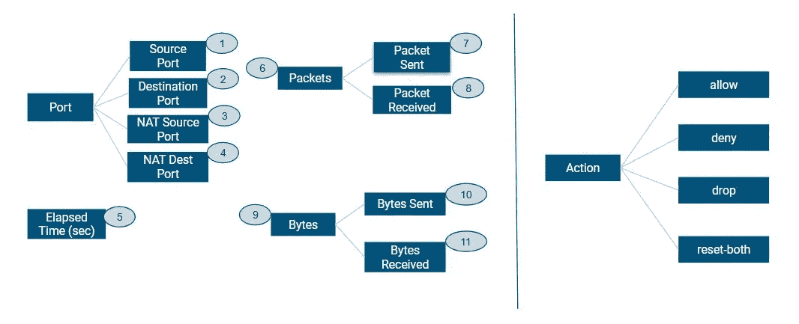

预测器(端口、数据包、字节和运行时间)和目标(动作)的层次结构

任务是根据*11 个*预测器对请求进行有效分类。目标变量 Action 有*四个*类。

1.  **允许** —良好的流量，让它击中服务器
2.  **拒绝** —阻止请求并向发送者回复拒绝访问
3.  **放弃** —悄悄地放弃请求
4.  **reset-both** —请求被阻止，RST 被发送以结束连接

# 数据准备

## 1.平衡等级

在正常情况下，防火墙通常允许请求通过。结果，我们可以看到 57%的请求只属于*允许类，*和低至 0.0008%的请求属于*重置-两者都属于*类。

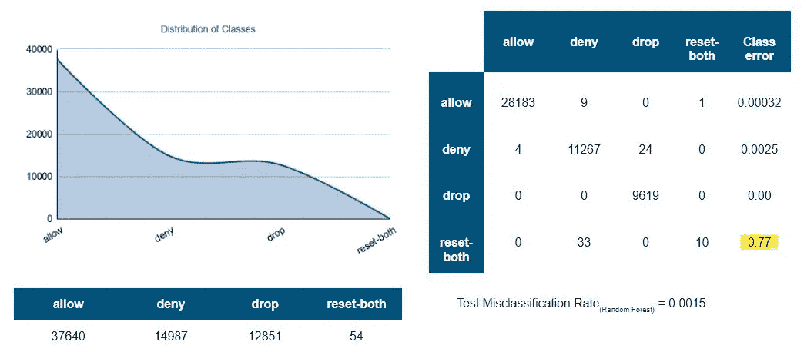

平衡前的类别分布和混淆矩阵

从随机森林分类器中提取的混淆矩阵显示，第四类*rest-both*(0.77)*的误分类率比其他类高很多。我们的模型将超过 75%的*重置错误分类——两个*请求都被*拒绝，*这非常糟糕！*

*这是不平衡类问题的一个副作用，算法没有足够的数据来学习一个应该被归类为*重置的请求是什么样子的。**

***合成少数过采样技术(SMOTE)** :*

> *一种从少数类中合成新样本的数据扩充过程。该算法在特征空间中随机选择一个点 *A* ，并找到它的 k 个最近邻。再次随机选取这些邻居 *B* 中的一个，并画一条线。然后在特征空间中沿着这条线创建合成样本。*

*在这个过程之后，我们看到这些类在某种程度上是平衡的。我认为进一步对 *action* 类进行欠采样以避免任何潜在的模型偏差可能是个好主意。注意*重置-平衡等级后*错误分类误差从 0.77 下降到 0.13！*

*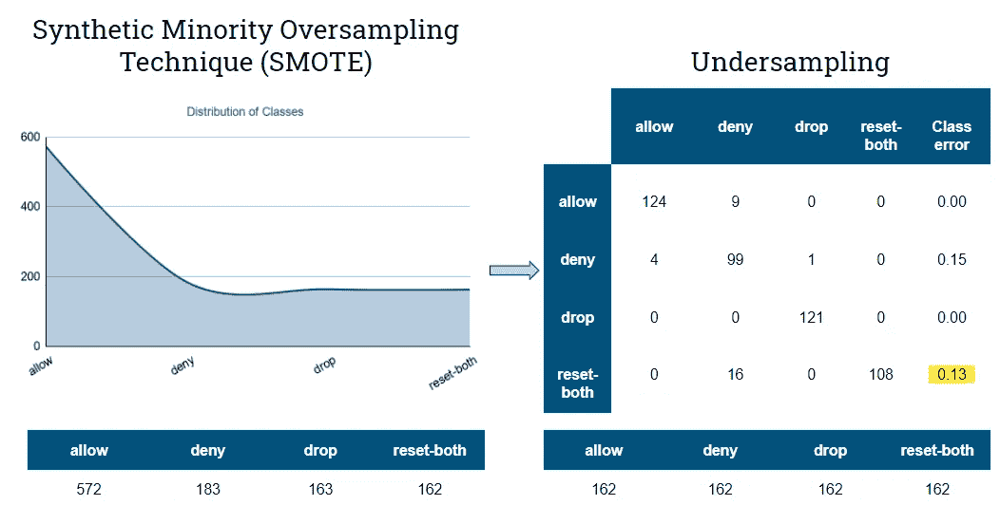*

*平衡后的类别分布和混淆矩阵*

*可以看出，*否定*的误分类误差却略有增加。欠采样会导致信息丢失，其结果是误差会有所增加。但是我们将关注于使我们的模型能够同样好地理解所有的类。*

## *2.特征缩放*

*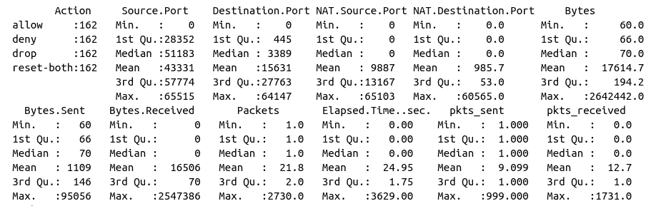*

*缩放前的功能摘要*

*像数据包(平均值约为 21.8)和字节(平均值约为 17614)这样的特征是完全不同的。像 KNN 和 SVM 这样基于距离的算法受特征范围的影响最大。因此，标准化(sd=1)非常重要，以确保距离不受不同比例的要素的影响，并且所有要素对结果的贡献都是相同的。*

*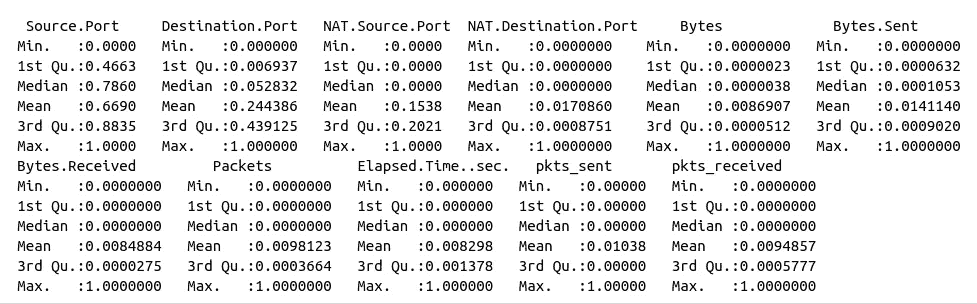*

*缩放后的功能摘要*

## *3.特征重要性*

*了解哪些特性会影响*动作*，哪些不会，这可能会有所帮助。相关矩阵有助于我们了解这些特征中是否有高度相关的，甚至是分层的和冗余的。*

*像*字节*这样的一些特性与*字节高度相关(> 0.9)。已发送和字节。收到*个数据包，和*个数据包。发送了*和*数据包。收到*。为了避免噪声而涉及所有这些相关的特征可能是没有意义的。*

*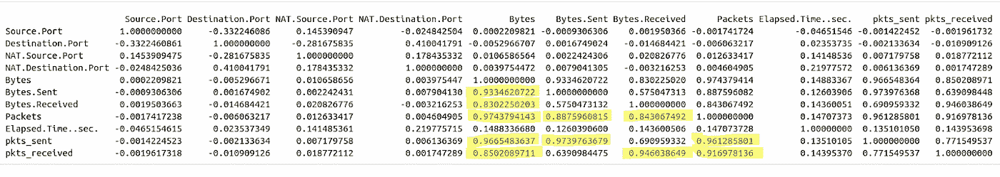*

*特征相关性*

*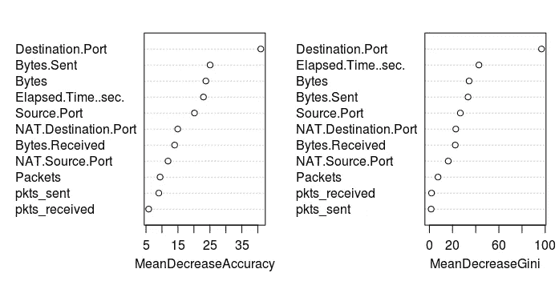*

*来自随机森林分类器的特征重要性*

*一个随机森林分类器认为*目的地。端口*是最重要的特性。*字节*，*字节。派出的*和 E *失效了。时间似乎也有助于预测。请注意，在此处的预测中并未实际使用所有的重叠要素。**

> *有趣的是，其中一些观察结果与领域知识非常吻合。UDP 泛洪(DoS)通常通过监控不规则端口上的流量来识别。为了防止这种情况发生，防火墙被配置为只允许某些预先确定的端口上的流量。*

# *数据建模*

*没有一种模式适合所有问题。因此，我们将继续在几个众所周知的分类算法上测试我们的数据，比较它们，并选择最好的一个。*

*我们将从简单的算法开始，如 KNN、逻辑回归、线性判别分析、朴素贝叶斯，然后将重点转移到越来越复杂的算法，如基于树的分类器、SVM 和神经网络。*

## *1.搜索超参数范围*

*为了执行我们的超参数搜索，我们将不使用交叉验证，而是以 75:25 的比例随机分割数据作为训练集和验证集。找到一个能很好地拆分数据的种子是很重要的(验证误差通常略高于训练误差)。*

## ***K-最近邻居:***

*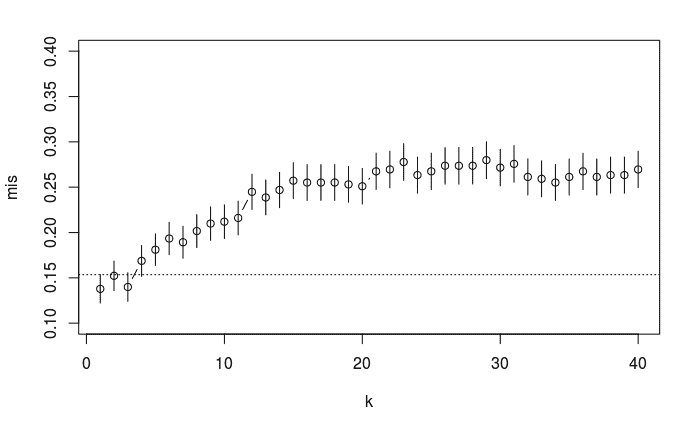*

*调谐 KNN*

*根据 [*一个标准误差规则*](https://stat.ethz.ch/R-manual/R-patched/library/mgcv/html/one.se.rule.html) (mis⋍0.15).*

*众所周知，KNN 在高维空间中挣扎，所以最好排除不必要的特征。然而，在这种情况下，消除高度相关的特征并不影响测试误差。*

## ***随机森林:***

**

*调整随机森林*

*   *使用 mtry=(2，4，6，8，10)和 nodesize=(2，4，6，8，10)的网格调谐，在列车分离时使用重复的 RF 交叉验证 OOB 误差。*
*   *相对 OOB 误差箱线图表明较低的 mtry 值(<=4) and higher values of nodesize (> =4)效果不佳。用 mtry>6 和 nodesize <6.*

*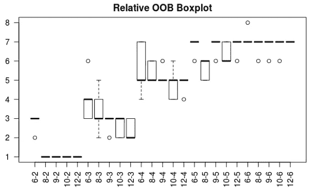*

*Fine-tuning Random Forest*

*   *Fine-tuned again using a grid of mtry=(6,8,9,10,12) and nodesize=(2,3,4,5,6) using repeated cross validation on the train split.*
*   *mtry along (8,9,10,12) are doing well with nodesize=2.*

*The best parameters seem to be around mtry=8 and nodesize=2*

## ***神经网络**再次重复这个过程是一个好主意*

*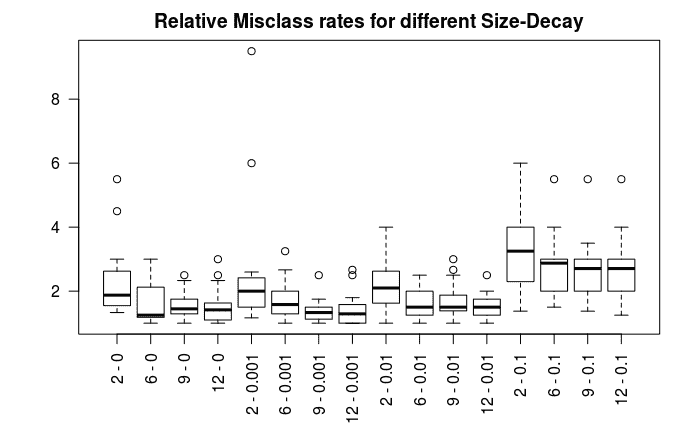*

*调谐神经网络*

*   *使用大小=(2，6，9，12)和衰减=(0，0.001，0.01，0.1)的网格进行调整，并在列车分割上使用重复的交叉验证。*
*   *在这种情况下，decay=0.1 显然不是一个好的选择。*

*最佳参数集似乎是大小=9，衰减=0.001*

## ***支持向量机:***

*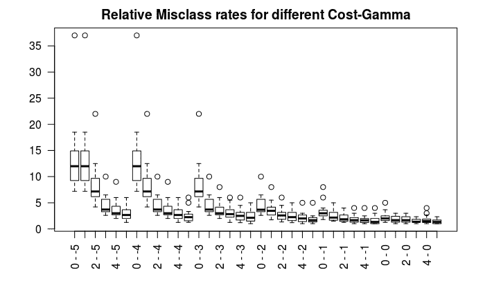*

*调谐 SVM*

*   *使用 cost=(10⁰，10，10，10，10⁴，10⁵)和 sigma=(10-⁵，10-⁴，10-，10-，10- ,10⁰)的网格调谐，使用列车拆分的交叉验证。*
*   *成本=1 显然效果不好。(图中 10 的幂)*

*cost=10⁵和 sigma=10⁰周围的参数似乎是最好的选择。*

## *2.型号选择*

> *使用交叉验证对多次分割的误差进行平均以减少错误分类率的可变性是很重要的。考虑到模型不是在一次随机分割中选择的，而是在多次分割的过程中选择的，这确保了模型选择的更大置信度。*
> 
> *交叉验证也使用每个数据点在过程中的不同时间进行训练和评估。当数据集很小时，这尤其有用。*

*10 重交叉验证在每一重中都包括以下步骤:*

1.  *对每个模型的训练数据进行内部交叉验证。这对于确保为该分割选择每个模型的最佳参数以确保公平比较非常重要。*
2.  *评估折叠的测试数据，并注意分割的测试误差。*
3.  *对 10 次拆分中的每一次重复这两个步骤。*

*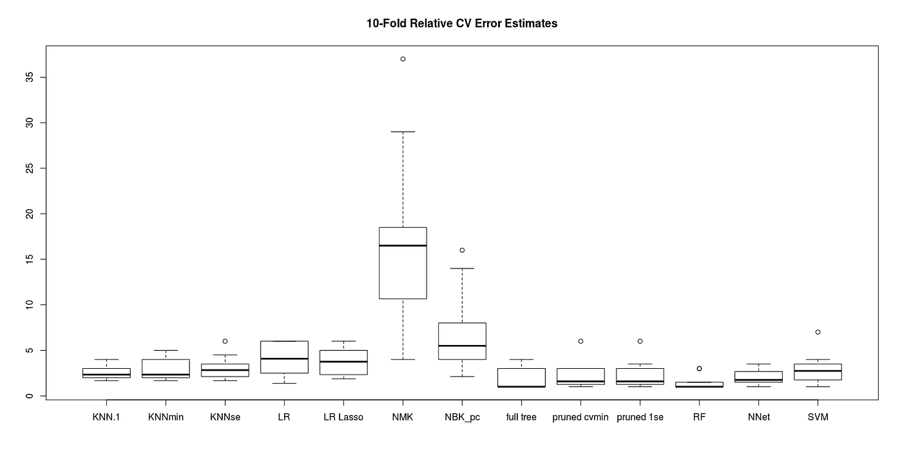*

*相对交叉验证错误分类率的箱线图*

*对于这个问题，随机森林显然是表现最好的模型，而朴素贝叶斯是最差的选择。KNN 和特里斯的平均值相当，但模型可变性稍高。*

## *3.结果*

*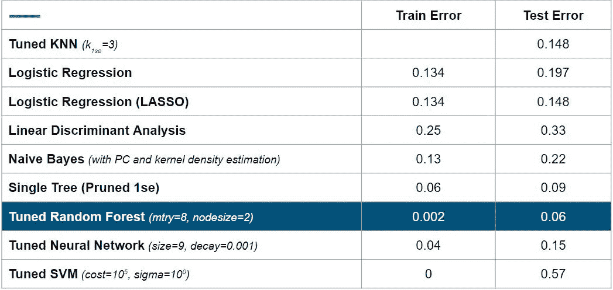*

*所有模型的错误分类率*

## *随机森林——成功的模式*

*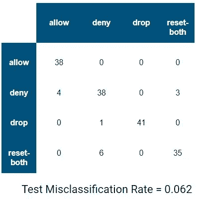*

*随机森林的混淆矩阵*

*   *第一类 *allow* 似乎是最容易预测的，零误分类。*
*   *在识别属于*重置的类之间存在一些不确定性*和*都否认*。*
*   *将*拒绝*作为*允许*的小误分类错误尤其会影响用于关键服务器的防火墙。*

# *结论*

*随机森林分类器的结果非常有希望，因为这只是一个开始，是人工智能在网络安全领域可以做什么的前奏。预测可以用大质量数据集进一步改进，该数据集可能包括高级特征，如验证码失败、地理定位、请求类型加密、标题等。*

*该项目的 R 代码可以在 [GitHub](https://github.com/pallavibharadwaj) 的[这里](https://github.com/pallavibharadwaj/IntelliWAF)找到。请在 [Twitter](https://twitter.com/pallavibharadwj) 上分享您的想法、投稿或联系。*