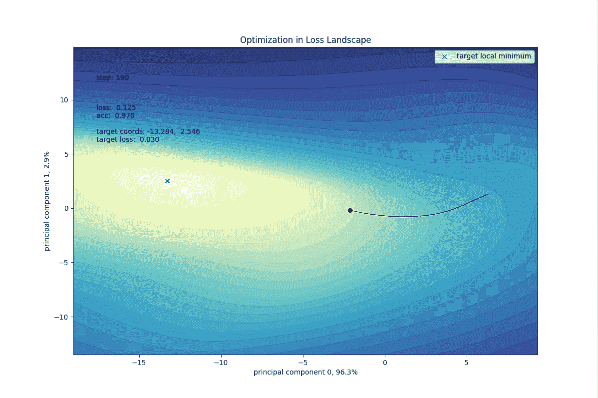
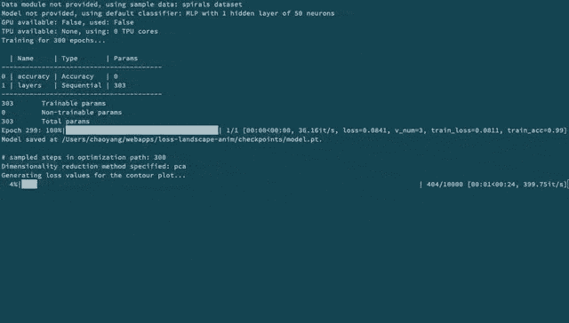
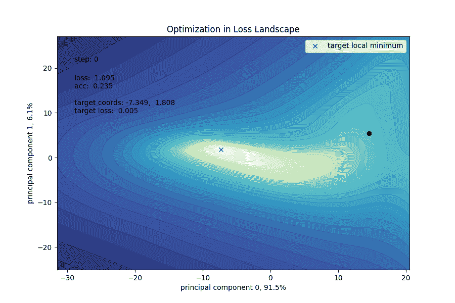
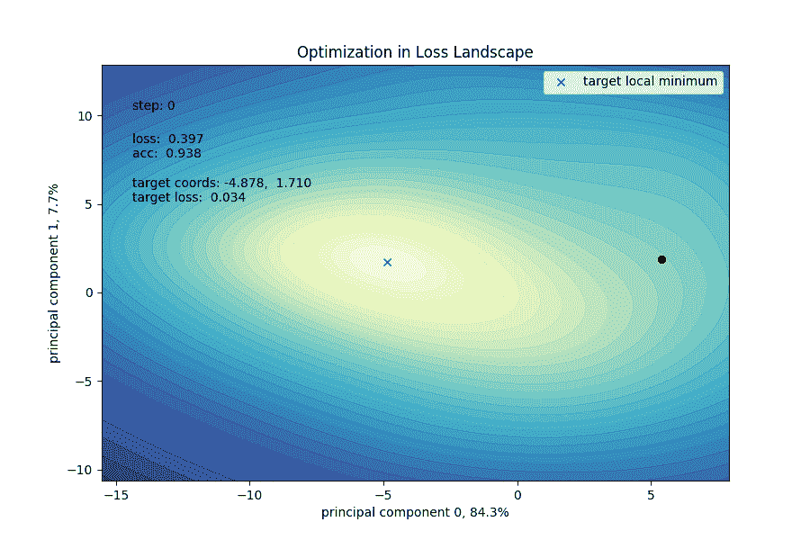
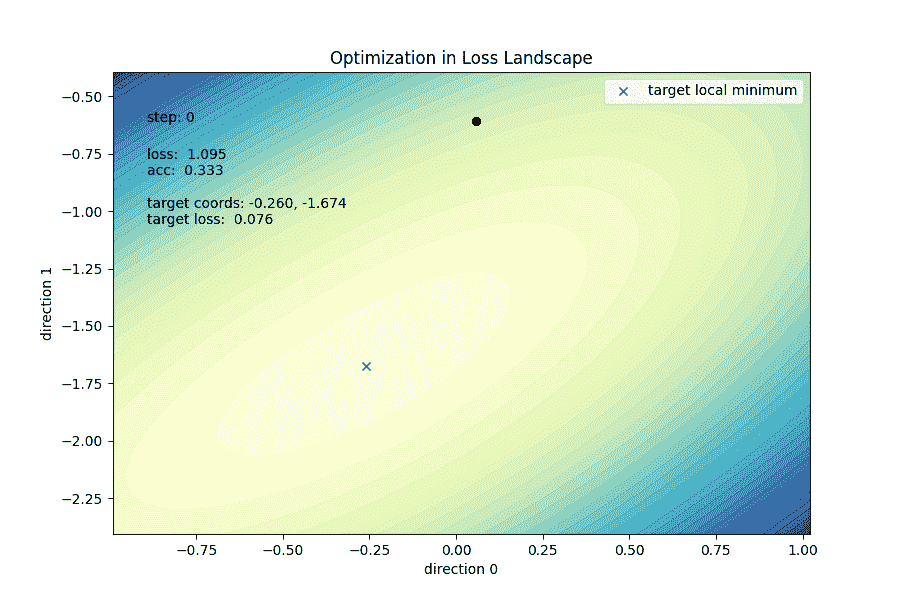
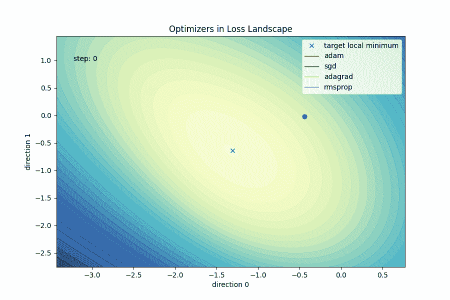
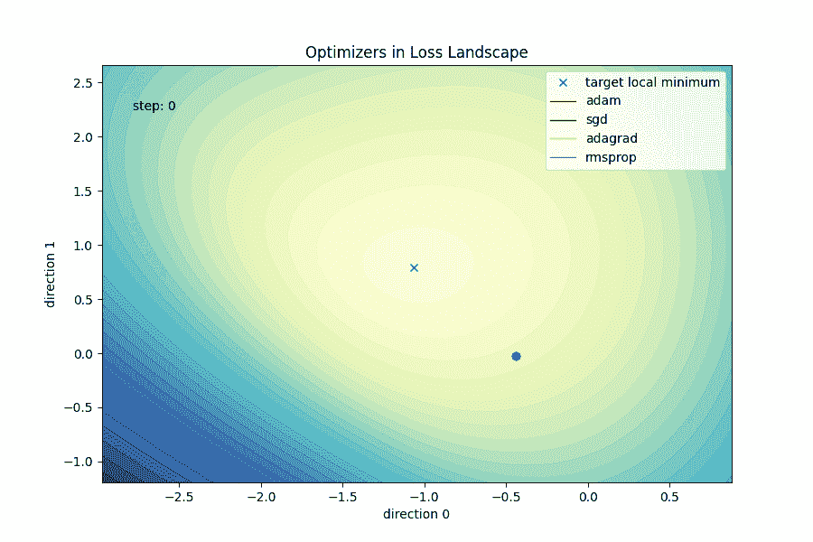

# 介绍损失景观动画 Python 包

> 原文：<https://towardsdatascience.com/introducing-the-loss-landscape-animation-python-package-2bf091a68734?source=collection_archive---------36----------------------->

## 从动画到直觉



作者图片

在我之前的文章[可视化神经网络的优化轨迹](/from-animation-to-intuition-visualizing-optimization-trajectory-in-neural-nets-726e43a08d85)中，我展示了一些动画图来演示神经网络的训练过程。从那以后，一些读者表达了对代码的兴趣，所以我把它移植到一个 [Python 包](https://github.com/logancyang/loss-landscape-anim)中，并在 PyPI 上发表了它。有了这个包，您可以轻松地生成类似的绘图，开箱即用地试验默认数据集和默认模型，或者通过以 [**PyTorch Lightning**](https://www.pytorchlightning.ai/) 的风格实现一个接口来绘制您自己的数据模块和/或模型。

# 装置

从 PyPI 直接安装

```
pip install loss-landscape-anim
```

或者您可以直接从源代码安装。我推荐用[诗词](https://python-poetry.org/)。如果你不知道什么是诗，我强烈推荐你去看看。这是一个非常简洁的依赖管理器，会让你的生活变得更加简单。一旦您克隆了这个 [repo](https://github.com/logancyang/loss-landscape-anim) 并安装了 poem，只需在项目目录中运行下面的命令来安装依赖项。

```
poetry shell
poetry install
```

`pip install -r requirements.txt`没有诗，也要工作。

# 基本示例

使用提供的螺旋数据集和默认的多层感知器(MLP)模型，您可以直接调用 loss_landscape_anim 来获得一个示例动画 GIF，如下所示:

```
from loss_landscape_anim import loss_landscape_anim# Use default MLP model and sample spirals dataset
loss_landscape_anim(n_epochs=300)
```

在终端中以脚本的形式运行这段代码，您会看到如下内容:



作者图片

您也可以在 Jupyter 笔记本上运行它。结果应该是这样的:



作者图片

请注意，如果您在笔记本中使用它，不要忘记在顶部包含以下行:

```
%matplotlib notebook
```

这是另一个例子——MNIST 数据集上的 LeNet5 卷积网络。您可以调整许多杠杆:学习速率、批量大小、时期、GIF 输出的每秒帧数、可重复结果的种子、是否从训练好的模型加载等等。查看函数签名了解更多细节。

```
from loss_landscape_anim import (
    loss_landscape_anim, MNISTDataModule, LeNet
)bs = 16
lr = 1e-3
datamodule = MNISTDataModule(batch_size=bs, n_examples=3000)
model = LeNet(learning_rate=lr)

optim_path, loss_steps, accu_steps = loss_landscape_anim(
    n_epochs=10,
    model=model,
    datamodule=datamodule,
    optimizer="adam",
    giffps=15,
    seed=180102,
    load_model=False,
    output_to_file=True,
    return_data=True,  # Optional return values if you need them
    gpus=1  # Enable GPU training if available
)
```

MNIST 数据集上 LeNet5 的输出如下所示:



作者图片

# 随机和自定义方向

在我之前的[文章](/from-animation-to-intuition-visualizing-optimization-trajectory-in-neural-nets-726e43a08d85)中，我提到了为什么选择 PCA 作为优化轨迹可视化的降维方法。虽然这是一个很好的方法，但是如果您需要更多的控制并设定自己的方向，软件包也允许您这样做。你可以设置任意两个方向，可以是随机生成的，也可以是你提供的。

对于 2 个随机方向，将`reduction_method`设置为`"random"`，例如

```
loss_landscape_anim(
    n_epochs=300, load_model=False, reduction_method="random"
)
```

对于您选择的两个固定方向，将`reduction_method`设置为`"custom"`，例如

```
import numpy as np

n_params = ... # number of parameters your model has
u_gen = np.random.normal(size=n_params)
u = u_gen / np.linalg.norm(u_gen)
v_gen = np.random.normal(size=n_params)
v = v_gen / np.linalg.norm(v_gen)

loss_landscape_anim(
    n_epochs=300,
    load_model=False,
    reduction_method="custom",
    custom_directions=(u, v)
)
```

这是一个由两个随机方向产生的样本(与 PC 方向不同，你可以在这个高维路径的 2D 投影中看到一个奇怪的曲线):



作者图片

默认，`reduction_method="pca"`。

# 自定义数据集和模型

要使用您自己的数据集和模型，请执行以下步骤:

1.  准备好你的`DataModule`。参考 [datamodule.py](https://github.com/logancyang/loss-landscape-anim/blob/master/loss_landscape_anim/datamodule.py) 获取示例。
2.  定义继承了`model.GenericModel`的定制模型。参见 [model.py](https://github.com/logancyang/loss-landscape-anim/blob/master/loss_landscape_anim/model.py) 获取示例。
3.  一旦您正确设置了您的自定义`DataModule`和`model`，调用如下所示的函数来训练模型并绘制损失景观动画。

```
seed = ...
bs = ...
lr = ...
datamodule = YourDataModule(batch_size=bs)
model = YourModel(learning_rate=lr)

loss_landscape_anim(
    n_epochs=10,
    model=model,
    datamodule=datamodule,
    optimizer="adam",
    seed=seed,
    load_model=False,
    output_to_file=True
)
```

# 比较不同的优化器

正如论文[可视化神经网络的损失景观](https://arxiv.org/abs/1712.09913v3)中提到的，优化路径通常落入一个非常低维的空间，随机 2D 投影很可能看起来像随机行走。另一方面，不同的优化器可以在高维空间中采取非常不同的路径。因此，很难选择两个方向来有效地比较不同的优化器。



以亚当的最优值为中心。作者图片

在这个例子中，我让`adam, sgd, adagrad, rmsprop`从相同的权重开始。下面的两个图形共享相同的两个随机方向，但是以不同的局部最小值为中心。第一个图形以 Adam 找到的图形为中心，第二个图形以 RMSprop 找到的图形为中心。从本质上讲，这两个平面是损失情况的两个平行的 2D 切片。

第一幅图显示，当以 Adam 路径的末端为中心时，看起来 RMSprop 要去一个损失值更大的地方。但是那是一种错觉。如果你检查 RMSprop，**的损失值，它实际上找到了一个比 Adam 的**损失更低的局部最优值。



以 RMSprop 的最优值为中心。作者图片

**这很好地提醒了我们，等高线只是一个非常高维的损失景观中的 2D 切片，等高线实际上并不反映实际路径的损失值**(除了中心点，因为我故意使用它作为锚点来定位 2D 切片)。

然而，我们可以看到，在这两种特殊情况下，无论它以哪里为中心，轮廓都是凸的。这或多或少反映了优化器应该不难找到一个相对较好的局部最小值。为了更严格地度量凸性，文中提到了一种更好的方法——使用*主曲率*，即 Hessian 的特征值。查看论文第 6 部分的结尾，了解更多细节。

为数学概念制作动画情节是获得直觉的好方法。通过更改模型配置和数据集，您可以随意使用这里的代码。对于大型模型，损失网格的生成可能计算量很大。你可以尝试使用图形处理器，并调整损失网格的分辨率。

这里是我的一些其他文章，你可能会感兴趣

*   [为什么是乙状结肠:概率观点](/why-sigmoid-a-probabilistic-perspective-42751d82686)
*   [我如何设计自己的全栈式 ML 工程学位](/how-i-designed-my-own-full-stack-ml-engineering-degree-297a31e3a3b2)
*   [为反向传播建立心智模型](/building-a-mental-model-for-backpropagation-987ac74d1821)
*   [用分形树开拓空间](https://levelup.gitconnected.com/colonize-space-with-fractal-trees-ecd6cbb6e78c)

关注我并订阅我的[电子邮件列表](https://medium.com/@loganyang/about)以获取新文章的更新。

感谢阅读！