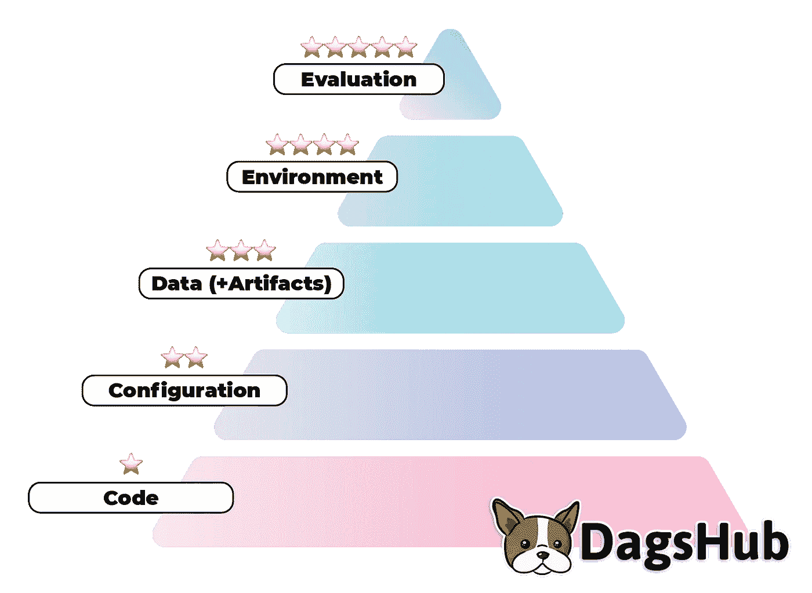

# 介绍机器学习再现性量表

> 原文：<https://towardsdatascience.com/introducing-the-machine-learning-reproducibility-scale-fb4b8e7f16f4?source=collection_archive---------39----------------------->


罗伯特·索林在 [Unsplash](https://unsplash.com?utm_source=medium&utm_medium=referral) 上的照片

## 量化机器学习的可重复性，并提出一个统一的项目可重复性排名系统

机器学习项目的可重复性是一个反复出现的话题，在许多不同的背景下被提出来——在学术界和工业界[都有](https://proceedings.neurips.cc/paper/2015/file/86df7dcfd896fcaf2674f757a2463eba-Paper.pdf)。有很多意见，主要集中在工具上，这很好，但会导致[关注特性而不是解决具体问题](https://dagshub.com/blog/solve-your-mlops-problems-with-an-open-source-data-science-stack/)。与此同时，似乎还没有做很多工作来提供一种量化给定项目的可再现性的方法，这意味着许多这些讨论仍然是抽象的，并且对于寻求一种方法来评估他们的工作并决定如何在可再现性方面改进它的从业者来说可能不太有用。

很多时候，评估重现一个给定项目的难易程度是一个巨大的挑战。这阻碍了人们在现有工作的基础上进行构建，导致轮子的重新发明，并导致对[开源机器学习](https://dagshub.com/blog/a-case-for-open-source-data-science/)项目的不信任。

但不一定非要这样。在这篇文章中，我将尝试提供一个具体的 5 星级排名系统，以及一个可以添加到机器学习项目的报告，该报告可以帮助其他人了解重现他们感兴趣的项目应该有多容易。

# 两种不同类型的再现性

一般来说，再现性是一个来自科学领域的术语，它被定义为:

> *研究结果的可再现性是指当研究被复制(重复)时，通过实验或观察性研究或数据集的统计分析获得的结果应具有高度的可靠性。*

在我们的例子中，我们可以将其分为两种不同类型的再现性:

*   技术再现性
*   科学再现性

在这里，技术再现性意味着通过运行项目的内容，我们实现了相同的输出，而科学再现性意味着实验的主张也被运行的输出所验证。

我们应该区分这些，因为在某些情况下，科学再现性可能更具定性，例如 GAN 项目，在该项目中，很难对结果进行定量比较，并且许多论文依赖于“目测”输出的质量。

另一方面，技术再现性纯粹是定量的。在 GAN 的例子中，技术再现性意味着生成运行将产生具有相同权重的模型。这可以通过比较权重来明确评估。

这凸显了另一个不同之处——技术再现性通常需要记录或硬编码随机种子来获得相同的结果。科学再现性有些相反——如果你不能用不同的随机种子得到相同的科学结果，它就不是科学可再现的。

这篇文章将关注技术的可复制性。

# 五星体系

五星体系为 ML 项目的可重复性设定了明确的标准。它由以下组件组成:

1.  密码
2.  配置
3.  数据(+工件)
4.  环境
5.  估价

我认为这个顺序也与实现每个阶段的难度相对应，尽管很明显，这是有待商榷的。



可扩展性的金字塔。鸣谢:作者(DagsHub)

让我们深入了解每个阶段。

# 代码⭐️

**含义:**你的代码可以接收一个输入，端到端地运行，并产生预期的输出。这里的输入通常是数据集，但有时也可能是其他东西，比如可解释性项目中的模型。输出通常是一个模型或一些图表或指标形式的“洞察力”。

**具体标准:**

1.  当接收到正确的输入时，您的代码运行无误
2.  您有一个代码可以在其上运行的示例输入，例如，如果您的项目是一个对象检测项目，您有一些已保存或已下载的数据集，模型将在其上运行而不会出错。
3.  对于上面的输入，多次运行代码将产生相同的输出。

**有用的工具:**

1.  饭桶

实际上，许多(但不是所有)发布代码的项目都遵循这个阶段。他们有一个示例数据集，以及在该数据集上运行并返回一个包含指标的文件的代码，这些指标显示模型已经了解了它应该了解的内容。

# 配置⭐️⭐️

**含义:**您有一个明确定义的配置文件，它与您的代码一起提交，并为给定的运行定义可配置的参数。代码使用这个配置文件来设置运行中的参数，它们不是以特别的方式编写的。

**具体标准:**

1.  您有一个或多个配置文件(这些文件可以是`YAML`、`JSON`或其他文件),它们包含了实验的**所有可配置的**参数。**重要说明**:这并不意味着所有的模型参数都必须出现在这个文件中，而是您特别配置的任何参数都必须出现在这里，这样就可以很容易地看到哪些参数被试验过，并且可以在现有项目的基础上修改它们。
2.  所有非确定性函数都有一个在配置文件中设置的种子(即[随机种子](https://pytorch.org/docs/stable/notes/randomness.html)必须出现在配置文件中)。
3.  该代码使用配置文件提取参数，并将它们输入到各自的函数中。这意味着，如果您有一个名为`epochs`的参数，其值为 5，它保存了训练模型的历元数。如果该值更改为 6，模型现在应该为另一个时期进行训练。这不一定是 Python 代码，可以通过创建 Makefile 来解决，该 Makefile 将配置参数作为命令行参数传递给代码。
4.  相同配置的多次运行会产生相同的结果。这是对第一阶段的扩展，因为这意味着该项目对于任何一组配置参数都是可再现的，而不仅仅是在发布版本中使用的选定参数。

**有用的工具:**

1.  水螅
2.  饭桶
3.  实验跟踪工具(例如 MLflow)

这一步并不总是作为典型项目的一部分。在许多情况下，配置是在项目的发布位置之外进行跟踪的，这意味着很难将使用的配置与直接联系起来，并且无法评估未成功生成最终结果的配置，这些配置可能会永久隐藏。

# 数据(+工件)⭐️⭐️⭐️

**含义:**你所依赖的数据和你的代码一起被管理。可以很容易地修改它，用其他数据集测试模型。如果您的项目有大量的资源需求，并且可以分成离散的步骤(例如，数据处理、培训等。)然后还跟踪每个阶段的工件，以便能够单独测试每个阶段的可再现性。

**具体标准:**

1.  数据集与代码一起管理。在某些情况下，这意味着它是预先下载的，或者它可能是流式的，但是它应该存在于项目的上下文中，以这样一种方式，您可以很容易地检索它来运行端到端的实验。
2.  记录数据集结构和要求。这意味着数据接口是清晰的，以这种方式构建其他数据集来运行实验应该是一个简单的过程。
3.  数据很容易修改。这意味着您可以用符合标准 2 的其他数据集替换本文中使用的数据集。，并成功运行该模型。
4.  对于资源密集型项目——项目管道被分割，中间工件与代码一起被跟踪和管理。这意味着，如果您有一个预处理步骤和一个训练步骤，那么一个协作者只能运行这两个步骤中的一个，并接收可测试的输出。

对于仅追加但历史数据从不更改的表格数据，保存生成用于定型的数据子集的查询和时间过滤器可能就足够了。中央日志记录或点击流数据就是一个很好的例子。但是在你写下这一步之前， [**记住，很多时候看起来永远不会被修改的数据最终会被修改**](https://venturebeat.com/2021/03/16/imagenet-creators-find-blurring-faces-for-privacy-has-a-minimal-impact-on-accuracy/) 。

**有用的工具:**

1.  DVC
2.  莱克夫斯
3.  哑弹
4.  Dolt —仅用于表格数据
5.  TerminusDB 仅用于表格数据

# ⭐️⭐️⭐️⭐️环境部

**含义:**您的环境以这样一种方式被跟踪和记录，即可以下载所使用的特定软件版本，并且可以设置特定硬件以实现与原始实验运行时相同的设置。实验环境是指实验运行时使用的所有软件和硬件版本。例如 PIP 包、您的 Python 版本、您使用的操作系统以及您在哪个 GPU 上运行实验。

**具体标准:**

1.  你有一个使用过的所有软件包的列表。在 Python 的情况下，包可以记录在一个`requirements.txt`文件中。
2.  您有一个示例环境，在该环境中项目运行时没有出现错误。实现这一点的最简单的方法是使用 Docker 映像，它也包含特定的操作系统和 Python 版本常量之类的内容。请注意，在某些情况下，尤其是在深度学习中，Docker 可能不够，您需要描述所使用的具体硬件和驱动程序版本(例如在 GPU 的情况下)，因为 [Docker 不是实际的 VM](https://dagshub.com/blog/setting-up-data-science-workspace-with-docker/) 。
3.  如果您的项目依赖于特定的硬件，那么应该提供安装文档。这个很简单。

**有用的工具:**

1.  码头工人
2.  `pip freeze`
3.  `conda env export`
4.  Python-dotenv

# 评估⭐️⭐️⭐️⭐️⭐️

**含义:**你可以很容易地试验运行结果。如果项目的产出是可操作的，即一个预测/生成产出的模型，这一点尤其重要。这可以从一个简单的 API 到一个完整的 UI，但它应该能够以一种能够在运行结果之间进行定性比较的方式处理再现的输出。

**具体标准:**

1.  您可以轻松地使用项目输出模型来预测/生成来自自定义用户输入的结果。
2.  您可以轻松地对不同数据或配置设置下不同项目运行的输出性能进行定性比较。

**有用的工具:**

1.  细流
2.  格拉迪欧

# ML 再现性报告

ML 再现性报告是一个可添加到项目(另存为`REPRODUCIBILITY.md`)中的降价文件，提供关于项目再现性状态的简明文档。你可以从这里复制或者从这个链接[下载。](https://dagshub.com/DAGsHub-Official/reproducibility-challenge/src/master/REPRODUCIBILITY.md)


再现性报告，从[此处](https://dagshub.com/DAGsHub-Official/reproducibility-challenge/src/master/REPRODUCIBILITY.md)下载。鸣谢:作者(DagsHub)

```
# Machine Learning Reproducibility Report
This document helps provide a concise representation of the project's reproducibility ranking. ## 1\. Code 
* [ ] Runnable code for the project exists in the following project: https://dagshub.com/{user}/{project_name}/ 
* [ ] The example input is located in this link: {link_to_input} (this must be a proper link, ideally tracked as part of the project). Note: using this input in a project run should achieve the stated results without errors. ## 2\. Configuration 
* [ ] The following files include all relevant configuration parameters for the project: 
    - {params_1}.yml 
    - {params_2}.yml 
    - ... Note: make sure that changing the parameters in these files will modify the project's actual run parameters. ## 3\. Data (+ Artifacts) 
* [ ] All project data and artifacts can be found here: {link_to_project_data}. 
* [ ] The structure/schema of input data is the following: {Add data structure/schema here}. 
* [ ] If running the project is resource intensive - the project consists of the following steps: 
    1\. Data preprocessing: 
    - Code: {link to code for data processing step} 
    - Outputs: {link to output 1}, {link to output 2} 
    2\. Model training: 
    - Code: ... 
    - Outputs: ... 
    3\. ... ## 4\. Environment 
* [ ] Software package documentation: {link to `reuiqrements.txt` or equivalent file} 
* [ ] Example environment: {link to docker hub or other container registry with the environment docker image} 
* [ ] If the project uses specific hardware - the hardware needed to run the project properly: 
    - 2 V100 GPUs 
    - At least 32GB RAM 
    - ... ## 5\. Evaluation 
* [ ] To evaluate the model go to: {link to hosted Streamlit app or Google Colab notebook that enables users to perform predictions on arbitrary inputs} 
* [ ] Evaluation app code: 
    - {link to file with Streamlit app code} 
    - In order to run this locally: {link to instructions on running the streamlit app}
```

# 摘要

这篇文章试图提供具体的、可操作的步骤，任何项目所有者都可以采取这些步骤来显著提高他们项目的可重复性。我们提供的报告使其他人能够快速验证项目的再现性状态，以便根据再现性得分筛选项目。希望听到您对结构的反馈，以及对流程本身的想法