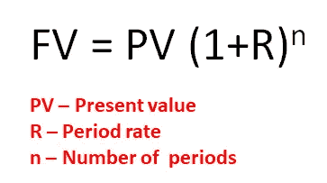
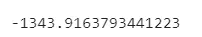
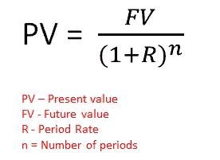
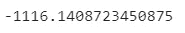
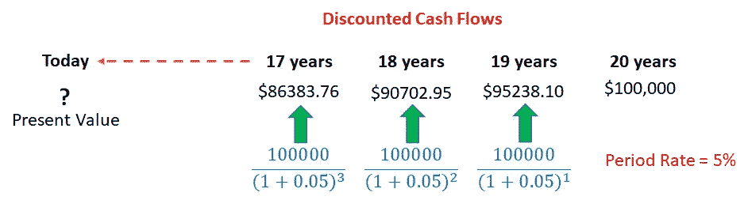
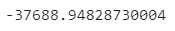
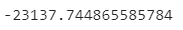
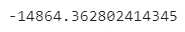
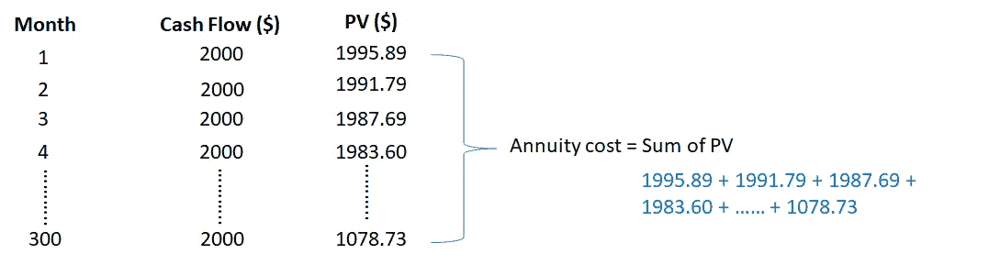
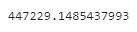

# 用 Python 介绍金钱的时间价值

> 原文：<https://towardsdatascience.com/introducing-the-time-value-of-money-with-python-20520ee51dfc?source=collection_archive---------17----------------------->

## 金钱和时间总是相互关联的。在本文中，我们将使用 Python Numpy Financial 来演示货币的时间价值示例。


迈克尔·朗米尔在 [Unsplash](https://unsplash.com/s/photos/money?utm_source=unsplash&utm_medium=referral&utm_content=creditCopyText) 上的照片

金钱的**时间价值**是一个基本的金融概念，它告诉我们，我们今天拥有的一美元比未来承诺的一美元更有价值。这是因为我们今天可以用手头的一美元进行投资，赚取利息/资本利得。

在本文中，我将通过以下几个主题来介绍货币的时间价值:

*   **未来值**
*   **现值**
*   **贴现现金流**
*   **现金流量折现法在年金估值中的应用**

我将演示我们如何使用[**Python NumPy-Financial**](https://numpy.org/numpy-financial/)来执行所有需要的计算。

# 必备 Python 库

1.  **NumPy-Financial**——[【https://numpy.org/numpy-financial/】](https://numpy.org/numpy-financial/)

# 开源代码库

本文中的原始完整源代码可以在我的 [Github Repo](https://github.com/teobeeguan/Algorithmic-Trading---Python/tree/main/Time%20Value%20of%20Money) 上获得。如果你想用它来跟踪我的文章，请随意下载。

# 1.**未来值**

首先让我们检查一下金融环境中未来价值的定义。

> 未来价值是一项投资在一个或多个复利期后将增长到的价值。[来源: [IFT](https://ift.world/concept1/concept-1-calculating-pv-fv-different-cash-flows/)

假设我们在银行有一笔 1000 美元的存款，年利率为 3%。1 年后，我们的存款的未来价值是多少？计算如下:

```
**future value (after end of 1 year) = 1000 * (1 + 0.03)**
```

2 年结束后的未来价值呢？

```
**future value (after end of 2 years) = 1000 * (1 + 0.03) * (1 + 0.03)**
```

因此，**未来值 FV** 可以表示为



作者准备的图像

让我们假设现在我们想要估计 10 年后的未来值 FV。我们可以使用***Python NumPy-Financial Fv***函数来处理计算。

*fv* 函数接受按顺序排列的四个参数:

1.  *利率——利率*
2.  *nper-复利数*
3.  *pmt —付款*
4.  *PV-现值*

结果如下:



作者准备的图像

**注意:** *你可能会注意到结果有一个负号。这是因为 Numpy-Financial 函数遵循 Microsoft Excel 符号约定，该约定总是表示正的未来值，导致负的现值，反之亦然。*

通过一行 Python 命令(不包括导入库)，我们可以得知 10 年结束后的未来值 FV 约为 **$1343.92** 。

# 2.现值

现在，让我们调整一下我们的问题:如果我们计划在 10 年后有 1500 美元，年利率为 3%，我们今天应该存多少？在这里，我们寻求 1500 美元的未来付款的现值(T21)。

> 现值是基于特定收益率的预期收入流的当前值。(来源:[维基百科](https://en.wikipedia.org/wiki/Present_value))

在这种情况下，我们得到一个未来值 1500 美元，年利率为 3%。我们只需要调整我们的未来价值公式 FV，来估算现值 PV。现值的计算公式如下:



作者准备的图像

我们可以使用***Python NumPy-Financial PV***函数来处理计算。



由此得出的现值表明，为了在 10 年后将我们的资本增加到 1500 美元(假设年利率保持不变，为 3%)，我们今天应该存入 1116.14 美元。

# 3.贴现现金流

现在，我们将在投资环境中扩展现值的概念。假设我们正在计划投资(如股票、债券或抵押贷款等)，这将在 20 年后给我们带来 100，000 美元的未来现金流。这里的问题是，20 年后 10 万美元的未来现金价值是多少？我们应该投入多少资金来实现我们的目标？

我们所需要的只是将未来的现金流贴现为从 19 年、18 年、17 年到今天的现值。这将导致一系列贴现现金流，最后一个值是现值。



作者准备的图像

幸运的是，我们可以在一行代码中使用相同的*Python NumPy-Financial Fv***函数来估算 20 年后 10 万美元的未来投资现金流的现值，从而避免复杂的计算。我们假定定期利率为每年 5%。**

****

**作者准备的图像**

**结果显示 100，000 美元的未来现金流以每年 5%的利率贴现为 37688.95 美元的现值。**

**现在，让我们通过将 20 年改为 30 年来调整我们的年数。**

****

**作者准备的图像**

**期限越长，现值越小(23137.74 美元)。**

**让我们再做一次调整，将周期利率从 5%改为 10%，但周期数仍为 20 年。**

****

**作者准备的图像**

**随着更大的期间利率为 10%，现值已大幅下降到只有 14864.36 美元。**

**在任何投资中，期数和回报率是根据我们的风险承受能力和财务目标决定我们初始投资额的重要因素。**

****值得注意的是，虽然较高的回报率承诺我们在固定时间框架内实现财务目标的初始投资额较低，但它总是伴随着较高的风险，需要对我们的投资工具进行更彻底的研究。****

# **4.**DCF 在年金估值中的应用****

**贴现现金流总是用于投资资产的估值。这里我们举一个年金估值的例子。**

> **年金是为一个人的一生或特定时期提供固定收入流的保险合同。(来源:[Annuity.org](https://www.annuity.org/annuities/))**

**假设你正在考虑一个保险公司的退休年金计划。你希望退休并在接下来的 25 年里每月获得 2000 美元。如果年贴现率是 2.5%，购买这份年金需要多少钱？**

****第 1–3 行:**将年贴现率转换为月贴现率，因为支付是按月进行的。**

****第 5–9 行:**生成从第 1 个月到第 300 个月的贴现现金流(或当前现值)序列。**

****

**作者准备的图像**

****第 11–12 行:**合计每个月的所有现值，得到年金成本。**

****

**作者准备的图像**

**计算出的年金成本为 447229.15 美元。给定每年 2.5%的贴现率，你将不得不为退休年金计划支付大约 450000 美元，该计划可以在 25 年内每月支付 2000 美元。**

# **结论**

**对金钱时间价值的理解有助于塑造我们的思维，尽早开始我们的财务和投资规划。通过对投资的良好管理，我们可以用最小的成本获得最大的利润。**

**我希望你喜欢阅读这篇文章。**

# **参考**

1.  **[https://ift . world/concept 1/concept-1-calculating-PV-Fv-different-cash-flow/](https://ift.world/concept1/concept-1-calculating-pv-fv-different-cash-flows/)**
2.  **https://en.wikipedia.org/wiki/Present_value**
3.  **【https://www.annuity.org/annuities/ **
4.  **[https://www.investopedia.com/terms/d/dcf.asp](https://www.investopedia.com/terms/d/dcf.asp)**