# 介绍 TigerGraph 3.2 的新地理空间布局功能:绘制新冠肺炎旅游事件地图

> 原文：<https://towardsdatascience.com/introducing-tigergraph-3-2s-new-geospatial-layout-feature-mapping-covid-19-travel-events-fe05b2b1d1e9?source=collection_archive---------38----------------------->

## 如何在新冠肺炎初学者工具包中使用 TigerGraph 3.2 的地理空间布局

# 导言和概述

## 老虎图 3.2

截至 9 月 30 日，TigerGraph 已经正式发布了 3.2 版本，现在 3.2 也同样适用于 TG Cloud！要了解更多关于该版本的信息，请查看发布说明。

 [## 发行说明- TigerGraph Server 3.2

### TigerGraph 文档中的官方 TigerGraph 发行说明

docs.tigergraph.com](https://docs.tigergraph.com/v/3.2/faqs/release-notes-tigergraph-3.2) 

## 基本原理

浏览图形数据时，可以使用地图坐标数据。TigerGraph 3.2 最近发布了一个全新的地理空间可视化功能，以帮助您轻松了解您的大部分数据位于何处，并识别可能存在的任何异常。

## 使用的工具

*   老虎图云
*   TigerGraph 新冠肺炎入门套件

## 旅程

*   第一部分:创建您的 TigerGraph 3.2 解决方案
*   第二部分:准备你的图表
*   第三部分:使用地理空间可视化功能

# 第一部分:创建您的 TigerGraph 3.2 解决方案

首先，我们将在 TigerGraph Cloud 上设置一个 TigerGraph 3.2 解决方案。为此，导航至 https://tgcloud.io/的，并创建您的免费账户(如果您还没有的话)。

 [## TigerGraph 云门户

### 在此创建您的免费帐户

tgcloud.io](https://tgcloud.io/) 

登录后，导航至“我的解决方案”选项卡，然后单击蓝色的“创建解决方案”按钮。

选择“我的解决方案”,然后单击蓝色的“创建解决方案”按钮。

您将被引导至一个四步流程来设置您的解决方案。在第一页上，确保您的 TigerGraph 版本为 3.2，然后单击初学者工具包的“新冠肺炎分析 3.2.0 版”图标。完成后，向下滚动并按“下一步”

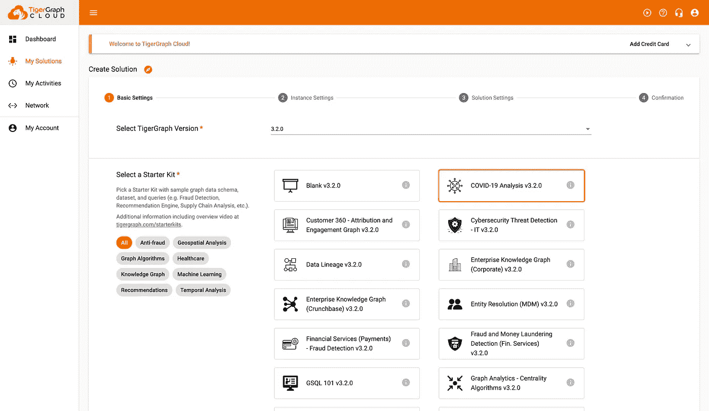

选择 3.2 作为版本，选择“新冠肺炎分析”作为入门套件。

像往常一样，如果你想创建一个免费的解决方案，不要为第二页编辑任何东西。在第三页上，为您的解决方案定制选项。

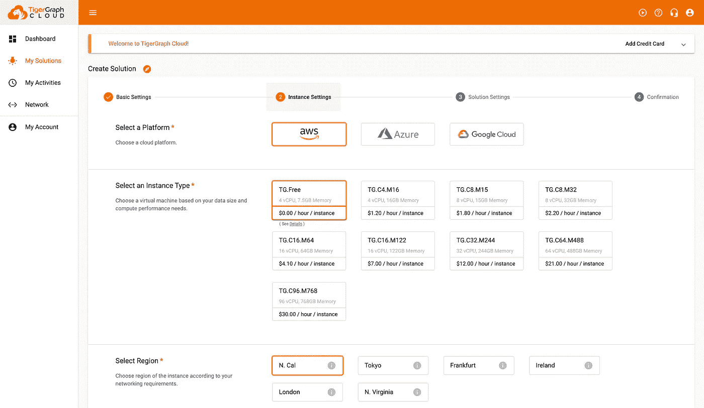

不要更改此页面上的任何内容！

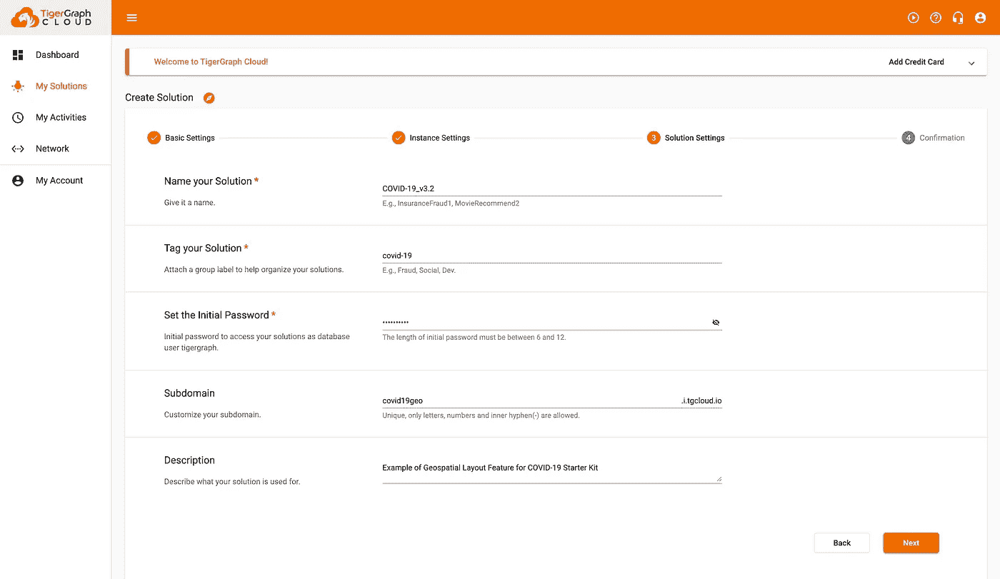

为您的解决方案定制此页面！

在最后一页，验证您输入的信息是正确的，然后按提交！设置可能需要几分钟时间。

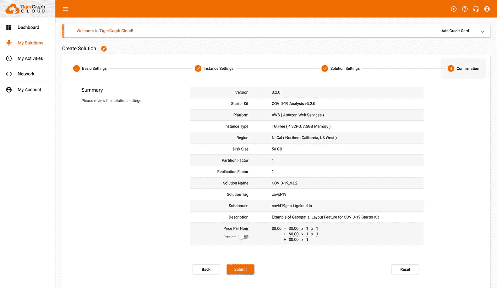

检查一切都好，并提交

# 第二部分:准备图表

在开始可视化数据之前，我们需要通过 GraphStudio 加载数据。为此，在您的解决方案旁边有一个绿点之后，按下四个小框(“应用”)并选择 GraphStudio。

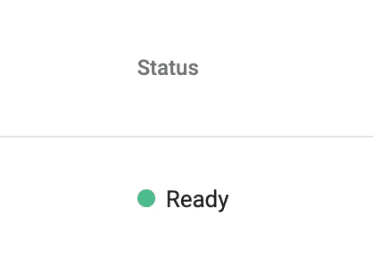

等到你的状态显示“准备好”

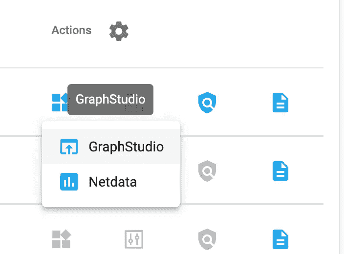

选择四个小框(“应用”)，然后从下拉列表中选择“GraphStudio”

您将被重定向到 GraphStudio。登录后，点击左上角的“全局视图”,然后从下拉列表中选择“我的图表”。

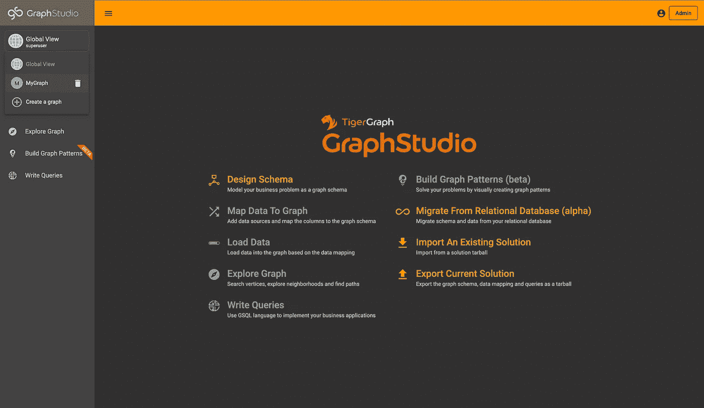

在“我的图形”中，选择“加载数据”选项卡。您可以通过按下播放按钮来加载所有文件，或者只选择 PatientRoute.csv 并按下播放按钮来只加载该文件，因为我们将只显示该博客的 TravelEvent 顶点。

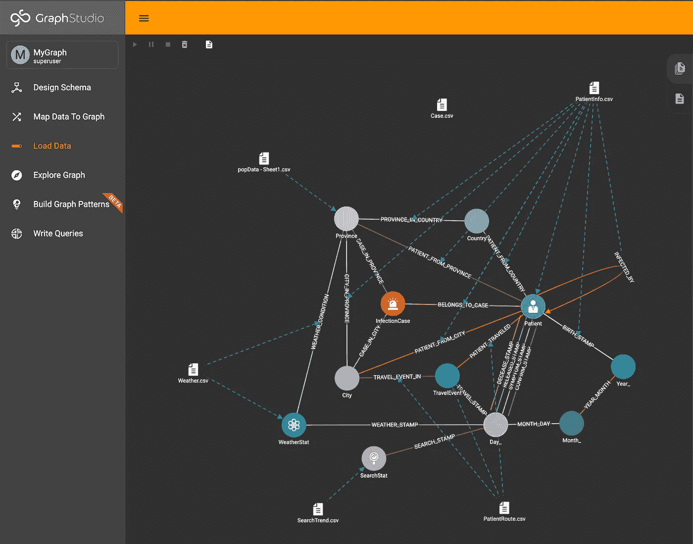

按左上角的播放按钮

等到它说“完成”，然后你将设置！

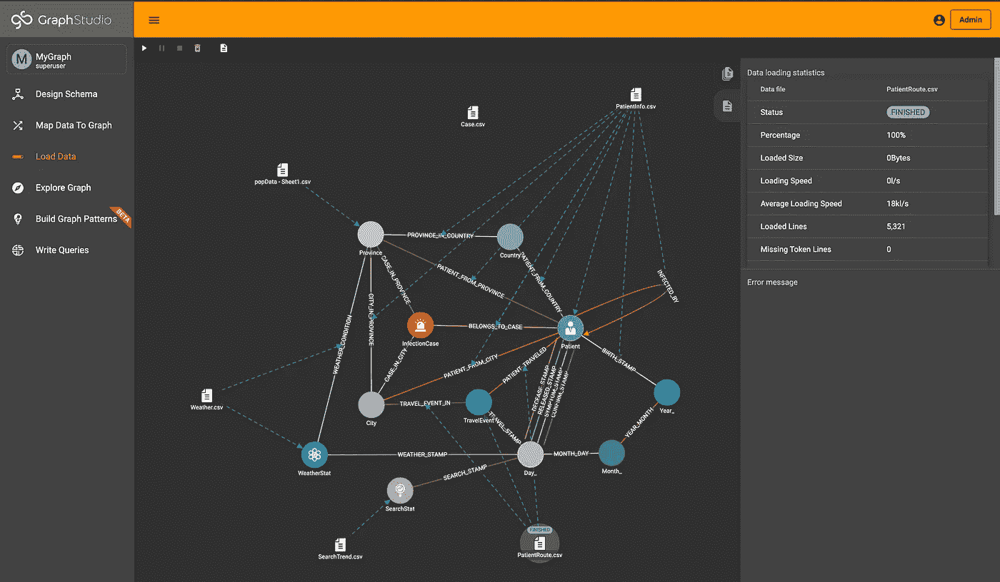

已成功加载 PatientRoute.csv。

> 注意:我们使用 TravelEvent 顶点是因为地理空间布局需要属性为**纬度**和**经度**的**顶点**。

# 第三部分:使用地理空间可视化功能

现在你有了数据，是时候可视化它了。点击进入“浏览图表”选项卡。

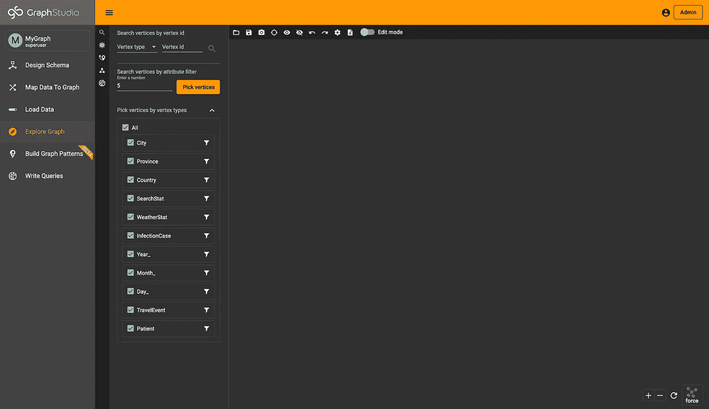

单击“浏览图表”选项卡

接下来，只选择“旅行事件”顶点，并选择其中的 100 个，按下“选择顶点”按钮。

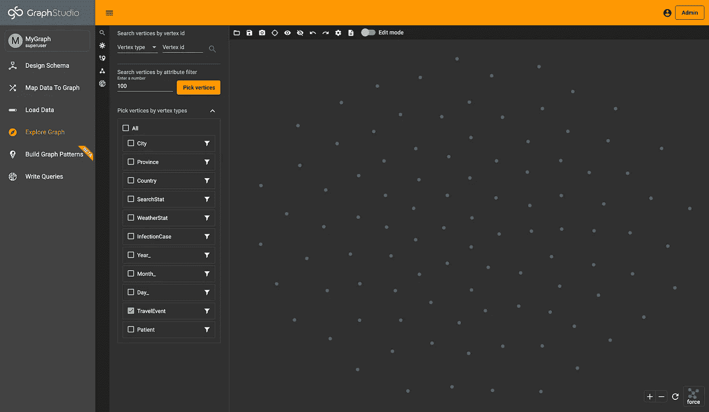

接下来，在右下角的下拉列表中选择“地理空间”。

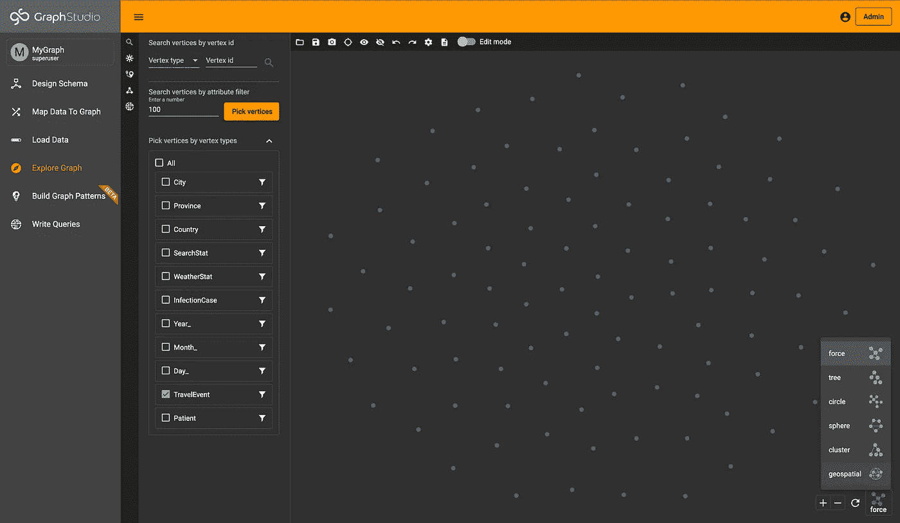

点击右下角的“地理空间”。

瞧，顶点现在在地图上了。

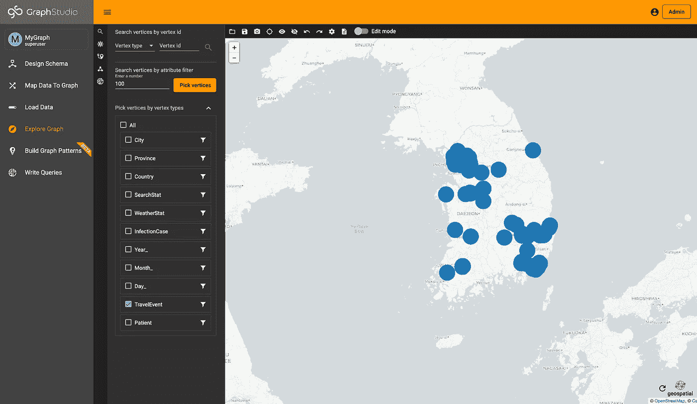

已映射的 TravelEvent 顶点

# 恭喜+后续步骤

恭喜你。您现在可以正式使用 TigerGraph Cloud 中的最新布局功能了！既然您已经将它用于初学者工具包，请尝试将其添加到您自己的数据和解决方案中。

如果您有任何问题，请不要犹豫，在社区论坛上发表。

 [## 老虎图

### 问 TigerGraph 问题！

community.tigergraph.com](https://community.tigergraph.com/) 

再者，如果你想和其他 TigerGraph 开发者聊天，一定要加入不和。

 [## 加入 TigerGraph Discord 服务器！

### 查看 Discord 上的 TigerGraph 社区-与 716 名其他成员一起玩，享受免费的语音和文本聊天。

不和谐. gg](https://discord.gg/gRHWBZNpxW)