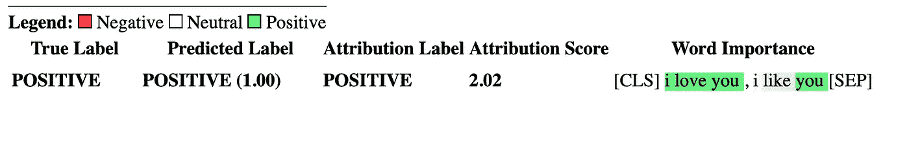

# 介绍变形金刚解释——变形金刚的可解释人工智能

> 原文：<https://towardsdatascience.com/introducing-transformers-interpret-explainable-ai-for-transformers-890a403a9470?source=collection_archive---------11----------------------->

## 2 行中任何变压器型号的型号说明。


艾米丽·莫特在 [Unsplash](https://unsplash.com?utm_source=medium&utm_medium=referral) 上的照片

> **TL:DR:** 《变形金刚解释》只用两行代码就把可解释的人工智能带到了《变形金刚》包中。它允许你简单地获得单词属性和这些属性的可视化。现在这个包支持所有带有序列分类头的 transformer 模型。
> 
> 点击这里查看项目:[https://github.com/cdpierse/transformers-interpret](https://github.com/cdpierse/transformers-interpret)

# 介绍

模型可解释性和最先进的研究似乎一直在进行一场拔河比赛。复杂的模型很难解释，而简单的模型往往更容易理解。

可解释的人工智能是当今机器学习中最重要的新兴子领域之一。出于道德、实践和——在企业界——法律的原因，我们必须能够解释所谓的“黑箱”模型的内部工作方式，这对于人工智能在我们生活中的长期成功至关重要。

对可解释人工智能的研究正在进行中，有许多了不起的项目和小组正在做着工作。构建 transformers interpret 的库名为 [Captum](https://captum.ai/) ，这是一个为 pytorch 中的模型可解释性而设计的包。我喜欢 Captum 的一点是，它有效地将可解释人工智能领域的所有领先研究整合到一个包中，当然，它针对 pytorch 进行了优化，这是一大优势。虽然 transformers interpret 只专注于 NLP，但 Captum 是多模态的，可以处理文本、计算机视觉和表格数据。Captum 的团队也做了出色的工作，给出了他们在整个软件包中使用的所有[算法](https://captum.ai/docs/algorithms)，如果你有兴趣了解 transformers interpret 的内部，这当然值得一试。

# 变形金刚解读入门

很像《拥抱脸变形金刚》背后的设计哲学,《变形金刚解读》的包装设计在最前沿就是易于使用。它在选择归因方法和如何总结归因方面固执己见。所有这些都允许终端用户只需 **2 行代码**就能获得他们模型输出的文字属性和可视化效果。目前，该软件包支持所有具有序列分类头的模型——因此(应该)适用于所有分类模型。计划支持问答模型和 NER 模型。

让我们来看一个动手的例子。要安装软件包，请执行以下操作:

```
pip install transformers-interpret
```

安装好这个包之后，我们将从实例化一个 transformers 模型和 tokenizer 开始。我选择了**distilbert-base-un cased-fine tuned-SST-2-English**这是一个针对情感分析任务进行了微调的 distil Bert 模型，我选择这个模型主要是因为与其他一些大型模型相比，它很受欢迎且轻量级。

```
from transformers import AutoModelForSequenceClassification, AutoTokenizermodel_name = "distilbert-base-uncased-finetuned-sst-2-english"model = AutoModelForSequenceClassification.from_pretrained(model_name)tokenizer = AutoTokenizer.from_pretrained(model_name)
```

有了模型和标记器，我们现在可以开始创建一个解释器，这非常简单:

```
from transformers_interpret import SequenceClassificationExplainer
cls_explainer = SequenceClassificationExplainer("I love you, I like you", model, tokenizer)
```

这就够了。要获得句子“我爱你，我喜欢你”的定语，我们只需调用:

```
attributions = cls_explainer()
```

如果我们想知道哪个类被预测:

```
>>> cls_explainer.predicted_class_name'POSITIVE'
```

要查看原始数字属性:

```
>>> attributions.word_attributions[('BOS_TOKEN', 0.0),('I', 0.46820529249283205),('love', 0.46061853275727177),('you', 0.566412765400519),(',', -0.017154456486408547),('I', -0.053763869433472),('like', 0.10987746237531228),('you', 0.48221682341218103),('EOS_TOKEN', 0.0)]
```

有趣的是，我们可以看到，模型将大量注意力放在了**“我爱你”**上，而“**我喜欢你**”则不那么重要。考虑到自我关注是如何工作的，这似乎与直觉相符，即“**love”**这个词正在增加其上下文周围单词的重要性。

数字定语可能很难读，尤其是对于长得多的句子。该软件包还有一个内置的可视化方法，建立在 Captums 的可视化之上，以提供易于理解的单词属性的可视化解释。

如果您在 jupyter 笔记本中工作，调用该方法将以内联方式显示可视化效果，如果您从脚本运行，只需传递一个 html 文件名，您就可以在浏览器中查看输出文件。

```
cls_explainer.visualize("distilbert_example.html")
```

这将产生如下所示的输出:



归因可视化

如果你想生成更多的属性，没有必要创建另一个解释器，你可以简单地传递一些新的文本给现有的解释器，新的属性就会被创建

```
attributions = cls_explainer("I hate you, I dislike you")
```

您并不局限于为预测类生成属性，这是默认行为，但可以通过传递您想要属性的类的类名或索引来覆盖:

```
attributions = cls_explainer(class_name="NEGATIVE")
```

这对于多类分类模型特别有用。

> 如需更详细的例子，请查看本[多类分类笔记本](https://github.com/cdpierse/transformers-interpret/blob/master/notebooks/multiclass_classification_example.ipynb)

## 完整的工作示例

下面是上述代码的完整工作示例。

单词属性和可视化的完整工作示例。

# 未来工作和解释者

在编写的时候，这个包只支持分类模型。然而，问答模式也很有可能像 NER 模式一样实现，这两种模式都是目前计划中的功能。

我还对探索因果语言模型和多项选择模型解释的可行性感兴趣。

Captum 有多种归因方法，transformers interpret 中默认的是**层综合渐变**，归因得分实际上是各层归因的汇总或平均。Captum 最近增加了对在变压器的特定层上执行层集成渐变的支持，所以我希望为用户添加一个选项，以逐层获得属性，这将允许更深入地检查模型的内部。

查看[回购](https://github.com/cdpierse/transformers-interpret)，了解未来版本的任何更新。

如果您有任何问题、建议或希望做出贡献(请😁)请联系。

如果你对模型的可解释性和可解释性感兴趣，我也强烈建议你去看看 Captum。他们正在做着惊人而重要的工作。

感谢阅读！