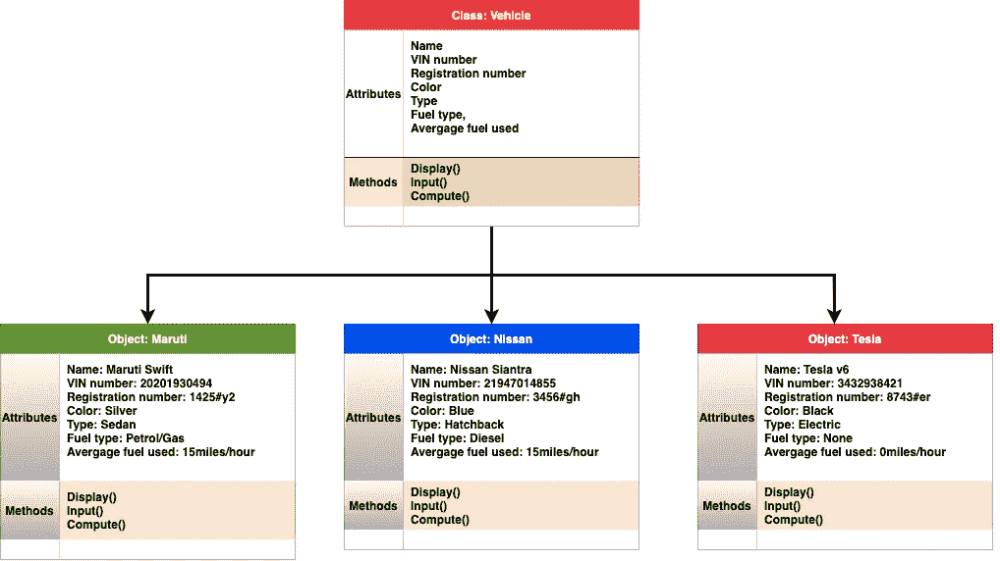
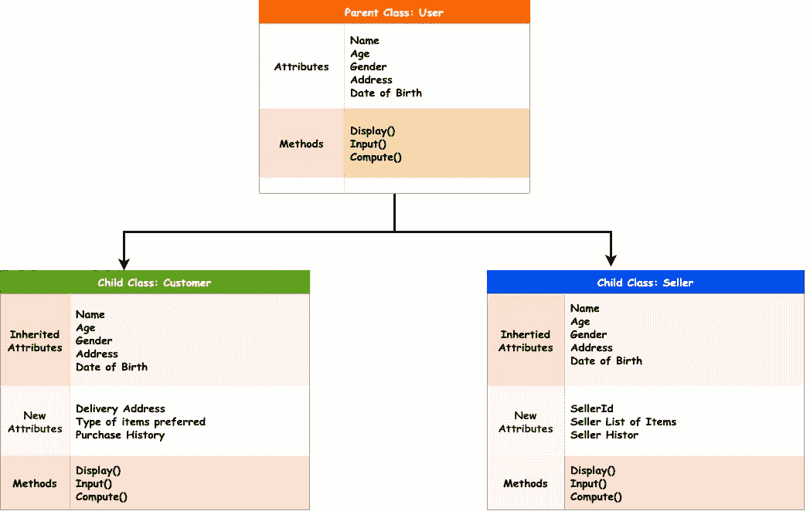

# 向您介绍 OOP 的世界——面向对象编程

> 原文：<https://towardsdatascience.com/introducing-you-to-the-world-of-oop-object-oriented-programming-95c33ae4df2?source=collection_archive---------41----------------------->

## 本文向您介绍了面向对象编程背后的基本直觉，以及它的四个支柱:抽象、封装、继承和多态。我们开始吧！

[来源](https://pixabay.com/illustrations/artificial-intelligence-brain-board-5885393/)

面向对象编程(OOP)是一种编程范式或编程方式，它使用类和对象来解决问题。类只是定义任何有形事物的属性和功能的一种方式。但是，类不能直接使用。我们需要一个对象，它是类的实例，来访问类中定义的属性和方法。因此，创建类并使用它们的对象来解决任何给定问题的编程范式被称为 OOP。

我给你举个例子。如果让您找出不同类型的车辆在一个月内的总油耗。在一个面向对象的编程范例中，你将创建一个名为“Vehicle”的抽象类，它包含所有车辆共有的基本属性，如 VIN 号、颜色、注册号、类型、燃料类型、平均燃料消耗量等。您还可以创建输入、显示或处理这些属性值的函数或方法。现在，你可以实例化同一类“车辆”的不同对象，如本田、特斯拉、马鲁蒂、日产等，并相应地设置它们的属性。接下来，你只需要一个函数来计算一种车辆的总油耗，瞧！你的问题解决了！

描述类的图像，以及上面例子中的对象

现在，我们理解了什么是面向对象编程。让我们讨论一下支撑 OOP 世界的四大支柱。

> 它们是:
> 
> **数据提取或数据隐藏**
> 
> **数据封装**
> 
> **继承**
> 
> **多态性**

让我逐一解释这些概念！

**数据抽象**更通俗的说法是数据隐藏。这是一个原则，即我们只向用户显示相关的细节，而隐藏可能与用户不相关的背景细节。例如，当你开车时，你只需要担心方向盘、离合器、油门、刹车和齿轮。你很少或者根本不知道它们是如何在后端机械地工作的。这是数据抽象的一个例子。你只是向用户展示诸如方向盘、离合器等细节，而不是让用户担心所有这些内部工作的细节。

[抽象的例子](https://commons.wikimedia.org/wiki/File:Lexus_LS_2013_launch_Cannes_vehicle_interior_front.jpg)

> **数据抽象**是隐藏背景细节，只向用户显示相关细节的过程。

**数据封装**是将所有元素包装在一起形成一个内聚单元的过程。数据封装通常会导致内部的数据抽象。我给你举个例子。当你坐在车里时，你有没有想过有多少不同的系统同时工作来使汽车发挥功能？空气冷却系统、发动机、汽车的其他不同部件，如座椅、结构、头枕等都集成在一辆汽车中，共同为您提供舒适的整体体验。这是封装的一个例子。具有不同特性的不同部件组合在一起形成一个整体，也就是汽车。此外，你只能看到相关的细节，但看不到他们的内部工作。这只不过是数据抽象。因此，封装通常会导致抽象。就编程而言，数据封装的一个很好的例子是类。由于一个类有这么多不同的属性和方法对应于不同的组件，它们是将数据封装到一个内聚单元中的完美例子。

[封装示例](https://www.donherringplano.com/mitsubishi-outlander-richardson-tx.html)

> **数据封装**是将所有元素包装在一起形成一个内聚单元的过程。

OOP 世界中下一个最重要的概念或原则是继承。**继承**顾名思义，继承你的父类的属性和方法(大部分是公共的和受保护的)。这允许子类或从另一个类(父类)继承的类利用父类的现有特性，而不必再次重写它们。

我给你举个例子。假设你在一家电子商务公司工作，你被要求建立他们的系统。您可以从创建一个名为“User”的类开始，该类包含所有使用该接口的人都会有的基本属性和方法。比如姓名、性别、年龄、住址、出生日期等公共属性。但是，可以有多种类型的用户，如客户和卖家。现在，要解决这个问题，您可以简单地创建一个继承类“User”的子类 Customer 和 Seller。因此，“用户”成为父类，“客户”和“销售者”成为它们的子类。现在，这两个类都将拥有其父类的所有属性，并且它们可以将自己的属性添加到从其父类继承的属性中。例如，子类“客户”可以有额外的属性，如送货地址、首选商品类型、购买历史等。类似地，另一个子类“卖方”可以具有其他属性，例如卖方 Id、卖方项目列表、卖方历史等。下图总结了这一点。

描述从父类到子类的继承的图片[图片由作者提供]

> **继承**是子类从父类继承属性和方法的过程。

接下来，我们来谈谈 OOP 的第四个也是最后一个支柱:多态性。**多态**是指代码能够根据所处的环境改变自身，而不会对其性能产生太大影响。换句话说，它是一个实体改变成生存和继续表现所必需的任何形式的能力。

让我给你一个真实的例子。在任何时候，你都是一个人，一个公司/网站/服务的用户，一个组织的员工，一个女儿/儿子，一个姐妹/兄弟，一个人。看到了吗？作为一个人，你根据情况和环境适应多少形式和角色。你是多态性的完美例子。你在人生的不同阶段扮演着不同的角色，尽管你可能会因为每个角色而稍有改变，但从本质上来说，你还是原来的你。因此，我们根据情况变化成各种不同的形式，从而在我们的日常生活中实现多态性。

在编程方面，假设你做了一个软件。现在，你的软件应该适应操作系统的变化，计算能力的变化，其他工作条件的变化，并且仍然保持运行。因此，你的软件需要有执行多态性的能力。

> **多态**是一个实体根据它所处的环境改变或适应自己而不影响其性能的能力。

因此，如果任何编程范式都基于使用类和对象，并遵循四个原则:数据抽象、封装、继承和多态，那么它就是众所周知的面向对象编程方法。

我希望这篇文章能帮助你理解 OOP 背后的直觉和它的四个支柱。如果你喜欢这篇文章，那么请喜欢，评论，并关注我！

非常感谢您的阅读！😊