# 为社会公益介绍人工智能

> 原文：<https://towardsdatascience.com/introduction-to-ai-for-social-good-875a8260c60f?source=collection_archive---------8----------------------->

## 从太空计数企鹅，打击偷猎，通过社交媒体监测心理健康，以及许多其他应用程序。

> “每当我听到人们说人工智能将在未来伤害人类时，我就会想，是的，技术通常总是可以用来做好事和坏事，你需要小心你如何构建它……如果你反对人工智能，那么你就是在反对不会发生事故的更安全的汽车，你是在反对能够更好地诊断生病的人。” *—* ***马克·扎克伯格，*首席执行官**
> 
> 新技术本身没有好坏之分。这完全取决于人们如何选择使用它。**——*大卫·王，杜克大学哲学教授***

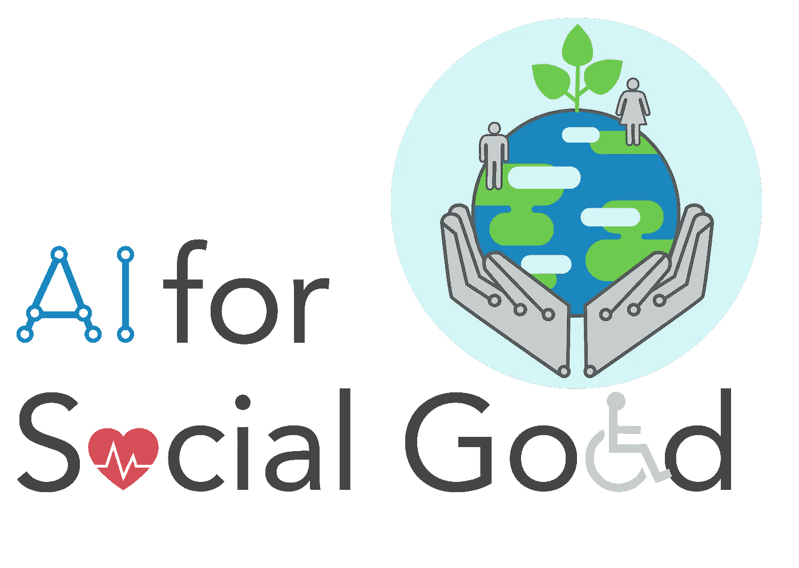

人工智能造福社会——一个相对较新的研究领域，位于人工智能和许多其他领域的交叉点。[来源](https://aiforsocialgood.github.io/2018/)

从常见的媒体言论中，人们很容易将人工智能(AI)视为一种技术，这种技术将使我们所有人失业，使歧视永久化，加剧分裂，并可能最终导致人类的灭亡。然而，我们必须学会将技术本身与其应用分开。如果不进入技术是否在道德上中立的哲学领域(有很好的论据支持这种说法，也有很好的论据反对这种说法)，从根本上说，技术是我们可以使用的工具。

一项技术的存在仅仅告诉我们*有什么*可能(也就是说，我能用它做什么)，但是没有什么能告诉我们*应该用它*做什么。这是大卫·休谟著名的 [**是——应该的陈述**](https://en.wikipedia.org/wiki/Is%E2%80%93ought_problem) 。只有透过人类视角的玫瑰色眼镜，才能得出任何规范价值，不管哲学家们是否认为这是技术固有的。核武器应该在战争中使用吗？应该实施广泛的监控以使公众更安全吗？是否应该常规使用基因编辑来根除某些先天性疾病？科学无法告诉我们。

自然地，一些技术可能比其他技术更容易被负面地利用。例如，核武器比计算机有更多的负面联想(通过使用单词"*武器*"，这一点变得很明显)。然而，支撑核武器的技术——核裂变——也给了我们一种产生基本无碳能源的新途径。我们必须认识到好坏的概念不是来自工具本身，而是如何使用它。AI 也不例外。

在这篇文章中，我将向读者介绍新兴的研究领域“*”人工智能，也称为“ [*人工智能对社会的影响*](https://crcs.seas.harvard.edu/ai-social-impact) ”，以及一些旨在解决当今存在的一些最重要的社会、环境和公共健康挑战的新颖应用。*

# *为什么 AI 会被污名化为不道德？*

*人工智能是计算机科学的一个分支学科。计算机科学家经常被批评缺乏对其研究的潜在伦理和社会影响的考虑。自从 [**深度学习革命**](https://en.wikipedia.org/wiki/Deep_learning#Deep_learning_revolution) 和 [**信息爆炸**](https://en.wikipedia.org/wiki/Information_explosion) 以来，这种批评在近年来愈演愈烈，这两者都增加了计算技术对社会的影响和力量。*

*这种批评基本上是有道理的。第二次世界大战结束后,《世界人权宣言》诞生了，它概述了每个人都应该毫无例外地享有的基本自由。1978 年发布的贝尔蒙特报告概述了从事人体研究的个人必须遵守的伦理原则和准则，这对医学和社会科学的研究方法产生了深远的影响。*

> ****旁注:*** 贝尔蒙特报告说了什么？ *它引入了三个支配未来人类受试者研究的首要原则:* [尊重人](https://en.wikipedia.org/wiki/Respect_for_persons) *:要求参与者知情同意，不得欺骗。
> 【2】**:使研究对象的利益最大化，风险最小化。
> (3)* [正义](https://en.wikipedia.org/wiki/Justice_(ethics)) *:通过合理的、合理化的程序对受试者的公平对待。**

*相比之下，计算机科学在很大程度上不受其研究方法限制的影响。从历史上看，大多数计算机科学课程很少或根本不强调伦理教育。这种不重视可能不是故意的，而是因为计算机科学家创造的技术对普通大众的生活影响相对较小。*

*情况不再是这样了。计算机科学家现在处理大型数据集，如(1)医疗数据，创建算法来检测和诊断癌症等疾病，并对疾病的传播进行建模；(2)社交媒体数据，创建改进的推荐系统和其他算法，通过提高消费者参与度来增加收入；(3)金融数据，创建算法来决定哪些个人将获得贷款，甚至人们应该投资哪些公司。这种创造对社会的影响已经显著增加，但仍然很少有正式的要求被引入来强制实施这一领域的道德实践。*

*这种权力的迅速增加自然会导致相互冲突的制约因素的加剧。这一法律立场基于法律先例，它着眼于过去类似的案件是如何判决的，以及这一裁决如何适用于新的情况。与任何新技术一样，目前几乎没有先例，这使得该领域在很大程度上不受监管。因此，技术上可行的不一定与被认为合法的一致。这两种观点都不一定符合组织想要追求的，或者公众认为是“道德的”。此外，这些限制的目标总是在变化。我们能希望做的最好的事情是改变这些标杆，使它们开始更紧密地重叠，而不是进一步分开。*

*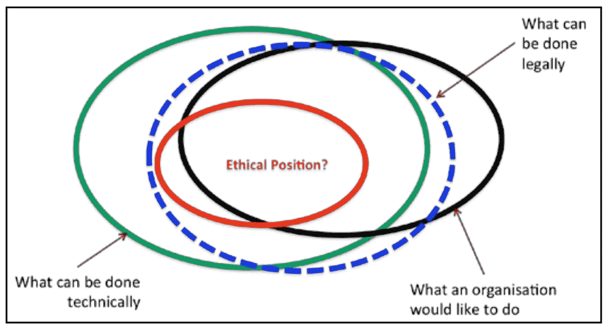*

*与人工智能相关的重叠约束。来源: [IBM 大数据和分析伦理报告](https://www.ibmbigdatahub.com/sites/default/files/whitepapers_reports_file/TCG%20Study%20Report%20-%20Ethics%20for%20BD%26A.pdf)*

*直到最近几年，人们才开始大声疾呼，阐明不受约束的计算机科学研究可能存在的危险。因此，我们看到了一股推动道德计算机科学实践的潮流，其重点是透明度和问责制。*

*哈佛等机构已经开始[将伦理道德嵌入计算机科学课程](https://news.harvard.edu/gazette/story/2019/01/harvard-works-to-embed-ethics-in-computer-science-curriculum/)，我们已经看到一些著名的研究期刊，如 [**【自然】**](https://www.nature.com/) 和 [**科学**](https://www.sciencemag.org/) 已经将公开数据集和分析作为一项[要求，还说明了数据的出处(例如，是否获得了知情同意)。像“*神经信息处理系统会议”* (NeurIPS)这样的会议也要求计算机科学论文提供](https://www.nature.com/nature-research/editorial-policies/reporting-standards)[更广泛的影响声明](https://www.nature.com/articles/s42256-021-00298-y)，表明他们的研究工作的任何伦理或社会影响。这种审查类似于政府倡议或大学和资助机构的机构审查委员会进行的审查。*

*显然，这些措施没有解决更大的问题。目前，它们很少，可能被选择性地应用，或者仅仅作为批准的橡皮图章，但它们是一个以前没有的对话的开始。解决大规模数据集中的个人隐私问题，如重新识别、信息泄露、不利影响或公众对人工智能缺乏信任的风险，将需要更广泛的措施。在医学和社会科学中已经实现了类似的措施，而没有严重阻碍研究目标，因此这不应该阻止计算机科学社区的重大障碍。*

# *什么是对社会有益的人工智能？*

***人工智能造福社会(AI4SG)** 是一个相对较新的研究领域，专注于利用人工智能解决当今存在的重要社会、环境和公共健康挑战。最初，这听起来像是一个噱头，试图颠覆传统上对人工智能的负面看法，但它不仅仅如此。为了简单起见，我们可以将 AI4SG 视为 AI 与社会科学以及环境科学的交集。*

*AI4SG 与 AI 的传统用例不同，它更多地使用了一种 [**自顶向下的方法**](https://en.wikipedia.org/wiki/Top-down_and_bottom-up_design) 。该领域的重点是根据联合国第 17 个可持续发展目标[**中概述的优先事项产生积极的社会影响，如下所示。**](https://www.un.org/development/desa/disabilities/envision2030.html)*

*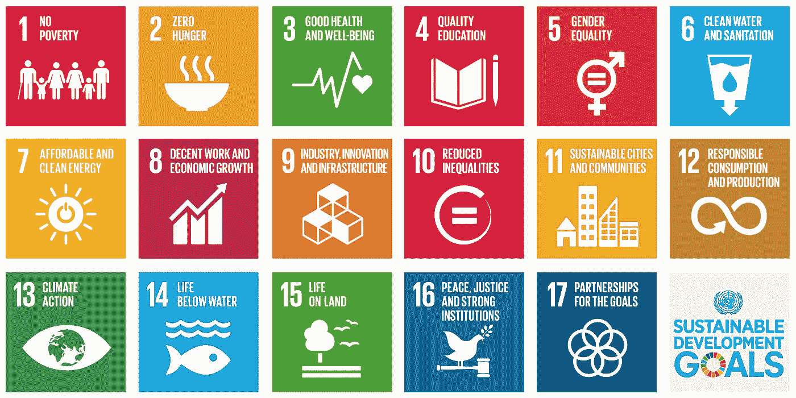*

*联合国的 17 个可持续发展目标。资料来源:联合国*

*相对于文本翻译等传统的人工智能应用，我们可能更感兴趣的是[模拟无家可归者的社交网络，以试图对抗艾滋病毒的传播](http://amulyayadav.com/Papers/IAAI2015.pdf)，这种疾病对艾滋病毒的影响不成比例。*

*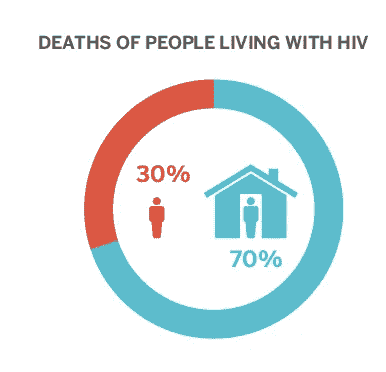*

*与有住所的人相比，无家可归的人受到艾滋病毒的影响更大。*

*虽然文本翻译可以产生积极的社会影响，但它通常不被视为 AI4SG 的一部分。大多数商业智能应用程序也是如此，比如库存计划、推荐系统等。*

*AI4SG 的许多应用程序利用的是 [**博弈论**](https://en.wikipedia.org/wiki/Game_theory) 的方法:它们可以使用代理和对手之间的博弈进行数学建模。基于博弈论的 AI 模型属于 [*强化学习*](https://en.wikipedia.org/wiki/Reinforcement_learning) 范式，由于它们需要使用多个智能体，因此通常被描述为 [**多智能体系统**](https://en.wikipedia.org/wiki/Multi-agent_system) 。这是一个完全独立的领域，很可能会改变社会和工业 4.0 的游戏规则。*

*例如，洛杉矶国际机场实施了一个[博弈论人工智能模型来帮助创建巡逻队，以最佳方式防御恐怖袭击](https://www.aaai.org/Papers/AAAI/2008/AAAI08-331.pdf)和毒品走私者。该系统着眼于现有的巡逻策略，对手能够利用低效率。相比之下，代理能够注意到这些低效率，并构建一个巡逻策略，通过从根本上消除这些低效率，最大限度地降低对手利用低效率的可能性。这一结果是通过使用[贝叶斯 Stackelberg 游戏](https://www.sigecom.org/exchanges/volume_7/2/jain.pdf)获得的，该游戏提供了一种看似随机的策略，能够最佳地抵御对手。*

*为了帮助更详细地阐明 AI4SG 需要什么，我们将查看研究文献中的几个定义。*

*[Floridi 等人](https://pubmed.ncbi.nlm.nih.gov/32246245/) (2020)概述了对 AI4SG 应用至关重要的七个因素，如下所示。这些原则与贝尔蒙特和门洛报告中概述的原则相吻合，但密切关注人工智能和滥用或恶意使用该技术的可能性。*

*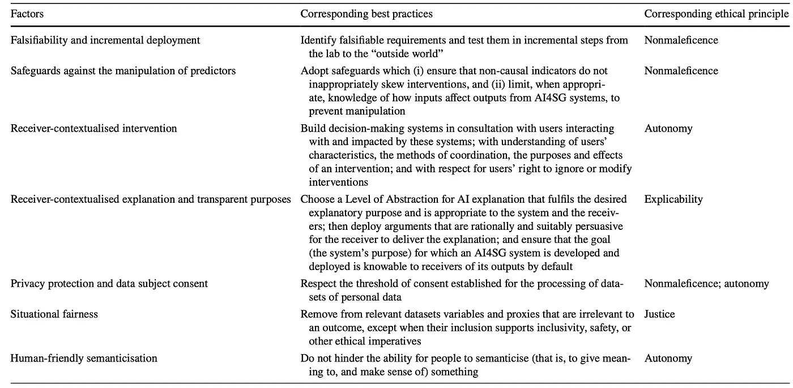*

*支持人工智能造福社会的七个因素和相应的最佳实践总结。[来源:*如何为社会公益设计 AI:七大要素*](https://pubmed.ncbi.nlm.nih.gov/32246245/)*

*[托马舍夫等人](https://www.nature.com/articles/s41467-020-15871-z) (2020)为 AI4SG 提供了一套类似的指南，涉及人工智能技术的整体使用(G1、G2、G3)、应用(G4、G5、G6、G7、G8)和数据处理(G9、G10)。*

*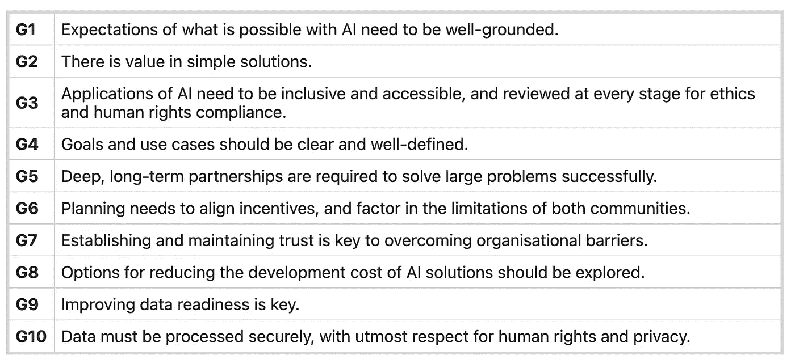*

*特定的应用并不总是能够对所有 17 个可持续发展目标产生积极的影响。事实上，一些技术可能对其中一个目标产生积极影响，而对另一个目标产生消极影响。为了应对这一点，应用程序应该致力于对尽可能多的 SDG 产生最大的净积极效应，同时不对其他 SDG 造成可避免的伤害。*

**人工智能促进协会* (AAAI)在 2019 年的年会上创造了 AI4SG 作为一个新兴话题，并从那时起概述了 AI4SG 应用所需的几个标准:*

*   ***问题的意义。**所考虑的社会影响问题是重大的，并且到目前为止还没有被人工智能社区充分解决。*
*   ***方法新颖。**引入新模型或对现有模型、数据收集技术、算法和/或数据分析技术进行重大改进。*
*   ***社会影响的范围和承诺。**解决方案产生社会影响的可能性很高，可能正在实践中使用或可以立即使用。*
*   *对尖端人工智能技术的依赖和/或进步。介绍适合正在解决的问题的新颖或最新的人工智能技术。*

*下面列出了目前 AI4SG 最常用的技术，其中一些已经在前面讨论过了。使用[博弈论](https://en.wikipedia.org/wiki/Game_theory)、[网络理论](https://en.wikipedia.org/wiki/Network_theory)、[多臂土匪](https://en.wikipedia.org/wiki/Multi-armed_bandit)、[马尔可夫决策过程](https://en.wikipedia.org/wiki/Markov_decision_process)、[强化学习](https://en.wikipedia.org/wiki/Reinforcement_learning)和[决策聚焦学习](https://ojs.aaai.org/index.php/AAAI/article/view/3982/3860)都是利用人工智能和多智能体系统领域的常见建模方法。*

*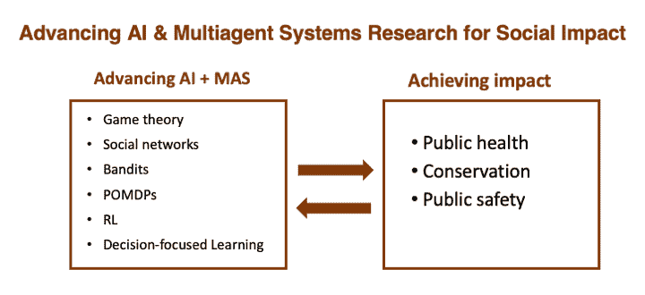*

*近几年 AI4SG 论文中发现的常见话题。*

*尽管 AI4SG 的形式还不成熟，但它已经取得了一些令人印象深刻的成果，其中一些我们将在下一节讨论。*

# *AI4SG 的应用*

*在本节中，我们讨论 AI4SG 的六个应用以及这些应用如何影响联合国的可持续发展目标。这些应用包括(1)从太空计数企鹅，(2)打击偷猎大象，(3)预防药物滥用，(4)疫情预测全球免疫观察，(5)心理健康监测的社交媒体分析，以及(6)谷歌的 Euphonia 项目。*

## *(1)从太空数企鹅*

*这可能是一个奇怪的例子，但这是一个非常有趣的应用，可以用于非侵入性监测和保护目的，并扩展到其他动物物种，属于 SDG 的 13-15。*

*研究员希瑟·林奇获得了 T2 青年科学家奖，因为她通过检查企鹅的“粪便”从太空中数出了企鹅。它们的鸟粪是浅粉色的，这使得它很容易被诸如 Landsat-7 这样的卫星看到。虽然由于空间分辨率有限，很难从太空中发现单个企鹅的排泄物，但发现整个企鹅群的粪便足迹是可能的。*

*这项技术在*[*一种基于对象的图像分析方法中进行了概述，用于在非常高的空间分辨率卫星图像中检测企鹅粪便*](https://www.mdpi.com/2072-4292/8/5/375)*希瑟·林奇就是这样能够监测南极半岛上各种企鹅物种的聚居地和数量，以及它们的迁移模式。她的工作提高了对半岛上阿德利企鹅数量的估计，其中目前最好的估计是 379 万对。***

***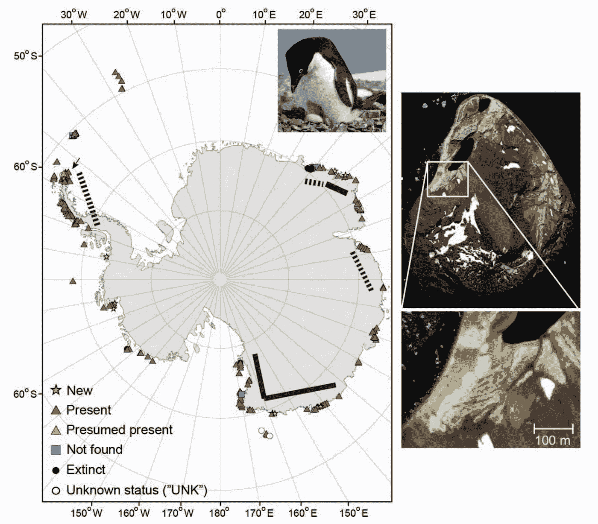***

***现存阿德利企鹅聚居地的地图，以及在图像中找不到并推测已经灭绝的企鹅聚居地。来源:[阿德利企鹅第一次全球普查](https://www.jstor.org/stable/90008569)***

***林奇教授也对生活在南极半岛的帽带企鹅进行了估计，估计在 375 个企鹅聚居地中有 342 万对企鹅在繁殖。***

***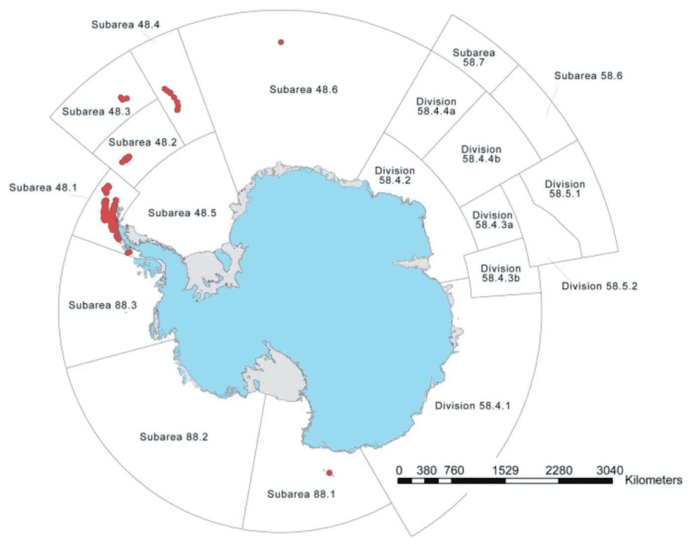***

***CCAMLR 分区所有现存帽带企鹅聚居地的地图。来源:[全球帽带企鹅种群评估](https://www.nature.com/articles/s41598-020-76479-3)***

***这种技术和类似的技术可以用来监测特别易受气候变化影响的物种的种群和人口统计数据的变化。这对于企鹅来说相对简单，因为覆盖在南极半岛上的雪和企鹅群的粪便之间形成了鲜明的对比，但类似的生物标志物可能会使这在未来成为其他物种的一种可能性。***

## ***(2)世界野生动物基金会打击非洲偷猎大象的行为***

***反偷猎努力强调了一个重要的博弈论模型子集，即所谓的“绿色安全游戏”，它有助于解决 SDG 的 1、11、15 和 16。***

***偷猎在乌干达是一个特别棘手的问题。在 20 世纪 70-80 年代的政治动荡期间，偷猎者将乌干达的大象数量从大约 30，000 头减少到不到 800 头。在伊丽莎白女王国家公园，诸如增加护林员巡逻和蜂巢围栏等保护项目的努力已经使大象数量回升到大约 3000 头，但是人象冲突仍然是该地区的一个问题。在卡塔拉，一些农民用毒死大象的方法来防止大象践踏他们的庄稼，而另一些则被偷猎者为了象牙或肉而猎杀。相当多的护林员在与偷猎者的争吵中被杀害，这导致该地区丧偶妇女的增加，使她们陷入贫困，无法养活家人。***

***护林员只有有限的资源来监控公园里的大象，因此需要明智地组织这些资源，让他们有最好的机会来打击该地区的偷猎行为，这就是我们的绿色安全游戏发挥作用的地方。***

***我们的绿色安全游戏基于 Stackelberg 安全游戏，专注于威胁预测，首先将伊丽莎白女王国家公园(Queen Elizabeth National Park)这一 2000 平方公里的区域划分为 1 公里 x 1 公里的网格单元。***

***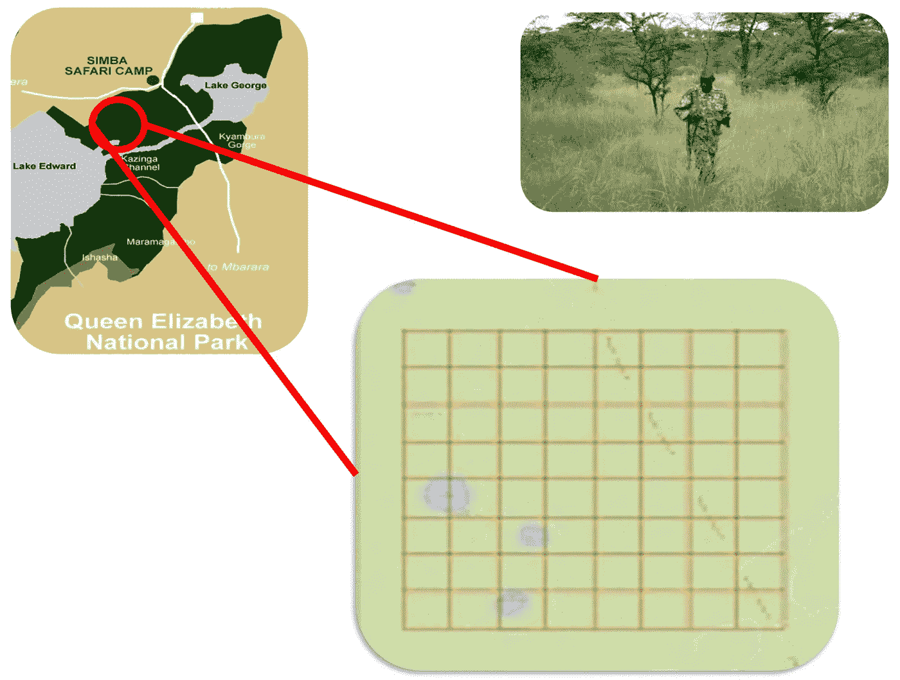***

***伊丽莎白女王国家公园(左上)被划分为 1 公里 x 1 公里的网格单元，用于建模。***

***安全游戏将涉及根据从 12 年来公园约 1000 起偷猎案件的先前数据中获得的各种因素，确定陷阱被放置在某个网格正方形中的概率。***

***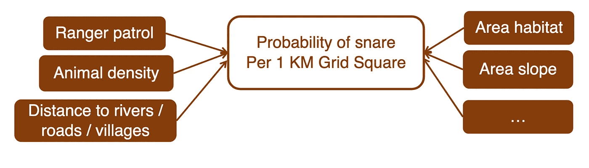***

***然后，人工智能模型设计一种新的巡逻方案，以最大化这些陷阱被抓住的可能性。这是反复执行的，使用过去的犯罪数据来预测未来陷阱放置的近似空间位置。***

***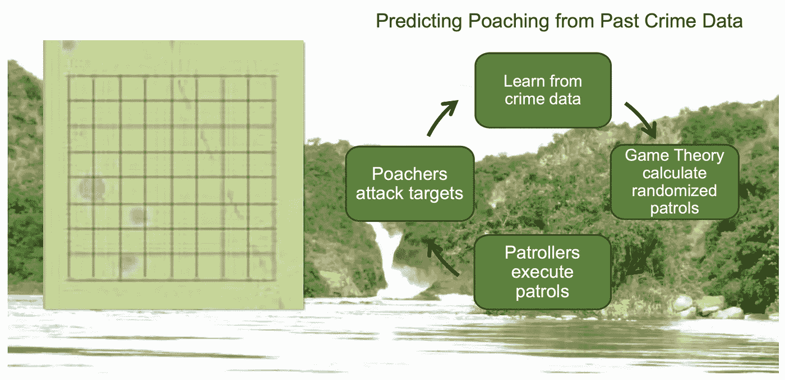***

***来源: [AI for Earth: AI 保护野生动物、森林、鱼类](https://www.microsoft.com/en-us/research/wp-content/uploads/2017/07/AI_for_Earth_Tambe_Milind.pdf)***

***当这种方法最初在公园两个 9 平方公里的区域实施一个月时，他们的陷阱命中率高于历史上所有先前月份的 91%。在此之后，在 6 个月的时间里，在公园内 9 平方公里的 27 个区域进行了更大规模的实地测试，并显示出非常积极的结果，捕捉到创纪录数量的陷阱，甚至有一名偷猎者在公园内被当场抓获。***

***自从这些实地实验以来，这些利用人工智能的绿色安全游戏已经被野生动物保护协会扩展到 Murchison Falls 国家公园，以及乌干达的其他地区，甚至被世界野生动物基金会扩展到柬埔寨，以防止偷猎大象。近年来，大象作为某些中草药的一种成分变得很受欢迎。当在柬埔寨的 Srepok 野生动物保护区进行测试时，在实施绿色安全游戏的第一个月，有 521 个陷阱被捕获，而该地区的护林员通常只发现 101 个陷阱。***

***类似的绿色安全游戏可以扩展用于边境巡逻、防止恐怖主义、保护珊瑚礁，甚至防止亚马逊雨林中的非法金矿开采等任务。***

## ***(3)预防药物滥用***

***解决联合国可持续发展目标 1 和 3，药物滥用预防一直是 AI4SG 研究人员的主要关注领域之一。药物滥用是一个重要的公共卫生问题，可能会产生广泛的负面社会影响，并可能增加精神和身体问题的发病率。***

***青年是最容易滥用药物的群体，某些青年群体使用药物的比例很高，例如无家可归的青年。社会科学研究表明，偏差训练可能是有用的，但通常基于同伴的干预是最有效的。***

***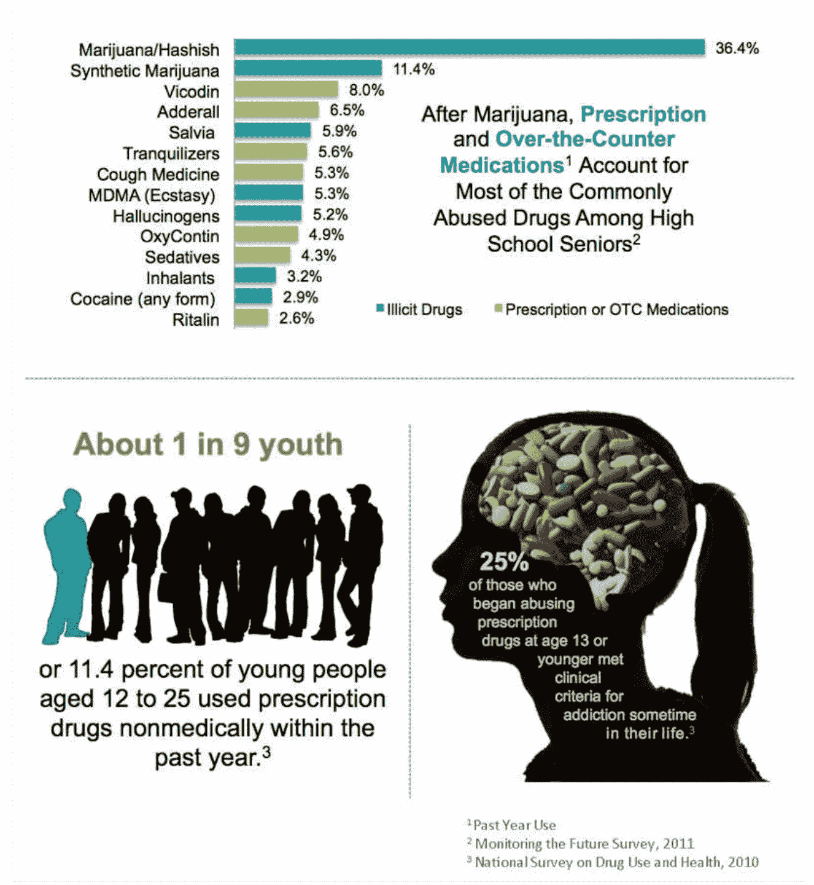***

***无家可归人群药物滥用预防统计概述。资料来源:[预防药物滥用 AI](https://www.cais.usc.edu/wp-content/uploads/2017/09/Vayanos-CAIS-Seminar-Fall-2017.pdf)***

***执行基于同伴的干预与出于营销目的选择影响者非常相似。选择社交网络中节点的子集，其具有将信息传播给目标人群中最大可能受众的最高概率。这已经在无家可归的人群中进行了研究，并被发现对打击各种异常行为有效，包括物质滥用。***

***想象一下，我们有一个社交网络， *G* ，如下图所示，并且能够选择 *K* 个节点作为同伴领袖。一旦近似的社会网络，假设一个独立的级联模型的信息传播，我们可以优化我们的算法，以最大化的影响节点的预期数量。***

**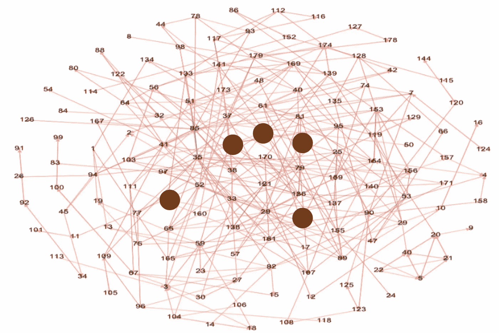**

**显然，由于各种原因，该过程在实践中更加混乱和不确定，包括退出该过程的同行领导，以及传播概率和社会网络结构的不确定性。**

**为了处理这种不确定性， [Wilder 等人(2017)](https://bryanwilder.github.io/files/aamas_deployment.pdf) 开发了*鲁棒影响最大化*，其使用部分观察的马尔可夫决策过程来迭代地选择社交网络中的最佳对等领导组，以实现最大的信息传播。**

**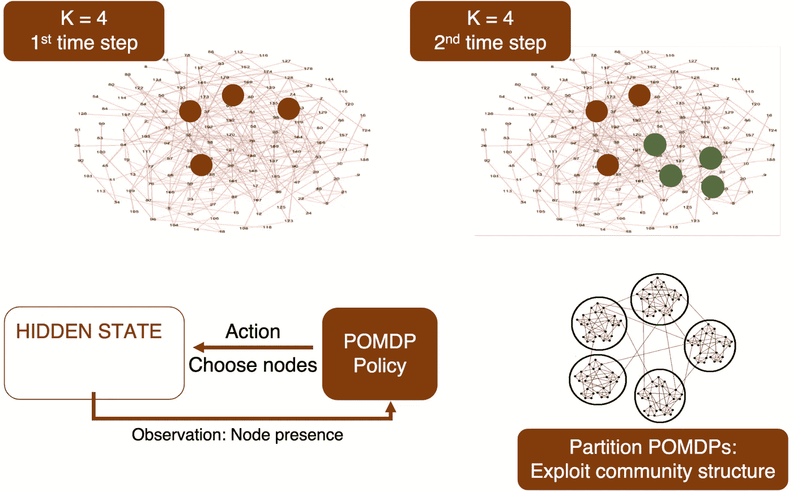**

**本质上，如果一个对等领导“没有出现”，那么这个对等领导被另一个最优选择的对等领导替换，以提供剩余网络的最大覆盖。**

**这种提供基于同伴的干预的技术可以应用于涉及通过社交网络传播的广泛任务，因此随着我们的生活越来越多地涉及越来越大的社交网络，这种技术可能会受到越来越多的关注。**

## **(4)疫情预测全球免疫观察站**

**在新冠肺炎疫情期间，哈佛大学公共卫生学院的教授[迈克尔·米娜](https://en.wikipedia.org/wiki/Michael_Mina_%28epidemiologist%29)提出了一个激进的新想法，他创造了“[全球免疫观察站](https://www.ncbi.nlm.nih.gov/pmc/articles/PMC7292646/)”，其作用类似于“大流行的天气预报”。**

**虽然这一目标尚未实现，但其潜在影响可能是深远的。通过查看整个人群样本的血清学指标，如血液中的抗体(即每次进行常规血液测试)，可以确定血清学指纹，然后将其添加到国家数据库中。然后可以对其进行分析，以检测当地人群中的任何异常情况。这可以用来在新疫情扩散到其他地区之前发现异常症状、感染和血液标志物，从而降低未来疫情或大流行的可能性。**

**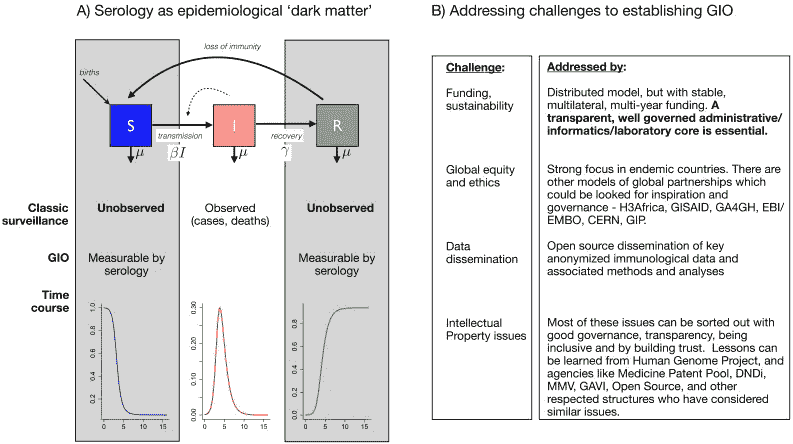**

**来源:[全球免疫观察站(GIO)迎接大流行时代。](ncbi.nlm.nih.gov/pmc/articles/PMC7292646/)**

**鉴于自 1900 年以来，我们已经经历了三次大流行，以及近 12 次来自 SARS、MERS、猪流感和禽流感等疾病的疫情威胁，拥有一个大流行预警系统将有助于协助和简化公共卫生工作。**

**虽然这一想法仍处于萌芽阶段，但如果将来真的付诸实施，取样的方式将不得不在很大程度上代表当地人口，而且很可能是嘈杂和稀疏的。因此，必须开发智能和稳健的采样方案，这些方案几乎肯定会利用机器学习技术。**

## **(5)心理健康的社会媒体分析**

**也许是迄今为止所有应用中最切实的，AI4SG 正在开发使用社交媒体监测精神健康的新方法。特别是，从社交媒体帖子中预测抑郁症已经受到了很多关注。**

**每年有数千万人患有抑郁症，但其中只有一小部分人接受治疗。 [Choudhury 等人](https://ojs.aaai.org/index.php/ICWSM/article/view/14432) (2013 年)使用了来自 Twitter 用户的一年数据，这些用户报告在抑郁发作前被诊断为临床抑郁，以开发一种能够估计个体抑郁风险的统计分类器。这包括社会参与、语言、语言风格、自我网络和推特话题等方面的变化。他们发现，社交媒体为描述抑郁症的发作提供了有用的信号。**

**这种工具可以在未来被医疗机构用来介入并提供帮助，以主动预防全面抑郁症的发生。研究人员建议，在不久的将来，可以使用类似的技术来标记其他心理障碍的发作或存在，特别是因为心理健康的重要性正在获得公众越来越多的认可。**

**同样，产后情绪和行为的变化也通过 Twitter 帖子进行了评估。 [Choudhury 等人](https://dl.acm.org/doi/abs/10.1145/2470654.2466447) (2013 年)发现，根据他们之前的社交媒体互动，他们有 71%的时间能够预测到孩子出生后母亲的情绪和行为状态会如何改变。这些信息可能有助于确定处于产后抑郁症高风险中的母亲。**

**除了抑郁症， [Thorstad 和 Wolff (2019)](https://pubmed.ncbi.nlm.nih.gov/31037606/) 分析了来自 Reddit 的信息，并能够从临床子主题上使用的词语中区分不同形式的精神疾病，如多动症、双相情感障碍和抑郁症。有趣的是，作者分析了非临床子主题，如涉及烹饪和旅行的子主题，发现他们能够使用这些子主题上的帖子预测某人是否可能向临床子主题发帖。**

**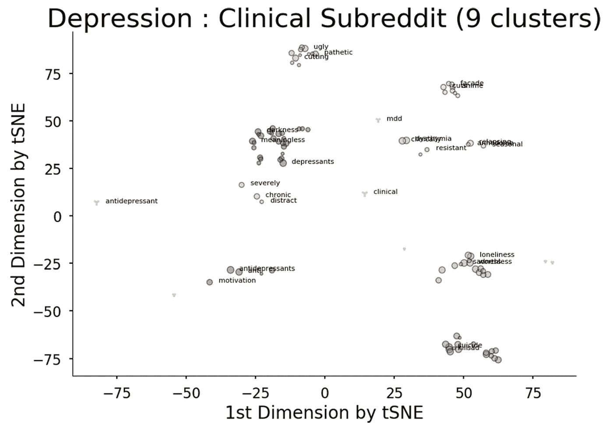**

**在研究 1 中学到的 100 个最能预测抑郁的单词。在使用 t-SNE 降维之后，基于单词的文档向量，将单词投影到二维空间中。颜色表示由 DBSCAN 分配的簇。灰色 Y 形标记表示 DBSCAN 没有分配给任何聚类的“噪声”点。在每个聚类中，前三个最具预测性的单词被标记。标记大小也随着预测等级线性缩放，其中较大的标记指示更多的预测单词。**

**这些结果表明，我们的整体精神状态，以及任何精神疾病，都会影响我们在网上使用的词语，并且在不久的将来可能会被 AI4SG 模型破译。**

## **(6)谷歌项目 Euphonia**

**谷歌的 Euphonia 项目或许应该成为人工智能增强包容性的光辉典范。该项目是一项正在进行的工作，包括获取大量构音障碍语音的原始数据。也就是说，来自患有严重语言障碍的人的语音使他们难以沟通，这可能源于疾病，如[肌萎缩侧索硬化症](https://www.mayoclinic.org/diseases-conditions/amyotrophic-lateral-sclerosis/symptoms-causes/syc-20354022)。**

**根据这些数据，谷歌创建了一种[机器学习算法](http://Personalizing ASR for Dysarthric and Accented Speech with Limited Data)，能够将这种构音障碍语音翻译成典型的语音，尽管仍处于早期阶段，但这种努力已经大大减少了许多人在日常生活中的交流障碍。在一个远程工作和在线会议越来越占主导地位的世界，将 Project Euphonia 等插件纳入 Zoom 和 Skype 等平台可以从根本上改善患有严重语言障碍的个人的包容性。**

**为了了解更多关于 Euphonia 项目的信息或者看到它的实际应用，我在下面提供了一些链接。**

 **[## 大戟项目

### Euphonia 项目是谷歌的一项研究计划，旨在帮助人们更好地理解非典型语言

网站.研究.谷歌](https://sites.research.google/euphonia/about/)** 

## **其他项目**

**虽然还有大量其他主题可以讨论，但我认为以上 6 个主题涵盖了人工智能令人兴奋的非传统应用，可用于改善个人、社会和环境福祉，与传统的人工智能叙事相反。我在下面为感兴趣的读者留下了其他 AI4SG 应用程序的链接:**

*   **[结合卫星图像和机器学习预测贫困](https://science.sciencemag.org/content/353/6301/790.full)**
*   **[糖尿病视网膜病变预测](https://www.nature.com/articles/s41746-019-0172-3)(~ 4.15 亿。病例)在眼底图像上使用深度学习(还可以预测性别、年龄、血压等。)**
*   **[在灾难推特数据中识别标签](https://www.cs.uic.edu/~cornelia/papers/aaai20_1.pdf)**
*   **[通过强化学习对假新闻检测的监督不力](http://www.acsu.buffalo.edu/~yaqingwa/files/20/AAAI20.pdf)**
*   **[保护照片收藏的地理位置隐私](https://arxiv.org/abs/1912.02085)**
*   **[在气象雷达数据中检测和跟踪公共鸟类栖息地](https://people.cs.umass.edu/~zezhoucheng/roosts/radar-roosts-aaai20.pdf)**
*   **[史丹福视敏度测试:使用贝叶斯技术的精确视力测试和人类视觉反应的发现](https://stanford.edu/~cpiech/bio/papers/StAT.pdf)**
*   **互联网审查的语言指纹:新浪微博事件**

## **潜在问题**

**正如任何学科一样，尤其是那些宣扬改善社会的学科，在应用中可能会有意想不到的后果。这也是为什么有人提出了更广泛的影响陈述的概念的部分原因，这样，发明者就可以清楚地列出特定技术的利弊。然而，AI4SG 仍然有可能在改善社会影响的幌子下被使用，同时对其他社区产生负面影响。幸运的是，SDG 的目标之一是减少不平等，让坏人更难从伦理角度证明这一方法的合理性。**

**为了做到完全透明，我还包含了一些文章的链接，这些文章展示了该领域的不同观点，概述了 AI4SG 实际上可能如何对社会有害。如果时间允许，我鼓励读者通读这些内容，并对 AI4SG 以及今后应该如何使用它提出自己的判断。这仍然是一个相对较新的领域，所以现在是参与讨论的好时机。**

*   **[旨在根除福利欺诈的人工智能算法往往最终反而惩罚了穷人](https://theconversation.com/ai-algorithms-intended-to-root-out-welfare-fraud-often-end-up-punishing-the-poor-instead-131625)**
*   **[AI 为善往往是坏事](https://www.wired.com/story/opinion-ai-for-good-is-often-bad/)**

# **最后的话**

> **数据缺口削弱了我们确定资源目标、制定政策和追踪责任的能力。没有好的数据，我们是盲目的。看不到就解决不了。 ***—联合国前秘书长科菲·安南*****

**AI4SG 在某种程度上与计算机科学领域相反，更接近于工程学科而不是计算学科。这是一种趋势，我们越来越开始看到它的出现，就像微型机器学习领域一样。在某些方面，AI 似乎是一个原型工程学科，类似于化学和电磁学，逐渐演变为化学和电气工程。像 Neuralink 这样的应用，以及像[优化民主](https://sites.google.com/view/optdemocracy/home?authuser=0)这样的研究工作，很可能会继续产生新的子领域。**

**我们生活在令人兴奋(也令人担忧)的时代，是时候开始拥抱和利用人工智能的力量来改善每个人的生活了。然而，我们应该谨慎地这样做，设置类似于在医学和社会科学中遇到的约束，以帮助管理和提供对计算机科学领域及其萌芽后代的问责。**

**鉴于大多数人工智能人才都被隔离在行业或学术界，鼓励研究人员为 AI4SG 计划贡献一定比例的时间可能会有成效，就像法律界的*公益*工作一样。现实世界挑战的复杂性实际上有助于促进对现有方法的理解，并在最重要的地方展示影响。**

# **进一步阅读和参考**

**[1]弗洛里迪，l；考尔斯，j。金，T.C .和轩辕洛尹，M. [**如何为社会公益设计 AI:七大要素**](https://pubmed.ncbi.nlm.nih.gov/32246245/) 。科学伦理。2020 年 6 月；26(3):1771–1796.doi:10.1007/s 11948–020–00213–5。Epub 2020 年 4 月 3 日 PMID:32246245；PMCID: PMC7286860。**

**[2]托马舍夫；科尔内比斯，j。Hutter，f .*et al .*[**AI for social good:解锁机会产生积极影响**](https://www.nature.com/articles/s41467-020-15871-z) 。***11、** 2468 (2020)。[https://doi.org/10.1038/s41467-020-15871-z](https://doi.org/10.1038/s41467-020-15871-z)***

***[3] Chessell，M. [**IBM 的大数据与分析伦理报告**](https://www.ibmbigdatahub.com/sites/default/files/whitepapers_reports_file/TCG%20Study%20Report%20-%20Ethics%20for%20BD%26A.pdf) 。2014.***

***[4]安南，K. [**数据可以帮助终结非洲各地的营养不良**](https://www.nature.com/articles/d41586-018-02386-3) **。** *性质* **555** ，7 (2018)。[https://doi.org/10.1038/d41586-018-02386-3](https://doi.org/10.1038/d41586-018-02386-3)***

**[5] Jean，n .等[**结合卫星图像和机器学习预测贫困**](https://science.sciencemag.org/content/353/6301/790/tab-pdf) **。** *理科*， **353** ，6301 (2016)。[https://doi.org/10.1126/science.aaf7894](https://doi.org/10.1126/science.aaf7894)**

**[6]m .德乔杜里、m .加蒙、Counts、s .和 h orvitz e .(2013 年)。 [**通过社交媒体预测抑郁症**](https://ojs.aaai.org/index.php/ICWSM/article/view/14432) **。** *网络与社交媒体国际 AAAI 会议论文集*， *7* (1)。从 https://ojs.aaai.org/index.php/ICWSM/article/view/14432[取回](https://ojs.aaai.org/index.php/ICWSM/article/view/14432)**

**[7]吉布尼，E. [**在世界上最大的机器学习会议**](https://www.nature.com/articles/d41586-020-00160-y) 上为道德人工智能而战。*性质* **577** 、609 (2020)。*[*https://doi.org/10.1038/d41586-020-00160-y*](https://doi.org/10.1038/d41586-020-00160-y)***

**[8]吉尔曼，M. [**旨在根除福利欺诈的人工智能算法往往以惩罚穷人而告终**](https://theconversation.com/ai-algorithms-intended-to-root-out-welfare-fraud-often-end-up-punishing-the-poor-instead-131625) **。**对话(2020)。**

**【9】Latonero，M. [**观点:AI 为善往往是坏**](https://www.wired.com/story/opinion-ai-for-good-is-often-bad/) **。**连线(2019)。**