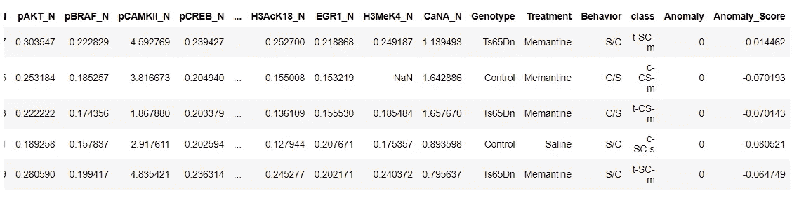
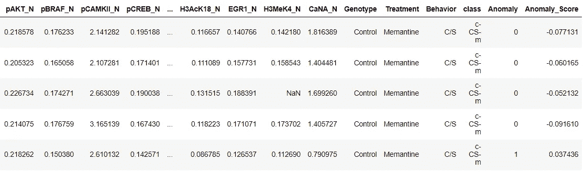

# 用 PyCaret 介绍 Python 中的异常检测

> 原文：<https://towardsdatascience.com/introduction-to-anomaly-detection-in-python-with-pycaret-2fecd7144f87?source=collection_archive---------3----------------------->

## 一步一步，初学者友好的教程，用于使用 PyCaret 的无监督异常检测任务


卢卡·斯拉普尼卡在 [Unsplash](https://unsplash.com?utm_source=medium&utm_medium=referral) 上拍摄的照片

# 1.介绍

[PyCaret](https://www.pycaret.org/) 是一个用 Python 编写的开源、低代码的机器学习库，可以自动化机器学习工作流。这是一个端到端的机器学习和模型管理工具，可以成倍地加快实验周期，提高您的工作效率。

与其他开源机器学习库相比，PyCaret 是一个替代的低代码库，可以用来用几行代码替换数百行代码。这使得实验快速有效。PyCaret 本质上是几个机器学习库和框架的 Python 包装器，比如 scikit-learn、XGBoost、LightGBM、CatBoost、spaCy、Optuna、Hyperopt、Ray 等等。

PyCaret 的设计和简单性受到了公民数据科学家这一新兴角色的启发，这是 Gartner 首先使用的术语。公民数据科学家是超级用户，他们可以执行简单和中等复杂的分析任务，这些任务在以前需要更多的技术专业知识。

想了解更多关于 PyCaret 的信息，可以查看官方[网站](https://www.pycaret.org/)或者 [GitHub](https://www.github.com/pycaret/pycaret) 。

# 2.辅导的目的

在本教程中，我们将学习:

*   **获取数据:**如何从 PyCaret 资源库导入数据。
*   **设置环境:**如何在 PyCaret 中设置无监督的异常检测实验。
*   **创建模型:**如何创建模型并将异常标签分配给数据集进行分析。
*   **图模型:**如何使用各种图分析模型性能。
*   **预测模型:**如何根据训练好的模型给新的/看不见的数据集分配异常标签？
*   **保存/加载模型:**如何保存/加载模型以备将来使用？

# 3.正在安装 PyCaret

安装很容易，只需几分钟。PyCaret 从 pip 的默认安装只安装在 [requirements.txt](https://github.com/pycaret/pycaret/blob/master/requirements.txt) 文件中列出的硬依赖项。

```
pip install pycaret
```

要安装完整版:

```
pip install pycaret[full]
```

# 4.什么是异常检测？

异常检测是通过与大多数数据显著不同来识别引起怀疑的罕见项目、事件或观察结果的任务。通常，异常项目会转化为某种问题，如银行欺诈、结构缺陷、医疗问题或文本中的错误。存在三大类异常检测技术:

*   **无监督异常检测:**无监督异常检测技术在假设数据集中的大多数实例是正常的情况下，通过寻找似乎最不适合数据集剩余部分的实例来检测未标记测试数据集中的异常。
*   **监督异常检测:**这种技术需要一个已经被标记为“正常”和“异常”的数据集，并且涉及训练一个分类器。
*   **半监督异常检测:**这种技术从给定的正常训练数据集构建一个代表正常行为的模型，然后测试由学习的模型生成测试实例的可能性。

# 5.PyCaret 中异常检测模块概述

[PyCaret 的异常检测模块](https://pycaret.readthedocs.io/en/latest/api/anomaly.html) ( `pycaret.anomaly`)是一个无监督的机器学习模块，它执行识别罕见项目、事件或观察结果的任务，这些项目、事件或观察结果通过与大多数数据显著不同而引起怀疑。

PyCaret 异常检测模块提供了几个预处理功能，可以在初始化设置时通过`setup`功能进行配置。它有超过 12 种算法和一些图表来分析异常检测的结果。PyCaret 的异常检测模块还实现了一个独特的功能`tune_model`，允许您调整异常检测模型的超参数，以优化监督学习目标，例如用于分类的`AUC`或用于回归的`R2`。

# 6.教程的数据集

在本教程中，我们将使用来自 UCI 的名为 [**小鼠蛋白质表达**](https://archive-beta.ics.uci.edu/ml/datasets/mice+protein+expression) 的数据集。数据集由 77 种蛋白质的表达水平组成，这些蛋白质在皮质的细胞核部分产生可检测的信号。该数据集包含每种蛋白质总共 1080 次测量。每次测量可以被认为是一个独立的样本(鼠标)。

## 数据集引用:

Higuera C，Gardiner KJ，CIO KJ(2015)自组织特征图确定了唐氏综合征小鼠模型中对学习至关重要的蛋白质。PLoS ONE 10(6): e0129126。[网页链接] journal.pone.0129126

您可以从这里找到的原始数据源<https://archive.ics.uci.edu/ml/datasets/Mice+Protein+Expression>**下载数据，并使用 pandas [**(了解如何使用)**](https://pandas.pydata.org/pandas-docs/stable/reference/api/pandas.read_csv.html) 加载数据，或者您可以使用 PyCaret 的数据存储库使用`get_data()`函数加载数据(这将需要互联网连接)。**

## **许可证:**

**这个数据集是在[知识共享署名 4.0 国际](https://creativecommons.org/licenses/by/4.0/legalcode) (CC BY 4.0)许可下许可的。**

**这允许为任何目的共享和改编数据集，只要给予适当的信任。([来源](https://archive-beta.ics.uci.edu/ml/datasets/mice+protein+expression))**

```
from pycaret.datasets import get_data
dataset = get_data('mice')
```

****

```
**# check the shape of data**
dataset.shape
>>> (1080, 82)
```

**为了演示对看不见的数据使用`predict_model`函数，从原始数据集中保留了 5% (54 条记录)的样本，用于实验结束时的预测。**

```
data = dataset.sample(frac=0.95, random_state=786)
data_unseen = dataset.drop(data.index)

data.reset_index(drop=True, inplace=True)
data_unseen.reset_index(drop=True, inplace=True)

print('Data for Modeling: ' + str(data.shape))
print('Unseen Data For Predictions: ' + str(data_unseen.shape))**>>> Data for Modeling: (1026, 82)
>>> Unseen Data For Predictions: (54, 82)**
```

# **7.在 PyCaret 中设置环境**

**PyCaret 中的`setup`函数初始化环境，并为建模和部署创建转换管道。在 pycaret 中执行任何其他函数之前，必须调用`setup`。它只需要一个强制参数:熊猫数据帧。所有其他参数都是可选的，可用于定制预处理管道。**

**当执行`setup`时，PyCaret 的推理算法将根据某些属性自动推断出所有特征的数据类型。应该可以正确推断出数据类型，但情况并非总是如此。为了处理这个问题，一旦执行了`setup`，PyCaret 就会显示一个提示，要求确认数据类型。如果所有数据类型都正确，您可以按 enter 键或键入`quit`退出设置。**

**确保数据类型正确在 PyCaret 中非常重要，因为它会自动执行多个特定于类型的预处理任务，这些任务对于机器学习模型来说是必不可少的。**

**或者，您也可以使用`setup`中的`numeric_features`和`categorical_features`参数来预定义数据类型。**

```
from pycaret.anomaly import *

exp_ano101 = setup(data, normalize = True, 
                   ignore_features = ['MouseID'],
                   session_id = 123)
```

****

**输出**

**成功执行设置后，它会显示信息网格，其中包含一些关于实验的重要信息。大部分信息与执行`setup`时构建的预处理流水线有关。这些特性的大部分超出了本教程的范围，但是，有一些重要的事情需要注意:**

*   ****session_id:** 一个伪随机数，作为种子分布在所有函数中，以便以后再现。如果没有通过`session_id`，则自动生成一个随机数，并分配给所有函数。在这个实验中，session_id 被设置为`123`,以便以后再现。**
*   ****缺失值:**当原始数据中存在缺失值时，会显示为`True`。请注意，上面信息网格中的`Missing Values`是`True`，因为数据包含缺失值，对于数字特征使用`mean`自动估算，对于类别特征使用`constant`自动估算。可以使用`setup`中的`numeric_imputation`和`categorical_imputation`参数改变插补方法。**
*   ****原始数据:**显示数据集的原始形状。在这个实验中,( 1026，82)意味着 1026 个样本和 82 个特征。**
*   ****转换数据:**显示转换数据集的形状。请注意，原始数据集的形状(1026，82)被转换为(1026，91)。由于数据集中分类要素的编码，要素的数量有所增加。**
*   ****数字特征:**推断为数字的特征数量。在该数据集中，82 个要素中有 77 个被推断为数值型。**
*   ****分类特征:**推断为分类的特征数量。在该数据集中，82 个要素中有 5 个被推断为分类要素。另外，请注意，我们使用`ignore_feature`参数忽略了一个分类特征，即`MouseID`。**

**请注意执行建模所必需的一些任务是如何自动处理的，例如缺失值插补、分类编码等。`setup`功能中的大多数参数是可选的，用于定制预处理流水线。这些参数超出了本教程的范围，但是我将在后面写更多关于它们的内容。**

# **8.创建模型**

**在 PyCaret 中创建异常检测模型很简单，与在 PyCaret 的监督模块中创建模型的方式类似。使用`create_model`函数创建异常检测模型，该函数采用一个强制参数，即模型名称作为字符串。这个函数返回一个训练好的模型对象。请参见下面的示例:**

```
iforest = create_model('iforest')
print(iforest)**>>> OUTPUT** IForest(behaviour='new', bootstrap=False, contamination=0.05, max_features=1.0, max_samples='auto', n_estimators=100, n_jobs=-1, random_state=123, verbose=0)
```

**我们已经使用`create_model`创建了一个隔离森林模型。请注意，`contamination`参数被设置为`0.05`，当您没有传递`fraction`参数时，这是默认值。`fraction`参数决定了数据集中离群值的比例。在下面的例子中，我们将用`0.025`部分创建`One Class Support Vector Machine`模型。**

```
svm = create_model('svm', fraction = 0.025)
print(svm)**>>> OUTPUT** OCSVM(cache_size=200, coef0=0.0, contamination=0.025, degree=3, gamma='auto',kernel='rbf', max_iter=-1, nu=0.5, shrinking=True, tol=0.001, verbose=False)
```

**要查看模型库中可用模型的完整列表，请查阅文档或使用`models`功能。**

```
models()
```

****

# **9.指定模型**

**现在我们已经创建了一个模型，我们希望将异常标签分配给我们的数据集(1080 个样本)来分析结果。我们将通过使用`assign_model`函数来实现这一点。**

```
iforest_results = assign_model(iforest)
iforest_results.head()
```

****

**注意，两列`Anomaly`和`Score`被添加到末尾。0 代表内部因素，1 代表外部因素/异常情况。`Anomaly_Score`是算法计算出的值。离群值被赋予较大的异常分值。请注意，`iforest_results`还包括我们在`setup`中删除的`MouseID`。它不用于模型，仅在您使用`assign_model`时附加到数据集。**

# **10.绘制模型**

**`plot_model`函数可用于分析不同方面的异常检测模型。此函数接受一个经过训练的模型对象并返回一个绘图。**

## **10.1T-分布式随机邻居嵌入(t-SNE)**

```
plot_model(iforest, plot = 'tsne')
```

****

## **10.2 均匀流形近似和投影**

```
plot_model(iforest, plot = 'umap')
```

****

# **11.根据看不见的数据预测**

**`predict_model`函数用于将异常标签分配给一个新的看不见的数据集。我们现在将使用我们训练好的`iforest`模型来预测存储在`data_unseen`中的数据。该变量是在本教程开始时创建的，包含来自原始数据集的 54 个样本，这些样本从未暴露给 PyCaret。**

```
unseen_predictions = predict_model(iforest, data=data_unseen)
unseen_predictions.head()
```

****

**`Anomaly`列表示异常值(1 =异常值，0 =内部值)。`Anomaly_Score`是算法计算出的值。离群值被赋予较大的异常分值。您也可以使用`predict_model`功能来标记训练数据。**

```
data_predictions = predict_model(iforest, data = data)
data_predictions.head()
```

****

# **12.保存模型**

**我们现在已经完成了实验，使用我们的`iforest`模型来预测看不见的数据上的标签。**

**这使我们的实验接近尾声，但仍有一个问题要问:当你有更多的新数据要预测时，会发生什么？你必须再次经历整个实验吗？答案是否定的，PyCaret 的内置函数`save_model`允许您保存模型和整个转换管道以备后用。**

```
save_model(iforest,’Final IForest Model 25Nov2020')
```

****

**为了将来在相同或不同的环境中加载已保存的模型，我们将使用 PyCaret 的`load_model`函数，然后轻松地将已保存的模型应用于新的未知数据进行预测。**

```
saved_iforest = load_model('Final IForest Model 25Nov2020')
new_prediction = predict_model(saved_iforest, data=data_unseen)
new_prediction.head()
```

****

# **12.总结/后续步骤？**

**我们只讲述了 PyCaret 的异常检测模块的基础知识。在下面的教程中，我们将更深入地探讨高级预处理技术，这些技术允许您完全定制您的机器学习管道，并且是任何数据科学家的必备知识。**

**感谢您阅读[🙏](https://emojipedia.org/folded-hands/)**

# **重要链接**

**⭐ [教程](https://github.com/pycaret/pycaret/tree/master/tutorials)py caret 新手？查看我们的官方笔记本！
📋[社区创建的示例笔记本](https://github.com/pycaret/pycaret/tree/master/examples)。
📙[博客](https://github.com/pycaret/pycaret/tree/master/resources)投稿人的教程和文章。
📚[文档](https://pycaret.readthedocs.io/en/latest/index.html)py caret 的详细 API 文档
📺[视频教程](https://www.youtube.com/channel/UCxA1YTYJ9BEeo50lxyI_B3g)我们的视频教程来自各种赛事。
📢[讨论](https://github.com/pycaret/pycaret/discussions)有疑问？与社区和贡献者互动。
🛠️ [变更日志](https://github.com/pycaret/pycaret/blob/master/CHANGELOG.md)变更和版本历史。
🌳[路线图](https://github.com/pycaret/pycaret/issues/1756) PyCaret 的软件和社区开发计划。**

# **作者:**

**我写的是 PyCaret 及其在现实世界中的用例，如果你想自动得到通知，你可以在[媒体](https://medium.com/@moez-62905)、 [LinkedIn](https://www.linkedin.com/in/profile-moez/) 和 [Twitter](https://twitter.com/moezpycaretorg1) 上关注我。**