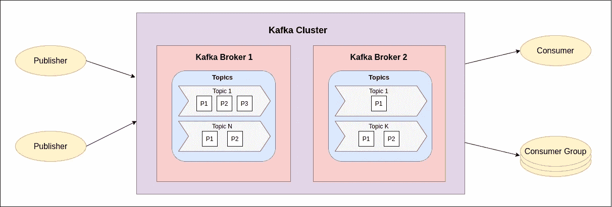
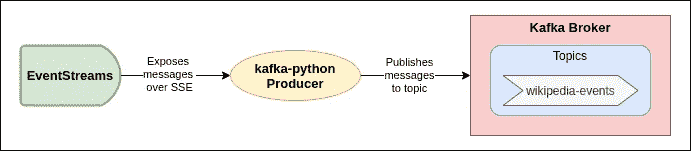

# 使用维基百科的 EventStreams 服务介绍阿帕奇卡夫卡

> 原文：<https://towardsdatascience.com/introduction-to-apache-kafka-with-wikipedias-eventstreams-service-d06d4628e8d9?source=collection_archive---------20----------------------->

## 概念和实践示例


若昂·布兰科在 [Unsplash](https://unsplash.com?utm_source=medium&utm_medium=referral) 上的照片

# 介绍

在这篇文章中，我们通过基本概念，构成了阿帕奇卡夫卡。我们利用维基百科提供的名为[事件流](https://wikitech.wikimedia.org/wiki/Event_Platform/EventStreams)的真实事件流，将它们发送到一个卡夫卡主题。

本教程旨在让读者熟悉 Apache Kafka，这是一个用于与 Kafka 交互的 Python 客户端库，也是进一步实验的平台。这种设置意味着在本地系统上运行，不考虑安全性和可伸缩性问题，使用的配置很少。

# 阿帕奇卡夫卡

Apache Kafka 可能是最著名的发布/订阅消息系统，它被各行各业过度采用是有充分理由的。在过去的几年里，由于对实时数据开发(分析、处理、可视化)的需求不断增长，它变得越来越流行。

已经写了许多电子书和文章来解释什么是阿帕奇卡夫卡以及它是如何工作的。在本文中，我将尝试对您需要了解的最重要的几点做一个简短的概述，并为您提供一些参考信息。我已经突出了最重要的关键词。

## 生态系统

Kafka 中的数据单元称为**消息**。一条消息只是一个字节数组，它还可以包含一个名为 **key** 的元数据位，这也是一个字节数组。根据用例的不同，可以使用或不使用键，它们提供了一种以更可控的方式填充主题分区的方法。消息也可以被称为键值对；您可以将它们视为传统 SQL 数据库中的记录。

在大多数情况下，消息需要有某种结构，可以很容易地从其他系统中解释出来(**模式**)。最流行的格式是 JSON、XML 和 Avro。

在 Kafka 中，生态系统消息是以**批**的方式产生的，目的是将消息在网络内部往返的开销降至最低。

消息被分类到不同的**主题**中，以便根据一些属性将它们分开。主题也可以分成**分区**，这提供了额外的可伸缩性和性能，因为它们可以被托管在不同的服务器上。您可以将主题视为一个仅附加的日志，只能从头到尾读取。在 SQL 世界中，主题就是我们的表。

有两种类型的客户端:**出版商**和**消费者**。顾名思义，发布者向主题发送消息，消费者阅读它们。

一个 Kafka 节点被称为**代理**。代理负责从生产者那里获取消息，将它们存储在磁盘中，并响应消费者的请求。许多经纪人组成一个集群。分区只能由一个称为 **leader 的代理拥有。**



卡夫卡主要成分概述

## 关键特征

使 Apache Kafka 脱颖而出的一些关键特性:

*   **多个制作者**可以同时发布消息到相同的主题。
*   **多个用户**可以独立于其他用户读取数据，也可以在共享流的一组用户中读取数据，并确保每条消息在整个组中只被读取一次。
*   **保留**，发布到集群的数据可以按照给定的规则在磁盘上保留。
*   可伸缩性，Kafka 被设计为完全可伸缩的，因为它是一个分布式系统，运行在不同地理区域的多个代理集群上，支持多个发行商和消费者。
*   **性能**，除了上面提到的特性之外，Kafka 即使在数据负载很重的情况下也非常快，从发布一条消息到可供消费之间的延迟为亚秒级。

在本教程中，我们将设置一个具有单个节点的 Kafka 集群作为概念验证。在生产环境场景中，为了充分利用 Kafka 的潜力，建议设置一个包含多个节点(至少三个)的集群。这将为实现跨节点的数据复制奠定基础，从而构建一个容错系统。

如果你想更深入地了解卡夫卡的生态系统，我建议你阅读**卡夫卡权威指南**以及其他电子书，你可以在[卡夫卡的官方网站](https://kafka.apache.org/books-and-papers)上免费找到。这本书将提供你理解 Kafka 如何工作所需要的所有低级知识，同时也提供在生产环境中部署的指南和建议。

# 卡夫卡-巨蟒

这个项目使用 kafka-python 库发布事件到 kafka 主题，因为它使用简单。当然，也有像 Confluent 的官方[库](https://github.com/confluentinc/confluent-kafka-python)或 [pykafka](https://github.com/Parsely/pykafka) 这样的替代品，你可以用它们来代替 kafka-python。

当然，您也可以从不同的编程语言中使用许多客户端库。用 Java 和 Scala 编写的客户端库可以被认为更适合生产环境，因为当需要完成更复杂的任务时，使用 Kafka 的母语将提供更多的选择。而且，那些库比用 Python 写的更成熟。

# 事件流

正如简介中提到的， [EventStreams](https://wikitech.wikimedia.org/wiki/Event_Platform/EventStreams) 是一个 web 服务，它使用[分块传输编码](https://en.wikipedia.org/wiki/Chunked_transfer_encoding)，遵循[服务器发送事件](https://en.wikipedia.org/wiki/Server-sent_events) (SSE)协议，通过 HTTP 公开连续的事件流。这些事件与维基百科用户改变现有维基百科网页状态(编辑和分类)的行为有关，也与添加新网页(网页)有关。

在这个项目中，我们只对与现有网页编辑相关的事件感兴趣，因此我们相应地过滤来自 EventsStreams 服务的事件。编辑事件包含编辑日期、编辑者的用户名、标志值(取决于是机器人还是人进行了编辑/更改)、文章标题和更多元数据等信息。出于本教程的考虑，我们选择只保留其中一些变量来发布给 Kafka 然而，您可以根据您想要模拟的用例来创建您自己的消息模式。

编辑事件带有不同名称空间，用于标识不同类型的文章类别。这些名称空间在从 EventStreams 中使用时是整数，但是我们根据这个[表](https://en.wikipedia.org/wiki/Wikipedia:Namespace#Programming)将它们映射到它们的 id 名称。

我们的消息的最终 JSON 模式示例如下:

```
{
    "id": 1426354584, 
    "domain": "www.wikidata.org", 
    "namespace": "main namespace", 
    "title": "articles_title", 
    "timestamp": "2021-03-14T21:55:14Z", 
    "user_name": "a_user_name", 
    "user_type": "human", 
    "old_length": 6019, 
    "new_length": 8687
}
```

# 设置项目



项目概述

## 在本地启动 Kafka 代理

打开一个新的终端来启动 Zookeeper 集群管理器。默认情况下，端口 2181 将用于以下机器:

```
bin/zookeeper-server-start.sh config/zookeeper.properties
```

在第二个终端中，在本地启动一个 Kafka 代理。默认情况下，它将在端口 9092 运行。

```
bin/kafka-server-start.sh config/server.properties
```

打开第三个终端，以便与卡夫卡互动。首先列出本地主机代理中当前可用的主题。

```
bin/kafka-topics.sh --list --zookeeper localhost:2181
```

创建一个新的卡夫卡主题，将其命名为 **wikipedia-events** 。在本主题中，我们将传播(发布)来自 EventStreams 服务的所有编辑事件。

变量*复制因子*和*分区*是可选的。第一个选项指的是本主题应该初始化的不同节点的数量，这个选项帮助您实现前面提到的容错，并且只在具有多个代理的集群中有意义。分区还提供跨多个代理的可伸缩性；在这种情况下，1(一)以外的值实际上没有意义。

```
bin/kafka-topics.sh --create --zookeeper localhost:2181 --replication-factor 1 --partitions 1 --topic wikipedia-events
```

再次列出我们的主题，wikipedia-events 应该在控制台中打印出来。

## 设置 Python 环境

首先将 [GitHub 项目](https://github.com/ZisisFl/kafka-wikipedia-data-stream)克隆到您的本地机器上。

```
git clone [https://github.com/ZisisFl/kafka-wikipedia-data-stream.git](https://github.com/ZisisFl/kafka-wikipedia-data-stream.git)
```

克隆完成后，导航到项目文件夹。

首先，我们需要创建一个新的 Python 3 虚拟环境(这不是强制性的，但是强烈推荐)。我们将这个环境命名为 kafka_env。这个项目所需的所有库都包含在 **requirements.txt** 文件中。如果你想自己安装必要的库，小心使用 pip install**Kafka-python**而不是 pip install **kafka** 。(以下命令可能不适用于 Windows 操作系统。)

```
python3 -m venv kafka_venv
source kafka_venv/bin/activate
pip install -r requirements.txt
```

使用以下命令，执行 Python 脚本*" Wikipedia _ events _ kafka _ producer . py "*并打开一个新的终端，以便通过终端使用来自 Kafka 主题的消息。选项 *from-beginning* 不是必需的，使用时会提供已经发布到目标主题的消息的全部历史；否则，从执行以下命令的那一刻起，您将消耗消息。

```
bin/kafka-console-consumer.sh --bootstrap-server localhost:9092 --topic wikipedia-events --from-beginning
```

控制台中应该打印出多个 JSON 对象！

# 实验建议

*   创建处理不同类型事件的多个生成器，并通过不同或相同的主题发送它们。
*   创建将数据成批存储到数据库或将其提供给任何其他系统的消费者。
*   创建一组消费者，他们将分担并行使用消息的工作，以提高性能。