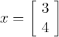
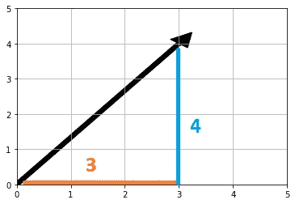
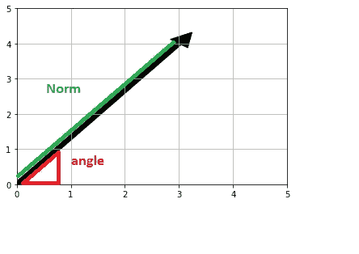
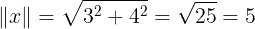
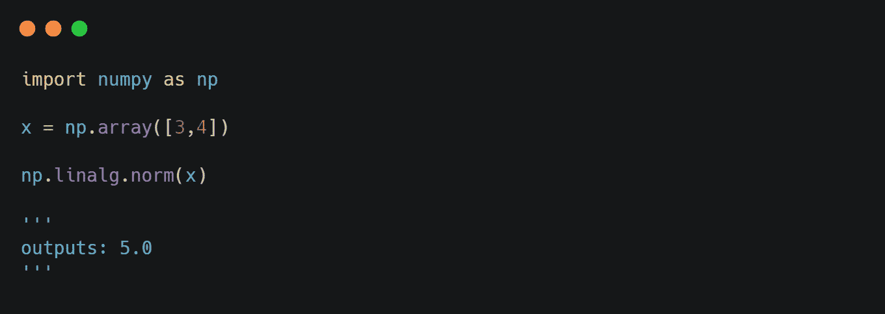
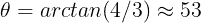
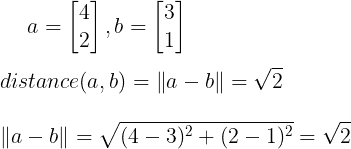
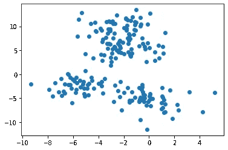
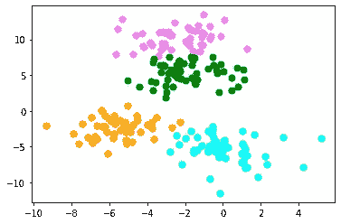

# 应用线性代数导论:范数和距离

> 原文：<https://towardsdatascience.com/introduction-to-applied-linear-algebra-norms-distances-2451e6325925?source=collection_archive---------8----------------------->

来自[佩克斯](https://www.pexels.com/de-de/foto/schreiben-mathematik-schule-display-8617644/?utm_content=attributionCopyText&utm_medium=referral&utm_source=pexels)的[扬·克鲁科夫](https://www.pexels.com/de-de/@yankrukov?utm_content=attributionCopyText&utm_medium=referral&utm_source=pexels)的照片

**目标:**本文介绍了向量范数、向量距离及其在数据科学领域的应用

**为什么要学:**向量范数和距离用来描述向量的属性以及不同向量之间的相互关系。它广泛应用于聚类等机器学习技术中。

**目录**

*   什么是规范？
*   距离
*   使用距离的示例
*   使聚集

# **什么是定额？**

为了理解向量的范数，让我们回忆一下向量是一个有序的有限数字列表，如下所示:

本例中的向量 x 有两个元素，因此我们可以很容易地在 2D 平面中绘制向量，如下所示:

作者图片

在上图中，向量的第一个元素对应于 x 值，向量的第二个元素对应于 y 值。很高兴知道向量的元素对应什么，但是向量的下列属性是什么？

作者图片

正如你在图中看到的，向量的进一步特征是它的范数，也就是向量在 x，y = 0 时离原点的距离，以及它的角度。定额是这样计算的:

在 Python 中，您可以像这样计算范数:

如果一个向量的范数是一个小的数，那么它就是小的；如果它的范数是一个大的数，那么它就是大的。(符合小或大的标准的数值取决于特定的应用和环境。)

为完整起见，角度θ计算如下:

观察 53 度以上的图是有意义的，因为我们比平分线(45 度)略高。但是尽管如此，我们不会关注向量的角度，因为这篇文章是关于范数和距离的。

# **距离**

我们可以用范数来定义两个向量 *a* 和 *b* 之间的[欧氏距离](https://en.wikipedia.org/wiki/Euclidean_distance)作为它们差的范数:

**使用距离的数据科学示例:**

*   **特征距离:**如果向量表示两个对象的特征，我们可以计算距离，如上所述，以获得特征距离，这是对对象差异程度的度量。举一个具体的例子，假设我们正处于疫情疫情中(比方说 Covid19)，我们拥有与医院中的患者相关的向量，条目包括体重、年龄、胸痛、呼吸困难和病毒测试结果。我们可以使用特征向量距离来判断一个患者病例是否与另一个相似(至少在特征方面)。
*   **文档相异度:**假设我们有两个向量，其中包含两个文档的单词出现的直方图(频率)。那么两个向量的距离代表两个文档的不相似性的度量。如果我们看的是同一类型或同一作者的文档，我们可能会期望距离更小，如果我们比较的是不同的作者和类型，我们可能会期望距离更大。

# 使聚集

作为一名数据科学家，如果您想解决聚类问题，向量距离的计算是至关重要的。这里，您将获得数据，在这种情况下，这些数据将是与感兴趣的实体(例如，医院中的患者)的特征相对应的多个向量。如果您有一个包含两个特征的矢量数据集，您可以将数据可视化为散点图，其中每个数据点对应一个矢量:

作者图片

在聚类中，目标是将向量分组，使得一个组中的向量彼此靠近，比如最小化彼此之间的距离，如下所示:

作者图片

本例中使用的聚类算法称为 [k-means 聚类](https://en.wikipedia.org/wiki/K-means_clustering)，基本上是基于本文中学习到的向量距离的计算。

今天就到这里，非常感谢您的阅读！如果你想了解未来的文章，请跟我来，如果你喜欢这篇文章，请鼓掌！