# 应用线性代数导论:向量

> 原文：<https://towardsdatascience.com/introduction-to-applied-linear-algebra-vectors-29ff7e0539?source=collection_archive---------23----------------------->

来自 [Pexels](https://www.pexels.com/de-de/foto/junge-im-blauen-hemd-5212358/?utm_content=attributionCopyText&utm_medium=referral&utm_source=pexels) 的 [Max Fischer](https://www.pexels.com/de-de/@max-fischer?utm_content=attributionCopyText&utm_medium=referral&utm_source=pexels) 的照片

**目标:**本文介绍了向量、向量运算及其在数据科学领域的应用

**为什么要学习它:**无论是预测、分类还是聚类，它都是几乎所有机器学习技术从数据中学习的基础

**目录:**

*   什么是向量？
*   向量加法
*   标量向量乘法
*   点积
*   线性组合

# 什么是向量？

向量是有序的有限数字列表。它们通常是这样写的:

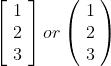

向量可以写在括号或圆括号中

向量的元素是该向量中的值。python 等效物是 numpy 数组。向量的大小(或长度)是其元素的数量:

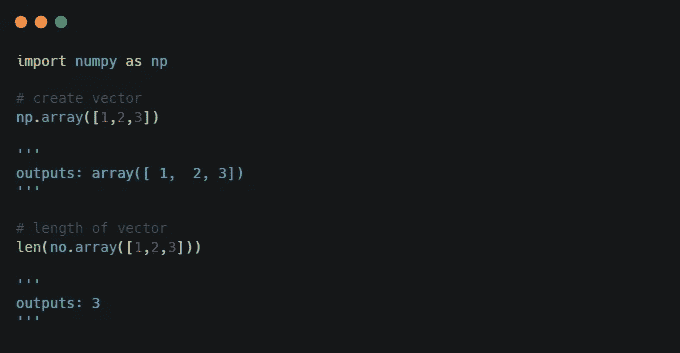

**示例:**

*   特征向量:在许多应用中，向量收集单个实体的不同特征。这些特征可以是对象的测量值，例如医院中患者的年龄、身高、体重、血压。
*   时间序列:向量可以表示时间序列或信号，即某个量在不同时间的值。例如，时间序列可以表示股票市场的股票价值，也可以表示某个地区每小时的降雨量。
*   客户购买:向量也可以表示特定客户从企业购买的记录，向量的条目表示客户在特定产品上花费的金额。

# **矢量加法**

向量加法通过逐元素加法工作:

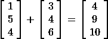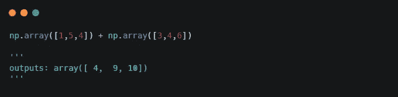

类似地，向量减法通过逐元素减法来工作:

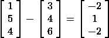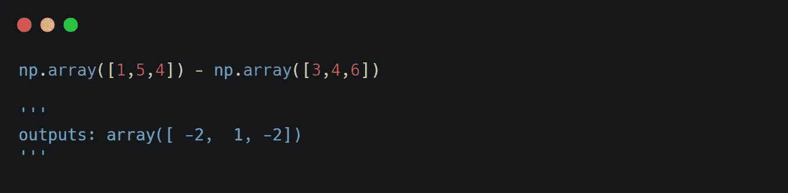

**示例:**

*   字数:如果向量 *a* 和 *b* 是字数，表示给定单词在两个对应文档 *A* 和 *B* 中的出现频率，那么 *a + b* 之和就是这两个文档的组合。同样，差异 *a-b* 给出了每个单词在文档 *A* 中出现的次数多于在 *B* 中出现的次数。
*   时间序列:如果 *a* 和 *b* 代表相同数量的时间序列，例如两家店的月利润，那么 *a+b* 之和代表两家店的月总利润的时间序列。
*   投资组合交易:假设我们有两个向量。首先，原始投资组合向量 *s* ，其条目表示投资组合中给定资产的份额数量。第二，交易向量 *b* ，正条目给出购买的资产数量，负条目给出出售的资产数量。然后我们最终的投资组合由 *s +b* 给出。

# **标量向量乘法**

另一个重要的向量运算是将向量与标量相乘(这只是“数字”的一个时髦说法)，这是通过将向量的每个元素与标量相乘来完成的:

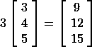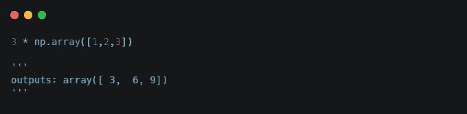

**例子:**

*   材料需求:假设向量 *q* 是生产某种产品的一个单位的材料清单，例如一部手机。那么 *q* 的条目就是生产一部手机所需的原料量。为了生产 300 台手机，我们需要 300 *q* 给出的原材料。
*   音频缩放:如果一个矢量 *v* 表示一个音频信号(正如我们所了解的，它是一个时间序列)，如果我们取标量倍数 3 *v* ，信号的音量可以增加 3 倍。

# **点积**

现在，这是线性代数中最重要的运算之一，设法出现在与数据科学相关的所有领域，从[线性回归](http://Linear regression)到[神经网络](https://en.wikipedia.org/wiki/Neural_network)。两个向量的点积是通过将向量的每个对应元素相乘并将所得乘积相加来计算的。自己看:

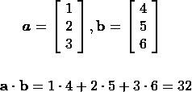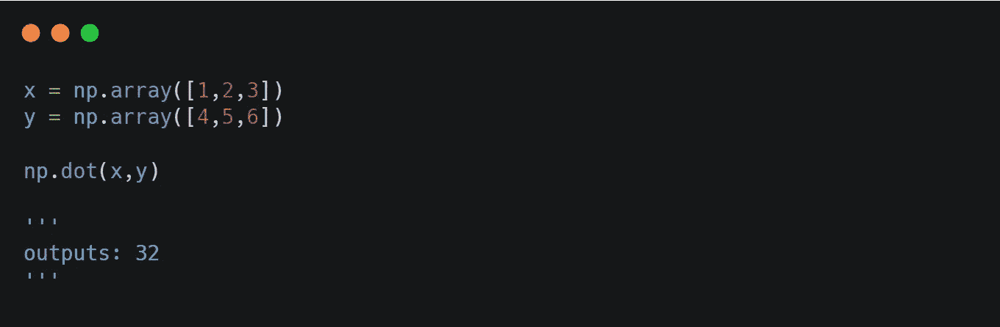

**例子:**

*   Sum:如果我们取向量 *a* 和 *b* 的点积，其中 *a* 仅由 1 组成，并且长度与 *b* 相同，我们得到 sum 运算。
*   平均:如果我们取向量 *a* 和 *b* 的点积，其中 *a* 仅由 1/n 个条目组成(n =向量的共享长度)，我们得到向量 *b* 的平均值。
*   同现:假设向量 *a* 和 *b* 是相同长度的向量，其中条目只能是 0 或 1，那么 *a* 和 *b* 的点积给出两个向量都显示为 1 的条目总数。这可能意味着在某些情况下，我们有相同的预测或特征。
*   [情感分析](https://en.wikipedia.org/wiki/Sentiment_analysis):文本分析中的一个具体问题是给定文本的情感(情感极性)是积极的、消极的还是中性的。我们可以通过创建两个向量来初步解决这个问题。首先，长度为 *n* 的向量 *x* 表示文本中 *n* 个单词的出现频率。第二，相同长度的向量 *w* ，代表给定单词的极性，条目为-1(表示‘不好’或‘可怕’之类的否定词)、0(表示‘和’之类的中性词)或 1(表示‘好’或‘awsome’之类的肯定性词)。然后 *x* 和 *w* 的点积给出了文本中情感的第一个(粗略的)度量。

# **线性组合**

点积的一种特殊解释是，我们将一个矢量 *x* 乘以另一个矢量 *β* 称为 *x* 的线性组合:

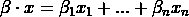

这里将 *β的元素称为系数。*x 的线性组合构成了预测连续量的最流行的统计工具之一的支柱——[线性回归](https://en.wikipedia.org/wiki/Linear_regression)。例如，它用于房价预测，其中我们有一个特征向量 *x* ，并希望通过回归系数 *β* 找到这些特征的最佳权重，以便在给定房屋特征(例如，房屋面积(平方英尺)、卧室数量等)的情况下预测房价。)

今天就到这里，非常感谢您的阅读！如果你想了解未来的文章，请跟我来，如果你喜欢这篇文章，请鼓掌！