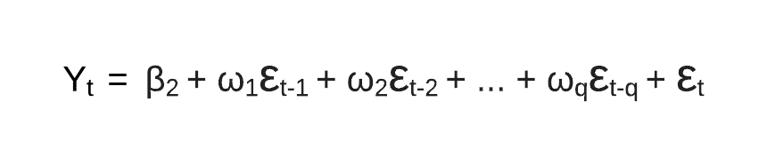
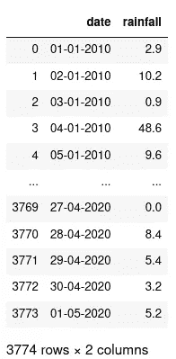
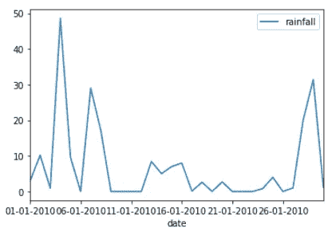
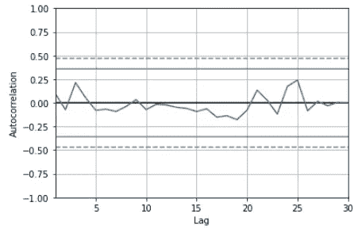
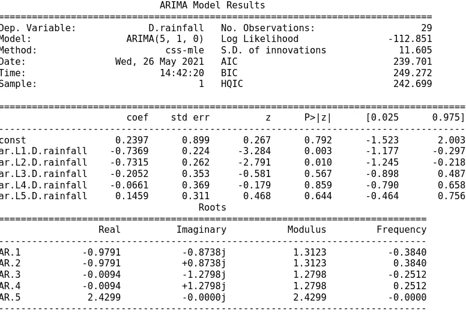
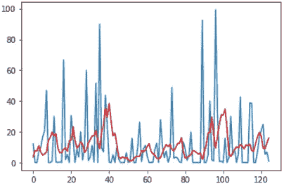

# 时间序列预测的 ARIMA 介绍

> 原文：<https://towardsdatascience.com/introduction-to-arima-for-time-series-forecasting-ee0bc285807a?source=collection_archive---------6----------------------->

## 了解用于时间序列预测的一种比较流行的 ML 算法。

自回归综合移动平均(ARIMA)模型是时间序列预测中较为流行和广泛使用的统计方法之一。它是一类统计算法，捕捉时间序列数据特有的标准时间依赖性。在本帖中，我将向您介绍 ARIMA 的基本原理，并展示一个用 Python 开发用于时间序列预测的 ARIMA 的实践教程。


托马斯·博尔曼斯在 [Unsplash](https://unsplash.com?utm_source=medium&utm_medium=referral) 上的照片

```
**Table of Content:** 1\. What is ARIMA?
2\. Introduction to the Dataset
3\. Implementing ARIMA model in Python
4\. Forecasting using ARIMA**Notes before we begin**:
1\. Download the [rainfall CSV dataset here](https://drive.google.com/file/d/1CL1l38xkg9NJTxUpq-i7CeMNjkp3BKIh/view)
2\. Install dependencies: 
  - *pip install statsmodels* OR *conda install statsmodels
  - pip install patsy OR conda install patsy*
```

# **什么是 ARIMA？**

## **关键词:平稳性和自相关性**

在我们深入 ARIMA 的正式数学定义之前，让我向你介绍一下**平稳性**的概念。平稳性仅仅意味着不依赖于时间的观察。对于依赖于时间的数据(如季节性降雨)，平稳性条件可能不成立，因为不同的时间将产生不同的观测值。

理解 ARIMA 的另一个重要概念是自相关。它与典型的相关性有何不同？首先，相关性涉及两组不同的观察值(如房价和可用公共设施的数量)，而自相关涉及同一组观察值，但跨越不同的时间(如夏季*与秋季*的降雨量)。

现在让我们来分解 ARIMA 的不同组成部分:自回归(AR)、综合(I)和移动平均线(MA)

## IMA 的自回归:自回归

正如您可能已经猜到的，自回归(AR)回归模型建立在自相关概念的基础上，其中因变量取决于其自身的过去值(例如，今天的降雨量可能取决于昨天的降雨量，等等)。一般等式是:


ARIMA 的自回归模型

如图所示，在时间 t`Yt`的观察`Y`取决于`Yt-1, Yt-2, ..., Yt-p`。为什么是`Yt-p`而不是`Y0`(即。初始值)？这里的 **p** 称为滞后阶数，表示我们在模型中包括的先前滞后观测的数量(例如，我们可能排除了当前时间之前 5 天以上的观测，因为这些较早的降雨观测可能不相关)。

## **AR[I]MA 中的 I:综合**

回想一下我们对平稳性的解释。ARIMA 的积分部分试图将时间序列数据的非平稳性转换成稍微平稳一点的东西。我们如何做到这一点？通过对任意两对观测值之间的**差**进行预测，而不是直接对数据本身进行预测。


ARIMA 的差异

请注意，根据我们在训练 ARIMA 模型时设置的超参数 **d** ，我们如何多次执行差分运算(**Y→Z**和 Z→Q)。

## 移动平均线

现在 ARIMA 的最后一块是移动平均线。它试图通过对你过去的观测值进行某种聚合操作，以残差ε(读作:ε)来减少我们的时间序列数据中的噪声。



ARIMA 移动平均线

ε项表示来自聚合函数的残差，这里的 **q** 是另一个超参数，与**p**相同，但不是识别时间序列数据本身的时间窗口(**p**),**q**指定移动平均值残差的时间窗口。

现在让我们用 Python 来实现 ARIMA。

# 数据集简介

> 如果您尚未下载数据集，请在此处[下载。](https://drive.google.com/file/d/1CL1l38xkg9NJTxUpq-i7CeMNjkp3BKIh/view)

让我们对数据集进行一些基本的探索。

```
import pandas as pddf = pd.read_csv('rainfall.csv')
df
```



降雨时间序列(图片由作者提供)

我们的数据集是从 2010 年 1 月 1 日到 2020 年 5 月 1 日的日降雨量时间序列数据(单位为毫米)。

让我们画出降雨量数据如何随时间变化的图(为了便于说明，我们以一个月为例)。

```
import matplotlib.pyplot as plt# First 30 days
first_30 = df[:30]first_30.plot.line(x='date', y='rainfall')
```



第一个月的降雨量数据(图片由作者提供)

我们还可以检查数据集中可能出现的任何自相关。

```
from pandas.plotting import autocorrelation_plotautocorrelation_plot(first_30['rainfall'])
```



自相关(图片由作者提供)

当滞后时间很短(0-5 天)和足够长(20-25 天)时，似乎有轻微的相关性，但不在中间值之间。

我们接下来可以从 ARIMA 的实施中获得有价值的信息！

# 用 Python 实现 ARIMA 模型

首先，我们需要导入`statsmodels`库。

```
from statsmodels.tsa.arima_model import ARIMA
```

然后，我们用这些初始超参数为 **p，d，q** 定义模型(如之前在*什么是 ARIMA？*节)。

```
# fit modelp,d,q = 5,1,0model = ARIMA(first_30['rainfall'], order=(p,d,q))
model_fit = model.fit()
```

让我们看看结果摘要。

```
print(model_fit.summary())
```



ARIMA 模式总结(图片由作者提供)

注意顶部的 **AIC、BIC 和 HQIC 指标**？这些值越低，模型的拟合度越好。所以可以进行进一步的超参数调优或者数据预处理，以达到更好的效果！

我们有了第一个 ARIMA 的工作模型。最后一节将带您了解如何根据我们训练好的模型进行未来预测。

# 使用 ARIMA 进行预测

让我们首先扩展我们的数据集，以包括`365`天而不是`30`。

```
data = df[:365]['rainfall'].values
```

1.  然后，我们将数据分为训练集(66%)和测试集(34%)。

```
train_size = int(len(data) * 0.66)
train, test = data[0:train_size], data[train_size:len(data)]
```

2.并初始化历史值和预测值用于比较目的

```
history = [x for x in train]
predictions = list()
```

3.现在，我们训练模型，并根据存储在测试数据中的信息进行未来预测

```
for t in range(len(test)): model = ARIMA(history, order=(5,1,0))
    model_fit = model.fit()
    pred = model_fit.forecast()
    yhat = pred[0]
    predictions.append(yhat) # Append test observation into overall record
    obs = test[t]
    history.append(obs)
```

4.让我们评估一下我们的表现

```
from sklearn.metrics import mean_squared_error
from math import sqrtrmse = sqrt(mean_squared_error(test, predictions))print('Test RMSE: %.3f' % rmse)
>>> Test RMSE: 20.664
```

相当大的 RMSE！毫无疑问，这里还有改进的空间。

我们还可以画出观察和预测之间的差异，并比较两者是如何相似的(或不同的！)



评价(图片由作者提供)

不算太差！我们的预测(红色)与某些天的观测(蓝色)非常相似(除了具有明显高峰的极端降雨情况)。

# **离别的思念**

就是这样！到目前为止，我们已经讨论了 ARIMA 的基本原理以及如何用 Python 实现它。ARIMA 的一个关键特征，就像任何其他 ML 模型一样，是它对超参数调整的依赖。因此，请务必执行这些步骤！除了微调之外，良好的工作领域知识也是产生高性能 ARIMA 模型的关键。你觉得 ARIMA 怎么样？

【https://tinyurl.com/2npw2fnz】*[*我会定期通过我的电子邮件简讯用通俗易懂的语言和漂亮的可视化方式总结人工智能研究论文。*](https://tinyurl.com/2npw2fnz)*