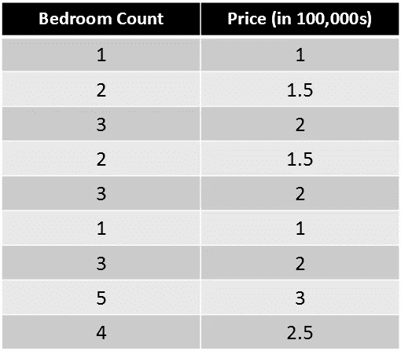
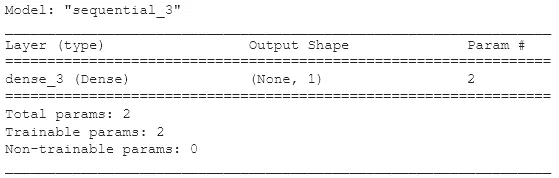
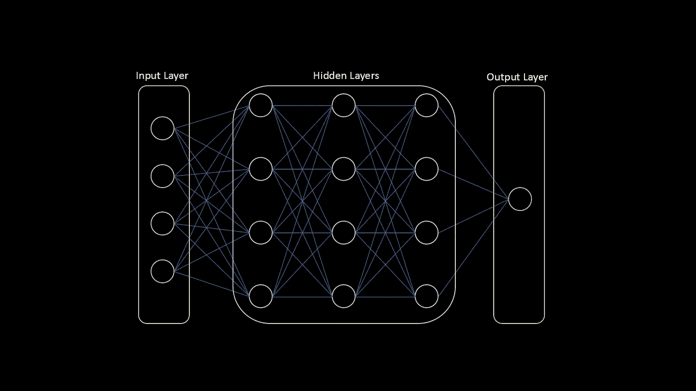
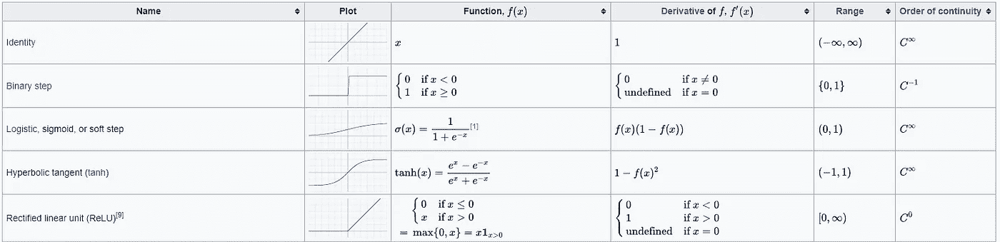
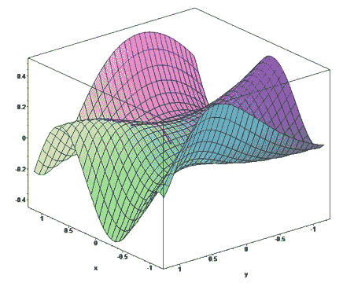
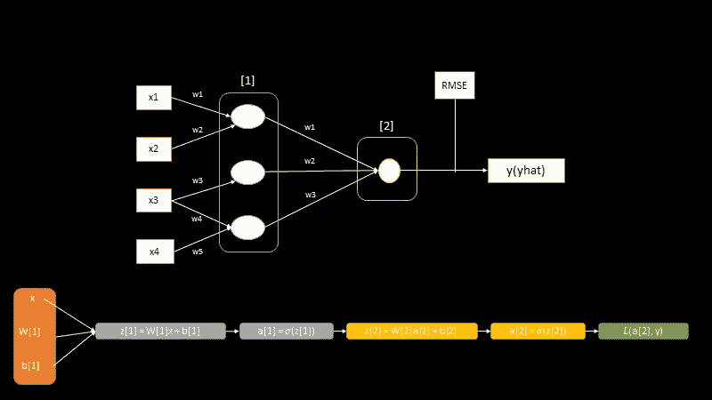
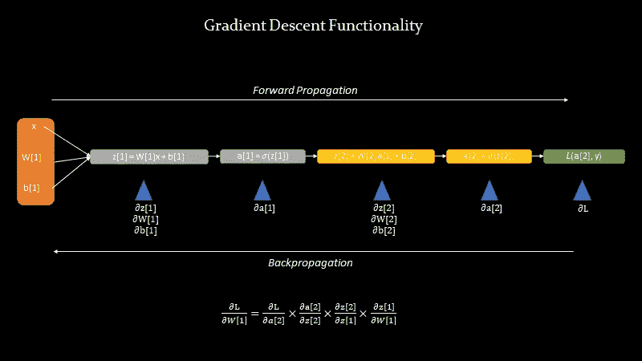
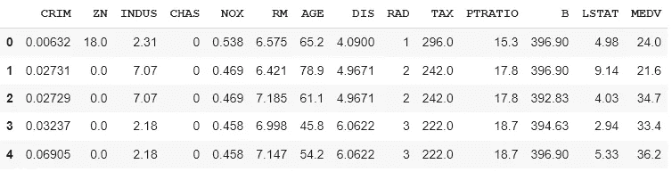
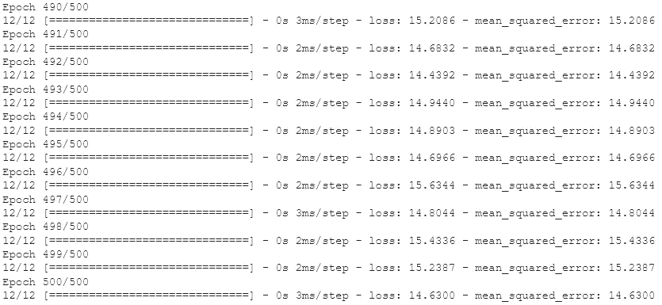
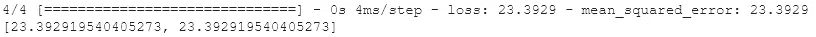

# 使用 Tensorflow 介绍人工智能、机器学习和深度学习

> 原文：<https://towardsdatascience.com/introduction-to-artificial-intelligence-machine-learning-and-deep-learning-with-tensorflow-b5fa20477e89?source=collection_archive---------25----------------------->

## 机器学习和张量流的起点


蒙大拿的野花。作者图片

这是我希望做的关于高级机器学习的一长系列的第一部分。Tensorflow 最近推出了 2.x，它与 Keras 的集成使它成为一种真正易于使用和学习的功能性语言。在这一点上，Tensorflow 和 PyTorch 非常相似，因此学习其中任何一种都将在参与人工智能复兴中为您提供很好的服务。

这并不意味着是一个数学演练，而是一个更实际的演练-这将帮助您自己开始使用 Tensorflow。也就是说，如果你想学习，我会添加一些解释来解释某些概念。

本文将假设您了解一些 Python。

# 目录

1.  一种新的编程模式
2.  这是怎么回事？
3.  预测波士顿房价数据集中房屋的中值

# 一种新的编程模式

为了达成共识，这里澄清了一些定义。

## **什么是人工智能、机器学习、深度学习？**

人工智能:计算机系统对人类智能的模拟。人工智能可以包括硬件和软件系统，它专注于 3 个认知过程:学习、推理和自我纠正。作为一个社会，我们目前处于人工智能的基础形式——人工狭义智能。这实质上意味着人工智能主要是复杂、非结构化数据集的非凡模式匹配器，因此，它最常见的应用是自然语言处理、计算机视觉和语音识别。

机器学习:通常被称为人工智能的一个子领域，机器学习是从数据中看到的例子中学习的实践。它采用带有答案的例子，并学习在给定数据的情况下产生这些答案的规则(模式)。ML 模型建立在统计学的基础之上，ML 优化器(他们如何学习这些模式)建立在微积分的基础上，高效的 ML 编程建立在线性代数的基础上。

深度学习:机器学习的一个子领域，是构建多层神经网络的实践。深度学习的常见用例是图像分类、时间序列预测和欺诈检测。

注意，深度学习只是代表了一套与复杂数据集的神经网络相关的方法；它们不是 ML 的灵丹妙药，也不是每个场景中的最佳建模选择。他们兴奋的一个重要原因是，他们已经能够学习获取数据并为各种非结构化任务创造答案的规则。

在解开更多关于深度学习和神经网络的事情之前，我们先来看一个例子。

## 开始简单

假设您想要预测一栋 7 居室房屋的价格。因此，想象一下，如果房屋定价很简单，每间卧室的价格为 50k + 50k，那么一间一居室的房屋价格为 100k，一间两居室的房屋价格为 150k，等等。你出去收集一些房子的数据，获得它们的卧室数量和价格。

为了在我们的模型中创造稳定性，我们可以适当地将数据缩小到单个数字(并以几十万来解释答案)。



作者图片

## 构建最简单的神经网络

作者图片

这将打印出:



作者图片

本质上，我们在网络中有一层一个节点/神经元。密集是一种识别其中有神经元的层的方法，连续的层通过顺序定义(在这种情况下，我们只有一个神经元和一个层)。

## 允许神经网络学习

现在，网络创建完毕，但我们需要为它提供两样东西:

1.  学习的方法
2.  学什么

作者图片

编译行包括两个非常重要的概念:

1.  优化器:这代表了一种方法，在这种方法中，神经网络遍历一个可能的领域，找到代表数据的最佳模式集，从而产生一组答案
2.  损失函数:这代表了告诉神经网络它是否朝着正确的方向前进的度量。

把这想象成我们建立的模型，穿越一系列的山丘，试图找到地形的最低点。它可以按线性顺序一次执行多个步骤，也可以随机执行巨大的跳跃(或者其他更聪明的技术)——这是优化器的基础。“sgd”代表随机梯度下降，这实质上是模型在地形上随机跳跃以找到最低点的地方。这个优化器非常有用，因为它可以防止模型陷入局部极小值，而这个极小值实际上并不是整个全局的底部，即全局极小值。

损失函数惩罚向错误方向迈出一步的模型，因此它知道它是否正在接近底部，也称为收敛。均方差是用于回归任务的常见损失函数，因为它预测连续值。它实际上是找到残差(实际预测值)，对其求平方，对所有平方误差求和，然后除以值的计数，得到一个度量值。

第二条线符合我们收集的数据的模型，并运行 500 个时期。历元表示模型将经历训练循环的次数。训练循环是模型“猜测”一个值，然后测量该值与实际值的接近程度，并对其进行迭代，直到尽可能好为止的过程。

## 预测新值

现在我们可以预测 7 间卧室。

作者图片

```
[3.9685223]
```

你可能会有点困惑，因为我们的数据直接映射到一个线性方程:y=.5x+.5，如果我们为 x 输入 7，我们应该得到 4——那么为什么我们得到~3.97 呢？

这是因为包括神经网络在内的 ML 模型的基础是概率。这些模型不会在确定性的世界中运行，我们实际上也不想让它们运行。机器学习的整个目标是建立模型，这些模型可以准确地、合乎道德地归纳出看不见的数据。如果它能“明确地”识别模式，这是不可能的——它需要考虑概率因素。此外，我们只有 9 个数据点来训练模型，这些数据点可以显著影响结果与规则的“真实公式”的接近程度。

> 机器学习的整个目标是建立模型，这些模型可以准确地、合乎道德地归纳出看不见的数据。

# 这是怎么回事？

## 神经网络结构

神经网络由 3 层组成:

1.  输入层:在我们的例子中，我们只有卧室，但是当我们扩展我们的数据集(邮政编码、平方英尺、财富等)时，每个新节点都会被添加一个额外的特征。)
2.  隐藏层:我们只有一个包含一个神经元的隐藏层，但是对于深度神经网络，神经元功能保持不变。每个神经元找到其特征的某种线性组合，然后对其应用非线性激活函数。
3.  输出层:这是我们的房价。它也可以是分类输出图层，但我们会希望通过不同的损失函数进行测量。

深度神经网络(或多层感知器)，深度学习的面包和黄油，利用了两个以上的隐藏层。



作者图片

神经网络至少需要这些东西才能正常工作(适当地推广到新数据):

1.  大量数据(因此痴迷于大数据)
2.  敏感激活函数
3.  有效且高效的优化算法
4.  适当损失函数

当我们谈论大量数据时，我们通常指的是数据应该具有大容量和多样性。如果模型希望有效地学习示例并归纳出新数据，它需要一组有代表性的示例来学习。

每个优化算法和损失函数如何工作的技术细节有点超出了本文的范围，但是我将介绍它们的用途和常见选择。

## 激活功能

激活函数是每个节点非线性转换数据以找到更复杂模式的一种方式。以下是一些最受欢迎的:



激活函数示例。[维基百科](https://en.wikipedia.org/wiki/Activation_function)

确定哪一个最适合您的模型的好方法是真正了解您的数据和您的目标。例如:ReLU 是一个常见的选择，如果我们要建立一个完整的房价预测模型，我们可能会使用它，但是为什么呢？ReLU 将< 0 到 0 的值截断，这很好地模拟了我们的产出价格，因为我们的模型预测房子的价格为负数是没有意义的。

有趣的事实:如果你在激活函数中认出一个熟悉的名字(逻辑)，那不是偶然的。逻辑回归是神经网络在最简单的尺度上所做的一个极好的例子。它采用各种输入，线性组合它们以学习各自的权重，然后将它们分解成一个 sigmoid 函数，以产生一个介于 0 和 1 之间的输出。

## 最优化算法

神经网络学习的方式是通过它们的优化技术。梯度下降是这方面的主要算法，但 GD 的变体已被提出，它们工作得非常好。这里有几个流行的:

1.  随机梯度下降
2.  RMSProp
3.  圣经》和《古兰经》传统中）亚当（人类第一人的名字

本质上，每一个都试图提出不同的方法来遍历广阔的领域以找到最低点——全局最小值——并且根据您的用例，不同的优化可能是有价值的。



红线是试图找到最小值的优化算法的一个例子。[维基百科](https://en.wikipedia.org/wiki/Gradient_descent)

## 损失函数

损失函数很大程度上取决于我们要做的任务。如果我们预测一个实数值(回归)，常见的损失函数是均方误差。如果我们预测一个分类变量(分类)，常见的损失函数是二元交叉熵(对于多分类是稀疏分类交叉熵)。

## 但是实际上发生了什么呢？

当该模型通过网络向前传播信息(向前传播)时，它猜测并学习与沿途增量损失相对应的权重。随着模型的每次前进，它也反向传播信息以重新更新权重，并在下一次变得“更聪明”(反向传播)。这是梯度下降背后的功能思想，也是数学如何如此完美地将所有这些部分联系在一起。



作者图片



导数在更新权重的过程中学习。作者图片

# 预测波士顿房价数据集中房屋的中值

我们可以使用[波士顿房价数据集](https://raw.githubusercontent.com/jbrownlee/Datasets/master/housing.csv)(这里是[的描述](https://raw.githubusercontent.com/jbrownlee/Datasets/master/housing.names))并尝试建立一个更深层次的神经网络来评估性能，而不是使用一个人为的 9 个值的列表。

作者图片



作者图片

我们正在预测“MEDV”值，因此我们可以将数据集分为 X 和 y，然后使用 sklearn 的 train_test_split()通过 75/25 拆分将我们的数据分为训练集和测试集。这允许模型适合训练数据，然后在测试数据上验证其性能。这样做是为了创建一个能够推广到新的、看不见的数据的模型。

作者图片

如果我们想让模型在精确度(或我们想要的任何其他度量)达到某个点时停止训练，会怎么样？本质上，如果模型能够根据我们选择衡量的指标更快地学习数据集中的模式，我们就不需要模型为我们设置的所有时期保持训练。

我们可以建立一个回调日志，如下图所示，当均方差小于 1 时停止训练。由于目标值字段是在 1000 美元左右，这将意味着模型何时能够预测在大约 31 美元以内。

我们也可以很容易地添加多层来扩展我们的网络；这与我们的激活功能相结合，允许每一层学习更复杂的模式。如果增加更多能够学习更复杂的模式，为什么不只是用无止境的层和节点使网络超载呢？在您的设计选择中，至少有几个需要慎重考虑的原因:

1.  当您过度复杂的模型架构时，过度拟合很容易发生。如果模型能够在任何事物中找到模式，它也很容易将噪声作为信号，这妨碍了它推广到看不见的数据的能力。
2.  计算成本是真实存在的。用大量数据训练大规模网络会占用大量计算资源。
3.  奥卡姆剃刀是机器学习的一个基本支柱。更容易理解、设计和解释的简单解决方案通常是更好的实现选择。这显然不适用于每一个问题，但它适用于大多数问题，并且肯定适用于这个问题。

> 奥卡姆剃刀，“简约原则或简约法则是‘实体不应被乘以超过必要性’的解题原则……”

此外，我们可以通过将“sgd”更改为“adam”来轻松更改优化器。这可能会对结果产生影响，因此如果您正在进行试验，请确保尝试多种实现。

作者图片



作者图片

根据训练数据，该模型似乎做得不错，但肯定不是最好的。让我们根据测试数据进行评估。

作者图片



作者图片

模型在测试集上表现明显更差，很明显过度拟合正在发生。一个可能的原因是，我们的模型对于一个有 500 行的数据集来说太复杂了(而训练集只有其中的 75%)。尽管如此，当涉及到神经网络时，我们也没有应用通用技术来减轻过度拟合(丢弃、正则化等。).更不用说梯度增强树通常在结构化数据上表现得更好，但那是不同的日子。

如果我们确实想在这个数据集上改进这个模型，下面是我们可以尝试的一些关键事情:

1.  超参数调整:有许多超参数会显著影响模型性能。一些关键因素包括学习速度、批量大小、节点数量等。
2.  改变优化算法:随机梯度下降可能是比 Adam 更好的选择，但它也可能是 Adam 需要的调整。
3.  交叉验证(Cross Validation ):一种将训练集和测试集分层的技术，允许更严格地根据看不见的数据评估模型。这也因此给了模型较少的数据来训练。
4.  丢弃/正则化/其他过度拟合技术:这些技术中的每一种都可能真正有助于惩罚模型过于接近我们数据集中的噪声。

**免责声明:我最近(在发表后)发现，这个数据集随意地假设人们更喜欢在种族隔离的街区购买住房；如果我事先知道这一点，我就不会在这个例子中使用它。除了教授职业道德实践之外，请谨慎使用该数据集。**

# 下次请继续收听

今天到此为止！这是对处理神经网络和张量流的机器学习“深”端的探索，但这真的只是开始，这个世界真的如此迷人。

如果您对学习计算机视觉、自然语言处理、序列模型、图形机器学习等感兴趣，请务必关注/订阅！

**参考文献**

[1]深度学习。人工智能、[神经网络和深度学习](https://www.coursera.org/learn/neural-networks-deep-learning?specialization=deep-learning)

【2】深度学习。AI，[改进深度神经网络:超参数调整、正则化和优化](https://www.coursera.org/learn/deep-neural-network?specialization=deep-learning)

【3】深度学习。人工智能、机器学习和深度学习的 TensorFlow 简介