# 注意机制互动指南

> 原文：<https://towardsdatascience.com/introduction-to-attention-mechanism-8d044442a29?source=collection_archive---------13----------------------->

## 理解 ML

## 注意力是如何产生的？为什么它会起作用，为什么它现在是 ML 中最重要的事情之一？

# 介绍

注意机制是机器学习中最重要的发明之一，目前(2021 年)它被用于在几乎每个领域取得令人印象深刻的成果，今天我想解释它的来源和工作原理。

在开始解释注意力之前，我们必须回过头来看看注意力应该解决的问题。在 2015 年之前，当输入序列非常长时，RNN 会出现问题。

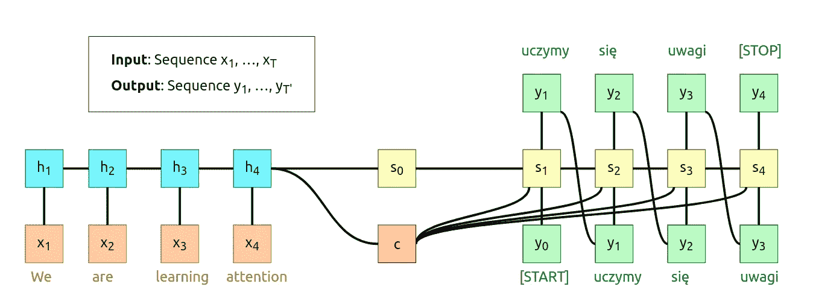

图 1:基于 [*“序列对序列神经网络学习”*、NeurIPS 2014](https://arxiv.org/abs/1409.3215) 论文、 [UMich](https://web.eecs.umich.edu/~justincj/teaching/eecs498/FA2019/) 设计的 RNN 序列对序列

> **注意**
> 这只是原图的截图，不幸的是我不能在介质上包含应用程序的一部分。如果你想玩它请直接去[这个链接](https://erdem.pl/2021/05/introduction-to-attention-mechanism#pure-rnn-sts-diagram)

只要句子很短，这种解决方案就很好。在解码器完成其工作后，我们剩下了**上下文向量*c*和**初始解码器状态**s0。这两个向量必须*“汇总”整个输入序列，因为我们要将它们送入模型的解码器部分。你可以把上下文向量看作是在编码序列和解码序列之间传递信息的东西。***

## *长句问题*

*对于长句，像 **T=100** ，很可能我们的上下文向量 ***c*** 不能够保存来自编码序列的所有有意义的信息。想想这句话:*

> *“在某种程度上，人工智能比我们想象的更近也更远。AI 更接近于能够做比大多数人预期的更强大的事情——驾驶汽车、治疗疾病、发现行星、理解媒体。这些都将对世界产生重大影响，但我们仍在研究什么是真正的智能。”——***马克·扎克伯格******【建筑贾维斯】****

**将第一句话压缩成上下文向量要比对整个引用做同样的事情容易得多。我们可以创建越来越长的上下文向量，但因为 rnn 是连续的，不会按比例增加。这就是注意力机制发挥作用的地方。**

**想法是在解码器的每个时间步长创建一个新的上下文向量**，其不同地关注编码序列。****

**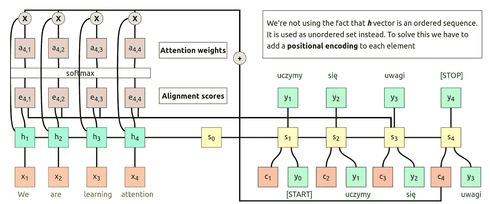**

**图 2:与 RNN 的序列对序列(注意)，基于 [*【神经机器 transla$on 通过联合学习对齐和翻译】*，NeurIPS 2015](https://arxiv.org/abs/1409.0473) 论文， [UMich](https://web.eecs.umich.edu/~justincj/teaching/eecs498/FA2019/) 设计**

**这次我们在解码器的每一步都计算一个额外的上下文向量。让我们通过一个完整的步骤来解释正在发生的事情。**

# **1.计算比对分数**

**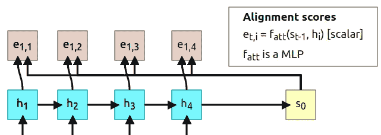**

***图 3:t = 1，* [*的比对分数来源:erdem.pl*](https://erdem.pl/2021/04/introduction-to-attention-mechanism)**

**在 ***t* =1** 时，我们将使用解码器状态***s _ t*-1**来计算比对分数。为了计算每个编码器状态的校准分数，我们使用了一个名为*校准函数*的函数，但它只是一个 MLP(多层感知器)。每个校准分数可以被视为“在状态 *s* 0 下，有多少 *h* 1 对预测输出有用”。alignment 函数输出一个标量值，它是一个实数，我们不能就这样使用它，我们必须使用 softmax 函数来规范化这些值。**

# **2.计算注意力权重**

**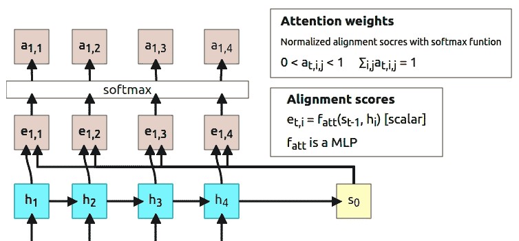**

***图 4:t = 1，* [*的注意力权重来源:erdem.pl*](https://erdem.pl/2021/04/introduction-to-attention-mechanism)**

**softmax 函数的输出被归一化，因此所有数字的总和为 1。这些输出被称为**注意力权重**，顾名思义，它们向模型显示“它应该关注相应的隐藏状态多少”。**

# **3.计算上下文向量**

**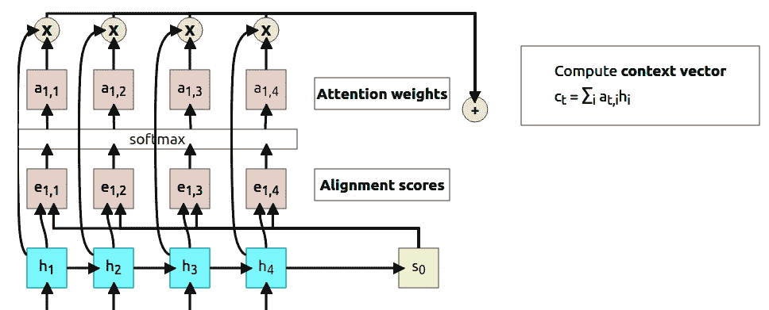**

***图 5:t = 1 的上下文向量计算，* [*来源:erdem.pl*](https://erdem.pl/2021/04/introduction-to-attention-mechanism)**

**现在发生了很多事情(上图中的 3 个步骤)。首先，我们将每个注意力权重乘以相应的隐藏状态( *a* 1，1 × *h* 1，1， *a* 1，2 × *h* 1，2……)。然后，将所有结果相加以用作**上下文向量 *c* 1** 。**

> *****注意:*** *你可能已经注意到，在这一点上“上下文向量”实际上是一个“上下文标量”但这只是因为我们决定只输出 1D(现在更容易展示和理解)。当我们开始将注意力抽象到它自己的层面时，我将切换到向量。***

# **4.计算第一个输出**

**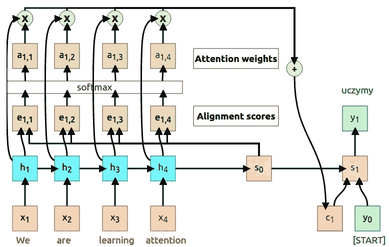**

***图 6:t = 1 时解码器的输出，* [*来源:erdem.pl*](https://erdem.pl/2021/04/introduction-to-attention-mechanism)**

**在第一个时间步长结束时，我们最终可以计算解码器的第一个输出。使用上下文向量 *c* 1、先前解码器的状态 *s* 0 和开始标记 *y* 0 来计算该输出。有趣的是，在整个过程中，我们不必将 *f_att* 作为一个单独的模型来训练。**整个过程是可微的**，所以我们可以通过计算图反向传播。**

# **5.并重复…**

**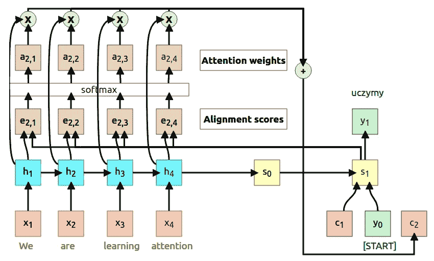**

***图 7:t = 2 的新上下文向量，* [*来源:erdem.pl*](https://erdem.pl/2021/04/introduction-to-attention-mechanism)**

**在时间步长 t=2 时，我们唯一要做的事情是**改变输入以计算从 *s* 0 到 *s* 1** 的比对分数。使用相同的过程，我们计算新的分数( *e2，1，e2，1*……)和注意力权重( *a2，1，a2，1*……)。然后将新的注意力权重和编码器的隐藏状态相乘，以计算新的上下文向量 *c* 2。此时，整个过程只是在循环中运行，直到解码器产生*【停止】* token(有时也叫*【EOS】*token，eng。句尾)。**

# **注意力权重可视化**

**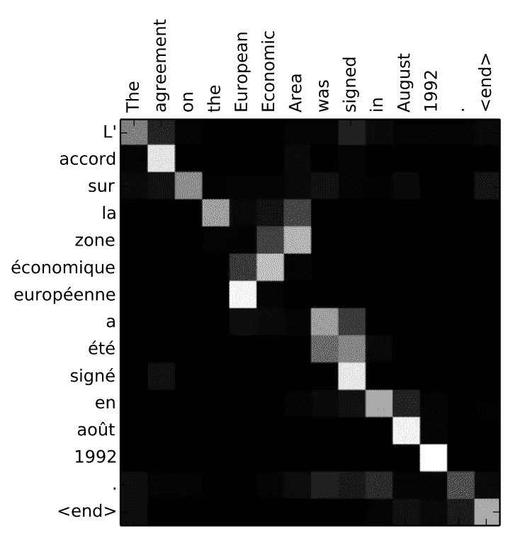**

***图 8:英语到法语翻译的注意力权重，来源:* [*通过联合学习对齐和翻译的神经机器翻译*](https://arxiv.org/abs/1409.0473)**

**在原论文中，有一个简单的可视化的注意力权重 ***ai，j*** 是在翻译英文句子*“关于欧洲经济区的协议于 1992 年 8 月签署”时生成的*译成法语*“1992 年 8 月签署的欧洲经济区协议”*。这个可视化向我们展示了一些有趣的事情。**

**第一件事是一个对角线模式，它告诉我们，模型把更多的注意力放在来自相同位置的相应法语单词上。第二件事更有趣，它是短语*“欧洲经济区”*，在法语中有相反的顺序*“欧洲经济区”*。我们可以看到，当生成`la`令牌时，模型更关注`the`和`Area`，那么当生成`zone`令牌时，它关注`Area`和`Economic`(忽略`European`)。另一个有趣的观察是 *"a été signé"* ，其中当生成`a`和`été`令牌时，模型同时考虑`was`和`signed`(这在法语中是有意义的，因为我们需要知道单词`étre`的确切变体)。**

**这个热图很重要，因为我们没有告诉模型它应该注意哪些单词，它是自己学习的。此外，我们还得到了模型决策的某种可解释性。**

# **注意力不知道输入是一个序列**

**您可能已经开始担心上一步我的信息发生了什么:**

***“我们没有利用 h 向量是有序序列的事实。它被用作无序集。为了解决这个问题，我们必须给每个元素添加一个位置编码***

**我已经单独写了一篇关于位置编码的文章，因为这篇文章包含了太多的信息。如果你感兴趣，请查看[了解变形金刚](https://erdem.pl/2021/05/understanding-positional-encoding-in-transformers)中的位置编码。**

**这仍然是一个东西，但不是解决这个问题，而是利用它来抽象注意力机制，并将其用于不同于文本序列的东西。用注意力描述图像呢？同年有一篇名为 [*“展示、参与、讲述:具有视觉注意力的神经图像字幕生成”*](https://arxiv.org/abs/1502.03044) 的论文，该论文在 RNN 解码器的帮助下，利用对 CNN 嵌入的注意力来生成图像字幕。**

**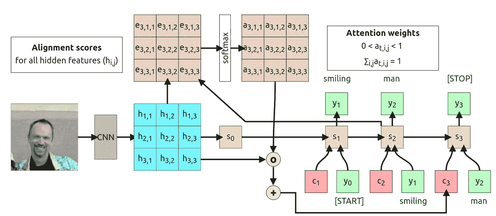**

**图 9:带注意的图像字幕(仍为 RNN)，基于 [*【展示、出席、讲述:带视觉注意的神经图像字幕生成】*，](https://arxiv.org/abs/1502.03044)论文， [UMich](https://web.eecs.umich.edu/~justincj/teaching/eecs498/FA2019/) 设计**

> ****注意**
> 这只是原图的截图，不幸的是我不能在介质上包含应用程序的一部分。如果你想玩它请直接去[这个链接](https://erdem.pl/2021/05/introduction-to-attention-mechanism#rnn-imtos-with-attention-diagram)**

**在本文中，作者提出了一种基于卷积特征提取的解决方案，而不是标准的 RNN 编码器网络。我们使用 CNN 的这些功能来计算状态，然后计算 RNN 解码器每个时间步长的对齐分数。和前面的例子一样，我将带你经历整个过程，但是你可能会根据上面的交互图理解它:)**

**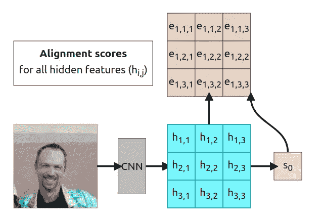**

***图 10:提取特征的比对分数计算，* [*来源:erdem.pl*](https://erdem.pl/2021/04/introduction-to-attention-mechanism)**

**我们假设 CNN 已经被训练并产生了我们的 3x3 网格。我们将使用初始网格来预测初始隐藏状态(有时它可以随机生成，甚至设置为 0)。现在，我们必须将相同的网格和 *s* 0 传递给对齐函数，以计算网格的每个值的相应对齐分数**

**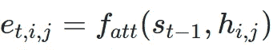**

**这给了我们 **t=1** 时间步长的对齐分数。和前面的例子一样，每个比对分数都是一个标量，它告诉我们“给定特征在当前时间步长中有多重要”。**

**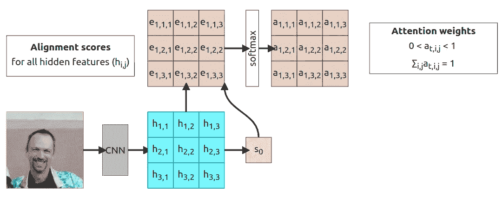**

***图 11:注意力权重，* [*来源:erdem.pl*](https://erdem.pl/2021/04/introduction-to-attention-mechanism)**

**计算出比对分数后，我们需要应用 softmax 将分数归一化为某个概率分布，其总和为 1。**

**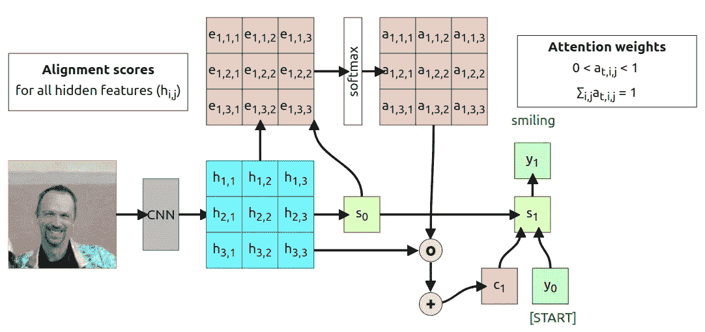**

***图 12:计算上下文向量并生成第一个输出，* [*来源:erdem.pl*](https://erdem.pl/2021/04/introduction-to-attention-mechanism)**

**现在，我们所要做的就是计算[哈达玛乘积](https://en.wikipedia.org/wiki/Hadamard_product_(matrices))(逐元素乘法，…)并对所有内容求和以获得上下文向量 *c* 1。其余部分的工作方式与前面的示例完全相同，因此我们使用上下文向量 *c* 1、起始令牌 *y* 0 和初始解码器状态 *s* 0，并通过 *gU* 函数来计算 *s* 1 状态，并获得一些输出令牌 *y* 1。**

> *****注意*** *此时不需要求和，我这样做只是为了让上下文向量的形状和上一个例子一样。我们可以很容易地使用一个 3x3 的矩阵作为函数的输入。***

**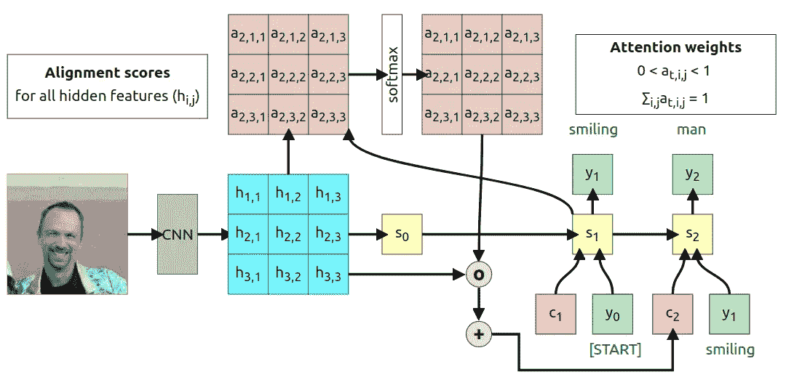**

***图 14:第二个时间步长(t=2)，* [*来源:erdem.pl*](https://erdem.pl/2021/04/introduction-to-attention-mechanism)**

**与之前相同，我们使用新生成的 *s* 1 状态来计算新的对齐分数 *e_* 2、 *i* 、 *j* ，然后使用 softmax 对其进行归一化，并将其计算到上下文向量 *c* 2 中。当解码器产生*【停止】*令牌作为输出时，该过程停止。**

# **注意力权重的可视化**

**与序列到序列的翻译一样，在这种情况下，我们能够可视化注意力权重。我将使用作者提供的一个例子。**

**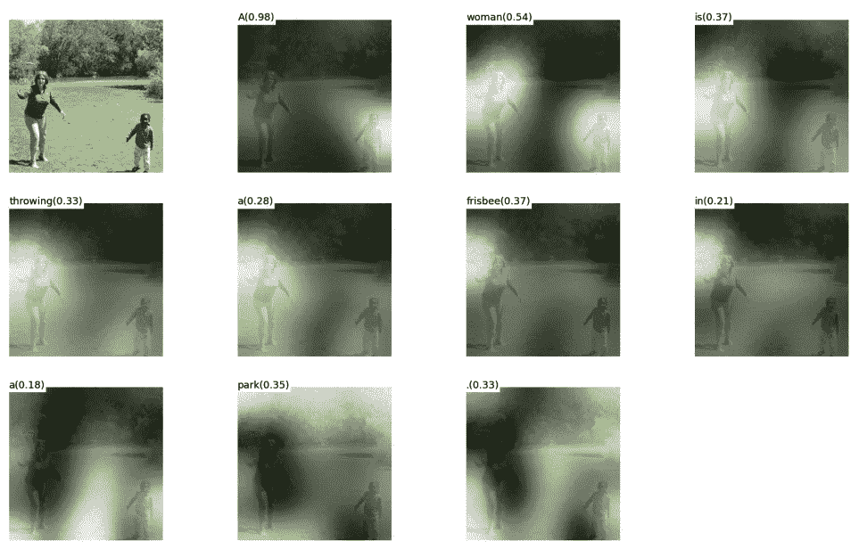**

***图 15:图像注意力可视化，白色区域具有较高的注意力权重值，来源:* [*显示、出席、讲述:具有视觉注意力的神经图像字幕生成*](https://arxiv.org/abs/1502.03044)**

**正如你所看到的，这不是一个解释模型的理想解决方案，但是仍然可以给你一种关于正在发生的事情的直觉。尤其是当我们看到像`frisbee`或`park`这样的记号时，当模型关注那些确切的对象时。在令牌`woman`的情况下，图像上的两个人节省了相似的注意力权重，但这仍然没问题，因为模型可以决定哪个是主题以及如何命名那个人。**

**还有一种类型的注意力叫做**硬注意力**，我们不使用 softmax 函数，而是选择一个具有最高对齐分数的特征，并使用该特征的值作为上下文。这需要在训练过程中进行一些改变，我现在不打算讨论这些。这里有一个努力关注的例子。**

**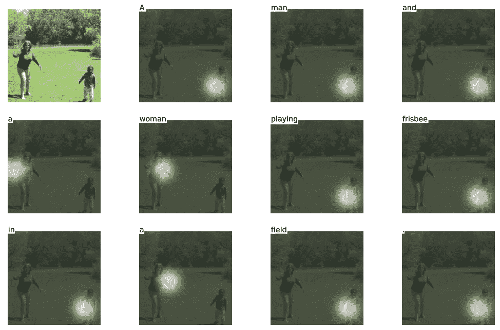**

***图 16:硬注意可视化，白色区域为模型注意的区域，来源:* [*展示、注意、讲述:视觉注意的神经图像字幕生成*](https://arxiv.org/abs/1502.03044)**

**如您所见，标题已经更改。现在它在说*“一个男人和一个女人在田野里玩飞盘。”取而代之的是“一个女人在公园里扔飞盘。”*。当生成标记`frisbee`模型关注孩子时，注意区域不完全与生成的标记相关(如在软注意中)。**

# **让我们抽象一下注意力**

**现在，当你知道注意力是什么的时候，我们可以开始抽象这个想法来创建所谓的*“注意力层】*。首先，让我们总结一下我们现在所拥有的:**

**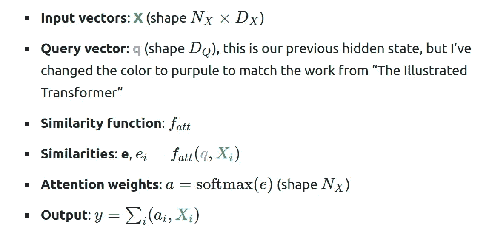**

**目前，我们的相似性函数是 *f_att，*，这是基于早期关注论文的正确结果，但是为了推广，我们可以将其改为 **q** 和 **X** 向量之间的**点积**。这只是更有效地计算点积，但它创建了一个具有最终结果的乘积。正如你们所记得的，当计算两个向量的点积时，结果是这样的**

**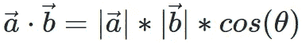**

**当向量的维数很大时，这可能会导致问题。为什么会有问题？看下一步和 *softmax* 功能。这是一个很好的函数，但是当一个元素的值非常大，并且我们的值大小随着输入维度的增加而增加时，它会导致渐变消失的问题。这就是为什么你不仅仅使用点积，而是使用**比例点积**，这样我们的新公式看起来就像**

**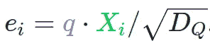**

> ***如果你不理解为什么点积会产生一个高维向量的大数，请查看* 3Blue1Brown 的[*Youtube 上关于这个主题的视频*](https://www.youtube.com/watch?v=LyGKycYT2v0)**

**此外，我们希望能够使用不止一个查询向量 **q** 。对于解码器的每个时间戳有一个单独的查询向量是很好的，但是当我们同时使用它们时会简单得多，所以我们将向量改为向量 **Q** (形状 *NQ* × *DQ* )。这也影响相似性得分和注意力的输出形状:**

**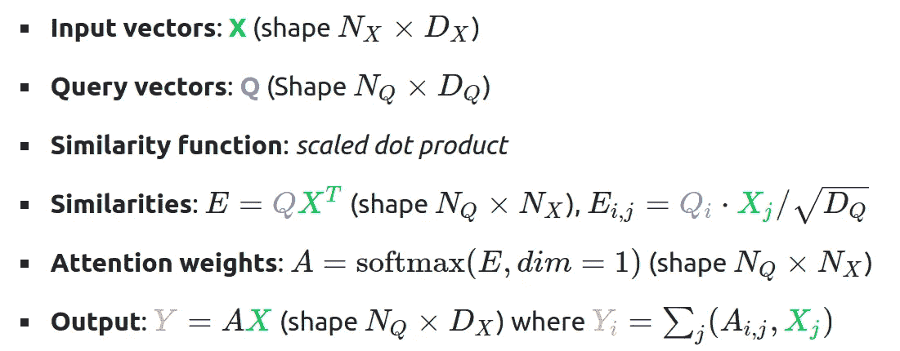**

**你可能想知道为什么 *softmax* 要计算在 *dim=1* 之上？这是因为我们希望获得每个查询向量在输入向量上的概率分布。您应该注意的另一件事是，相似性得分的计算简化为矩阵乘法。**

**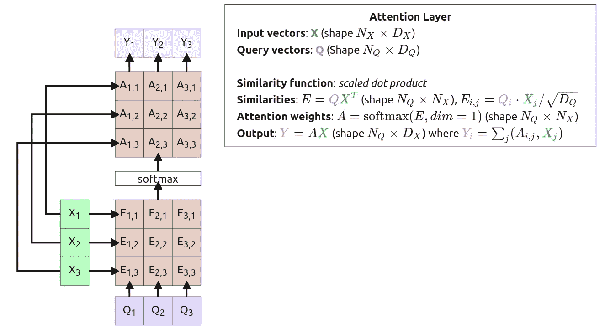**

***图 17:注意力和自我注意力层层叠加，演职员表:* [*《注意力就是你所需要的一切》*](https://arxiv.org/abs/1706.03762) *，* [*乌米奇*](https://web.eecs.umich.edu/~justincj/teaching/eecs498/FA2019/) *，* [*插图变压器*](http://jalammar.github.io/illustrated-transformer/)**

> ****注意**
> 这只是原图的截图，不幸的是我不能在介质上包含部分应用程序。如果你想玩它请直接去[这个链接](https://erdem.pl/2021/05/introduction-to-attention-mechanism#the-layer)**

**现在我们进入有趣的话题。图表的第一步是注意力的标准方法。我们只有我们的**查询向量**和**输入向量**。我们使用输入两次，一次是在计算**相似度**时，第二次是在计算**输出向量**时。我们可能想以稍微不同的方式使用这些向量，这就是**键**和**值**的想法的来源。**

**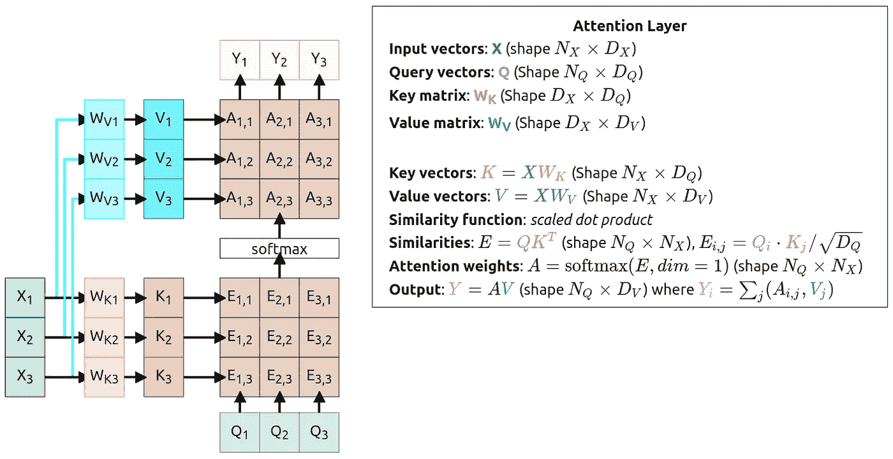**

***图 18:键和值分离，来源:* [*关注层图*](http://localhost:8000/2021/05/introduction-to-attention-mechanism#the-layer)**

**你可能想知道这些向量是什么，为什么它们很重要？我在 [stackexchange](https://stats.stackexchange.com/a/424127) 上发现了查询/值/键的一般概念背后的一个直觉:**

> ***键/值/查询概念来自检索系统。比如你在 Youtube 上键入一个查询搜索某个视频，搜索引擎会将你的* ***查询*** *映射到一组* ***键*** *(视频标题、描述等)。)与数据库中的候选视频相关联，然后呈现给你最匹配的视频(* ***值*** *)。***

**如果我们从可用性的角度来看，它们允许模型决定如何使用输入数据。通过创建可训练权重(WK 和 WV ),我们可以调整输入以适应不同的任务。**

> *****注意*** *刚好我所有的向量都有相同的长度，确切的形状要匹配(看描述中显示的形状)，但不一定要一样。***

**这时我们的**注意层**准备好了！我们能做得更好吗？是啊！！！**

## **自我关注层**

**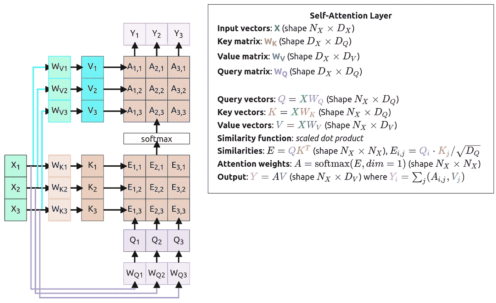**

***图 19:自我关注层结构，来源:* [*关注层图*](http://localhost:8000/2021/05/introduction-to-attention-mechanism#the-layer)**

**一直以来，当使用关注层时，我们创建单独的**查询向量**，这在自我关注方法中已经改变。这次我们添加了另一个权重矩阵(WQ ),它将用于计算新的**查询向量**。这样，我们就能让我们的模型自己学习**输入向量**的转换。**

**我们这里有所谓的**自我关注层**，这是一个通用层，你可以在你的模型中使用。它接受**输入向量**并输出**输出向量**。整个层是**排列等变****

**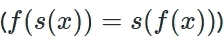**

**这意味着当你置换**输入向量**时，输出将是相同的，但被置换。**

**最后，我需要解释为什么我改变了颜色。原因是为了匹配[图文并茂的变形金刚](http://jalammar.github.io/illustrated-transformer/)博文中使用的颜色。**

**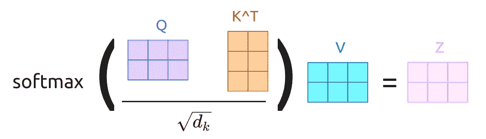**

***图 19:自关注层矩阵计算，设计来自:* [*图示变压器*](http://jalammar.github.io/illustrated-transformer/)**

# **结论**

**从这一点开始，我们可以使用**自我关注层**来创建一个**变压器**，但是这篇文章已经太长了。你应该对注意力机制如何工作以及为什么工作有一个直觉。我将写另一篇关于设计**变形金刚**和**多头注意力**的文章，但现在请参考[图解变形金刚](http://jalammar.github.io/illustrated-transformer/)。**

**Jay Alammar 很好地解释了变压器的工作原理，还有一个矢量计算的例子。我的文章试图解释关注和自我关注的概念是如何产生的，因为你们中的很多人是在阅读了那篇博客文章后来到这里的，所以我希望你们对色彩模式感到熟悉。**

**我希望你喜欢这些图表，如果你有任何问题，请随时提问。**

# **参考资料:**

*   **Sutskever 等人，“神经网络的序列对序列学习”，NeurIPS 2014 年【https://arxiv.org/abs/1409.3215 **
*   **Bahdanau 等人，“通过联合学习对齐和翻译的神经机器翻译”，https://arxiv.org/abs/1409.0473 ICLR 2015 年**
*   **徐等，“展示、参与、讲述:视觉注意下的神经图像字幕生成”，2015[2015](https://arxiv.org/abs/1502.03044)**
*   **阿希什·瓦斯瓦尼等人，《注意力是你所需要的一切》，neur IPS 2017[https://arxiv.org/abs/1706.03762](https://arxiv.org/abs/1706.03762)**
*   **杰伊·阿拉玛，《图解变形金刚》，2018 年[http://jalammar.github.io/illustrated-transformer/](http://jalammar.github.io/illustrated-transformer/)**
*   **3Blue1Brown，“点积与二元性| EoLA #9”，2016[Youtube lygkycyt 2v 0](https://www.youtube.com/watch?v=LyGKycYT2v0)**
*   **密歇根大学，“计算机视觉的深度学习”，2019 [讲座](https://web.eecs.umich.edu/~justincj/teaching/eecs498/FA2019/)**

***最初发布于*[*https://erdem . pl*](https://erdem.pl/2021/05/introduction-to-attention-mechanism)*。***