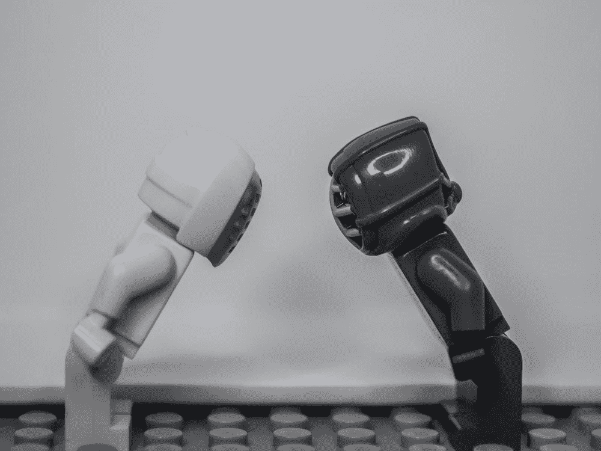
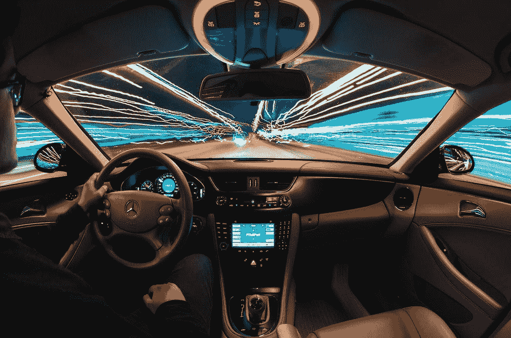
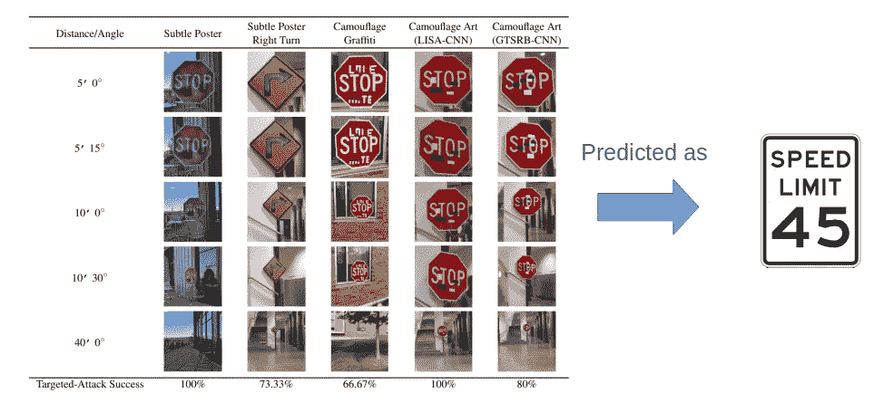

# 2021 年自动驾驶简介

> 原文：<https://towardsdatascience.com/introduction-to-autonomous-driving-in-2021-7e0281c0d929?source=collection_archive---------23----------------------->

## 自动驾驶汽车目前面临哪些挑战？

从肉电脑到芯片电脑的转变。图片由作者启发而来[3]。

上个月，在 2011 年 [CVPR](http://cvpr2021.thecvf.com/) 期间，**自动驾驶(AD)** 一些最热门的公司在 WAD(自动驾驶研讨会)上分享了他们对未来移动性的看法。IEEE 计算机视觉和模式识别会议(CVPR)是计算机视觉领域的三大学术会议之一(与 ECCV 和 ICCV 并列)。

今年，他们从自动驾驶领域最热门公司的 R&D 实验室中精心挑选了令人难以置信的主题演讲人: **Waymo** (谷歌)**特斯拉**、**丰田高级开发研究所**(TRI-AD)**英伟达**、**英特尔**、**极光**、 **Wayve** 、 **Waabi** 、**Argo**

自动驾驶涉及解决各种挑战，如障碍物和自由空间检测、车道跟踪、传感器融合、驾驶员凝视监控、十字路口的运动规划、行人姿态和行为预测等。其中，CVPR 2021 **在广告中突出了 2021 年的趋势。**

我已经为你总结了自动驾驶汽车目前面临的最大挑战！

# 关键 1)端到端模式是王道

使用数据创建端到端模型。

国王模型。图片由 [@ivanana](https://unsplash.com/@ivanana) 提供。

## 软件 2.0

**特斯拉**[的 AI 高级总监安德烈·卡帕西(Andrej Karpathy)不断重申，软件行业应该走向**软件 2.0**](https://www.youtube.com/watch?v=y57wwucbXR8&ab_channel=Databricks) 。

**首先，什么是软件 1.0 和 2.0？**

**软件 1.0** 代表经典栈:“*它由程序员写给计算机的明确指令*”[【1】](https://karpathy.medium.com/software-2-0-a64152b37c35)。相比之下，软件 2.0 不遵循任何明确的配方或状态机。它使用优化来寻找哪种配方最适合实现其预期目标，而无需明确的指令。与人类类似，软件 2.0 接收数据和标签，并学习数据中的模式，以自行预测标签。

**软件 2.0 基本上是人工智能推动的软件。**

看 2021 年为 AD 发表的论文，很明显 2021 年是软件 2.0 年。

## 2021 年

传统顺序与 DL 端到端方法。图片由作者提供。

大多数 R&D 和行业报纸现在都在使用端到端模型。

亚历克斯·肯德尔( **Wayve 首席执行官**)写道，他的广告模式:“*没有手写的规则。仅仅是纯粹的智力*【5】。这是可能的，因为大多数最近的广告模型由一个*联合感知、预测和运动规划*模型组成。

输入仅仅是原始传感器测量(照相机、激光雷达、雷达)，输出是方向盘控制命令。在中间层块之间可访问可解释的表示。

## 特斯拉

特斯拉专注于其模块化架构的灵活性。尽管是端到端的，但每个特斯拉人工智能工程师都可以在他们网络的一个特定模块上并行贡献/微调，而不会破坏联合网络的任何其他模块。

在实践中，所有传感器测量值都被转换为特征，然后被馈送到递归神经网络架构(transformer ),该架构随时间融合所有相机特征。一旦融合完成，他们就使用分支结构。多头网络被分成分支网络。每个分支输出一个期望的矢量，如*轨迹*、*检测*等。

# 关键 2)传感器警告

自动驾驶汽车面临两大预测挑战:

*   **感知**:理解环境和其他行动者。
*   **动作规划:**通过该环境确定行动路线。

他们仍然很难决定哪些传感器最适合这项任务。

相机 VS 激光雷达。静止在运动中的形象(unsplash.com)

解决**感知**问题的经典方法是融合相机、激光雷达(激光)，有时是雷达(微波)传感器。但是这些天，关于哪些传感器相关的争论正在激烈地进行着。

尤其是今年，一些公司宣布他们将不再使用激光或雷达，而只使用摄像机。

## 语境

2019 年 4 月 22 日**特斯拉**声称全自动驾驶**既不需要激光雷达(光线探测和测距)，也不需要高清地图就能成功**[【2】](https://www.youtube.com/watch?v=HM23sjhtk4Q&ab_channel=AutoPilotReview)。埃隆·马斯克挑衅地说，使用激光雷达是一件*“愚蠢的差事】、*“*不必要的昂贵传感器”。*虽然即使在遮挡、雨、雾和雪的情况下，激光雷达也能准确地进行 3D 检测，但它确实很贵。

汽车上的激光雷达。[图像](https://thenounproject.com/term/lidar/2612725/)由[矢量点](https://thenounproject.com/vectorspoint)组成。

**激光雷达优势:**

*   准确度和精确度
*   生成 3D 图像和深度图。
*   在能见度低的情况下(日落、有雾的情况下)也能看见
*   立即给出深度，无需计算处理

**激光雷达缺点:**

*   扩展成本高(谷歌 Waymo 专有系统约为 75，000 美元，而最近初创公司制造的激光雷达可能需要约 1000 美元)
*   两辆自带激光雷达的车辆之间可能存在干扰和堵塞
*   激光脉冲可能对环境和健康造成的危害。
*   激光雷达无法读取标志或颜色。
*   美学(在前置激光雷达的情况下可以隐藏)

## 2021 年

特斯拉在 2021 年 5 月的一份新声明中表示，从现在起**他们将完全依靠视觉**，在他们的汽车周围使用八个摄像头(这意味着他们也停止使用[雷达](https://www.autopilotreview.com/tesla-vision-cameras-only/))。他们有一个独特的人工智能团队:视觉团队。

> 从 2021 年 5 月开始交付，为北美市场制造的 Model 3 和 Model Y 车辆将不再配备雷达。—特斯拉官网[【4】](https://www.tesla.com/support/transitioning-tesla-vision)

当 AD(自动驾驶)正在摸索寻找硬件-软件的完美匹配时，特斯拉并不是唯一一家放弃地图融合传统方法的公司。斯巴鲁也在赌视觉系统。Wayve 的首席执行官兼联合创始人 Alex Kendall 强调“*劳动密集型的高清地图和手工编码的规则很难适应新的复杂的驾驶领域*”[7]。

为什么他们选择相机而不是激光雷达？

*   比较便宜的
*   雷达和照相机测量之间存在差异。
*   可靠性:雷达有时会输出随机噪声测量值

他们得出结论，当雷达和视觉不一致时，他们应该相信视觉的准确性。

# 关键 3)感知和运动规划

我写了一篇技术文章，解释了模型如何学习预测其环境行为。

它需要计算机视觉和深度学习基础知识。

 [## 理解自动驾驶的感知和运动规划(2021)

### 深入研究当前的 SOTA 方法，共同预测汽车周围的环境及其行为

towardsdatascience.com](/understanding-perception-and-motion-planning-for-autonomous-driving-2021-e9241e067db7) 

# 关键 4)数据为王

为了训练广告模型，你需要大量的数据。

你需要大量的图像记录！图片由 [@konstandy](https://unsplash.com/@konstandy) 提供。

要训练端到端多任务多模态模型，您需要以下数据:

*   **大**(百万视频)
*   **清洁**(标注数据)
*   **多样**(很多边缘案例)

最大的瓶颈是多样性。Cruise(广告初创公司)ML 工程师之一最近承认，穿着精心制作的万圣节服装的行人无法被识别，因为这些数据不存在于训练数据集中[7]。

## 舰队学习系统

**特斯拉**

**特斯拉**用自动贴标机对其车队私有数据的自动标签系统进行了升级。因为他们的预测没有时间限制(离线)，他们可以使用高延迟集合模型、额外的传感器、跟踪、未来帧(后见之明)来从车队视频中获得准确的注释。他们手动开发了 221 个触发器，将在客户车队中激活。他们的模型部署在特斯拉汽车中，目前在当前的特斯拉汽车中以阴影模式运行。例如，当摄像头和雷达不匹配时，当用户决策和模型控制预测相差太大时，会向 Tesla 发送一个触发器来分析数据，自动标记它们并将其用于训练(闭环 AI)。

**英伟达**

为了挖掘他们庞大的数据集， **NVIDIA** 使用集成模型来预测标签及其不确定性。不确定性由不同网络之间的不一致来量化。当不确定性高时，图像在训练数据中被上采样[5]。

## 使用模拟

模拟驾驶。图片由 [@samuele_piccarini](https://unsplash.com/@samuele_piccarini)

为了加速 AV 开发和访问大规模验证， **NVIDIA** 正在使用模拟。他们将模拟用于:

*   感觉
*   规划和控制
*   完整的 AV 堆栈
*   检查驾驶体验

…在各种情况下。

他们使用他们的 [NVIDIA Omniverse 模拟器](https://developer.nvidia.com/nvidia-omniverse-platform)进行精确渲染。当他们在现实世界中的预测失败时，他们狡猾地使用他们的模拟器。当它发生时，他们在模拟器中生成类似事件的多个场景，并重新训练他们的模型。

**Waadi** 使用 LidarSim (CVPR 2020)模拟激光雷达原始数据和周围驾驶员真实行为的任意场景。

从哪里获取语义标签？ **TRI-AD** 提供答案:在模拟中！他们大量使用模拟来生成他们的语义标签。他们努力缩小模拟和真实世界数据之间的领域差距[11]。他们的模型将模拟和真实世界的数据都作为输入。然后，他们可以学习如何提取这两个空间中的共同数据特征。在这种情况下，真实世界的数据标签是自我监督的，而模拟数据当然是由模拟器标记的。

## 开源数据集

你可以免费使用几个开源数据集(Lyft、NuScenes、Waymo 开放数据集、Argoverse、TRI-AD 的 DDAD)。它们本质上是用来衡量每篇新研究论文的准确性。创建生产级别的系统将是低效的:例如，特斯拉在发布他们的模型时使用了 1.5 的训练数据。

# 关键 5)人工智能安全问题:

在与生死相关的人工智能系统中，很多意识正在上升:医疗保健、军事、移动等。

当这些技术出错时，它们可能会杀死某个人。因此，系统的安全性和稳定性至关重要。恶意设计的数据或模式可以用来欺骗 AI 系统。我们把这些欺骗的附加称为“对抗性攻击”。

到目前为止，AVs 还远非万无一失。一些研究人员已经表明，地面上的一些小贴纸可能会导致自动驾驶汽车驶入对面的车道[8]。

对车辆感知障碍的敌对攻击示例如下所示，其中所有图像都被错误分类为“限速 45”。

贴纸和遮挡导致将停车标志误归类为限速标志。文献[6]的结果。图片由作者提供。

该模型无法识别许多不同配置(遮挡、贴纸等)的停车标志，而人类可以清楚地看到它。如果机器检测到限速而不是停车标志，后果可能很可怕。

[来自安全学习实验室(伊利诺伊州)](https://aisecure.github.io/)【10】的李博对当前 AD 系统的弱点提出了警告:如果 AD 仅依赖于数据(如在端到端系统中)，它将更容易受到潜在的敌对攻击。

**可能的解决方案:**

*   不同传感器的融合是解决方案之一。很难在同时攻击每个传感器的同时保持它们之间的逻辑关系。
*   不同模型的融合(集合模型)
*   ML 鲁棒性增强及其认证(参见[认证鲁棒性排行榜](https://github.com/AI-secure/Provable-Training-and-Verification-Approaches-Towards-Robust-Neural-Networks#:~:text=Provable%20Training%20and%20Verification%20Approaches%20Towards%20Robust%20Neural%20Networks,-Recently%2C%20provable%20(i.e.&text=In%20contrast%20to%20empirical%20robustness,future%20attacks%20will%20attack%20further.))。
*   构建识别攻击的系统。[9]
*   另一种方法是停止纯粹的数据驱动的端到端管道，并向 ML 管道添加一些知识领域。例如，添加以检查停车标志是否为写有“STOP”的八角形。)

# 结论

自动驾驶是一个非常令人兴奋的领域。行业将部署和研究与部分开源资源联系起来。我们可以欣赏社区为构建移动未来所做的独特努力。广告不缺乏挑战，最好的还在后面！

**当前挑战**

*   **泛化**(在训练空间之外创建健壮的模型)
*   **适应性**(针对不同的汽车、不断变化的地点、传感器配置、用例、道路政策)
*   **世界建模和缩放**(理解复杂、动态的世界，联合预测)
*   **不确定性**(什么不确定性小到我的模型是安全的？)
*   **可解释性**(有哪些因果因素)
*   **应对路上很少发生的疯狂事件的长尾。**
*   **互动**(我应该在其他车辆移动之前移动还是等待？).
*   **计算能力**(监控共“感知”车外所见，“测绘”车在何处，“规划”汽车运动，“内部传感”监控司机)。
*   **安全**

**感谢您的阅读！**

**中上关注我** [**推特**](https://twitter.com/ciel_delem) **！😃**

# 参考

[1][https://karpathy.medium.com/software-2-0-a64152b37c35](https://karpathy.medium.com/software-2-0-a64152b37c35)

[2][https://TechCrunch . com/2019/04/22/任何依赖激光雷达的人都注定要失败——埃隆-马斯克-赛义德/](https://techcrunch.com/2019/04/22/anyone-relying-on-lidar-is-doomed-elon-musk-says/)

https://www.youtube.com/watch?v=g6bOwQdCJrc 安德烈·卡帕西·CVPR 2021[ab _ channel = WADatCVPR](https://www.youtube.com/watch?v=g6bOwQdCJrc&ab_channel=WADatCVPR)

[4][https://www.tesla.com/support/transitioning-tesla-vision](https://www.tesla.com/support/transitioning-tesla-vision)

[5]https://youtu.be/eOL_rCK59ZI CVPR WAD 2021

[6]对深度学习模型的强大物理世界攻击，https://arxiv.org/pdf/1707.08945.pdf CVPR 2018

[7][https://towards data science . com/自驾-汽车-过去-现在-未来-71532430346](/self-driving-cars-past-present-and-future-71532430346)

[8][https://keen lab . Tencent . com/en/whites/Experimental _ Security _ Research _ of _ Tesla _ auto pilot . pdf](https://keenlab.tencent.com/en/whitepapers/Experimental_Security_Research_of_Tesla_Autopilot.pdf)

[9][https://venturebeat . com/2020/02/24/Google-ai-detects-adversarial-attack-against-image-classifiers/](https://venturebeat.com/2020/02/24/googles-ai-detects-adversarial-attacks-against-image-classifiers/)

[https://secure-ai.github.io/](https://secure-ai.github.io/)

【11】*语义分割的几何无监督域自适应*，https://arxiv.org/abs/2103.16694[熊伟·圭齐利尼等人](https://arxiv.org/abs/2103.16694)