# BanditPAM 简介

> 原文：<https://towardsdatascience.com/introduction-to-banditpam-1217ee457927?source=collection_archive---------14----------------------->

## [实践教程](https://towardsdatascience.com/tagged/hands-on-tutorials)

## 如何将多臂土匪问题与聚类算法联系起来

照片由[克里斯塔普斯·格伦德斯坦斯](https://unsplash.com/@grundsteins?utm_source=unsplash&utm_medium=referral&utm_content=creditCopyText)在 [Unsplash](https://unsplash.com/s/photos/restaurant-front?utm_source=unsplash&utm_medium=referral&utm_content=creditCopyText) 上拍摄

# 介绍会；展示会

BanditPAM 是一种聚类算法，它的名字没有它著名的兄弟 **KMeans** 那么令人回味。它属于 **KMedoids** 算法家族，并在 2020 年 NeurIPS 大会上发表**(论文链接)**。
在深入细节之前，让我们先解释一下与 **KMeans 的区别。**

主要区别来自于**“手段”**和**“水母”**但结构是一样的。

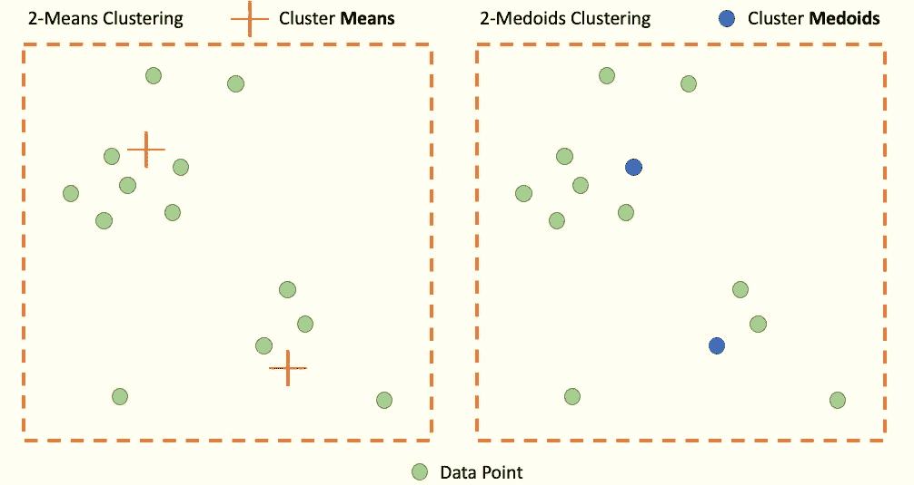

作者图片

如图所示，KMeans 通过最小化到同一个簇中每个点的欧几里德距离来定位其簇的中心(即其**质心**)。因此，它是其簇中的点的平均值 **(** K **表示)**。在其一侧，KMedoids 将其群集**的中心定位在数据集**的一个点上，从而最小化与同一群集的其他点的距离。我们称这些中心为水母

> 换句话说，每个 **KMedoids** 聚类的中心必然是数据集中存在的点**(与 K-Means 相反)**

**那又怎样？**

在一些问题中，考虑 medoids 允许对结果有更好的理解和**可解释性**，以及对所谓的“结构化”对象(通常是数据表)的聚类的**改进**

**为什么现在？**

KMeans 一直主导着聚类算法的主题，因为它的操作**简单**，尤其是因为它的低复杂度。事实上，KMeans 的复杂度通常是线性的，取决于数据集中的点数 n、聚类数 k 和维度数。对于类水母来说，这是一个不同的故事，因为即使是被称为 **PAM** (用于围绕类水母进行分区)的最新技术也具有二次**复杂度**。

> 正是在这一点上，该研究论文通过实现 **BanditPAM** 而闻名，根据该研究论文，这是 PAM 从二次复杂度到“准线性”复杂度的改进(精确到 O[nlog(n)]

BanditPAM 基于 **2 算法**:

*   **PAM** —围绕水母分区
*   多臂**土匪**

# 围绕 Medoids(或 PAM)的分区

**1。演示文稿** 与所有聚类算法一样，PAM 的目标是获得所执行的聚类的**最佳质量。**

通过注意 d(。, .)距离度量**(欧几里德距离、余弦相似度……)和**在 medoids** 的集合中，这个质量是通过这个成本函数获得的:**

**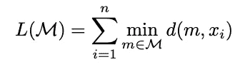**

**作者图片**

> **换句话说，PAM 的目标是找到一组**kme doid**，允许最小化点到其最近的 medoid 的距离。**

**该算法基于与 KMeans 相当的 **2 步。****

****2。构建(初始化阶段)****

**在这个阶段，PAM 根据特定的规则初始化它的 **k** medoids。**

**在已经初始化了 **N 个点**和 **L 个 medoids**的情况下，我们根据以下关系找到下一个 medoids**m ***:**

**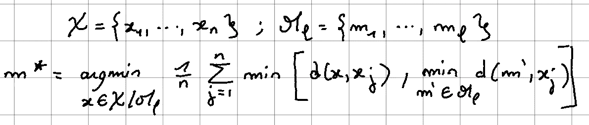**

**作者图片**

*****让我们通过一个例子来说明这个步骤:*****

**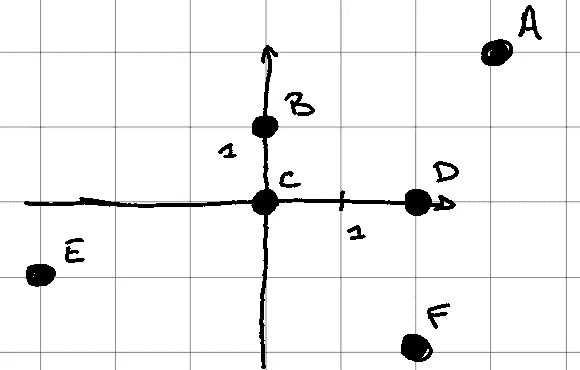**

**作者图片**

**让我们考虑 6 点(A、B、C、D、E、F)，让我们试着根据上面定义的**构建**步骤来定义 **2 medoids** 。**

**对于这个例子，我们将两点之间的距离定义为**欧几里德距离的平方。****

**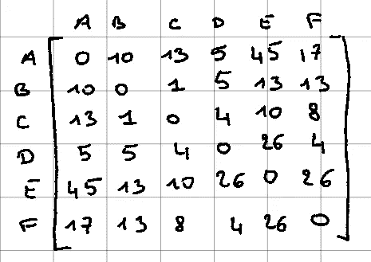**

**作者图片**

**因此，我们获得这个**距离矩阵**，其中所有进一步的计算都将参考这个矩阵**

****1.a 定义第一个 medoid****

**因为它是我们希望计算的第一个 medoid，所以我们得到下面的关系:**

**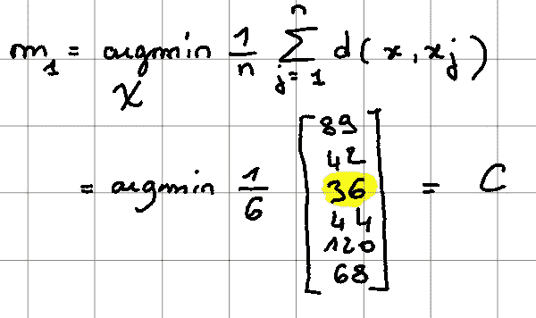**

**作者图片**

**这里我们注意到关系是**不同的**，因为不存在最小值。这是因为在这个阶段**集合 M** 是空的，因此**第二个最小值没有被定义**。**

****1.b 定义第二个 medoid****

**这一步可能更难理解，因为我们使用的是**整体**关系:**

**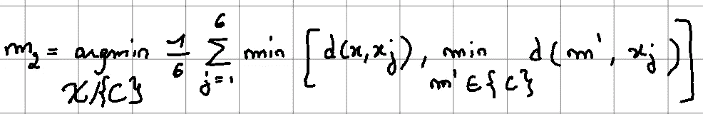**

**作者图片**

**再次取矩阵，我们得到以下结果:**

**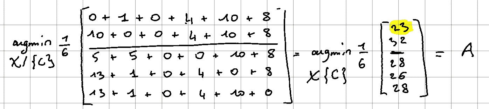**

**作者图片**

**由于我们已经将自己设置为 **2 medoids** ，初始化步骤是**超过**。已经选择了 a 和 C，并且**成本函数** n 是:**

**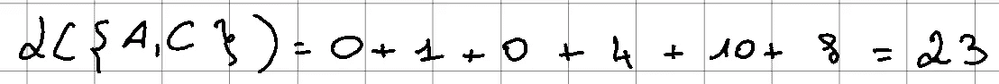**

**作者图片**

**我们已经按照预期定义了 2 个 medoids，因此初始化已经完成。让我们进入**交换阶段——优化阶段。****

****2。SWAP(优化阶段)****

**再次意图最小化目标函数，该步骤试图**用非 medoids** 交换一些 medoids。换句话说，一个 medoid 成为一个“正常”点，一个“正常”点成为一个 medoid。“正常”点是指**而不是**med oid 的点。在所有可能的配对中，选定的配对遵循以下关系:**

**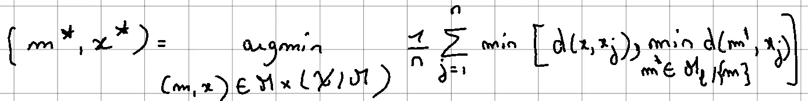**

**作者图片**

**一旦 **m*和 x*找到**，x*就变成了一个 medoid，m*又变成了一个“正常”点。**

**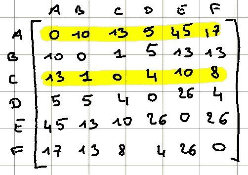**

**作者图片**

**提醒一下，我们有这个距离矩阵，但是**现在有了 A 和 C** ，两个初始化的 medoids。**

**通过应用上面的**交换关系**，我们得到:**

**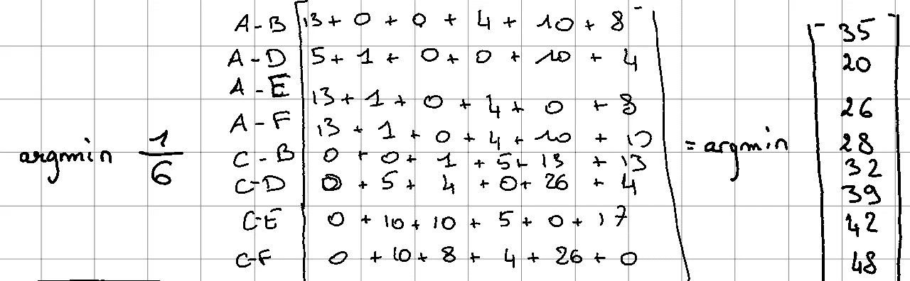**

**作者图片**

**在这种情况下，**最小值是 medoid A 和点 d 之间的连接。****

> **当且仅当以 A 和 D 为中间点的成本函数低于以 A 和 c 计算的成本函数时，A 成为非中间点，D 成为中间点**。****

**但是在这里:**

**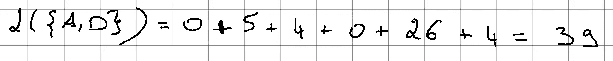**

**作者图片**

> **当 39 > 23 时，A 和 D 不反转，假设收敛。算法停止。**

****如果值小于 23** ，我们将反转 A & D，交换过程将重复进行，直到**收敛**(即成本函数不再降低)**

****3。问题****

**在具有 **n** 个点和 **k** 个 medoids 的更一般的例子中，复杂度是**二次**。**

**为什么会这样？**

**在**构建**步骤中，对于**的每一个 medoid** ，我们感兴趣的是**的 n 个点中的每一个。**对每个点，进行 n 次求和(见构建关系)。因此，复杂度是 **n*n** ，因此**是二次的**。现实中既然有 k 个 medoids，**复杂度为 O(k*n*n)** 。**

**同样的推理也适用于互换。**

**因此，该算法的一般复杂度是**的二次方**。**

**为了克服这个问题，BanditPAM 使用**多臂 Bandit** 算法将复杂度从**二次**改为 **n*log(n)** 。**

# **多臂土匪(或 MAB)**

**多臂强盗是一个涉及两难境地的问题:**探索与开发**。有必要简要解释一下这种困境。**

****1。问题的背景****

**让我们想象一下 **Pierre** ，一个年轻的工人和他的父母在巴黎生活了一年。不幸的是，皮埃尔并不擅长烹饪，他习惯于独自在家时外出就餐。到了选择的时候，彼得总是面临同样的困境:“我是回到已经让我满意的餐馆，还是冒险尝试一家新餐馆？**

**这个问题**说明了多臂土匪**:**

> **几个行动是可能的(餐馆)，每个行动提供一个奖励(对食物、风格、服务的满意程度…)，可以是正面的，也可以是负面的。然而，对同一行为的回报不是恒定的，例如，如果彼得在两个不同的时间去餐馆，他可能一次喜欢它，另一次讨厌它。**

****2。可能的策略****

**那么采取什么样的策略才是最好的呢？**

*   **继续执行给予最佳奖励的**相同动作**？**
*   **冒着不断选择新行动的风险，希望这些行动能提供比以前更好的回报？**

**第一种策略叫做**剥削**。一个人利用一个行动，却不知道其他行动的回报。如果彼得遵循这个策略，他会选择他最喜欢的餐馆(即有最好回报的餐馆)并坚持下去，而不会去其他地方吃饭…**

**另一种策略叫做**探索**。这包括始终探索其他行动，以获取尽可能多的信息，最终选择最佳行动。**

****3。现有算法****

**幸运的是，这个问题已经有了解决方案。**

**ε贪婪算法在于以概率ε探索可能的动作。如果是这种情况，探索是随机进行的。否则，选择最佳动作。**

**如果彼得在选择他的餐馆时遵循这种“ε-贪婪”策略，他有**随机选择新餐馆**的概率ε(例如 0.05 或 5%)。因此，他有 95%的机会回到他最喜欢的餐馆。**

**有了**多臂大盗**，这种探索不是随机的而是被认为**更聪明**。具体来说，在每一步，所选择的行动都是由一种称为 **UCB** 的算法来决定置信上限
(请注意，除了研究论文中提到的 UCB 之外，还有其他算法)**

****4。UCB 概述****

**随机探索的问题是，有可能遇到你在之前已经遇到过的**坏行为。****

**提醒一下，每家餐厅的奖励不是固定值，而是取决于给定时刻的**。通过包含评级的概念，Peter 可能会去一家他已经欣赏到 5 颗**中的 4 颗星的餐厅吃饭，但是一个月后他的第二次尝试以 5 颗中的 1 颗星结束。因此，这种类型的餐厅具有高度的不确定性，不像其他餐厅，Pierre 每次光顾都以大致相同的“分数”结束。**

**UCB 的算法是偏好非常**不确定的动作**。否则，避免具有**一致奖励历史**的动作。目标是支持探索更有潜力获得**最佳回报的行动。****

**与彼得的情况类似，**如果他遵循 UCB 策略**，他会选择一家在不同的访问中他的评价非常不同的餐馆。因此，如果他已经去过一个餐馆四次，并且评级总是**相对相同，那么第五次，这个餐馆不太可能成为最好的。****

****在选择第 t 家餐馆时，选择尊重以下关系:****

****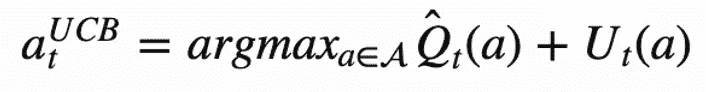****

****作者图片****

****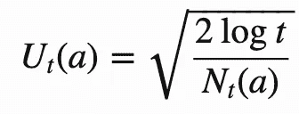****

****作者图片****

> ****换句话说，选择的行动是最大化行动和第二项 u 的回报历史平均值的行动。****

****很简单，相同的动作执行得越多，Nt(a)增加得越多，因此 Ut(a)减少。动作“a”不太可能被选中。****

****在彼得的例子中，他选择同一家餐馆越多，Nt(a)越高，Q + U 项减少越多，选择该行动的可能性越小。****

# ****Bandit + PAM = BanditPAM****

****PAM 算法中多臂 Bandit 的存在允许我们从计算问题转移到统计问题。****

****事实上，MAB 可以很容易地插入到交换和构建步骤中。****

****对于**交换步骤**，类比如下:****

*   ****简单地考虑一个 **medoid/non-medoid 对**作为一个可能的**动作**，并且**相关的奖励**是要最小化的**成本函数**的值。代价函数越接近 **0** ，奖励越高。****

****因此，PAM 避免计算所有可能的对(n*(n-k))，而是通过 PAM 算法选择最佳对。这样一来，复杂度就变成了 **n*log(n)。******

****对于**构建步骤**，类比如下:****

*   ******每个可能的候选者**是一个**动作**，回报是交换步骤的成本函数的计算，但仅针对数据的**随机样本。这允许对于测试的同一候选人，按照 PAM 算法，奖励的**值是不同的**。******

**BanditPAM 的使用是通过 Python 实现的。
**GitHub**举例:[https://github.com/ThrunGroup/BanditPAM/](https://github.com/ThrunGroup/BanditPAM/)**

# **结论**

**对 BanditPAM 的介绍让我们可以独立地观察两种算法。在 **KMedoids** 算法中加入统计模型(PAM)提高了复杂度，同时保持了相对较好的聚类质量。**

**在研究论文中提供了更多关于如何将多臂强盗纳入 PAM 的细节。这种处理不是很明显，我邀请所有好奇的人来看看原始文件。**

**感谢您阅读我的第一篇文章，如果您喜欢，请随时支持、评论和分享。**

## **来源**

*   ****bandit PAM:**[https://papers with code . com/paper/bandit-PAM-almost-linear-time-k-medoids](https://paperswithcode.com/paper/bandit-pam-almost-linear-time-k-medoids)**
*   ****多臂土匪:**[https://lilian Weng . github . io/lil-log/2018/01/23/the-Multi-Armed-Bandit-problem-and-its-solutions . html](https://lilianweng.github.io/lil-log/2018/01/23/the-multi-armed-bandit-problem-and-its-solutions.html)**