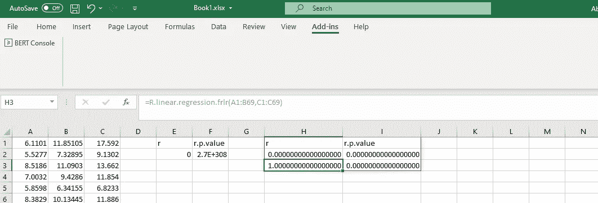
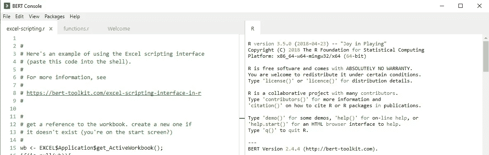
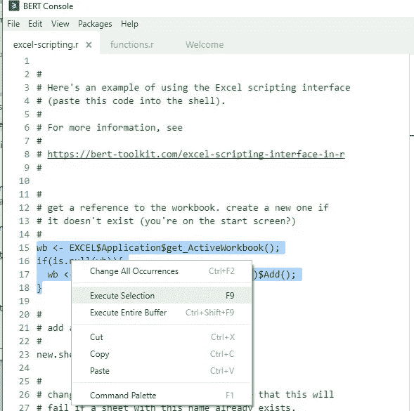
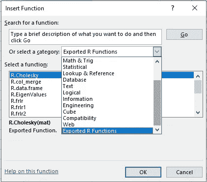
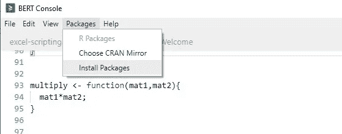
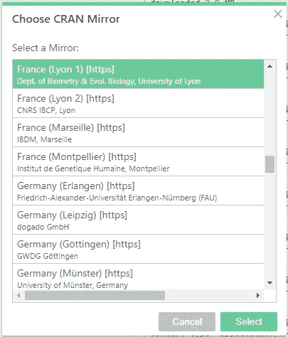
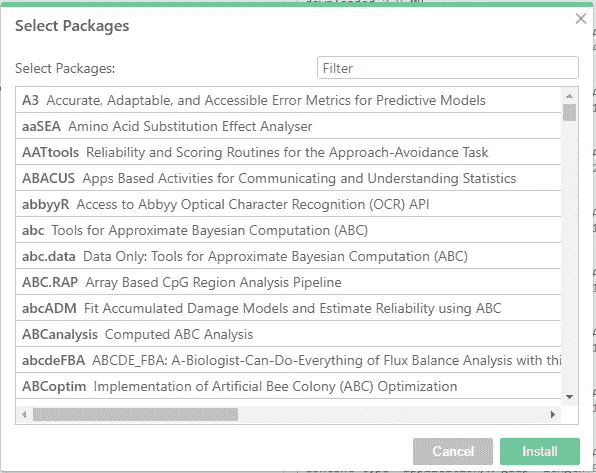
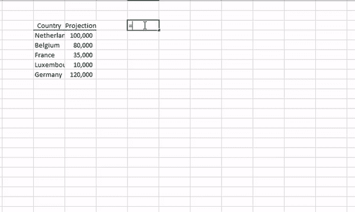

# 基本 Excel R 工具包(BERT)简介

> 原文：<https://towardsdatascience.com/introduction-to-basic-excel-r-toolkit-bert-de44f309e3d2?source=collection_archive---------21----------------------->

## 使用 BERT 插件向 Excel 用户开放过多的 R 功能。


卢卡斯·布拉塞克在 [Unsplash](https://unsplash.com?utm_source=medium&utm_medium=referral) 上的照片

过去三十年来，xcel 一直是企业首选的数据分析工具。Excel 提供内置工具来进行统计分析、创建预算、预测、仪表板、数据绘图等。然后还有插件来填补分析空白或提高性能。

对我来说，Excel 是一个很好的工具，但我在使用它时有两个问题:第一，当处理大型数据文件(> 50MB)时，Excel 偶尔会死机；第二，生成的默认图质量很差，需要大量的润色。这些就是过渡到 MATLAB(授权软件)和 R(开源)的原因。

我在这里不是要说服人们离开 Excel 并过渡到 R 或任何编程语言，而是要为那些 Excel 用户提供一个利用 ***基本 Excel R 工具包(BERT)*** 插件的解决方案。正如数据科学专业圈子里流行的说法:

> 数据科学的关键是利用不同的工具来解决问题，而不是掌握一种工具。

# 伯特是什么？

*Basic Excel R Toolkit 或 BERT* 是一个插件，用于运行 Excel 电子表格单元格中的内置 R 函数。伯特自由了！BERT 提供了两个特性:

1.  Excel 的用户自定义 R 函数:用户可以在 R 中定义自己的函数，BERT 会将这些函数转换成 Excel 函数。
2.  从 R 控制 Excel:用户可以使用 R 与 Excel 电子表格实时交互。

BERT 的另一个优点是它与 VBA 兼容。

# 安装 BERT

因此，要开始，首先我们需要安装插件。文件可以从[这里](https://bert-toolkit.com/download-bert)下载。BERT 的 ***当前限制*** 是，它只适用于 2003 年以后的 Excel 版本的 Windows 用户和 64 位 Windows。

安装完成后，BERT 插件将出现在 Excel 的 Add-ins 选项卡中，BERT 控制台将打开。如果控制台没有打开，则单击加载项中的控制台选项打开 BERT 控制台。



作者图片

BERT 控制台由两部分组成。左半部分是带有三个打开标签的编辑器，右半部分是 R 控制台。



作者图片

BERT 控制台上的选项卡“ *excel-scripting.r* ”用于与 excel 实时交互。您可以尝试运行 *excel-scripting.r* 选项卡上的命令，方法是选择代码块并按下 ***F9*** 来执行，或者使用 ***Ctrl+Shift+F9*** 来执行完整的代码。



只有在同名的工作表不存在的情况下，从该选项卡运行整个代码块才会在 Excel 中创建名为“R data set”的新工作表。有关这方面的更多详细信息，请参见此处提供的[文档。](https://bert-toolkit.com/excel-scripting-interface-in-r)

我对第二个选项卡“ *functions.r* ”很感兴趣，我将尝试详细说明我们可以利用的不同功能。

# 在 Excel 中使用 R 函数

BERT 有一种预定义的编写函数的方式，类似于 r。

```
function_name <- function(arg1,arg2,...){
...
}
```

安装 BERT 时定义了两个默认函数。它们是实测值和特征值。这些函数可作为 R.function_name 访问。因此，在 Excel 中，可以通过输入 R.TestAdd 和 R .特征值来访问它们。

要访问这些功能，我们先按下 ***Shift+F3*** 打开插入功能对话框。从**类别的**下拉菜单中选择 ***导出 R 功能*** 。



## 书写功能

现在我们对如何加载 R 函数有了一个大致的概念，所以让我们获得一些实践经验。

这里我将基于一些基本的 R 函数来定义函数，创建图的函数，以及线性回归的函数。编写完函数后，将其保存为默认设置，以便在 Excel 中使用。

***基本 R 函数:*** 这里我定义了四个函数使用 R %in%运算符，使用 rbind()或 cbind()函数组合向量，通过组合 2 个向量创建一个数据帧。更多预定义功能可在[这里](https://bert-toolkit.com/bert-example-functions)找到。

```
# matching vectors using %in%
match <- function(vec1,vec2){
vec1 %in% vec2
} # combine 2 matrices wrt rows
row_combine <- function(mat1, mat2){
rbind(mat1,mat2)
} # combine 2 matrices wrt columns
col_combine <- function(mat1, mat2){
cbind(mat1,mat2)
}# create data frame
data.frame <- function(x,y){
as.data.frame(cbind(x,y))
}
```


作者图片

***R 的基绘图:*** 接下来，我定义了一个函数来使用 R 的基绘图，这里是为绘制直方图和散点图定义的两个函数。

绘制直方图的代码:

```
graph.histogram <- function(data, main="Histogram", xlabel="Data"){# passing cell=T means "use the cell address as a unique
# identifier". otherwise, use the name parameter to identify
# the target shape.BERT.graphics.device(cell=T);# scrub the data (slightly) then generate a histogramx <- unlist( as.numeric( data ));hist( x, xlab=xlabel, main=main, col="pink", breaks=13, font.main=1);# we're done with the graphics device; we can shut it off.
# this isn't strictly necessary, but there's a limit of 63
# active devices so it's a good idea.dev.off();# returning TRUE indicates everything succeeded.
T}
```

绘制散点图的代码:

```
graph.scatter <- function(x,y,main="Scatter plot"){BERT.graphics.device(cell=T);plot(x,y)dev.off();
}
```


作者图片

这些函数的有趣之处在于，输入值的变化会实时反映在图中。除此之外，图的质量远远优于 Excel 的默认图，如下图所示。

***安装包:*** 这里出于演示的目的，我使用了内置函数 draw.map()。该函数绘制世界地图，为此，它需要 ***地图包*** 。

```
draw.map <- function( countries, values, title ){
library(maps);
BERT.graphics.device(cell=T);# allow nulls in countries; map to values and ensure zeros.
c2 <- unlist(countries[!is.na(countries)]);
values <- as.numeric(values);
values[is.na(values)] <- 0;
v2 <- unlist(values[!is.na(countries)]);# for colors, reduce to a color space of 32 (?) levels. scale values.
n <- 32;
scaled.values <- round((1-((v2-min(v2))/(max(v2) - min(v2))))*(n-1))+1;
heatcolors <- heat.colors(n);
margins = c(0, 0, 0, 0);if( !missing(title)){ margins[3] <- .6; }# fill doesn't work properly (or at least as one would expect)
# when a country has multiple polygons, so do this in separate passes...
# 1: space out the map
par(mai=margins);
map("world", c2, fill=F, lty=0);# 2: fill in countries
sapply( c2, function(country){
map( "world", country, fill=T, lty=0, add=T,
col=heatcolors[scaled.values[[which(c2==country)]]] );
});# 3: draw lines on top
map("world", c2, fill=F, col="#cccccc", add=T );# add title
if(!missing(title)){ title( main=title, font.main=1 ); }dev.off();T;}
```

要在 BERT 中安装软件包，我们必须在 BERT 控制台上选择 Packages 选项卡-> Install packages。



作者图片

这将提示你选择克兰镜



作者图片

之后，您可以选择要安装的软件包。



作者图片

软件包安装完成后，定义的函数就可以使用了。



作者图片

# 结束语

BERT 是一个非常强大的插件，可以使 Excel 用户社区受益。上述演示清楚地强调了一个事实，即大多数 R 功能(只有 CRAN 包可用)即使不是全部都可以通过 BERT 获得。

我认为使用 BERT 的主要优势是:

1.  R 函数的清晰兼容性
2.  易于定制或构建您自己的功能
3.  优质地块
4.  反映在图中的实时变化

伯特的缺点是:

1.  绘图中的更改不会像默认 Excel 绘图那样反映在 PowerPoint 中。

除了上面提到的缺点，我目前不明白为什么 BERT 不能成为一个好的工具。

如果你是一个 Excel 用户，那么试试 BERT，看看它是否能给你的工作增加价值。

## 参考:

1.  [https://bert-toolkit.com/](https://bert-toolkit.com/)

您可以在 [LinkedIn](https://www.linkedin.com/in/abhinav-malasi/) 和 [Twitter](https://twitter.com/malasi_abhinav) 上与我联系，跟随我的数据科学和数据可视化之旅。