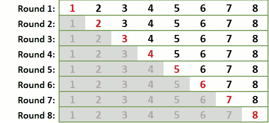
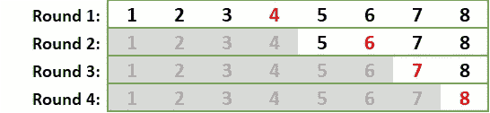
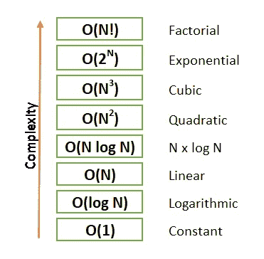
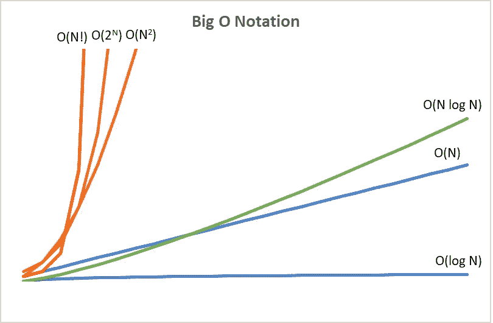

# 大 O 符号介绍

> 原文：<https://towardsdatascience.com/introduction-to-big-o-notation-820d2e25d3fd?source=collection_archive---------0----------------------->

## 使用线性搜索和二分搜索法示例开始使用大 O 符号

# 介绍

大 O 符号是衡量算法效率的一种方式。它测量输入增加时运行函数所花费的时间。或者换句话说，函数的伸缩性有多好。

衡量效率有两个部分——时间复杂度和空间复杂度。时间复杂度是根据计算步骤来衡量函数运行的时间。空间复杂度与函数使用的内存量有关。这篇博客将用两种搜索算法来说明时间复杂性。

大 O 有时被称为算法的上限，这意味着它处理最坏的情况。最好的情况实际上并没有告诉我们什么——它将在第一遍中找到我们的项目。我们使用最坏情况来消除不确定性——算法的性能永远不会比我们预期的差。


Jr Korpa 在 [Unsplash](https://unsplash.com?utm_source=medium&utm_medium=referral) 上拍摄的照片

# 线性搜索示例

让我们看一个简单的例子。

我们将在 1-8 的范围内搜索数字 8。

我们的第一个策略是从数组的第一个数字开始，向上移动一个数字，直到找到目标数字。我们的算法步骤应该是这样的。

1.  从头开始
2.  将当前值与我们的目标值进行比较
3.  移动到下一个值
4.  到达列表的末尾



线性搜索-作者图片

在第一轮，我们选择一号。这是不正确的，所以我们转到第二轮，排除第一个选项。第二步也不正确，我们一直继续，直到我们选择第八个。

在我们最坏的情况下，这不是很有效。我们必须检查列表中的每一个数字，直到找到我们的答案。这种方法叫做**线性搜索**。线性搜索的大 O 符号是 **O(N)** 。复杂度与输入的大小直接相关-算法对每个额外的数据元素采取额外的步骤。

```
def linear_search(arr, x):  #input array and target

    for i in range(len(arr)): 
          if arr[i] == x: 
            return i 

    return -1   
# return -1 if target is not in the array
```

# 二分搜索法的例子

让我们试试不同的策略。这个策略的关键部分是列表必须有序。

这次我们从列表的中间开始。我们检查是否选择了目标数字。如果不是，我们检查数字是小于还是大于我们的选择。在这两种情况下，我们都排除掉不包括我们目标的一半列表。然后，我们在剩余值的中间选择一个数字。

1.  找到列表的中间——中点
2.  将中点与目标进行比较
3.  如果我们的价值和目标相符，我们就停下来——我们找到了目标
4.  如果我们的值比目标值小，我们制作一个新的列表，从中点加 1 到最大值。
5.  如果我们的值大于目标值，我们会创建一个新的列表，范围从最小值到中点减一。
6.  重复，直到我们找到目标或到达最后一个元素，它不匹配目标。



二分搜索法——作者图片

我们第一选择的中点是 4。目标值大于 4，所以我们排除值为 4 及以下的值，并创建一个从 5 到 8 的新列表。我们选择一个中点值 6，然后再次选择。我们继续，直到只剩下第八个。

这种策略被称为**二分搜索法**。它是有效的，因为它在每一遍中消除了一半的列表。如果我们加倍搜索，在 1-16 的范围内寻找第 16 个，我们只需要再多一轮。令人惊讶的是，如果我们要在 1 到 100 万之间选一个数字，最坏的情况是 20 次猜测。

当我们得到这样的大数字时，我们可以清楚地看到这种方法比使用线性搜索有效得多:20 次猜测对 1，000，000 次猜测。

我们可以对此进行数学建模。数字 8 等于 2 x 2 x 2。我们也可以用指数来表达这个方程:2 的 3 次方，或 2。

指数的倒数是对数。以 2 为底的 8 的对数意味着你要用多少次 2 乘以 8 才能得到 8。如上图所示，2 x 2 x 2 =8，所以 Log2 8 = 3。

一般来说，二分搜索法的最坏情况是 n + 1 的对数。二分搜索法的大 O 符号是 **O(log N)** 。与 O(N)对每个数据元素采取额外步骤相反，O(log N)意味着每次数据加倍时算法采取额外步骤。

```
def binary_search3(arr, target):
    left = 0
    right = len(arr) - 1while left <= right:
        mid_point = (left + right) // 2    

        if target < arr[mid_point]:
            right = mid_point - 1
        elif target > arr[mid_point]:
            left = mid_point + 1
        else:
            return mid_pointreturn -1
```

注意:即使二分搜索法比线性搜索更有效，你也不会总是在每个例子中选择它。这是因为第一个条件。二分搜索法要求该列表是有序的。对列表进行排序本身就很复杂，所以在某些情况下，使用线性搜索可能比首先对列表进行排序更有效。

# 书写大 O 符号

当我们写大 O 符号时，随着输入变得越来越大，我们寻找增长最快的项。我们可以通过去掉常数和任何非主导项来简化方程。比如 O(2N)变成 O(N)，O(N + N + 1000)变成 O(N)。

二分搜索法是 O(log N ),比线性搜索简单。还有很多更复杂的算法。二次算法或 O(N)的一个常见例子是嵌套的 for 循环。在嵌套循环中，我们在外部循环中迭代整个数据。然后，对于每个元素，我们在一个内部循环中遍历数据。这是 N×N 乘以 N。



复杂性——作者形象

这是这些大运行时间在图表上的样子。这篇博客中的例子是两个最不复杂的符号。



大 O 图—作者图片

# 摘要

通常有许多选择来编写代码以获得解决方案。理解大 O 符号在编写算法时很重要。它帮助你确定你的算法何时变快或变慢。你也可以比较不同的方法，选择最有效的。

# 额外资源

通过 freeCodeCamp 的 Treehouse 有一个很棒的 YouTube 课程，带你从初学者到理解大 O 符号。警告它超过五个小时长。(这里有一个[博客](https://medium.com/analytics-vidhya/how-to-watch-youtube-like-a-boss-df7e1aea18a4)，里面有一些高效观看 YouTube 的技巧)

## 树屋教程

## 大 O 小抄

https://www.bigocheatsheet.com/